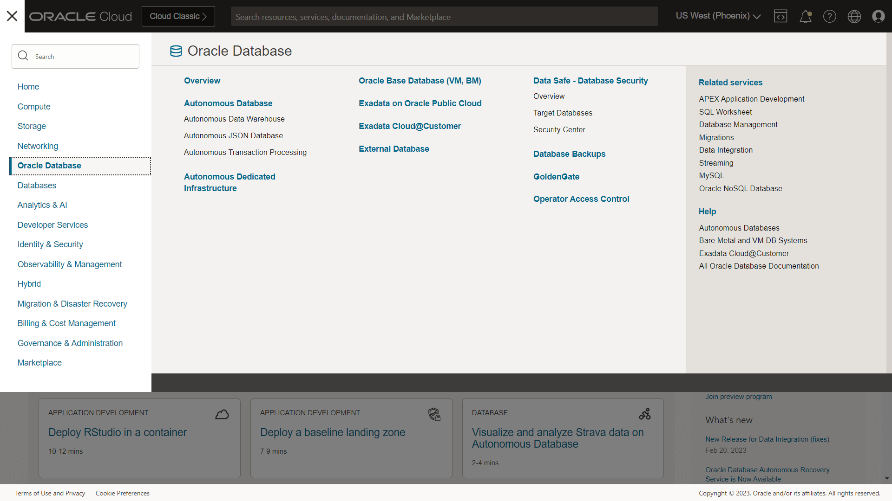
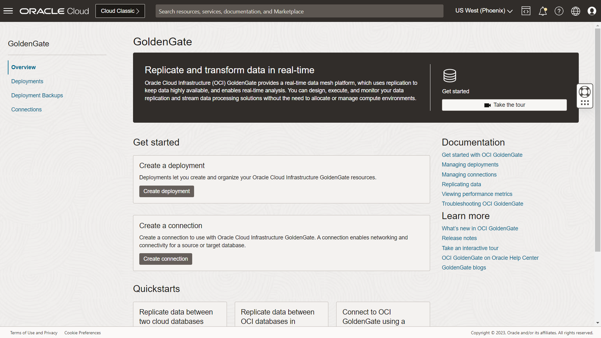
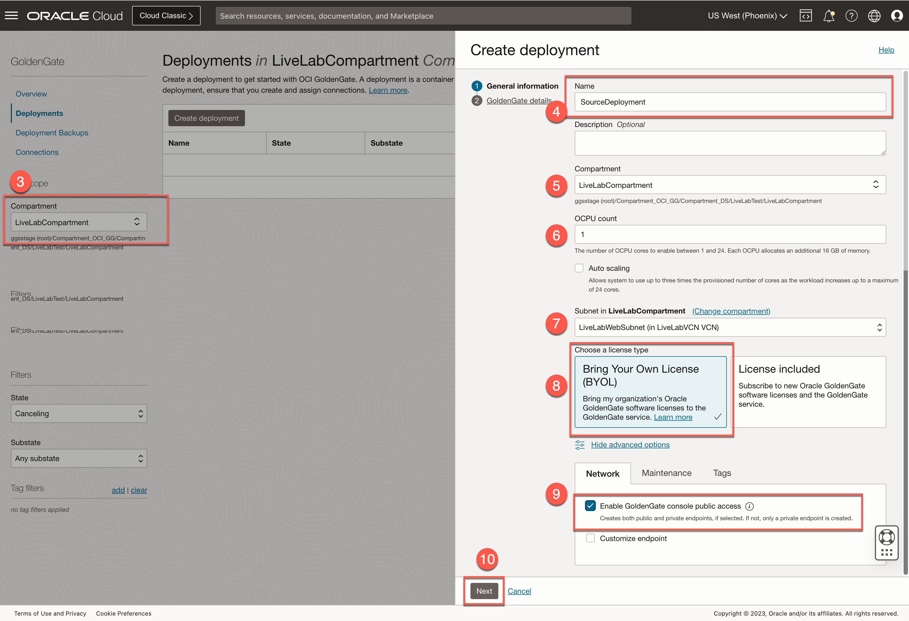
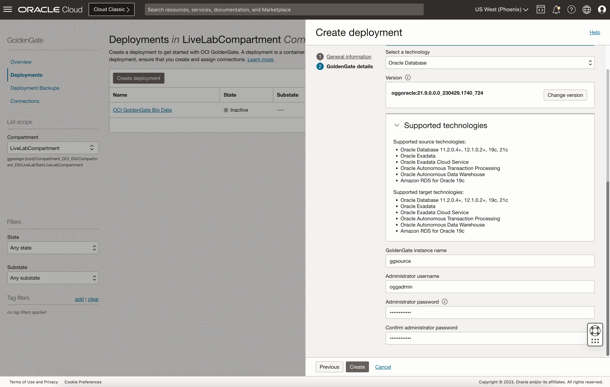
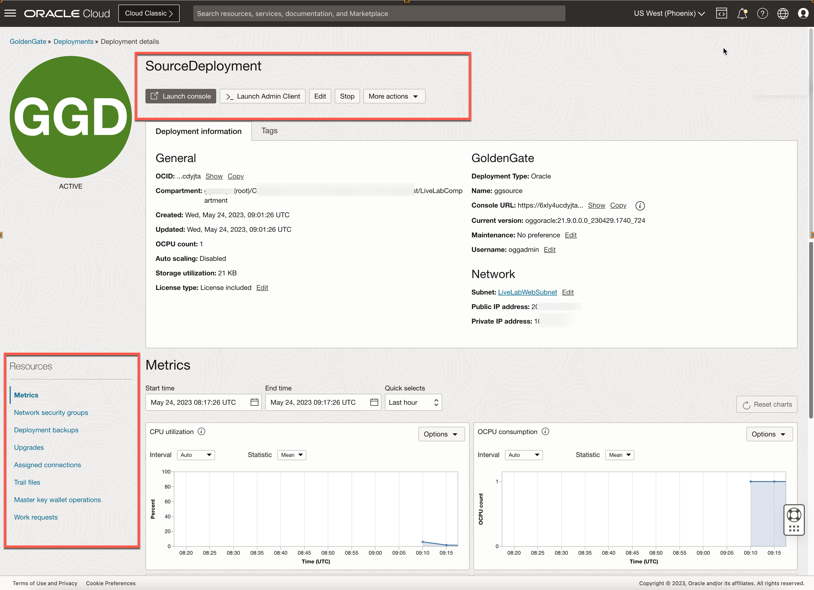
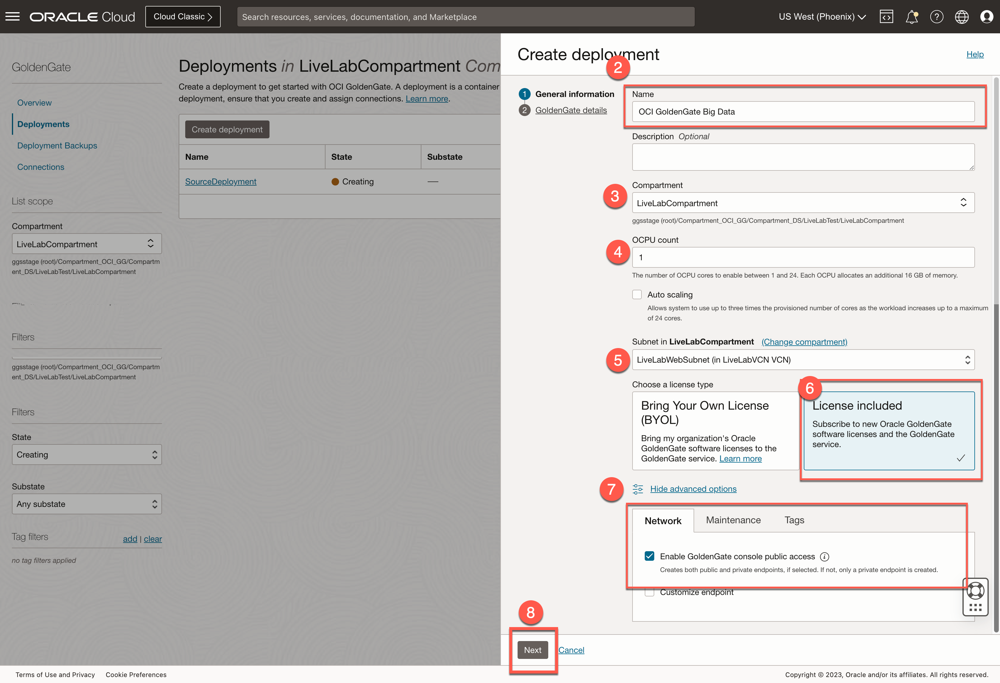
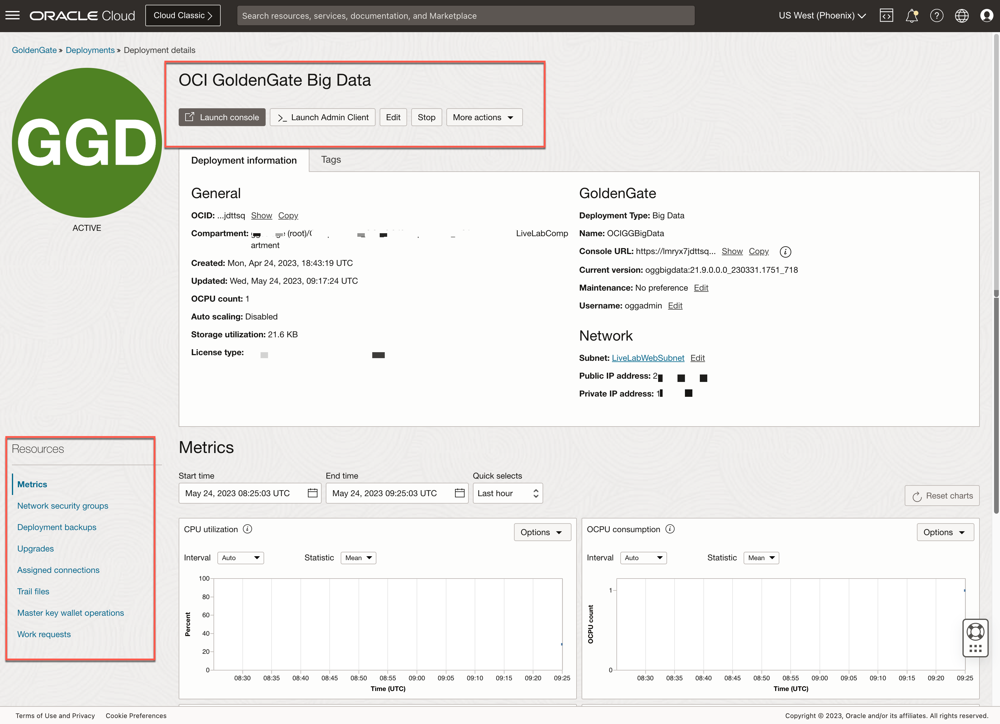

# Create the OCI GoldenGate deployments

## Introduction

In this lab, you learn to create the source and target Oracle Cloud Infrastructure (OCI) GoldenGate deployments.

Estimated Time: 5 minutes

### About OCI GoldenGate deployments

OCI GoldenGate deployments contain and manage the resources it requires to function. The GoldenGate deployment also lets you access the GoldenGate deployment console, where you can access the OCI GoldenGate deployment console to create and manage processes such as Extracts and Replicats.

### Objectives

In this lab, you will:
* Locate Oracle Cloud Infrastructure GoldenGate in the Console
* Create the source deployment
* Create the target deployment
* Review the OCI GoldenGate deployment details
* Access the OCI GoldenGate deployment console

### Prerequisites

This lab assumes that you completed all preceding labs.

## Task 1: Create the source deployment

1.  Open the **Navigation Menu**, navigate to **Oracle Database**, and then select **GoldenGate**.

    

2.  On the GoldenGate **Overview** page, click **Create deployment**.

    
3.  You may need to select a compartment. Under List Scope, from the Compartment dropdown, expand the root compartment, and then select the compartment **LiveLabCompartment**.

4.  In the Create Deployment panel, enter **SourceDeployment** for Name.

5.  From the Compartment dropdown, select **LiveLabCompartment**.

6.  For OCPU Count, enter **1**.

7.  For Subnet, select a subnet. If you're using the workshop environment, select **LiveLabWebSubnet**.

8.  For License type, select **Bring Your Own License (BYOL)**.

9. Click **Show advanced Options**, and then select **Create public endpoint**.

    

10. Click **Next**.
11. For Select a technology, select **Oracle Database**.

11. For GoldenGate Instance Name, enter **ggsource**.

12. For Administrator Username, enter **oggadmin**.

13. For Administrator Password, enter a password. Take note of this password.

    > **Note:** *For the purposes of this LiveLab, you use the same passwords for the oggadmin user and the database user. To ensure the password works for both users, enter a password containing only upper case letters, lower case letters, numbers, and underscores. If using the green button version of this lab (running on LiveLabs sandbox), you can use the database admin password on the reservation page*.

14. Click **Create**.

    

    > **Note:** *You're brought to the Deployment Details page. It takes a few minutes for the deployment to be created. Its status will change from CREATING to ACTIVE when it is ready for you to use.*

    

## Task 2: Create the target deployment.

1. Go back to the GoldenGate **Overview** page, click **Create Deployment**.

    

2.  In the Create Deployment panel, enter **OCI GoldenGate Big Data** for Name.

3.  From the Compartment dropdown, select **LiveLabCompartment**.

4.  For OCPU Count, enter **1**.

5.  For Subnet, select a subnet. If you're using the workshop environment, select **LiveLabWebSubnet**.

6.  For License type, select **License included**.

7.  Click **Show advanced options**, and then select **Create public endpoint**.

8. Click **Next**.
    

9. For Select a technology, select **Big Data**.

10. For GoldenGate Instance Name, enter **OCIGGBigData**.

11. For Administrator Username, enter **oggadmin**.

12. For Administrator Password, enter a password. Take note of this password.

    > **Note:** *For the purposes of this LiveLab, you use the same passwords for the oggadmin user and the database user. To ensure the password works for both users, enter a password containing only upper case letters, lower case letters, numbers, and underscores. If using the green button version of this lab (running on LiveLabs sandbox), you can use the database admin password on the reservation page.*

13. Click **Create**.

    

    >**Note:** *You're brought to the Deployment Details page. It takes a few minutes for the deployment to be created. Its status will change from CREATING to ACTIVE when it is ready for you to use.*

    

You may now **proceed to the next lab**.

## Learn More

* [Managing deployments](https://docs.oracle.com/en/cloud/paas/goldengate-service/using/deployments.html)

## Acknowledgements
* **Author** - Madhu Kumar S, Senior Solution Engineer, AppDev and Integration
* **Contributors** -  Denis Sendil, Database Product Management; Jenny Chan, Consulting User Assistance Developer, Database User Assistance
* **Last Updated By/Date** - Madhu Kumar S, Senior Solution Engineer, AppDev and Integration

