# Environment Setup

## Introduction

In this lab, you learn to set up your environment in Oracle Cloud Infrastructure using Cloud Shell. Cloud Shell is a web based terminal built into the Oracle Cloud console.

Estimated time: 20 minutes

### Objectives

In this first lab, we will prepare our work environment and create our lab resources using a Terraform script.

-   Create SSH keys in a Cloud Shell environment.
-	Modify a terraform variables file to interact with the script.
-   Prepare our work environment and create our lab resources using a Terraform script.


## Task 1: Use Cloud Shell to clone the lab repository

1. In the Oracle Cloud console global header, click **Cloud Shell**. Cloud Shell opens as a separate panel in the Oracle Cloud console, which you can expand to full screen.

  _**Note:** *It takes a few minutes for Cloud Shell to connect and load your session.*_

	

2. After Cloud Shell connects, enter the following command to clone the repository:

	```
	<copy>
	git clone https://github.com/smadhukumar/atp-to-kafka.git
	</copy>
	```

3. Enter the following command to change directories:

    ```
	<copy>
	cd atp-to-kafka
	</copy>
    ```
    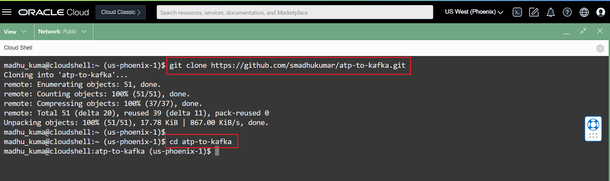
## Task 2: Generate SSH keys

1. In Cloud Shell, enter the following commands to add the execute permission to generate_pemkey.sh, and then run the file.

	```
	<copy>
	chmod +x generate_pemkey.sh

	./generate_pemkey.sh

	</copy>
	```

2. Enter the following command to copy your public pem file content:

	```
	<copy>
	cat ~/.ssh/oci_api_key_public.pem
	</copy>
	```

	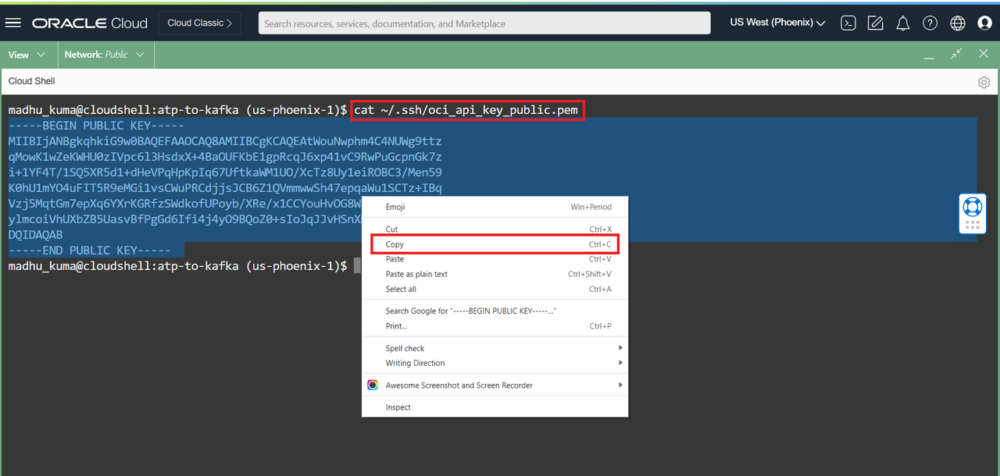

## Task 3: Add Public API keys and Modify Terraform variables

1. In the Oracle Cloud console, click **Profile**, and then select your username.
Needs to add screenshot *(Add a screenshot here of the Oracle Cloud global header with the Profile menu open.)*

	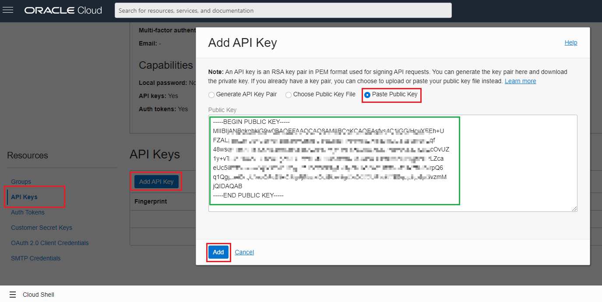
2. On the **User Details** page, under **Resources**, click **API Keys**, and then click **Add API Key**.
* screeensot needs add * 
3. In the Add API Key dialog, select **Paste Public Key**, paste the public pem key copied from Cloud Shell into the Public Key text area, and then click **Add**.

4.  In the Configuration File Preview dialog, copy the values into a text editor so you can refer to them in the next steps.
	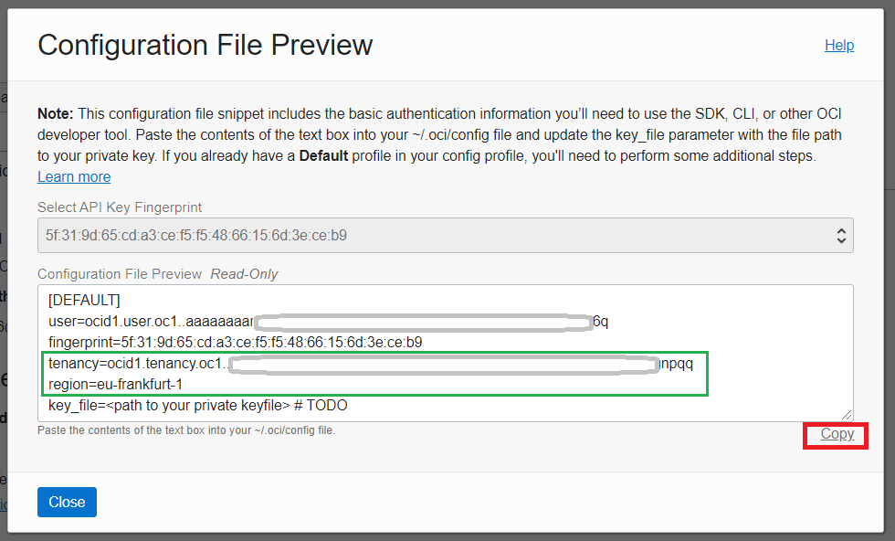


5. In Cloud Shell, enter the following command to modify **terraform.tfvars**:.

	```
	<copy>
	vi terraform.tfvars
	</copy>
	```

	_**NOTE:** This creates a new file. Press i on your keyboard to enable editing, and then press Shift+Insert to paste a copied parameter. When you're done editing, press the escape key, then :wq, and then Enter to save and quit._

6. Replace the following placeholders in double quotes with the configuration file values copied to your text editor..

	```
	<copy>
	tenancy_ocid  = "replace-your-tenancy-value-here"
	region = "replace-your-region-value here"
	compartment_ocid = "replace-your-tenancy-value_here"
	fingerprint="replace-your-fingerprint-value"
	user_ocid="replace-your-user-ocid-value"
	</copy>
	```

	_**NOTE:** if you are an experienced OCI user, I'd highly suggest you use your own compartment to isolate all resources. To do so, provide your preferred compartment OCID in `compartment_ocid`. If you are new to OCI cloud, just enter your Tenancy value as compartment OCID._

## Task 4: Terraforming

1. Run the following command to download the necessary terraform values from Oracle Cloud Infrastructure.

	```
	<copy>
		terraform init
	</copy>
	```

2. Enter the following terraform commands:

	```
	<copy>
	terraform plan

	terraform apply --auto-approve
	</copy>
	```
	_**NOTE:**: Plan and apply shouldn't prompt user input. If it does, then refer to the API key configuration values copied to your text editor from Task 4._
	
3. Make a copy of the output results in your notepad for later use.

	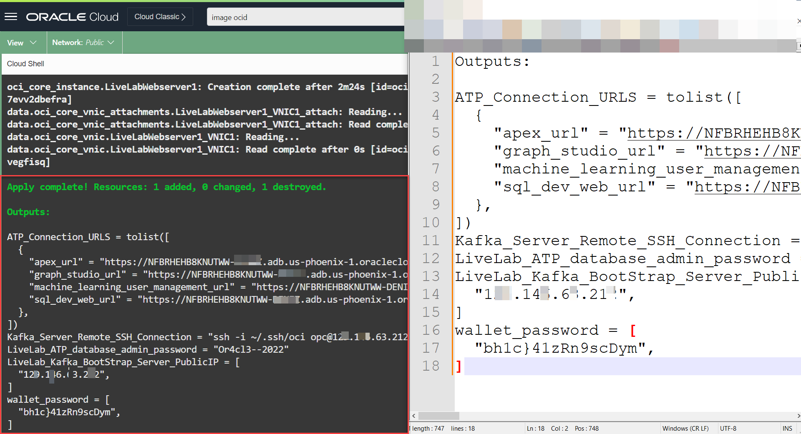

## Task 5: Create a source ATP schema

1.  In the OCI Console, select your ATP instance from the Autonomous Databases page to view its details and access tools.

    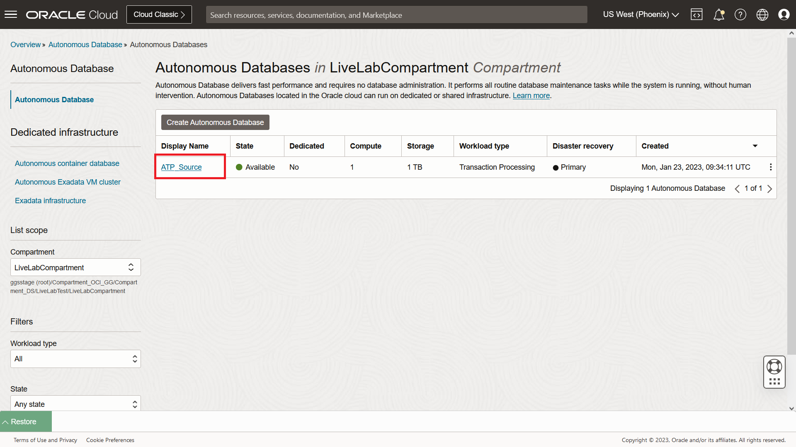

2.  Click on  **Database actions**.

    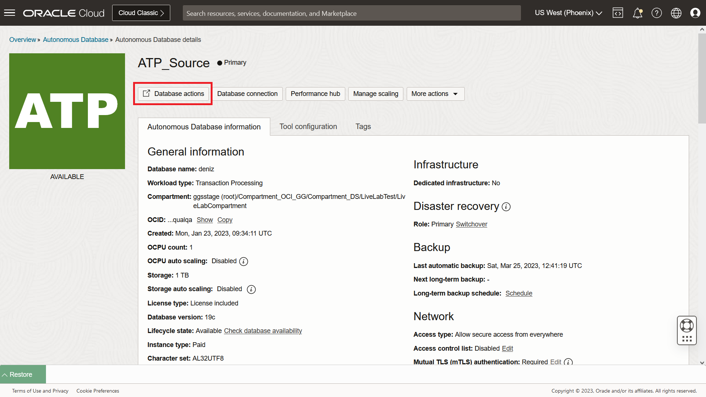

3.  From the Database Actions menu, under **Development**, select **SQL**.

    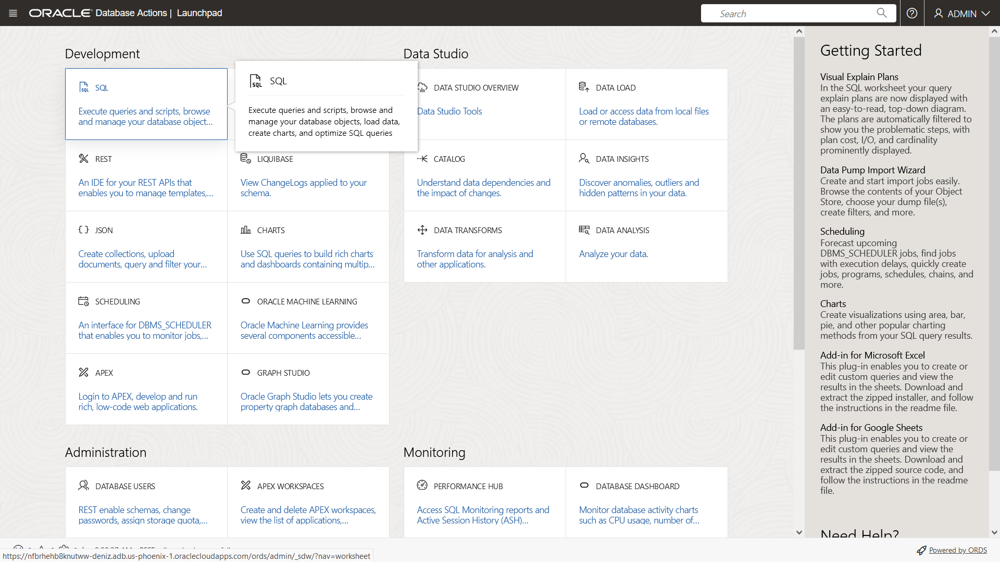

4.  (Optional) Click **X** to close the Help dialog.

5.  Copy the SQL query and paste it into the SQL Worksheet. Click **Run Script**. The Script Output tab displays confirmation messages.

    ```
    <copy>
    CREATE USER "SRC_OCIGGLL" IDENTIFIED BY "#OCIGGSr0ck5*";
    GRANT CREATE SESSION TO "SRC_OCIGGLL";
    ALTER USER "SRC_OCIGGLL" ACCOUNT UNLOCK;
    GRANT CONNECT, RESOURCE, DWROLE  TO "SRC_OCIGGLL";
    GRANT UNLIMITED TABLESPACE TO "SRC_OCIGGLL";
    BEGIN
        ORDS.ENABLE_SCHEMA(p_enabled => TRUE,
                        p_schema => 'SRC_OCIGGLL',
                        p_url_mapping_type => 'BASE_PATH',
                        p_url_mapping_pattern => 'SRC_OCIGGLL',
                        p_auto_rest_auth => FALSE);
        commit;
    END;
    /
   </copy>
    ```

    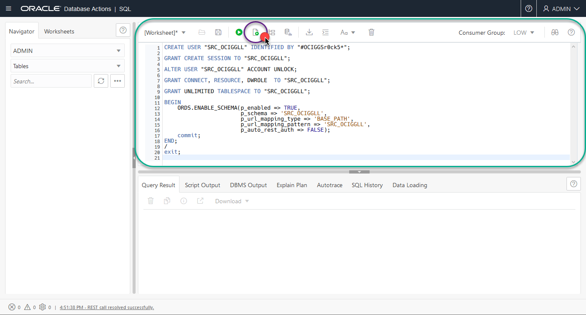


6. Copy the SQL query and paste it into the **SQL** Worksheet**. Click **Run Script**. The Script Output tab displays confirmation messages.
   
    ```
    <copy>
    --------------------------------------------------------
    --  DDL for Table SRC_CITY
    --------------------------------------------------------
    CREATE TABLE "SRC_OCIGGLL"."SRC_CITY" 
    (   "CITY_ID" NUMBER(10,0), 
        "CITY" VARCHAR2(50 BYTE), 
        "REGION_ID" NUMBER(10,0), 
        "POPULATION" NUMBER(10,0)
    ) ;
    --------------------------------------------------------
    --  DDL for Table SRC_CUSTOMER
    --------------------------------------------------------
    CREATE TABLE "SRC_OCIGGLL"."SRC_CUSTOMER" 
    (	"CUSTID" NUMBER(10,0), 
        "DEAR" NUMBER(1,0), 
        "LAST_NAME" VARCHAR2(50 BYTE), 
        "FIRST_NAME" VARCHAR2(50 BYTE), 
        "ADDRESS" VARCHAR2(100 BYTE), 
        "CITY_ID" NUMBER(10,0), 
        "PHONE" VARCHAR2(50 BYTE), 
        "AGE" NUMBER(3,0), 
        "SALES_PERS_ID" NUMBER(10,0)
    ) ;
    --------------------------------------------------------
    --  DDL for Table SRC_ORDERS
    --------------------------------------------------------

    CREATE TABLE "SRC_OCIGGLL"."SRC_ORDERS" 
    (   "ORDER_ID" NUMBER(10,0), 
        "STATUS" VARCHAR2(3 BYTE), 
        "CUST_ID" NUMBER(10,0), 
        "ORDER_DATE" DATE, 
        "CUSTOMER" VARCHAR2(35 BYTE)
    ) ;
    --------------------------------------------------------
    --  DDL for Table SRC_ORDER_LINES
    --------------------------------------------------------

    CREATE TABLE "SRC_OCIGGLL"."SRC_ORDER_LINES" 
    (   "ORDER_ID" NUMBER(10,0), 
        "LORDER_ID" NUMBER(10,0), 
        "PRODUCT_ID" NUMBER(10,0), 
        "QTY" NUMBER(10,0), 
        "AMOUNT" NUMBER(10,2)
    ) ;
    --------------------------------------------------------
    --  DDL for Table SRC_PRODUCT
    --------------------------------------------------------

    CREATE TABLE "SRC_OCIGGLL"."SRC_PRODUCT" 
    (   "PRODUCT_ID" NUMBER(10,0), 
        "PRODUCT" VARCHAR2(50 BYTE), 
        "PRICE" NUMBER(10,2), 
        "FAMILY_NAME" VARCHAR2(50 BYTE)
    );
    -------------------------------------------------------
     --  DDL for Table SRC_REGION
    --------------------------------------------------------

    CREATE TABLE "SRC_OCIGGLL"."SRC_REGION" 
    (   "REGION_ID" NUMBER(10,0), 
        "REGION" VARCHAR2(50 BYTE), 
        "COUNTRY_ID" NUMBER(10,0), 
        "COUNTRY" VARCHAR2(50 BYTE)
    ) ;
    </copy>
    ```
    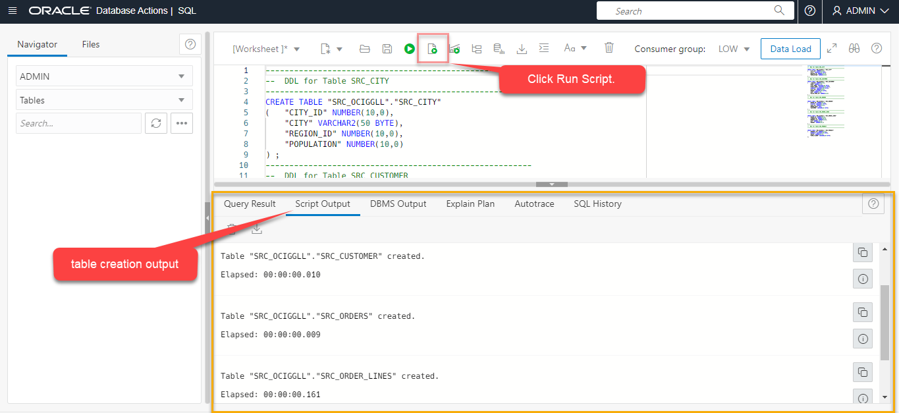

>**Note:** *If you find that running the entire script does not create the tables, then try running each table creation statement one at a time until all the tables are created.*

7. In the Navigator tab, look for the **SRC\_OCIGGLL** schema and then select tables from their respective dropdowns to verify the schema and tables were created. You may need to log out and log back in if you can't locate **SRC\_OCIGGLL**.

    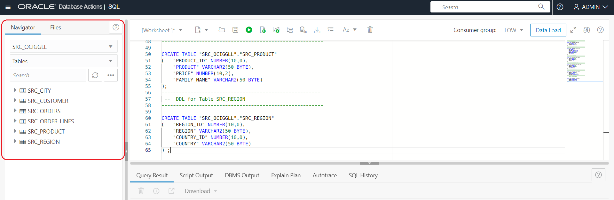

8. To **enable supplemental logging**, run the following command:

    ```
    <copy>ALTER PLUGGABLE DATABASE ADD SUPPLEMENTAL LOG DATA;</copy>
    ```
9. Run the **alter user** command to unlock the ***ggadmin*** user and set the password for it.

    ```
    <copy>alter user ggadmin identified by Or4cl3##2023 account unlock;</copy>
    ```

You may now **proceed to the next lab**.


## Acknowledgements
* **Author** - Madhu Kumar S, Senior Solution Engineer, AppDev and Integration
* **Contributors** -  Denis Sendil, Database Product Management; Jenny Chan, Consulting User Assistance Developer, Database User Assistance
* **Last Updated By/Date** - Madhu Kumar S, Senior Solution Engineer, AppDev and Integration
