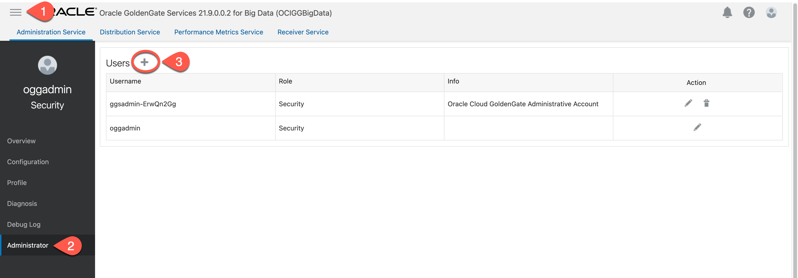
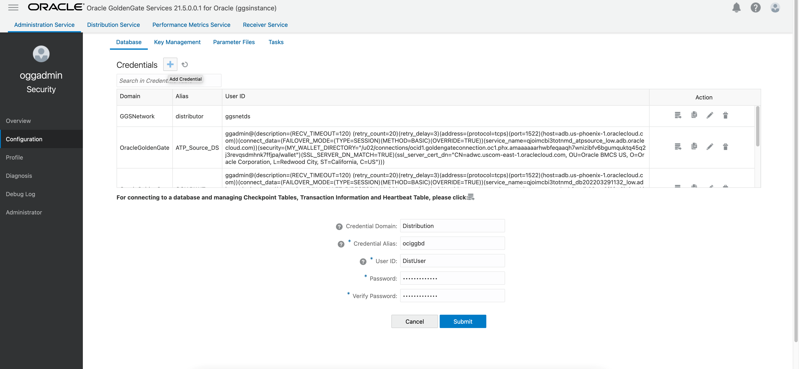
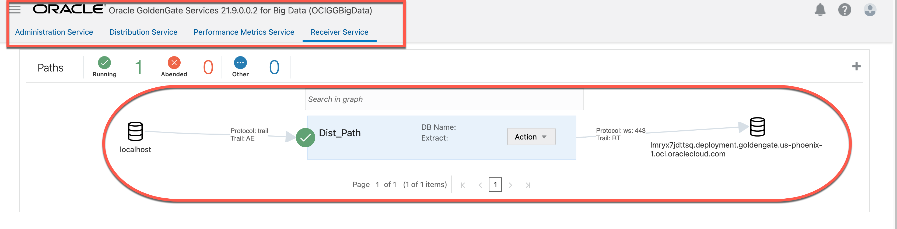

# Create a Distribution Path

## Introduction

This lab walks you through the steps to create a distribution path from source OCI GoldenGate Deployment to OCI GoldenGate for Big Data Deployment. 

Estimated time: 5 minutes

### About Create a Distribution Path

The Distribution Server is accessible from the Service Manager home page.From the Service Manager home page, click the Distribution Server. The Distribution Server Overview page is displayed where you can view the path that connects the extract and replicat.The path between a source and target deployment can be set using the Distribution Server. You can also create target-initiated distribution paths from the Receiver Server

### Objectives

In this lab, you will:
* Locate Oracle Cloud Infrastructure GoldenGate in the Console
* Create a distribution path from source OCI GoldenGate Deployment to OCI GoldenGate for Big Data Deployment

### Prerequisites

This lab assumes that you completed all preceding labs.

## Task 1: Add New User

1. In source OCI GoldenGate for Oracle Deployment, go to Administration Service and click on the hamberger menu. Navigate to  **Administrator** and click on ***'+' (plus icon)*** to add a new user.

    

2. On User page,for **Username**, type ***DistUser***

3. For **Role**,select ***Administrator***

4. For **Type**,select ***Password***

5. For **Password**,Provide user defined Oracle standard password
6. For **verify Password**, Kindly re-enter the above password and click ***submit***    

    

## Task 2: Add Credential

1.  Go to Administration Service of source OCI GoldenGate Deployment and click on the hamberger menu. Navigate to  **Configuration** and click on ***'+' (plus icon : Add Credential)*** to add a new credential.
    

2. For **Credential Domain**, type ***Distibution***.
3. For **Credential Alias**, type ***ociggbd***.
4. For **User ID**, enter ***DistUser***
5. For **Password**, enter the password which is created at ***Task 1: Add New User Step 5***.
6. For **Verify Password**, Kindly re-enter the above password and click ***submit***
    

## Task 3: Add Path

1. Go to Distibution Service of source OCI GoldenGate Deployment and click on ***'+' (plus icon: Add Path)*** to add a new path.

    

2. On Add Path page,for **Path Name**, enter ***Dist_Path***.
3. For **Source**, Select the Extract created
4. For **Trail Name**, Select the trail fine name
5. For **Generated Source UR**I,No need to change
6. For **Target Authentication Method**, select ***UserID Alias***
7. For **Target**,From the drop-down list, select your data transfer protocol as ***WSS**
8. For **Target Host**, OCI GG Big Data Console URL without https://
9. For **Port Number**, enter port number as ***443***.
10. For **Trail Subdirectory**, ***Leave Empty***
11. For **Trail Name**, Same as selected trail name
12. For **Domain**, type ***Distibution***  that was given in ***Task 2: Add Credential Step 2***
13. For **UserID**, enter ***DistUser*** what was created in ***Task 2: Add Credential Step 4***
    

14.	Click Create & Run. If successful, Distribution Path will be in running status with a green colour.

    
    
15.	In OCI GoldenGate Big Data deployment, go to Receiver Service and observe the Path created there. 
*** add screen here***

    

In this lab, you created a distribution path from source OCI GoldenGate Deployment to OCI GoldenGate for Big Data Deployment.

## Learn More

* [Managing Deployments](https://docs.oracle.com/en/cloud/paas/goldengate-service/using/deployments.html)

## Acknowledgements
* **Author** - Madhu Kumar S, AppDev and Integration, Bangalore Tech Teame
* **Contributors** -  Deniz Sendil, Database Product Management; Jenny Chan, Consulting User Assistance Developer
* **Last Updated By/Date** - 

