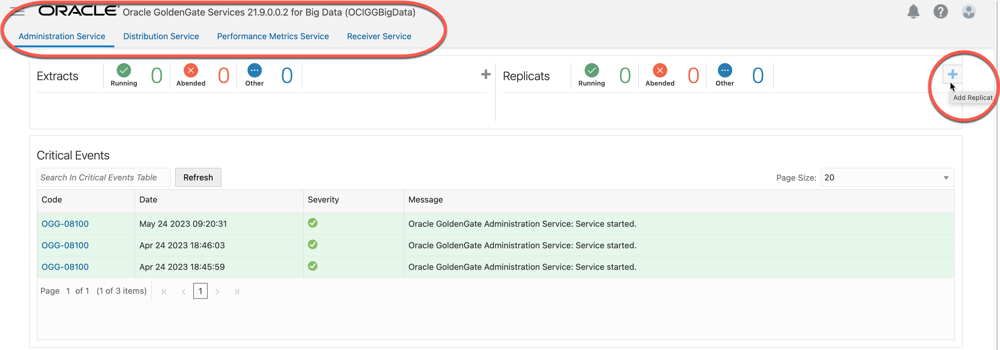

# Add and run the Replicat

## Introduction

In this lab, you learn to Add a checkpoint table and then add and run a Replicat process in the OCI GoldenGate for Big Data deployment console.

Estimated time: 10 minutes


### About Replicat

The Replicat process runs on the target system, reads the trail on that system, and then reconstructs the DML or DDL operations and applies them to the target Apache Kafka. Replicat uses dynamic SQL to compile a SQL statement once, and then execute it many times with different bind variable.

### Objectives

In this lab, you will:
* Add a checkpoint table
* Add and run a Replicat process

### Prerequisites

This lab assumes that you completed all preceding labs.

## Task 1: Add and run the Replicat

1. The user should already be logged in to the OCI GoldenGate for Big Data deployment console. You can start this lab with, "In the OCI GoldenGate for Big Data (OCIGGBigData) deployment console, click **Administration Service**. If you don't see Extracts and Replicats, open the navigation menu and click **Overview**."
2. In the Replicats section, click **Add Replicat** (plus icon).
    
3. On the Add Replicat page, for **Replicat Type**, select **Classic Replicat**, and then click **Next**.
    
4. On the Replicat Options page, for **Process Name** enter **kafkaRep**.
5. For **Source**, select ***Trail***.
6. For **Trail Name**, select ***RT***.
7. For **Target**, select ***Kafka***
8. For **Available aliases**, select the ***kafka*** connection created in **Lab 3 Task 2**.
9. Click ***Next***.
    
10.	On the Parameter File page, review the mappings, and then click **“Next”**.
    
11. On the Properties Files page, locate gg.handler.kafkahandler.topicMappingTemplate, and set it to “***${FullyQualifiedTableName}***”.

    ```
    <copy>${FullyQualifiedTableName}</copy> 
    ``` 
12. Click **“Crate & Run”**.   

    
    You return to the Administration Service Overview page, where you can review the Replicat process.
    

In this lab, you created a replicat for OCI GoldenGate  Deployment.

You may now **proceed to the next lab**.

## Learn More
* [Creating a Replicat](https://docs.oracle.com/en/cloud/paas/goldengate-service/using/goldengate-deployment-console.html#GUID-063CCFD9-81E0-4FEC-AFCC-3C9D9D3B8953)

## Acknowledgements
* **Author** - Madhu Kumar S, Senior Solution Engineer, AppDev and Integration
* **Contributors** -  Denis Sendil, Database Product Management; Jenny Chan, Consulting User Assistance Developer, Database User Assistance
* **Last Updated By/Date** - Madhu Kumar S, Senior Solution Engineer, AppDev and Integration
