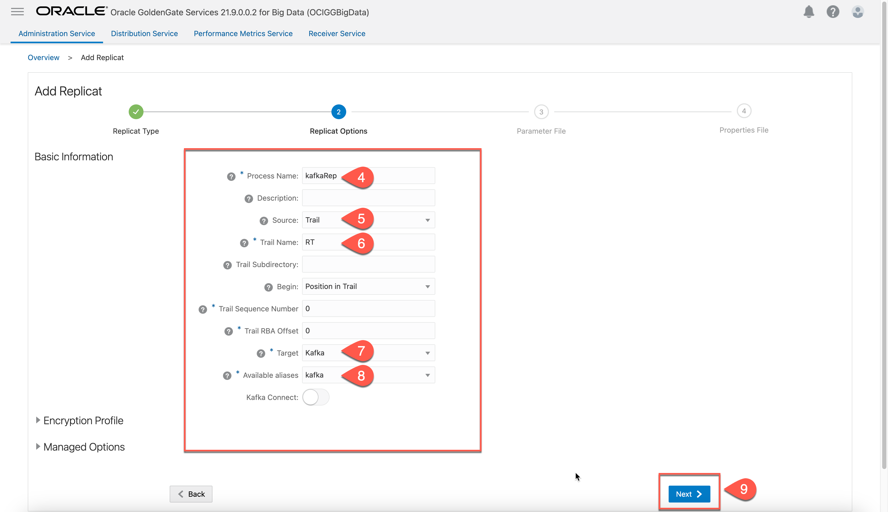
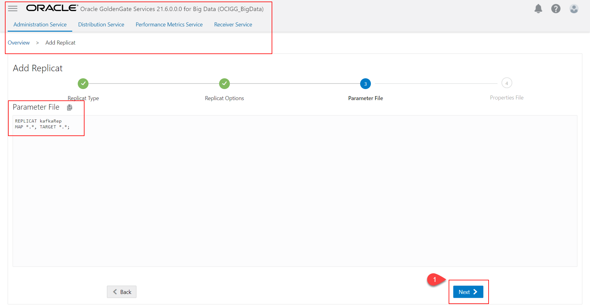

# Create and run the Replicat

## Introduction

This lab walks you through the steps to create a replicat for OCI GoldenGate for Big Data Deployment. 

Estimated time: 5 minutes

### About Create a Replicat

The Replicat process runs on the target system, reads the trail on that system, and then reconstructs the DML or DDL operations and applies them to the target Apache kafka. Replicat uses dynamic SQL to compile a SQL statement once, and then execute it many times with different bind variable

### Objectives

In this lab, you will:
* Locate Oracle Cloud Infrastructure GoldenGate in the Console
* Create a replicat for OCI GoldenGate for Big Data Deployment.
### Prerequisites

This lab assumes that you completed all preceding labs.

## Task 1: Add Replicat.

1. In OCI GoldenGate Big Data Deployment Details, click **Launch Console** to access the web UI.

    

2.	Provide **Username** and **Password** to login.

    
3.	In Administration Service, click ***“Add Replicat”***.

    
4. Select ***“Classic Replicat”*** and click **“Next”**.
    
5. Provide **“Basic Information”** ,for **Process Name** as  ***kafkaRep***.
6. For **Source** as ***Trail***.
7. For **Trail Name**,trail name that was provided in distribution path
8. For **Target**,choose as ***Kafka***
9. For **Available aliases for Kafka** ,***“assigned connection name”***
10. Click ***Next***

    
11.	Review the mappings and click **“Next”**.
    
12. In “Properties File”, provide **topic mapping template** as “***${FullyQualifiedTableName}***”. Click **“Crate & Run”**.  

    

In this lab, you created a replicat for OCI GoldenGate for Big Data Deployment.

## Learn More

* [Managing Deployments](https://docs.oracle.com/en/cloud/paas/goldengate-service/using/deployments.html)

## Acknowledgements
* **Author** - Madhu Kumar S, AppDev and Integration, Bangalore Tech Teame
* **Contributors** -  Deniz Sendil, Database Product Management; Jenny Chan, Consulting User Assistance Developer
* **Last Updated By/Date** - 
