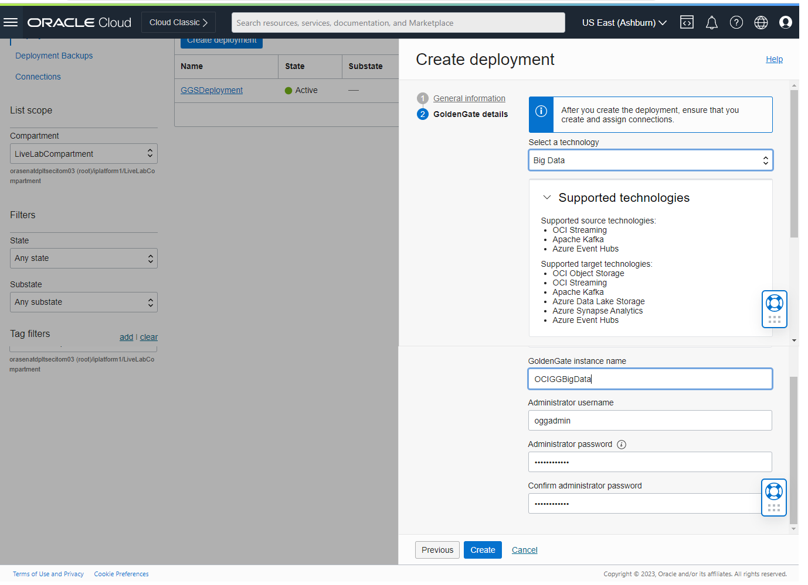
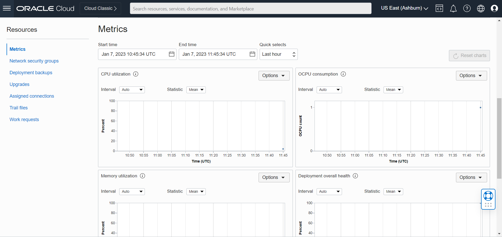

# Create the Oracle Cloud Infrastructure GoldenGate Deployment for Target

## Introduction

In this lab, you learn to create the Autonomous Transaction Processing (ATP) and Apache Kafka connections and then assign them to OCI GoldenGate deployments.

Estimated time: 5 minutes

### About Oracle Cloud Infrastructure GoldenGate Deployments

Oracle Cloud Infrastructure GoldenGate Deployment manages the resources it requires to function. The GoldenGate deployment also lets you access the GoldenGate deployment console, where you can access the OCI GoldenGate deployment console to create and manage processes such as Extracts and Replicats.

### Objectives

In this lab, you will:
* Locate Oracle Cloud Infrastructure GoldenGate in the Console
* Create an OCI GoldenGate deployment for Big Data
* Review the OCI GoldenGate deployment details
* Access the OCI GoldenGate deployment console

### Prerequisites

This lab assumes that you completed all preceding labs.

## Task 1: Create a deployment

> **Note:** *Compartment names in the screenshots may differ from values that appear in your environment.*

1.  Open the **Navigation Menu**, navigate to **Oracle Database**, and select **GoldenGate**.

    

2.  On the GoldenGate **Overview** page, click **Create Deployment**.

    
3.  You may need to select a compartment. Under List Scope, from the Compartment dropdown, expand the root compartment, and then select the compartment **LiveLabCompartment**.

4.  In the Create Deployment panel, enter **OCI GoldenGate Big Data** for Name.

5.  From the Compartment dropdown, select a compartment.

6.  For OCPU Count, enter **1**.

7.  For Subnet, select a subnet. If you're using the workshop environment, select **LiveLabWebSubnet**.

8.  For License type, select **License included**.
9.  Click **Show Advanced Options**, and then select **Create Public Endpoint**.

9. Click **Next**.
    

10. Select Technology as  **Big Data**.

11. For GoldenGate Instance Name, enter **OCIGGBigData**.

12. For Administrator Username, enter **oggadmin**.

13. For Administrator Password, enter a password. Take note of this password.

>**Note:** This password needs to match password of a database user that we will use later. In order to make sure the password works for both, we suggest you enter a password containing only upper case letters, lower case letters, numbers, and underscores. If you are using the green button (run on LiveLabs tenancy), you can use your database admin password given to you on the reservation page.

14. Click **Create**.

    

You're brought to the Deployment Details page. It takes a few minutes for the deployment to be created. Its status will change from CREATING to ACTIVE when it is ready for you to use.

## Task 2: Review the Deployment details

On the Deployment Details page, you can:

* Review the deployment's status
* Launch the GoldenGate service deployment console
* Edit the deployment's name or description
* Stop and start the deployment
* Move the deployment to a different compartment
* Review the deployment resource information
* Add tags

    
    

## Task 3: Launch the GoldenGate Deployment Console

1. When the deployment is active, click **Launch Console**.

    

2. To log in to the GoldenGate deployment console, enter **oggadmin** for User Name and the password you provided above, and then click **Sign In**.

    

After you log in, you're brought to the GoldenGate deployment console home page. Here, you can access the GoldenGate Administration, Performance Metrics, Distribution, and Receiver Services, as well as add Extracts and Replicats for your data replication tasks.

In this lab, you created an OCI Deployment, reviewed its Deployment details, and launched the Deployment Console.

You may now **proceed to the next lab**.

## Learn More

* [Managing Deployments](https://docs.oracle.com/en/cloud/paas/goldengate-service/using/deployments.html)

## Acknowledgements
* **Author** - Madhu Kumar S, Senior Solution Engineer, AppDev and Integration
* **Contributors** -  Denis Sendil, Database Product Management; Jenny Chan, Consulting User Assistance Developer, Database User Assistance
* **Last Updated By/Date** - Madhu Kumar S, Senior Solution Engineer, AppDev and Integration
