# Add and run the Extract

## Introduction

In this lab, you learn to add Transaction information (TRANDATA) and then add and run the Extract process in the source OCI GoldenGate deployment console.

Estimated time: 15 minutes

### About Transaction information 

Adding Transaction information (TRANDATA) allows Oracle GoldenGate to collect the information it needs from database transaction records.


### Objectives

In this lab, you will:
* Launch the OCI GoldenGate deployment console and log in
* Add transaction information
* Add and run an Extract


### Prerequisites

This lab assumes that you completed all preceding labs, and your deployment is in the Active state.


## Task 1: Add transaction information

1.  Use the Oracle Cloud Console navigation menu to navigate back to GoldenGate.

2.  On the Deployments page, select **GGSDeployment**.

3.  On the Deployment Details page, click **Launch Console**.

    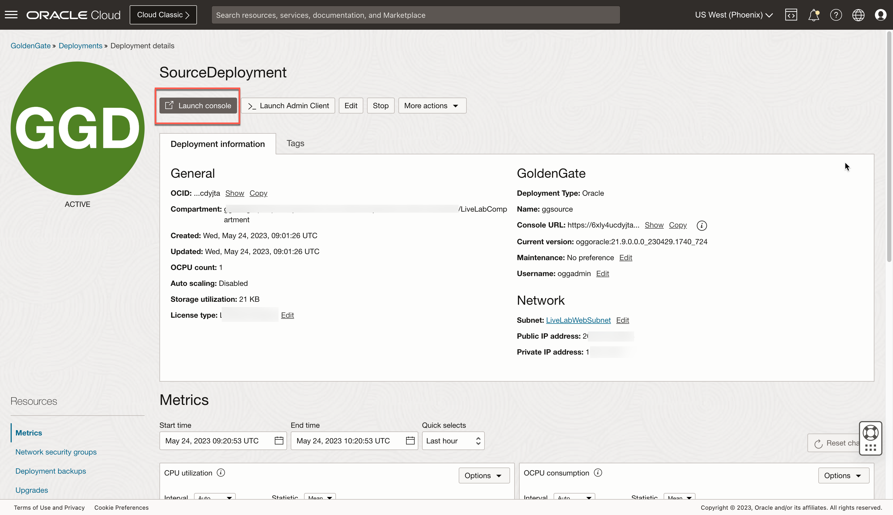

4.  On the OCI GoldenGate Deployment Console sign-in page, enter **oggadmin** for User Name and the password you provided when you created the deployment, and then click **Sign In**.

    

    You're brought to the OCI GoldenGate Deployment Console Home page after successfully signing in.

> **Note:** *Ensure that you enable supplemental logging before adding an Extract or you may encounter errors. If you encounter errors, delete and add the Extract before trying again.*

5.  Open the navigation menu and then click **Configuration**.

    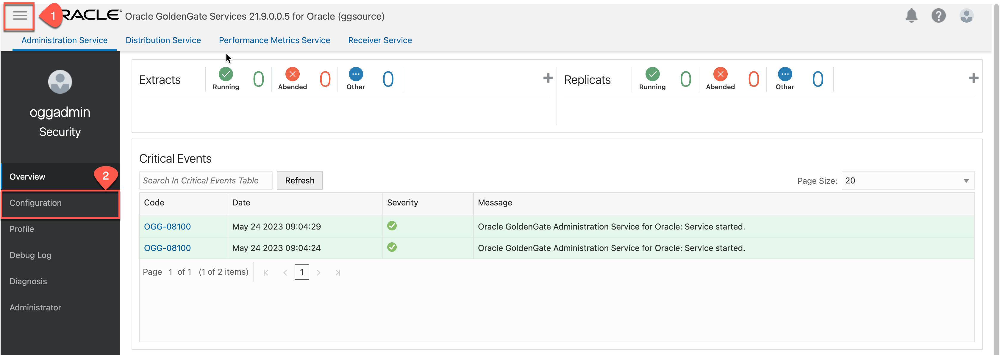

6.  Click **Connect to database SourceATP**.

    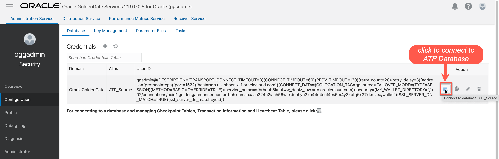

7.  Next to **TRANDATA Information** click **Add TRANDATA**.

    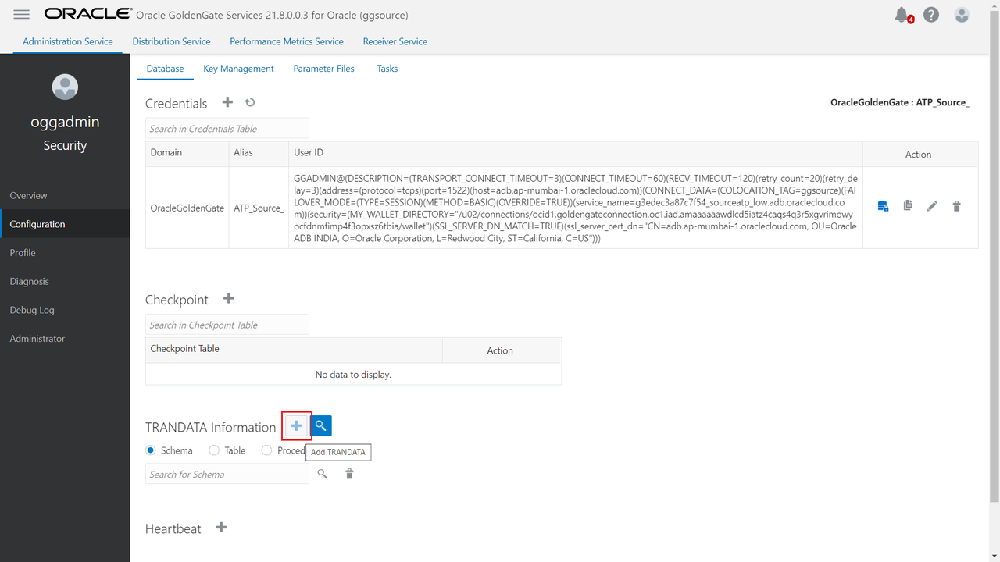

8.  For **Schema Name**, enter **SRC\_OCIGGLL**, and then click **Submit**.

    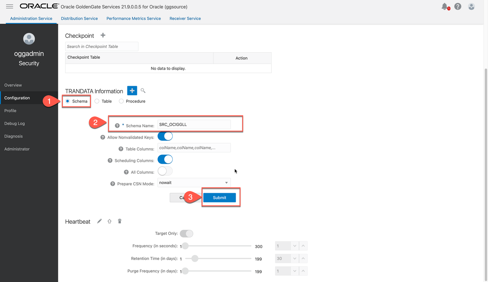

9.  To verify, click **Search TRANDATA**, and then enter **SRC\_OCIGGLL** into the Search field and click **Search**.

    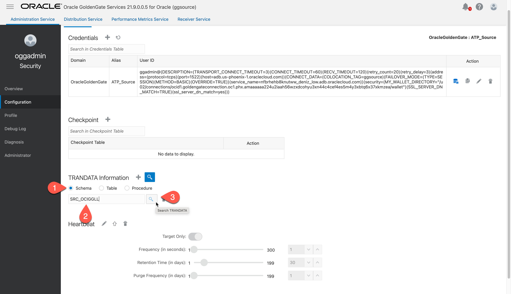

    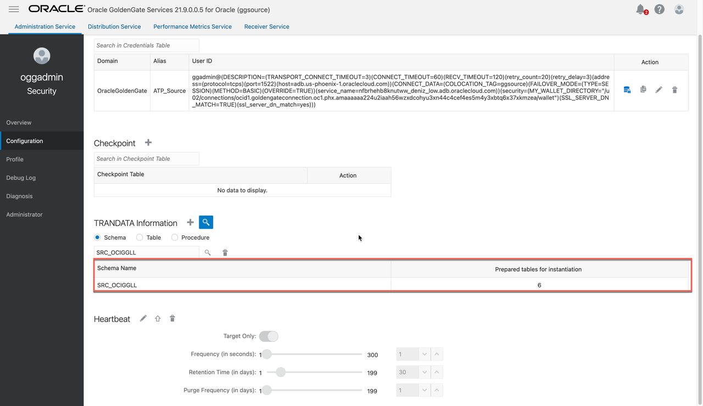


To return to the GoldenGate Deployment Console Home page, click **Overview** in the left navigation.
## Task 1: Add and Run an Extract

1.  On the GoldenGate Deployment Console Home page, click **Add Extract** (plus icon).

    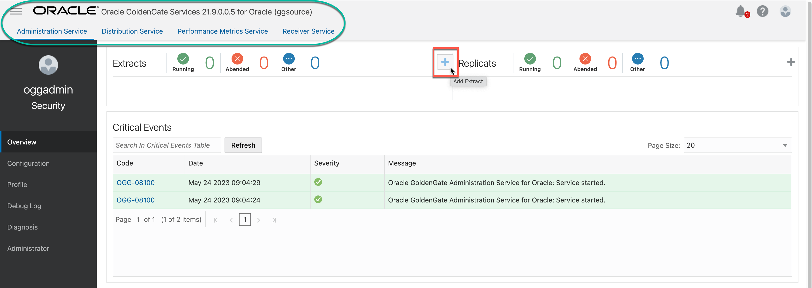

2.  On the Add Extract page, select **Integrated Extract**, and then click **Next**.

    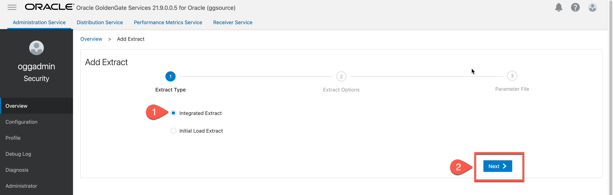

3.  For **Process Name**, enter EXTATP.

4.  For **Trail Name**, enter AE.

5.  Under **Source Database Credential**, for **Credential Domain**, select **OracleGoldenGate**.

6.  For **Credential Alias**, select the **ATP_Source**.

    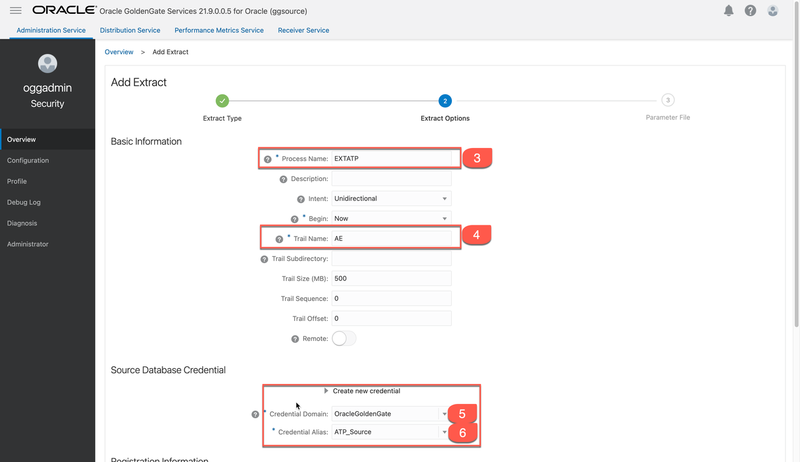

7.  Under Managed Options, enable **Critical to deployment health**.

8.  Click **Next**.
    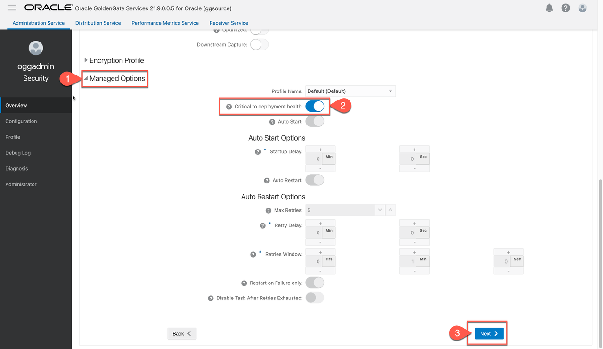


9.  On the Parameter File page, in the text area, add a new line to the existing text and add the following:

    ```
    <copy>-- Capture DDL operations for listed schema tables
    ddl include mapped

    -- Add step-by-step history of ddl operations captured
    -- to the report file. Very useful when troubleshooting.
    ddloptions report

    -- Write capture stats per table to the report file daily.
    report at 00:01

    -- Rollover the report file weekly. Useful when IE runs
    -- without being stopped/started for long periods of time to
    -- keep the report files from becoming too large.
    reportrollover at 00:01 on Sunday

    -- Report total operations captured, and operations per second
    -- every 10 minutes.
    reportcount every 10 minutes, rate

    -- Table list for capture
    table SRC_OCIGGLL.*;</copy>
    ```

    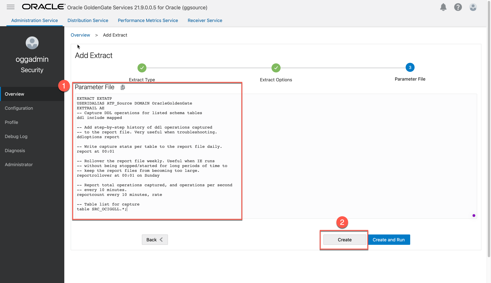

10. Click **Create**. You're returned to the OCI GoldenGate Deployment Console Home page.

11. In the EXTATP **Actions** menu, select **Start**. In the Confirm Action dialog, click **OK**.

    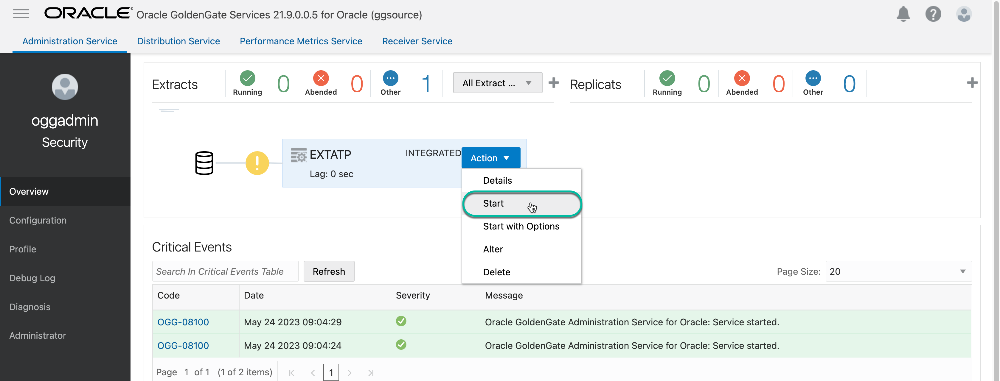

    The yellow exclamation point icon changes to a green checkmark.

    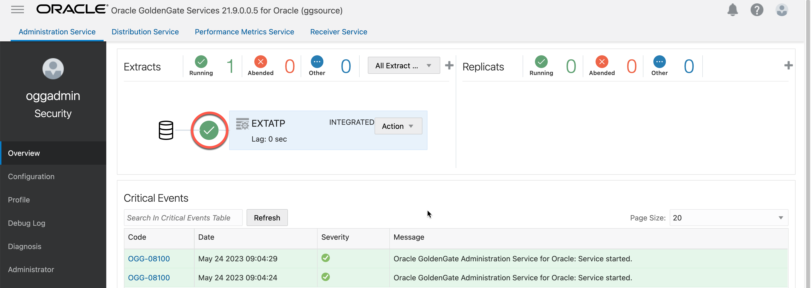


You may now **proceed to the next lab**.


## Learn more

* [ADD TRANDATA](https://docs.oracle.com/en/middleware/goldengate/core/21.3/gclir/add-trandata.html)

You may now **proceed to the next lab**.

## Acknowledgements
* **Author** - Madhu Kumar S, Senior Solution Engineer, AppDev and Integration
* **Contributors** -  Denis Sendil, Database Product Management; Jenny Chan, Consulting User Assistance Developer, Database User Assistance
* **Last Updated By/Date** - Madhu Kumar S, Senior Solution Engineer, AppDev and Integration