# Create the Oracle Cloud Infrastructure GoldenGate resources

## Introduction

This lab walks you through the steps to create an Oracle Cloud Infrastructure (OCI) GoldenGate deployment.

Estimated time: 10 minutes

### About Oracle Cloud Infrastructure GoldenGate Deployments and Database Registrations

A Oracle Cloud Infrastructure GoldenGate deployment manages the resources it requires to function. The GoldenGate deployment also lets you access the GoldenGate deployment console, where you can access the OCI GoldenGate deployment console to create and manage processes such as Extracts and Replicats.

Database Registrations capture source and target credential information. A database registration also enables networking between the Oracle Cloud Infrastructure (OCI) GoldenGate service tenancy virtual cloud network (VCN) and your tenancy VCN using a private endpoint.

### Objectives

In this lab, you will:
* Locate Oracle Cloud Infrastructure GoldenGate in the Console
* Create a OCI GoldenGate deployment
* Register the source and target databases


## Task 1: Create a deployment

> **Note:** *Compartment names in the screenshots may differ from values that appear in your environment.*

1.  Open the **Navigation Menu**, navigate to **Oracle Database**, and select **GoldenGate**.

    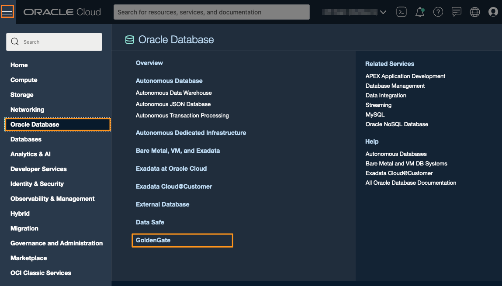

2.  On the GoldenGate **Overview** page, click **Deployments**.

    

3.  You may need to select a compartment. Under List Scope, from the Comparment dropdown, expand the root compartment, and then select the compartment associated with your username. For example, if your LiveLab username is LL1234-user, expand root, and then select the compartment **LL1234-COMPARTMENT**.

4.  On the Deployments page, click **Create Deployment**.

    

5.  In the Create Deployment panel, enter **GGSDeployment** for Name.

6.  From the Compartment dropdown, select a compartment.

7.  For OCPU Count, enter **1**.

8.  For Subnet, select a subnet. If you're using the workshop environment, select **&lt;user&gt;pubsubnt**.

9.  For License type, select **Bring You Own License (BYOL)**.

10. Click **Show Advanced Options**, and then select **Create Public Endpoint**.

    

11. Click **Next**.

12. For GoldenGate Instance Name, enter **ggsinstance**.

13. For Administrator Username, enter **oggadmin**.

14. For Administrator Password, enter a password. Take note of this password.

>**Note:** This password needs to match password of a database user that we will use later. In order to make sure the password works for both, we suggest you enter a password containing only upper case letters, lower case letters, numbers, and underscores. If you are using the green button (run on LiveLabs tenancy), you can use your database admin password given to you on the reservation page.

15. Click **Create**.

    

You're brought to the Deployment Details page. It takes a few minutes for the deployment to be created. Its status will change from CREATING to ACTIVE when it is ready for you to use.

## Task 2: Register the source database

First, follow the steps below to register the source Oracle Autonomous Transaction Processing \(ATP\) Database.

1.  Use the Oracle Cloud Console breadcrumb to navigate back to the GoldenGate page.

    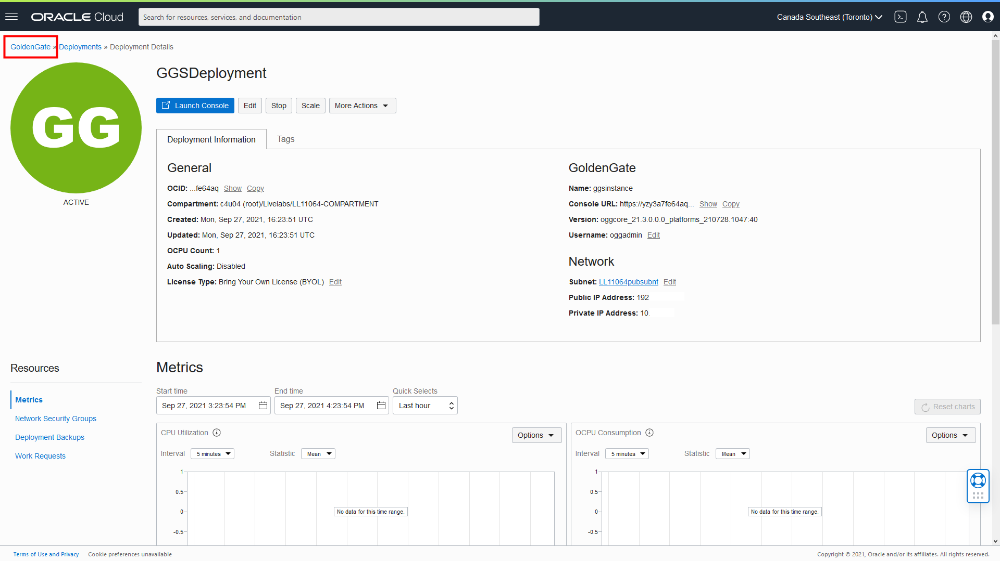

2.  Click **Registered Databases**.

    

3.  Click **Register Database**.

    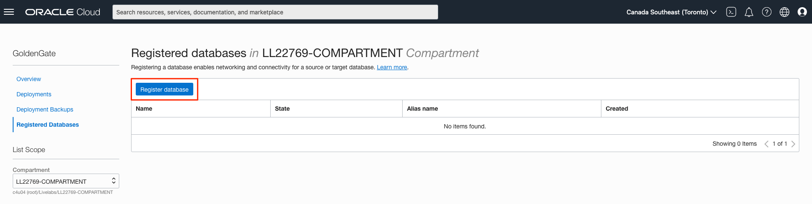

4.  In the Register Database panel, for Name and Alias, enter **SourceATP**.

5.  From the Compartment dropdown, select a compartment.

6.  Click **Select Database**.

7.  From the Database Type dropdown, select **Autonomous Database**.

8.  For **Autonomous Database in &lt;compartment-name&gt;**, click **Change Compartment**, select the compartment you created your ATP instance, and then select **SourceATP** from the dropdown. Some fields are autopopulated based on your selection.

9.  Enter the database's password in the Password field, and then click **Register**.

    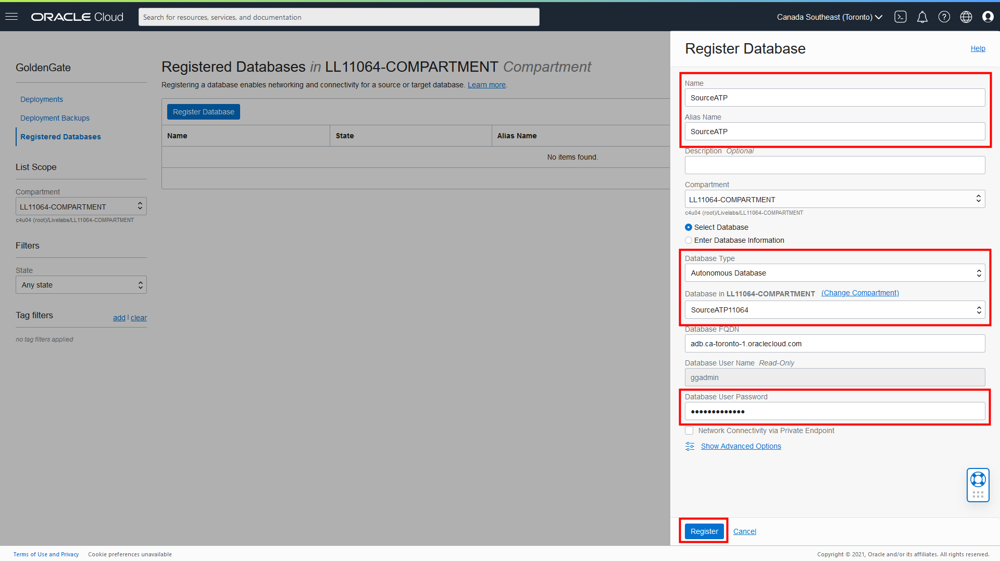

    The database registration becomes Active after a few minutes.

## Task 3: Unlock the GGADMIN user and check support mode for the source database

Oracle Autonomous Databases come with a GGADMIN user that is locked by default. The following steps guide you through how to unlock the GGADMIN user.

1.  From the Oracle Cloud Console **Navigation Menu** (hamburger icon), click **Oracle Database**, and then select **Autonomous Transaction Processing**.

	

2.  From the list of databases, select **SourceATP**.

    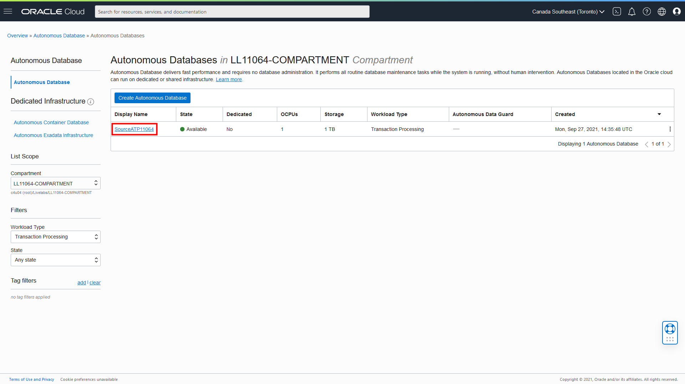

3.  On the SourceATP Database Details page, click **Database Actions**.

    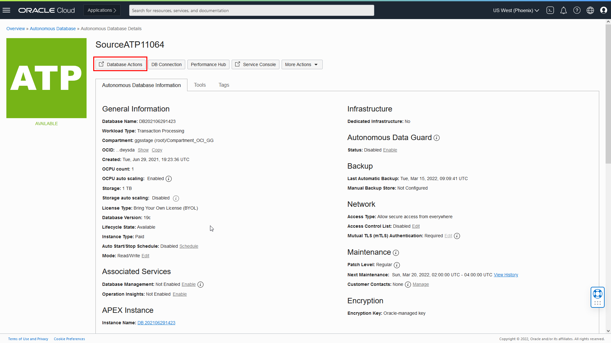

    > **Note:** *If you're prompted to log in to Database Actions, use the source database admin credentials.*

4.  Under **Administration**, click **Database Users**.

    

5.  From the list of users, locate **GGADMIN**, and then click the ellipsis (three dots) icon and select **Edit**.

    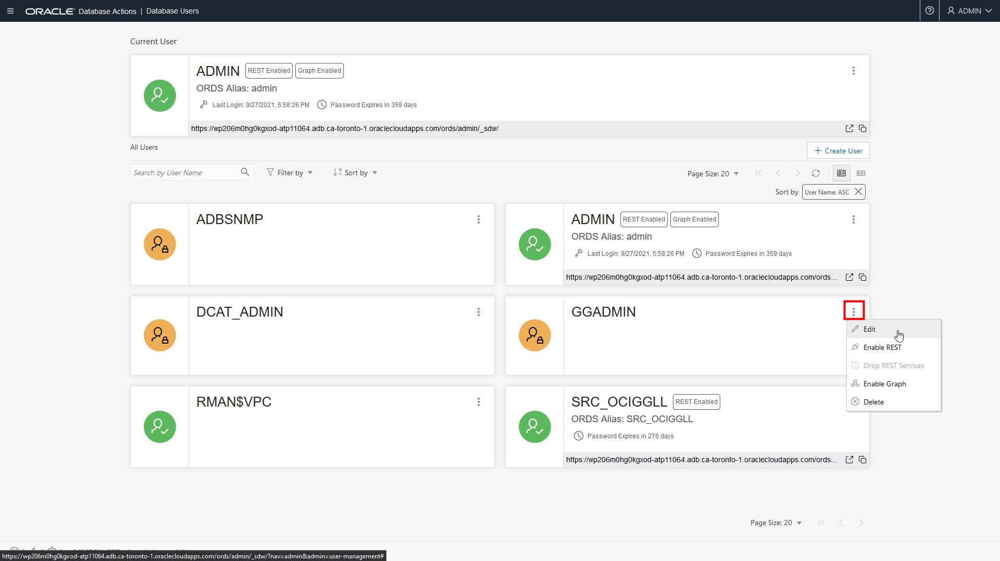

6.  In the Edit User panel, deselect **Account is Locked**, enter the password you gave the ggadmin user in the database registration steps above, and then click **Apply Changes**.

    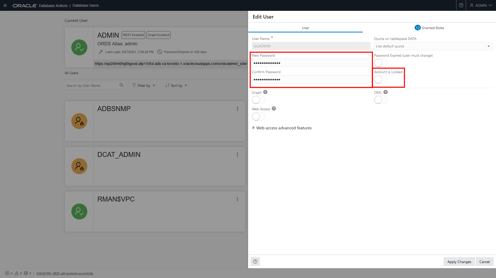

    Note that the user icon changes from a padlock to a checkmark.

7.  From the navigation menu (hamburger icon), click **SQL**.

8.  In the worksheet, enter the following, and then click **Run Statement**:

    ```
    <copy>
select * from DBA_GOLDENGATE_SUPPORT_MODE where owner = 'SRC_OCIGGLL';
    </copy>
    ```

    The Script Output panel displays six tables whose Support_Mode is **FULL**.

    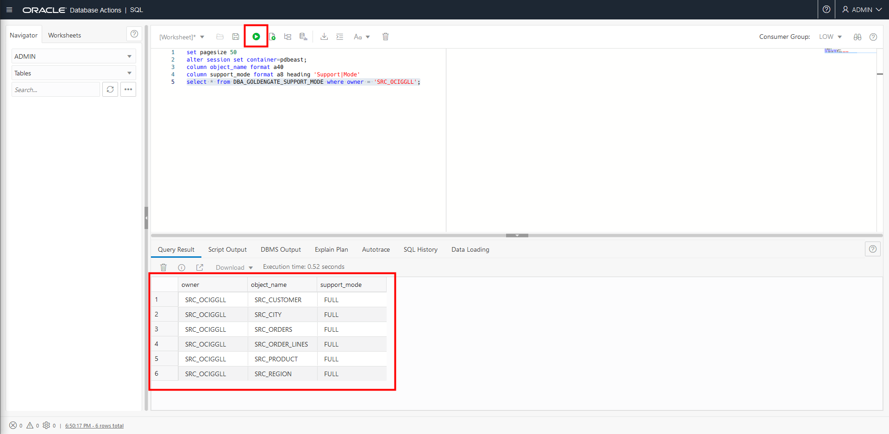

You can leave the source database SQL window open for use in a later lab.

## Task 4: Register the target database and unlock the GGADMIN user

Now, follow the steps below to register the target Autonomous Data Warehouse \(ADW\) instance.

1.  Use the Oracle Cloud Console navigation menu to navigate back to GoldenGate.

1.  Click **Registered Databases** and then **Register Database**.

    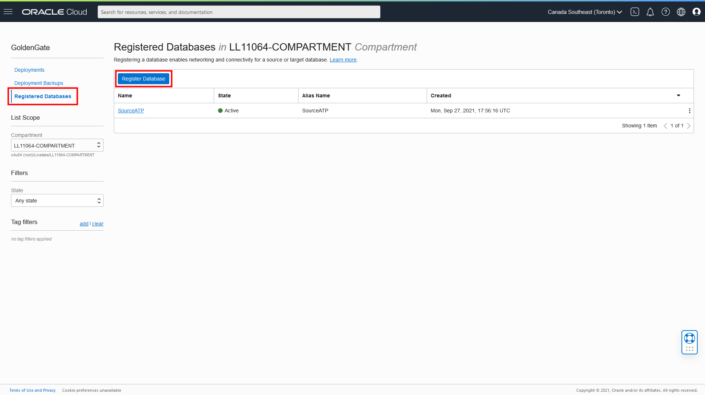

2.  In the Register Database panel, enter **TargetADW** for Name and Alias.

3.  From the **Compartment** dropdown, select a compartment.

4.  Click **Select Database**.

5.  For **Autonomous Database in &lt;compartment-name&gt;**, click **Change Compartment**, select the compartment you created your ADW instance, and then select **TargetADW** from the dropdown. Some fields are autopopulated based on your selection.

6.  Enter the database's password in the Password field, and then click **Register**.

    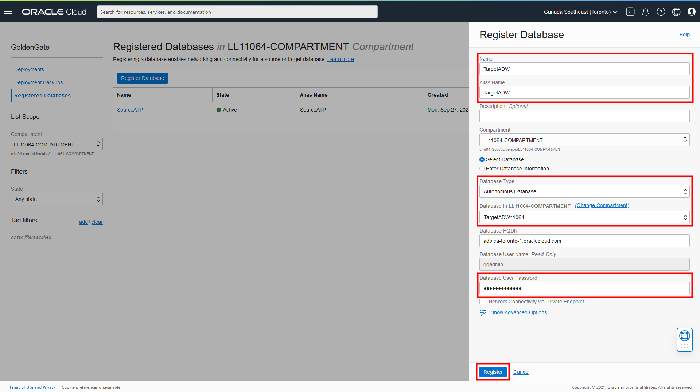

    The source and target databases appear in the list of Registered Databases. The database registration becomes Active after a few minutes.

7.  Repeat the instructions under Task 2 to unlock the GGADMIN user on the TargetADW database.

In this lab, you created an OCI GoldenGate deployment, and registered the source and target databases.

## Learn More

* [Managing Deployments](https://docs.oracle.com/en/cloud/paas/goldengate-service/using/deployments.html)
* [Managing Database Registrations](https://docs.oracle.com/en/cloud/paas/goldengate-service/using/database-registrations.html)

## Acknowledgements
* **Author** - Jenny Chan, Consulting User Assistance Developer, Database User Assistance
* **Contributors** -  Denis Gray, Database Product Management; Arabella Yao, Database Product Management
* **Last Updated By/Date** - Jenny Chan, June 2022
