# Create the Extract process and export data using Oracle Data Pump

## Introduction
This lab instructs you to use the OCI GoldenGate deployment console to add transaction information to the source database, add a checkpoint table to the target database, add and run an Extract, and instantiate the target database using Oracle Data Pump.

Estimated time: 25 minutes

### About the Extract process
An Extract is a process that extracts, or captures, data from a source database.

### Objectives
In this lab, you learn to:
* Log in to the OCI GoldenGate deployment console
* Connect to the source database to add transaction information
* Connect to the target database to add a checkpoint table
* Add and run an Extract
* Export data from the source database using Oracle Data Pump

## Task 1: Review the Deployment details
Return to the OCI GoldenGate deployment you created in the previous lab.

1. In the Oracle Cloud console, open the navigation menu, click **Oracle Database**, and then click **GoldenGate**.

2. Click **Deployments**.

3. On the Deployments page, select the deployment you created to view its details.

On the Deployment Details page, you can:

* Review the deployment's status
* Launch the GoldenGate service deployment console
* Edit the deployment's name or description
* Stop and start the deployment
* Move the deployment to a different compartment
* Review the deployment resource information
* Add tags

    

## Task 2: Launch the GoldenGate Deployment Console

1. On the deployment details page, click **Launch Console**.

    

2. To log in to the GoldenGate deployment console, enter **oggadmin** for User Name and the password you provided in Lab 1 (Task 1, Step 14), and then click **Sign In**.

    

After you log in, you're brought to the GoldenGate deployment console home page. Here, you can access the GoldenGate Administration, Performance Metrics, Distribution, and Receiver Services, as well as add Extracts and Replicats for your data replication tasks.

## Task 3: Add Transaction Data and a Checkpoint Table

> **Note:** *Ensure that you enable supplemental logging before adding an Extract or you may encounter errors. If you encounter errors, delete and add the Extract before trying again.*

1.  Open the navigation menu and then click **Configuration**.

    

2.  Click **Connect to database SourceATP**.

    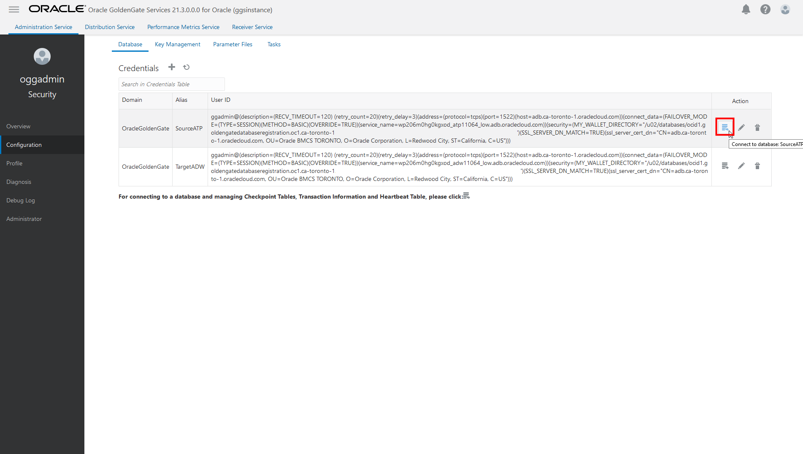

3.  Next to **TRANDATA Information** click **Add TRANDATA** (plus icon).

    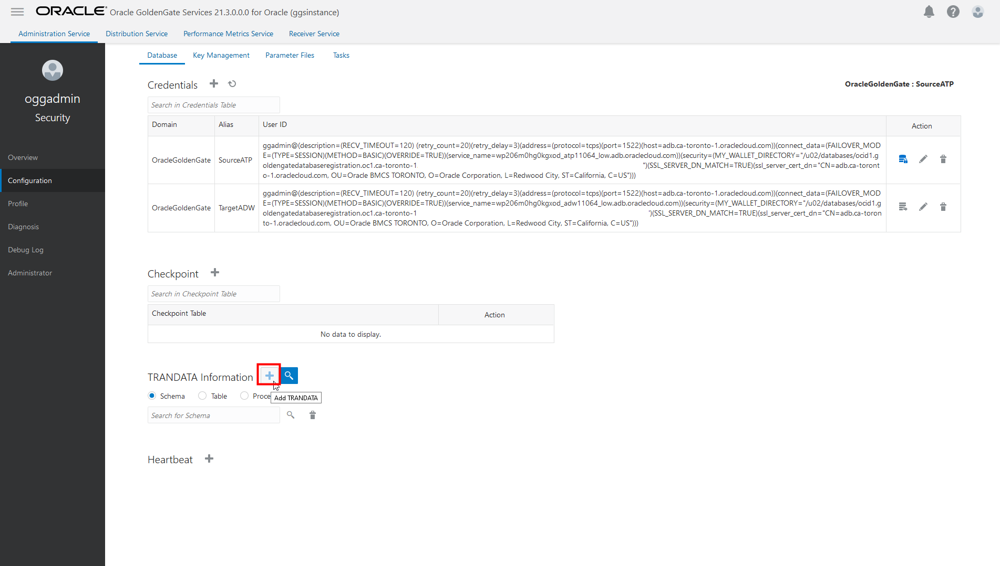

4.  For **Schema Name**, enter `SRC_OCIGGLL`, and then click **Submit**.

    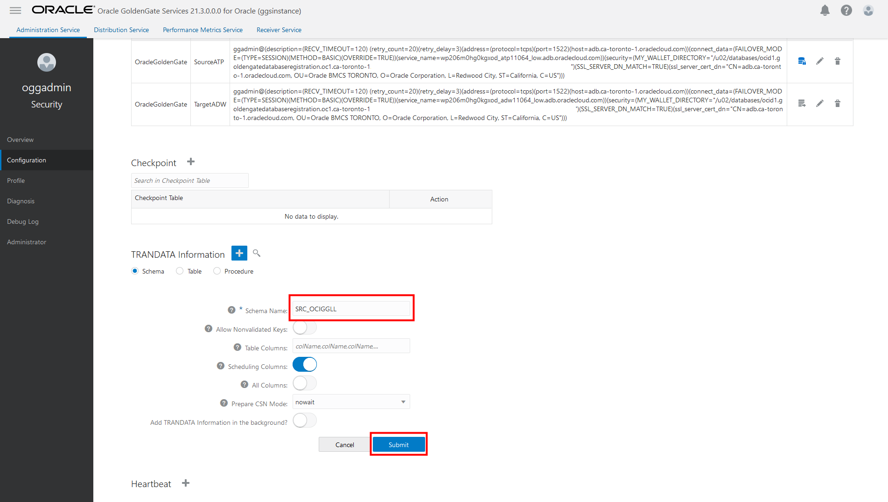

5.  To verify, click **Search TRANDATA**, and then enter `SRC_OCIGGLL` into the Search field and click **Search**.

    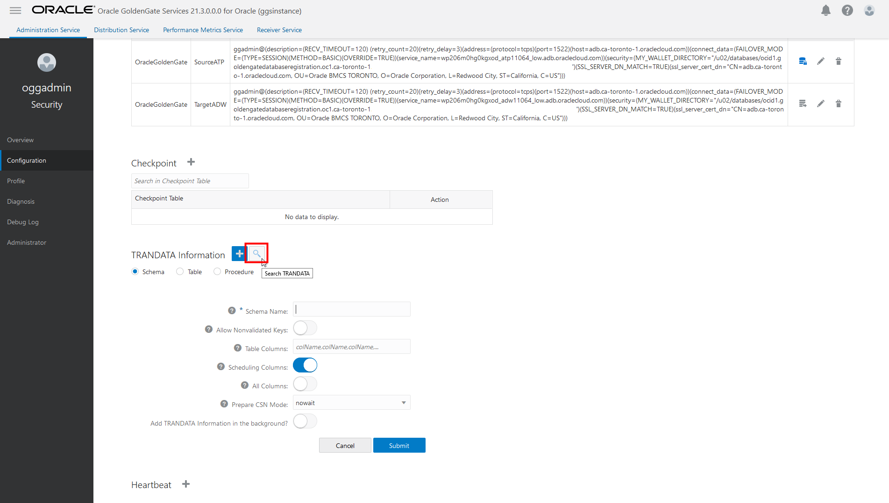

    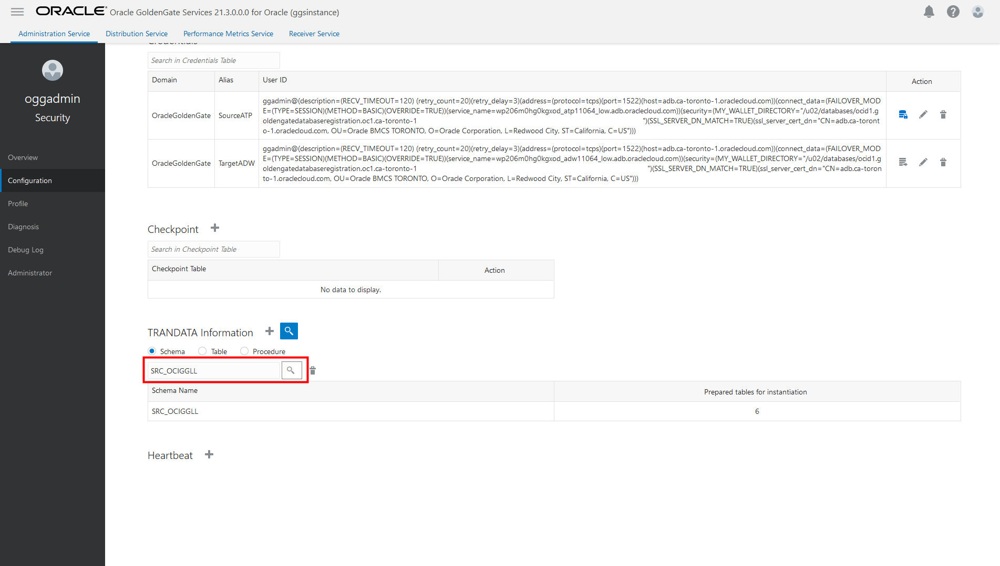

6.  Click **Connect to database TargetADW**.

    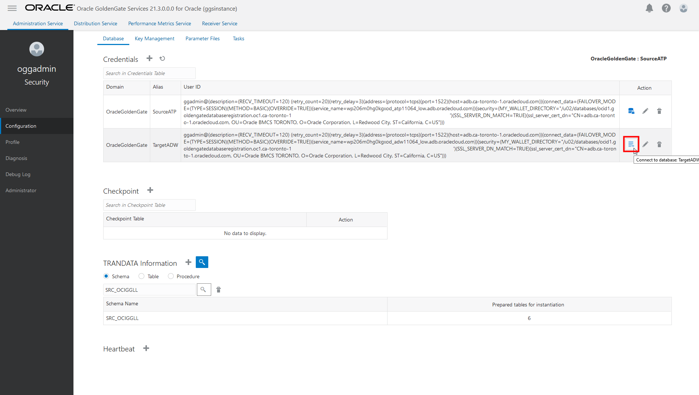

7.  Next to Checkpoint, click **Add Checkpoint**.

    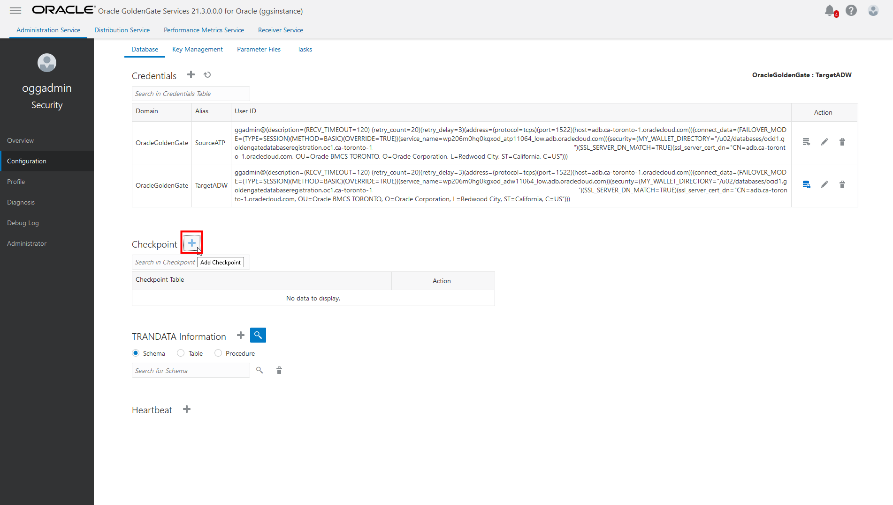

8.  For **Checkpoint Table**, enter `"SRCMIRROR_OCIGGLL"."CHECKTABLE"`, and then click **Submit**.

    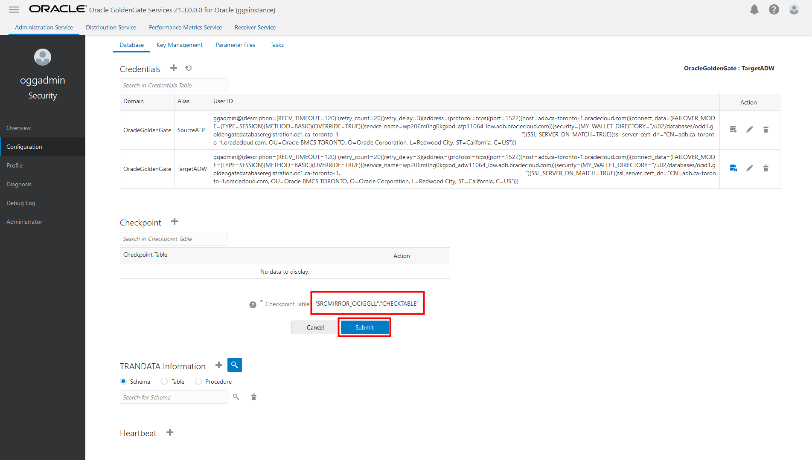

To return to the GoldenGate Deployment Console Home page, click **Overview** in the left navigation.

## Task 4: Add and Run an Extract

1.  On the GoldenGate Deployment Console Home page, click **Add Extract** (plus icon).

    

2.  On the Add Extract page, select **Integrated Extract**, and then click **Next**.

    

3.  For **Process Name**, enter UAEXT.

4.  For **Trail Name**, enter E1.

    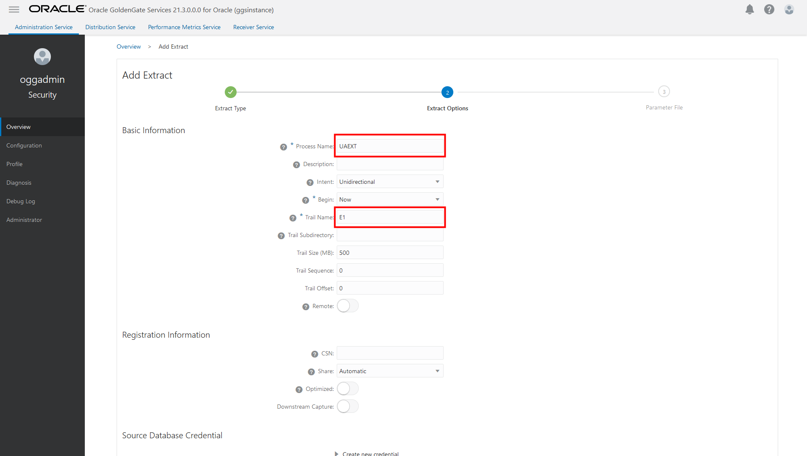

5.  Under **Source Database Credential**, for **Credential Domain**, select **OracleGoldenGate**.

6.  For **Credential Alias**, select the **SourceATP**.

    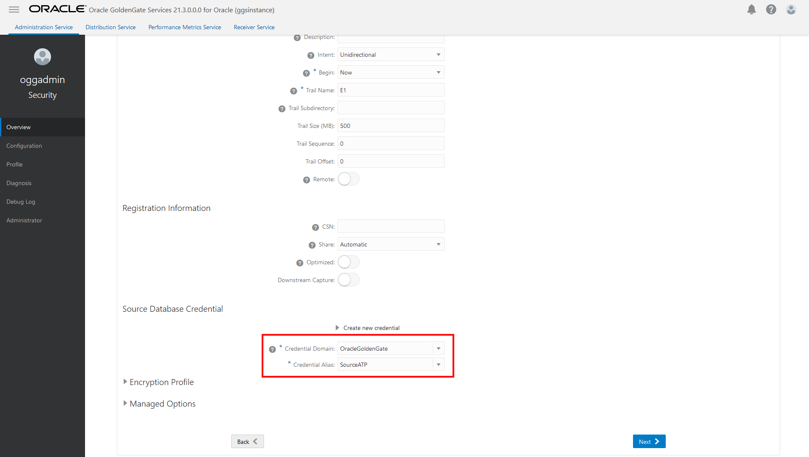

7.  Under Managed Options, enable **Critical to deployment health**.

    

8.  Click **Next**.

9.  On the Parameter File page, in the text area, add a new line to the existing text and add the following:

    ```
    <copy>-- Capture DDL operations for listed schema tables
    ddl include mapped

    -- Add step-by-step history of ddl operations captured
    -- to the report file. Very useful when troubleshooting.
    ddloptions report

    -- Write capture stats per table to the report file daily.
    report at 00:01

    -- Rollover the report file weekly. Useful when IE runs
    -- without being stopped/started for long periods of time to
    -- keep the report files from becoming too large.
    reportrollover at 00:01 on Sunday

    -- Report total operations captured, and operations per second
    -- every 10 minutes.
    reportcount every 10 minutes, rate

    -- Table list for capture
    table SRC_OCIGGLL.*;</copy>
    ```

    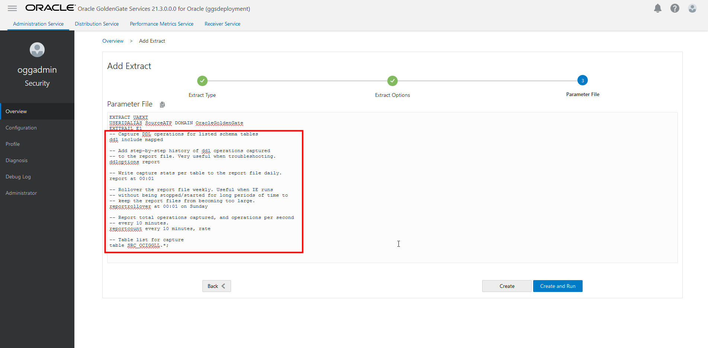

10. Click **Create**. You're returned to the OCI GoldenGate Deployment Console Home page.

11. In the UAEXT **Action** menu, select **Start**. In the Confirm Action dialog, click **OK**.

    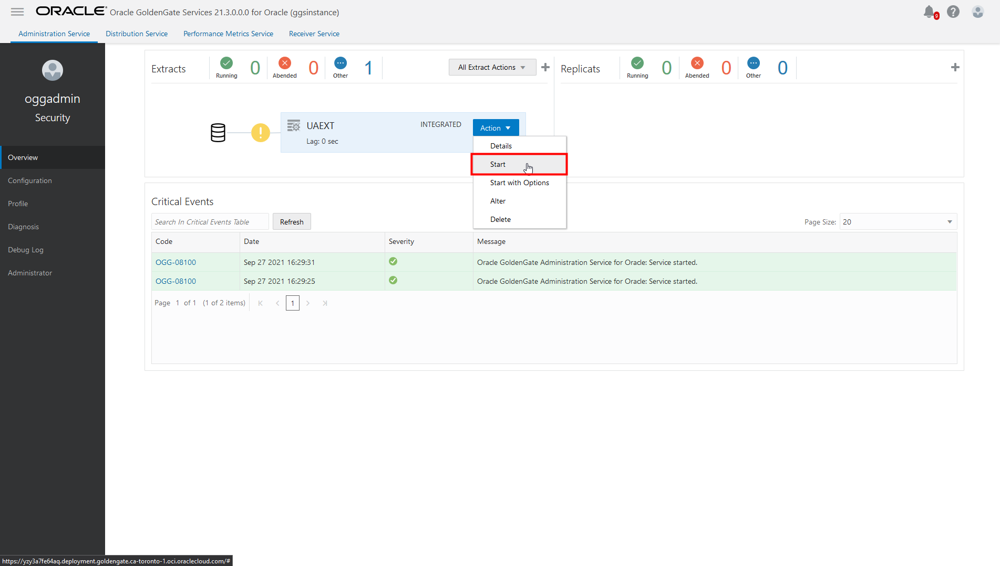

    The yellow exclamation point icon changes to a green checkmark.

    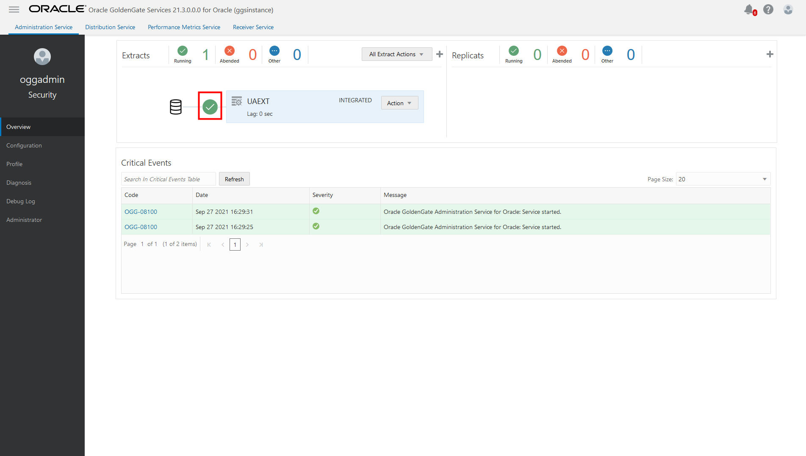

## Task 5: Check for long running transactions

1.  In the source database SQL window, enter the following script, and then click **Run Statement**:

    ```
    <copy>select start_scn, start_time from gv$transaction where start_scn < (select max(start_scn) from dba_capture);</copy>
    ```

    If the query returns any rows, then you must locate the transaction's SCN and then either commit or rollback the transaction.

    

## Task 6: Export data using Oracle Data Pump (ExpDP)

Before using Oracle Data Pump to export data from the source database, first create an Oracle Object Store bucket, then create yourself a Credential Token, and then use these resources to create a credential in ATP.

1.  From the Oracle Cloud Console navigation menu (hamburger icon), click **Storage**, and then **Buckets**.

    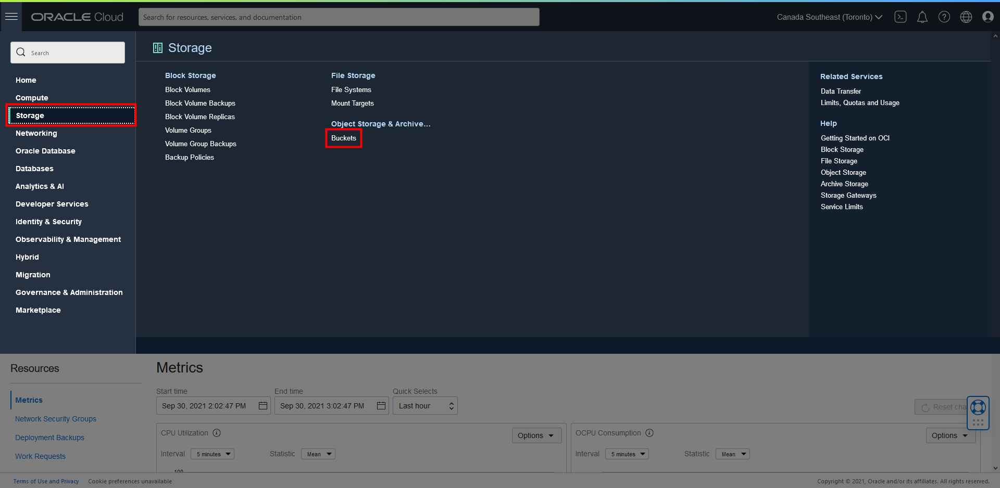

2.  On the **Buckets in &lt;compartment-name&gt;** page, click **Create Bucket**.

    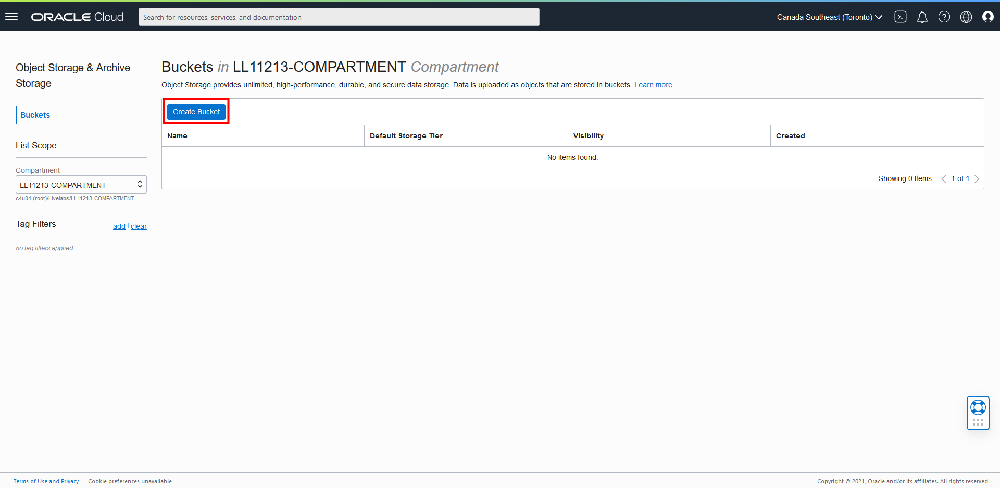

3.  In the **Create Bucket** panel, enter a name, and then click **Create**.

    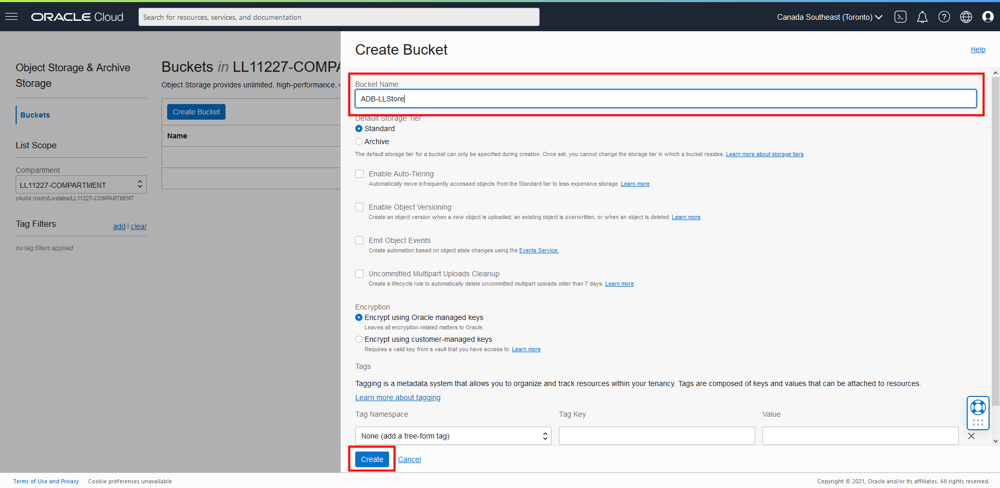

4.  From the list of buckets, click the bucket you created. You're brought to the bucket Details page.

5.  On the bucket details page, under Objects, click **Upload**.

6.  Enter a prefix, select a file (a simple text file will do), and then click **Upload**.

7.  Close the panel. The object you uploaded appears in the Objects list.

8.  In the Objects list, click the three dots icon for your object, and then select **View Object Details**.

9.  In the Object Details panel, copy the URL Path (URI) up the object name and paste it into a text editor.

    

    The bucket URI should match the following syntax:

    ```
    <copy>https://objectstorage.&lt;region&gt;.oraclecloud.com/n/&lt;namespace&gt;/b/&lt;bucket-name&gt;/o/</copy>
    ```

10. In the Oracle Cloud Console global header, click **Profile** (user icon), and then select your username.

    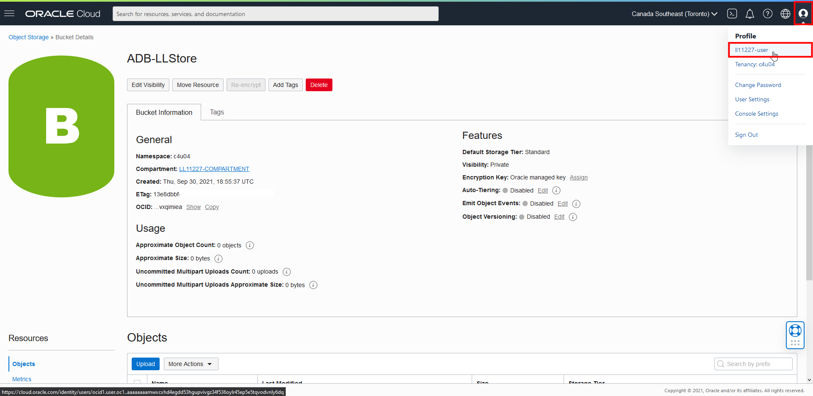

11. On the User Details page, under **Resources**, click **Auth Tokens**, and then click **Generate Token**.

    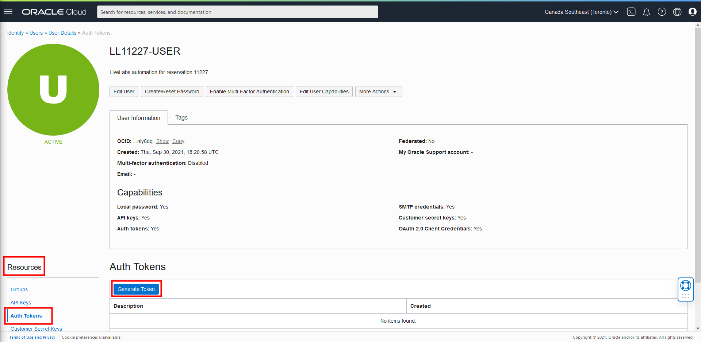

12. In the Generate Token dialog, enter a description, and then click **Generate Token**.

    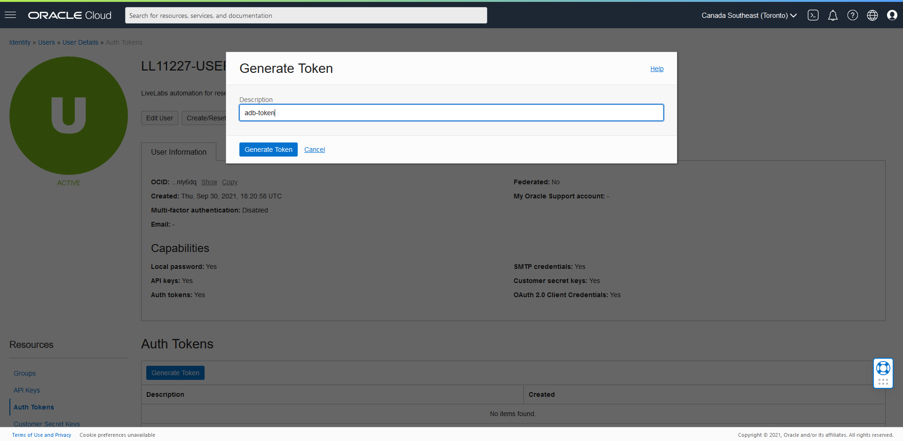

13. Click **Copy**, and then click **Close**.

    > **Note:** *Paste the token to a text editor for use in the next step.*

    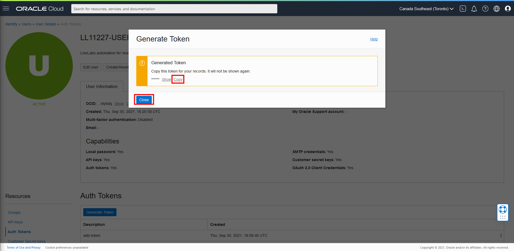

14. In the source database SQL window, enter the following script, replace the placeholders with your user name and token value, and then click **Run Statement**:

    ```
    <copy>BEGIN
  DBMS_CLOUD.CREATE_CREDENTIAL(
    credential_name => 'ADB_OBJECTSTORE',
    username => '<user-name>',
    password => '<token>'
  );
END;</copy>
    ```

    > **Note:** If you're using a federated user, then the username should be in the following format: `oracle/<user-name>`


    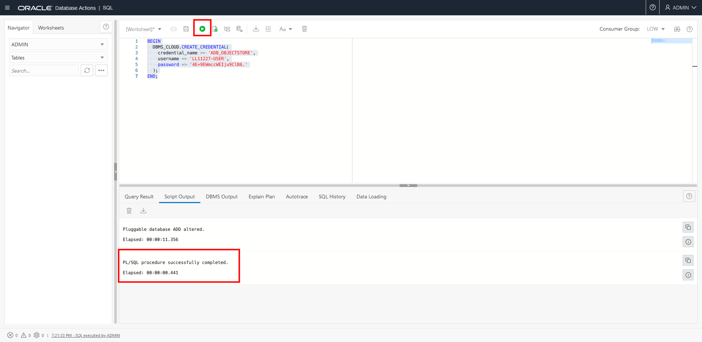

15. Use the following script to create the Export Data job using Oracle Data Pump ExpDP. Ensure that you replace the Object Store URI (`https://objectstorage.<region>.oraclecloud.com/n/<namespace>/b/<bucket-name>/o/`) with **your URI** from step 5. `SRC_OCIGGLL.dmp` is a file that will be created when this script runs.

    ```
    <copy>DECLARE
    ind NUMBER;              -- Loop index
    h1 NUMBER;               -- Data Pump job handle
    percent_done NUMBER;     -- Percentage of job complete
    job_state VARCHAR2(30);  -- To keep track of job state
    le ku$_LogEntry;         -- For WIP and error messages
    js ku$_JobStatus;        -- The job status from get_status
    jd ku$_JobDesc;          -- The job description from get_status
    sts ku$_Status;          -- The status object returned by get_status

    BEGIN
    -- Create a (user-named) Data Pump job to do a schema export.
    h1 := DBMS_DATAPUMP.OPEN('EXPORT','SCHEMA',NULL,'SRC_OCIGGLL_EXPORT','LATEST');

    -- Specify a single dump file for the job (using the handle just returned
    -- and a directory object, which must already be defined and accessible
    -- to the user running this procedure.
    DBMS_DATAPUMP.ADD_FILE(h1,'https://objectstorage.&lt;region&gt;.oraclecloud.com/n/&lt;namespace&gt;/b/&lt;bucket-name&gt;/o/SRC_OCIGGLL.dmp','ADB_OBJECTSTORE','100MB',DBMS_DATAPUMP.KU$_FILE_TYPE_URIDUMP_FILE,1);

    -- A metadata filter is used to specify the schema that will be exported.
    DBMS_DATAPUMP.METADATA_FILTER(h1,'SCHEMA_EXPR','IN (''SRC_OCIGGLL'')');

    -- Start the job. An exception will be generated if something is not set up properly.
    DBMS_DATAPUMP.START_JOB(h1);

    -- The export job should now be running. In the following loop, the job
    -- is monitored until it completes. In the meantime, progress information is displayed.
    percent_done := 0;
    job_state := 'UNDEFINED';
    while (job_state != 'COMPLETED') and (job_state != 'STOPPED') loop
      dbms_datapump.get_status(h1,dbms_datapump.ku$_status_job_error + dbms_datapump.ku$_status_job_status + dbms_datapump.ku$_status_wip,-1,job_state,sts);
      js := sts.job_status;

    -- If the percentage done changed, display the new value.
    if js.percent_done != percent_done
    then
      dbms_output.put_line('*** Job percent done = ' || to_char(js.percent_done));
      percent_done := js.percent_done;
    end if;

    -- If any work-in-progress (WIP) or error messages were received for the job, display them.
    if (bitand(sts.mask,dbms_datapump.ku$_status_wip) != 0)
    then
      le := sts.wip;
    else
      if (bitand(sts.mask,dbms_datapump.ku$_status_job_error) != 0)
      then
        le := sts.error;
      else
        le := null;
      end if;
    end if;
    if le is not null
    then
      ind := le.FIRST;
      while ind is not null loop
        dbms_output.put_line(le(ind).LogText);
        ind := le.NEXT(ind);
      end loop;
    end if;
  end loop;

  -- Indicate that the job finished and detach from it.
  dbms_output.put_line('Job has completed');
  dbms_output.put_line('Final job state = ' || job_state);
  dbms_datapump.detach(h1);
END;</copy>
    ```

    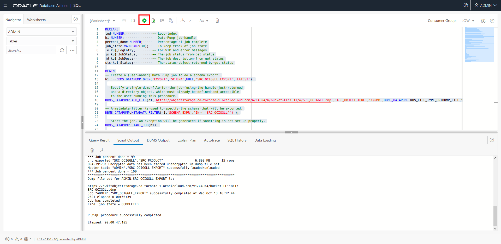

## Learn more

* [Creating an Extract](https://docs.oracle.com/en/cloud/paas/goldengate-service/using/goldengate-deployment-console.html#GUID-3B004DB0-2F41-4FC2-BDD4-4DE809F52448)

## Acknowledgements
* **Author** - Jenny Chan, Consulting User Assistance Developer, Database User Assistance
* **Contributors** -  Denis Gray, Database Product Management; Arabella Yao, Database Product Management
* **Last Updated By/Date** - Jenny Chan, June 2022
