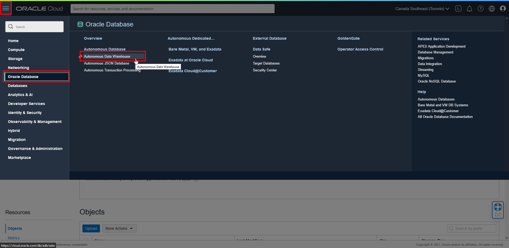
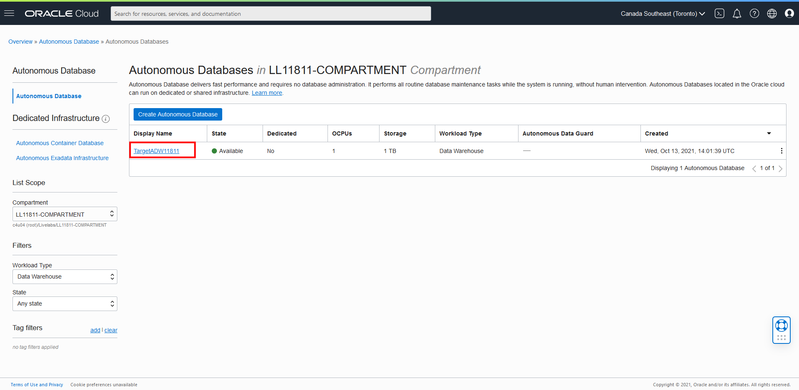
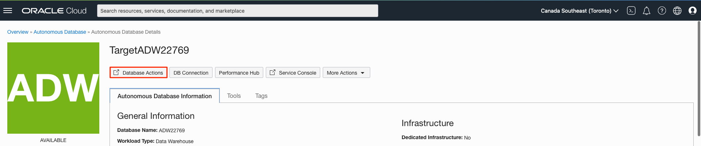
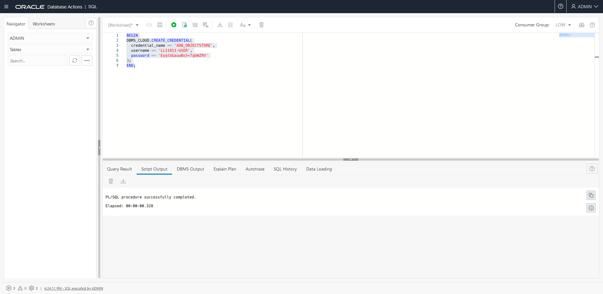
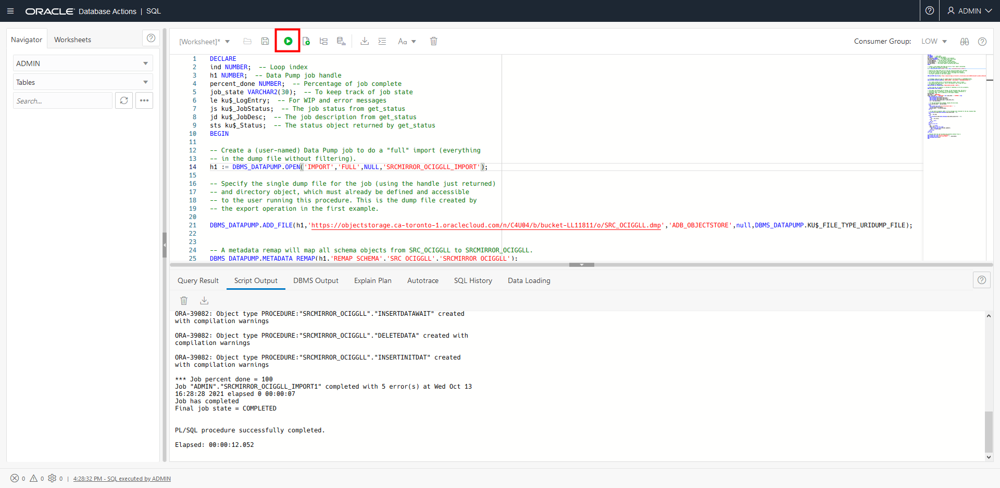
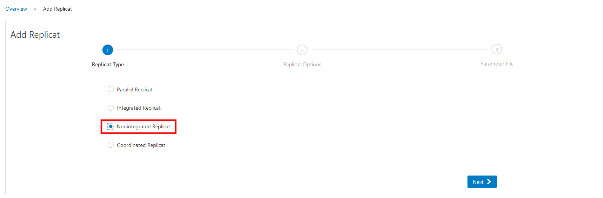
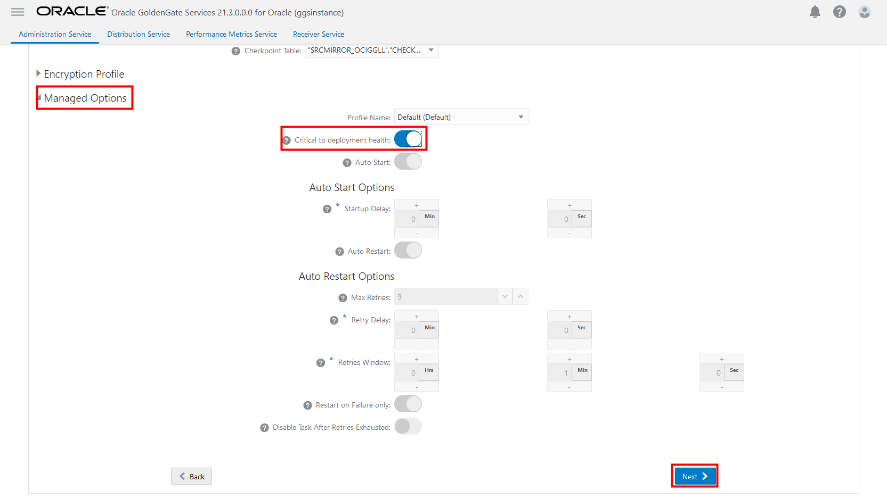
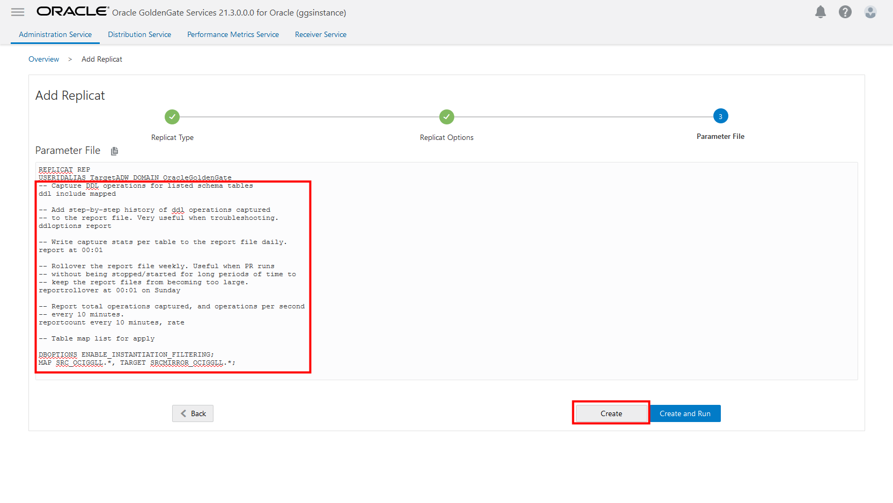

# Create and run the Extract and Replicat

## Introduction

This lab walks you through the steps to instantiate the target database using Oracle Data Pump, and then add and run a Replicat in the Oracle Cloud Infrastructure (OCI) GoldenGate Deployment Console.

Estimated time: 15 minutes

### About Replicats

A Replicat is a process that delivers data to a target database.

### Objectives

In this lab, you will:
* Instantiate the target database using Oracle Data Pump
* Add and run a Replicat

### Prerequisites

This lab assumes that you completed all preceding labs, and your deployment is in the Active state.

## Task 1: Import data using Oracle Data Pump (ImpDP)

Before importing data to the target database, create a credential in the target database to access the exported data file in Oracle Object Store.

1. In the **Oracle Cloud Console**, open the navigation menu (hamburger icon), select **Oracle Database**, and then click **Autonomous Data Warehouse**.

    

2. In the list of Autonomous Data Warehouses, click **TargetADW**.

    

3. On the **TargetADW Details** page, click **Database Actions**.

    

4. Log in to Database Actions as ADMIN, and then click **SQL**.

5. Enter the following script and then click **Run Statement** to create a credential in ADW:

    ```
    <copy>BEGIN
    DBMS_CLOUD.CREATE_CREDENTIAL(
      credential_name => 'ADB_OBJECTSTORE',
      username => '<user-name>',
      password => '<token>'
    );
    END;
    </copy>
    ```

    > **Note:** If you're using a federated user, then the username should be in the following format: `oracle/<user-name>`

    

6.  Enter the following script and then click **Run Statement** to import data using ImpDP:

    ```
    <copy>DECLARE
    ind NUMBER;  -- Loop index
    h1 NUMBER;  -- Data Pump job handle
    percent_done NUMBER;  -- Percentage of job complete
    job_state VARCHAR2(30);  -- To keep track of job state
    le ku$_LogEntry;  -- For WIP and error messages
    js ku$_JobStatus;  -- The job status from get_status
    jd ku$_JobDesc;  -- The job description from get_status
    sts ku$_Status;  -- The status object returned by get_status
    BEGIN

    -- Create a (user-named) Data Pump job to do a "full" import (everything
    -- in the dump file without filtering).
    h1 := DBMS_DATAPUMP.OPEN('IMPORT','FULL',NULL,'SRCMIRROR_OCIGGLL_IMPORT');

    -- Specify the single dump file for the job (using the handle just returned)
    -- and directory object, which must already be defined and accessible
    -- to the user running this procedure. This is the dump file created by
    -- the export operation in the first example.

    DBMS_DATAPUMP.ADD_FILE(h1,'https://objectstorage.<region>.oraclecloud.com/n/<namespace>/b/<bucket-name>/o/SRC_OCIGGLL.dmp','ADB_OBJECTSTORE',null,DBMS_DATAPUMP.KU$_FILE_TYPE_URIDUMP_FILE);


    -- A metadata remap will map all schema objects from SRC_OCIGGLL to SRCMIRROR_OCIGGLL.
    DBMS_DATAPUMP.METADATA_REMAP(h1,'REMAP_SCHEMA','SRC_OCIGGLL','SRCMIRROR_OCIGGLL');

    -- If a table already exists in the destination schema, skip it (leave
    -- the preexisting table alone). This is the default, but it does not hurt
    -- to specify it explicitly.
    DBMS_DATAPUMP.SET_PARAMETER(h1,'TABLE_EXISTS_ACTION','SKIP');

    -- Start the job. An exception is returned if something is not set up properly.
    DBMS_DATAPUMP.START_JOB(h1);

    -- The import job should now be running. In the following loop, the job is
    -- monitored until it completes. In the meantime, progress information is
    -- displayed. Note: this is identical to the export example.
    percent_done := 0;
    job_state := 'UNDEFINED';
    while (job_state != 'COMPLETED') and (job_state != 'STOPPED') loop
      dbms_datapump.get_status(h1,
        dbms_datapump.ku$_status_job_error +
        dbms_datapump.ku$_status_job_status +
        dbms_datapump.ku$_status_wip,-1,job_state,sts);
        js := sts.job_status;

      -- If the percentage done changed, display the new value.
      if js.percent_done != percent_done
      then
        dbms_output.put_line('*** Job percent done = ' ||
        to_char(js.percent_done));
        percent_done := js.percent_done;
      end if;

      -- If any work-in-progress (WIP) or Error messages were received for the job, display them.
      if (bitand(sts.mask,dbms_datapump.ku$_status_wip) != 0)
      then
        le := sts.wip;
      else
        if (bitand(sts.mask,dbms_datapump.ku$_status_job_error) != 0)
        then
          le := sts.error;
        else
          le := null;
        end if;
      end if;
      if le is not null
      then
        ind := le.FIRST;
        while ind is not null loop
          dbms_output.put_line(le(ind).LogText);
          ind := le.NEXT(ind);
        end loop;
      end if;
    end loop;

    -- Indicate that the job finished and gracefully detach from it.
    dbms_output.put_line('Job has completed');
    dbms_output.put_line('Final job state = ' || job_state);
    dbms_datapump.detach(h1);
    END;</copy>
    ```

    

## Task 2: Add and run the Replicat

1.  On the GoldenGate Deployment Console Home page, click **Add Replicat** (plus icon).

    

2.  On the Add Replicat page, select **Nonintegrated Replicat**, and then click **Next**.

    

3.  On the Replicat Options page, for **Process Name**, enter **Rep**.

4.  For **Credential Domain**, select **OracleGoldenGate**.

5.  For **Credential Alias**, select **TargetADW**.

6.  For **Trail Name**, enter E1.

7.  For **Checkpoint Table**, select **"SRCMIRROR_OCIGGLL","CHECKTABLE"**.

    

8.  Under **Managed Options**, enable **Critical to deployment health**, and then click **Next**.

    

9.  In the **Parameter File** text area, replace **MAP \*.\*, TARGET \*.\*;** with the following script:

    ```
    <copy>-- Capture DDL operations for listed schema tables
    --
    ddl include mapped
    --
    -- Add step-by-step history of ddl operations captured
    -- to the report file. Very useful when troubleshooting.
    --
    ddloptions report
    --
    -- Write capture stats per table to the report file daily.
    --
    report at 00:01
    --
    -- Rollover the report file weekly. Useful when PR runs
    -- without being stopped/started for long periods of time to
    -- keep the report files from becoming too large.
    --
    reportrollover at 00:01 on Sunday
    --
    -- Report total operations captured, and operations per second
    -- every 10 minutes.
    --
    reportcount every 10 minutes, rate
    --
    -- Table map list for apply
    --
    DBOPTIONS ENABLE_INSTANTIATION_FILTERING;
    MAP SRC_OCIGGLL.*, TARGET SRCMIRROR_OCIGGLL.*;</copy>
    ```

    

    > **Note:** *'DBOPTIONS ENABLE\_INSTATIATION\_FILTERING' enables CSN filtering on tables imported using Oracle Data Pump. For more information, see [DBOPTIONS Reference](https://docs.oracle.com/pls/topic/lookup?ctx=en/cloud/paas/goldengate-service/using&id=GWURF-GUID-BA8C0CED-D87F-4106-862E-4AD22D910160).*

10.  Click **Create**.

11. In the REP Replicat **Action** menu, select **Start**.

    The yellow exclamation point icon changes to a green checkmark.

## Learn more

* [Add a Replicat for Oracle Database](https://docs.oracle.com/en/cloud/paas/goldengate-service/cress/index.html)

## Acknowledgements
* **Author** - Jenny Chan, Consulting User Assistance Developer, Database User Assistance
* **Contributors** -  Denis Gray, Database Product Management; Arabella Yao, Database Product Management; Katherine Wardhana, User Assistance Developer
* **Last Updated By/Date** - Katherine Wardhana, October 2022
