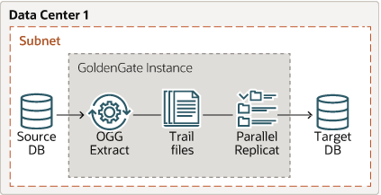
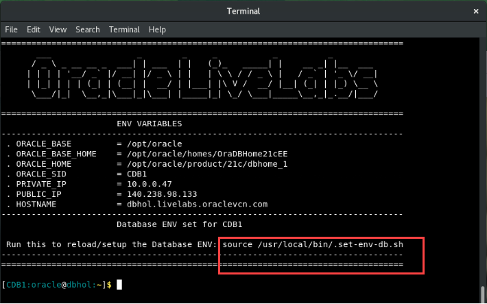
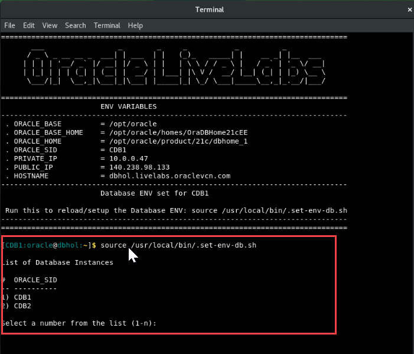

# Initialize environment

## Introduction
In this lab you will learn to setup the required database and Oracle GoldenGate replication users.

*Estimated Time*:  10 minutes

### Objectives
Understanding how to prepare and set up an Oracle multitenant database for replication and create users for replication. Users are created using scripts that populate the multitenant environment with required Oracle Users while applying aliases to be used by GoldenGate.

### Lab Configuration


This lab environment consists of two container database instances: CDB1 and CDB2. The following table provides a snapshot of the available environment:

|  Name   | Description |
 ---------| ------------
| CDB1      | Container Database instance |
| CDB2      | Container Database instance |
| PDBWEST   | Pluggable database on container    database CDB1 |
| PDBEAST   | Pluggable database on container database CDB2|
| c##ggadmin | Common user on Container Database CDB1 <br><br>Password: Welcome2OGG|
|ggadmin     | Local user on Pluggable Database PDBWEST of Container Database CDB1 <br><br>Password: Welcome2OGG|
|ggadmin     | Local user on Pluggable Database PDBWEST of Container Database CDB2 <br><br>Password: Welcome2OGG|

To set up unidirectional replication, CDB1 is the source database with pluggable database PDBWEST. The target database is CDB2 with pluggable database PDBEAST. 

Privileges for database common user for CDB1 (c##ggadmin), and local users for PDBWEST and PDBEAST (ggadmin) have been pre-granted for this lab. 

In this lab, the database users (c##ggadmin and ggadmin) have been granted DBA privileges for simplifying access requirements. 

> **Note:** Granting DBA role is not mandatory for every user. Privileges should be granted depending on the actions that the user needs to perform on the database. For example, to grant DML operation privileges to insert, update, and delete transactions to ggadmin, you can use the GRANT ANY INSERT/UPDATE/DELETE privileges and to further allow users to work with tables and indexes as part of DML operations, use the GRANT CREATE/DROP/ALTER ANY TABLE/INDEX privileges. 

If you want to learn to configure the prerequisites for an Oracle database user in a multitenant database, see the [Appendix 1: Check Parameters Required to Enable GoldenGate on the Database](#appendix-1-check-parameters-required-to-enable-goldengate-on-the-database)

### Prerequisites
This lab assumes you have completed:
  - Lab: Prepare setup
  - Lab: Environment setup


## Task 1: Set the Environment Variables

The script available with this lab will set up the environment variables for the required database. Follow these steps to set the environment variables for CDB1:

  1. Run the following script on the terminal to set the environment variables:

       ```
        <copy>
         source /usr/local/bin/.set-env-db.sh
        </copy>
       ```
    

      The following image shows the execution of the .set-env-db.sh script:
      
      
      

  2. Select 1 to set the database environment for CDB1 when the system prompts you to select the container database option that you want to use.

  
       

     At the top of the terminal, you will see the list of environment variables that have been set up for CDB1.

## Task 2: Connect to CDB1, PDWEST, and PDBEAST

   1. Connect to CDB1 common user c##ggadmin.
    
       ```
       <copy>
       sqlplus c##ggadmin/ggadmin@cdb1
       </copy>

       ```
   2. Connect to PDBWEST to verify that you are able to connect to the PDB:
      
      ```
       <copy>
         connect ggadmin/Welcome2OGG@pdbwest
       </copy>

      ```
   3. Similarly, connect to PDBEAST to verify that you are able to connect to the PDB:
     
      ```
       <copy>
         connect ggadmin/Welcome2OGG@pdbeast
       </copy>
      ```

## Appendix 1: Check Parameters Required to Enable GoldenGate on the Database
   
   In this lab, Oracle GoldenGate replication is enabled on the database side. However, if you want to check if Oracle GoldenGate is enabled on a database, you can use the following steps:

   1. Connect to the common CDB user.

      ```
       <copy>sqlplus c##ggadmin/ggadmin@cdb1</copy>

      ```
  
   2. Run the command to check if Oracle GoldenGate is enabled:

        ```
         <copy>show parameter enable_goldengate_replication</copy>
        ```

        The return value must be TRUE.

   3. From the sql prompt, connect to CDB2 using the command:  

      ```
      <copy>connect c##ggadmin/ggadmin@cdb2</copy>
      
      ```
   4. After connecting to CDB2, run the following command:
      
       ```
        <copy>show parameter enable_goldengate_replication</copy>
       ```
     
       The return value must be TRUE.

You may now **proceed to the next lab**.

## Learn More

* [GoldenGate Quickstarts](https://docs.oracle.com/en/middleware/goldengate/core/21.3/coredoc/quickstart-your-data-replication-oracle-goldengate-microservices-architecture.html)

## Acknowledgements
* **Author** - Preeti Shukla
* **Contributors** - Preeti Shukla, Volker Kuhr
* **Last Updated By/Date** - Preeti Shukla, Oracle GoldenGate, Principal UAD, April 2023
