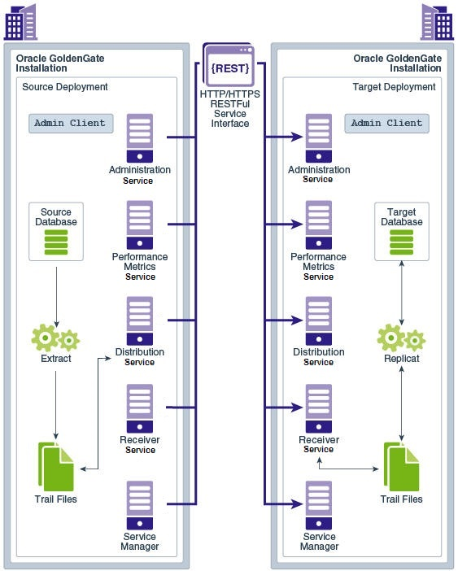

# Introduction

## About this Workshop                             
The labs in this workshop walk you through use cases to add users and database credentials, enable Trandata, add Heartbeat and Checkpoint tables, and create Extract and Replicat processes.

Estimated Workshop Time: 4 hours

### About Oracle GoldenGate Admin Client
Oracle GoldenGate is a comprehensive software package for real-time data integration and replication.

The Admin Client is a command line utility. You can use it to issue the complete range of commands that configure, control, and monitor Oracle GoldenGate.

This diagram illustrates the main components of the Microservices Architecture and how replication processes operate within a REST API environment.

  

Watch this short video about the Oracle GoldenGate product family:
    [Oracle GoldenGate product family](youtube:kdMUxSf9j0k)

### Objectives

In this workshop, you will:
  * Add database credentials
  * Enable Trandata
  * Add Heartbeat table
  * Add Checkpoint table
  * Add an Extract process
  * Add a Replicat process

### Prerequisites
* The following are required to complete this lab:
    * Prior knowledge of using Linux command-line options and Oracle WebLogic Server
    * Prior knowledge of Database basic concepts
* Ensure that you have a multitenant database set up.

Watch this short video on adding Database Credentials, Extract, and Replicat Processes in Oracle GoldenGate Microservices on MySQL database:

  [Add credentials, extract, and replicat in GoldenGate](youtube:h0J070YIK4E)

You may now **proceed to the next lab**.

## Learn More

Use these links to get more information about Oracle GoldenGate:

* [Using Oracle GoldenGate with Oracle Database](https://docs.oracle.com/en/middleware/goldengate/core/21.3/oracle-db/configuring-oracle-goldengate-multitenant-container-database-1.html#GUID[…]DE05)
* [Step by Step Data Replication Using Oracle GoldenGate Microservices Architecture](https://docs.oracle.com/en/middleware/goldengate/core/21.3/ggmas/quickstarts.html)
* [Command Line Interface Reference for Oracle GoldenGate](https://docs.oracle.com/en/middleware/goldengate/core/21.3/gclir/add-credentials.html#GUID-6D80E0AC-9497-46C6-92D9-2F817D04BD99)

## Acknowledgements
* **Author** - Anuradha Chepuri, Principal UA Developer, Oracle GoldenGate User Assistance
* **Contributors** -  Preeti Shukla, Volker Kuhr
* **Last Updated By/Date** - Anuradha Chepuri, June 2022
