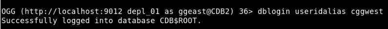
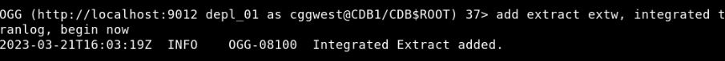
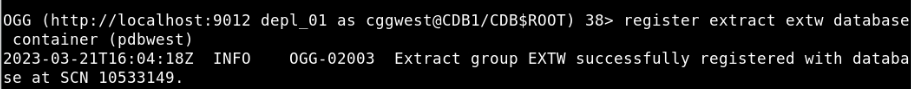
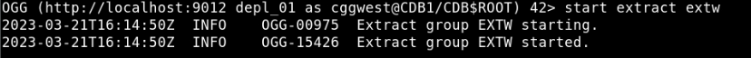

# Add Extract

## Introduction
Use `ADD EXTRACT` to create an Extract group/process.

This lab describes how to add an Extract (`extw`), which then captures data from the source database **pdbwest** and writes to a trail file (`ea`).

Estimated Time: 10 minutes

### Objectives
In this lab, you will:
* Create an Extract process.
* Register the Extract process.
* Add the Extract trail.
* Edit the parameter file.
* Start the Extract process.

### Prerequisites
This lab assumes that you have:
- The appropriate database privileges to be able to execute the commands in the Admin Client.
- Completed the tasks in **Lab - Configure Database Credentials, Trandata, Heartbeat, and Checkpoint Tables**.

## Task 1: Add an Extract Process

Extract is created for the root container **CDB1**. Follow the given steps to add Extract **extw**:

1. Test the database connection by running the following command:
    ```
    <copy>
    DBLOGIN USERIDALIAS cggwest
    </copy>
    ```

    The output shows:

    

2. Add an Extract:
    ```
    <copy>
    ADD EXTRACT extw, INTEGRATED TRANLOG, BEGIN NOW
    </copy>
    ```

   The output shows:

   

    **extw** is the name of the Extract that is being created. However, the Extract is yet to start.

3. Register the Extract:
    
    ```
    <copy>
    REGISTER EXTRACT extw Database Container (pdbwest)
    </copy>
    ```
   The output shows:

   

4. Edit the Extract parameters in the Extract parameter file (`exte.prm`):
    ```
    <copy>
    EDIT PARAMS extw
    </copy>
    ```
    The Extract parameter file is as follows:
    ```
    <copy>
    EXTRACT extw
    USERIDALIAS cggwest domain OracleGoldenGate
    EXTTRAIL west/ea
    SOURCECATALOG pdbwest
    DDL INCLUDE ALL
    TABLE hr.*;
    </copy>
    ```

5.  Save the Extract parameter file and exit the editor.

6. Add the trail file for the Extract:
    ```
    <copy>
    ADD EXTTRAIL west/ea EXTRACT extw
    </copy>
    ```
  
7. Start the Extract:
    ```
    <copy>
    START EXTRACT extw
    </copy>
    ```
   The Extract **extw** starts, as shown in the following image:

   

8. To confirm the Extract has started, run the following command:

    ```
    <copy>
    INFO EXTRACT extw
    </copy>
    ```

   The following details are displayed for the Extract:

     


You may now **proceed to the next lab**.

## Learn More
* [Using the Admin Client](https://docs.oracle.com/en/middleware/goldengate/core/21.3/coredoc/administer-microservices-command-line-interface.html#GUID-0403FAF0-B2F7-48A0-838F-AB4421E5C5E2)
* [ADD EXTRACT](https://docs.oracle.com/en/middleware/goldengate/core/21.3/gclir/add-extract.html#GUID-D9611110-A8D6-4118-837E-BF1900262666)
* [SOURCECATALOG](https://docs.oracle.com/en/middleware/goldengate/core/21.3/reference/sourcecatalog.html#GUID-C2D88643-6839-432D-A7E4-63B874859566)

## Acknowledgements
* **Author** - Preeti Shukla, Principal UA Developer, Oracle GoldenGate User Assistance
* **Contributors** -  Volker Kuhr
* **Last Updated By/Date** - Preeti Shukla, April 2023
