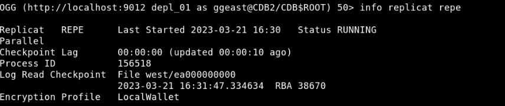

# Add Replicat

## Introduction
Use ADD REPLICAT to create a Replicat process.

This lab describes how to add a Replicat process (`repe`), which then delivers the change data from the trail file (`ea`) created by the Extract, to the target database.
Replicat reads the trail file on the target database, reconstructs the DML or DDL operations, and applies them to the target database.

*Estimated Time*: 10 minutes

### Objectives
In this lab, you will:
* Create a Replicat process.
* Edit the parameter file.
* Start the Replicat process.

### Prerequisites
This lab assumes that you have:
- the appropriate database privileges to be able to execute the commands in the Admin Client.
- completed the tasks in **Lab - Enable Trandata, Add Heartbeat and Checkpoint Tables**.
- completed the tasks in **Lab - Add Extract**.

## Task 1: Add a Replicat

To add a Replicat:

1. Test the database connection by running the following command:
    ```
    <copy>
    DBLOGIN USERIDALIAS ggwest
    </copy>
    ```

2. Add a Replicat:
    ```
    <copy>
    ADD REPLICAT repe, INTEGRATED, PARALLEL, EXTTRAIL east/ea CHECKPOINTTABLE ggadmin.ggs_checkpointtable
    </copy>
    ```
    `repe` is the name of the Replicat that is being created.

3. Edit the parameter file:
    ```
    <copy>
    EDIT PARAMS repe
    </copy>
    ```
    The Replicat parameter file is as follows:
    ```
    <copy>
    REPLICAT repe
    USERIDALIAS ggwest DOMAIN OracleGoldenGate
    DDL INCLUDE ALL
    SOURCECATALOG pdbeast
    MAP hr.*, TARGET hr.*;
    </copy>
    ```

4. Start the REPLICAT:
    ```
    <copy>
    START REPLICAT repe
    </copy>
    ```
  The REPLICAT process **repe** starts.

5. To confirm the REPLICAT has started, run the following command:
    ```
    <copy>
    INFO REPLICAT repe
    </copy>
    ```
The following is a sample Replicat output:

    

You may now **proceed to the next lab**.

## Learn More
* [Using the Admin Client](https://docs.oracle.com/en/middleware/goldengate/core/21.1/admin/getting-started-oracle-goldengate-process-interfaces.html#GUID-84B33389-0594-4449-BF1A-A496FB1EDB29)
* [ADD REPLICAT](https://docs.oracle.com/en/middleware/goldengate/core/21.3/gclir/add-replicat.html#GUID-540A171A-71C2-49C3-964E-5D57B27257D4)

## Acknowledgements
* **Author** - Anuradha Chepuri, Principal UA Developer, Oracle GoldenGate User Assistance
* **Contributors** -  Preeti Shukla, Volker Kuhr
* **Last Updated By/Date** - Anuradha Chepuri, July 2022
