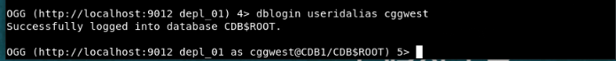

# Configure Database Credentials, Trandata, Heartbeat, and Checkpoint Tables

## Introduction

To configure credentials, trandata, and various processes for an Oracle GoldenGate deployment, you need to connect to the Administration Service for the deployment using the CONNECT command. 

The Administration Service is used to configure database login credentials, trandata, checkpoint table and heartbeat table. You will also use the Administration Service to create Extract and Replicat processes later. 

The credentialstore in Oracle GoldenGate contains the database credentials used to connect to source and target databases. To configure database connections from Oracle GoldenGate, the credentialstore needs to be altered using the ALTER CREDENTIALSTORE command, to add database user credentials. After setting up the credentials in the credentialstore, you will be able to use the DBLOGIN command to connect to the source and target databases from the Admin Client. 

With the ADD SCHEMATRANDATA and ADD TRANDATA commands, Oracle GoldenGate acquires the transaction information that it needs from the transaction records. For a seamless data replication in Oracle GoldenGate, you need to first add TRANDATA for the database tables.

The use of checkpoint table causes checkpoints to be part of the Replicat transaction. Use the `ADD CHECKPOINTTABLE` command to create a checkpoint table in the target database. Replicat uses the table to maintain a record of its read position in the trail for recovery purposes.

The Heartbeat functionality helps in monitoring replication lags. Add a heartbeat table to each of your databases by using the `ADD HEARTBEATTABLE` command.

In this lab, you will need the following details to run the CONNECT command to access to the Administration Service for the deployment:

<ul>
  <li>Deployment name: depl_01</li>
  <li>Administration Service URL: http://localhost:9012</li>
  <li>Oracle GoldenGate Administrator User Credentials: 
      <ul>
         <li>User name: ggma</li>
         <li>Password: ggma</li>
      </ul>
</ul>

Estimated Time: 30 minutes

### Objectives
In this lab, you will:
* Connect to the Administration Service for the deployment `depl_01` using Admin Client
* Add and test the database connections from Oracle GoldenGate
* Enable Trandata on source database
* Add Heartbeat table for the source and target databases
* Add Checkpoint table for the target database

### Prerequisites
This lab assumes that you have:
* Set the environment variables for the container database
* Test the connection to the database from sqlplus prompt

## Task 1: Connect to the  Administration Service for the Deployment
1. Run `adminclient` to open the Admin Client.

2. Execute the following command to connect to the Administration Service for the deployment <b>depl_01</b>:

    ```
    <copy>
    CONNECT http://localhost:9012 DEPLOYMENT depl_01 as ggma PASSWORD ggma
    </copy>
    ```


## Task 2: Add Database Credentials

   In this lab, you will establish database connections from Oracle GoldenGate to the Oracle database instances on the source (CDB1) and target (CDB2) databases. 

   On CDB1, establish database credentials for users: <b>c##ggadmin</b> and <b>ggadmin</b>

   On CDB2, you only need to set up database credentials for the <b>ggadmin</b> user because this is the target pluggable database where the updates will be applied.

   To create database credentials using the Admin Client:

   1. Run the following command to add the common user for CDB1 with credentials alias as `cggwest`:

    ```
    <copy>
    ALTER CREDENTIALSTORE ADD USER c##ggadmin@cdb1 ALIAS cggwest DOMAIN OracleGoldenGate PASSWORD ggadmin
    </copy>
    ```
    The USERIDALIAS for connecting to CDB1 is **cggwest**.

   2.  Test the database connection:
        ```
        <copy>
        DBLOGIN USERIDALIAS cggwest
        </copy>
        ```
       The output would display as follows for a successful connection:

       

   3. Run the following command to add the PDB database user `ggadmin` for the pluggable database **pdbwest**. The USERIDALIAS is `ggwest`.

      ```
      <copy>
      ALTER CREDENTIALSTORE ADD USER ggadmin@pdbwest ALIAS ggwest DOMAIN OracleGoldenGate PASSWORD Welcome1
      </copy>
      ```
   4. Test the database connection using the DBLOGIN command:

       ```
       <copy>
       DBLOGIN USERIDALIAS ggwest
       </copy>
       ```
      The output would display as follows for a successful connection:

      

   5. Add the credentials for the target PDB, **pdbeast** to the credentialstore:
        ```
         <copy>
         ALTER CREDENTIALSTORE ADD USER ggadmin@pdbeast ALIAS ggeast DOMAIN OracleGoldenGate PASSWORD Welcome1
         </copy>
        ```

   
   **Note**: For **pdbeast**, only the pluggable database credentials are required because this would be the target database. 

   6. Test the connection to **pdbeast** with DBLOGIN:
      
      ```
      <copy>
      DBLOGIN USERIDALIAS ggwest
      </copy>
      ```

   After the connection is successful, you can begin setting up other requirements for data replication, discussed in the next tasks.  

## Task 3: Enable supplemental logging on source database

By enabling trandata, supplemental logging is enabled for the source database at the schema, table, or procedure level. 

In this lab, you will enable trandata at the schema level for the source database CDB1. Using the ADD SCHEMATRANDATA command, Oracle GoldenGate acquires the transaction information required from the transaction records for the HR schema available with this lab. 

To enable trandata, run the following commands:

  1. Connect to **pdbwest** using the **ggwest** credential alias:

     ```
     <copy>
     DBLOGIN USERIDALIAS ggwest
     </copy>
     ``` 


  2. Run the ADD SCHEMATRANDATA command to enable supplemental logging at the schema level.

     ```
     <copy>
     ADD SCHEMATRANDATA hr
     </copy>
 
     ```
   
   

     This ensures that all tables added or updated within the HR schema, are logged. If you want to enable supplemental logging for a particular table, for example, EMPLOYEES table in HR schema, then you can also run the command:

     ```
     <copy>
     ADD TRANDATA hr.employees
     </copy>
     ```

  3. Run the following command to verify that supplemental logging is enabled at the schema level :

     ```
     <copy>
     INFO SCHEMATRANDATA hr
     </copy>
     ```

     The output for the **hr** schema is as follows:

     

  4. Run the following command to verify that supplemental logging is enabled at the table level.

     ```
     <copy>
     INFO TRANDATA hr.employees
     </copy>
     ```


     The output for **employees** table of the **hr** schema is as follows:

     


## Task 4: Add checkpoint table for target

   To add the Checkpoint table:

   1. Connect to **pdbeast** using the credential alias **ggeast**

      ```
      <copy>
      DBLOGIN USERIDALIAS ggeast
      </copy>
      ```

   2. Execute the following command:
      
      ```
      <copy>
      ADD CHECKPOINTTABLE ggadmin.ggs_checkpoint
      </copy>
      ```

   3. Run the following command to verify the output:

      ```
      <copy>
      INFO CHECKPOINTTABLE ggadmin.ggs_checkpointtable
      </copy>
      ```
   4. Run the **INFO** command to verify that the checkpoint table is added.

      ```
      <copy>
      INFO CHECKPOINTTABLE ggadmin.ggs_checkpoint
      </copy>
      ```

   The Checkpoint table gets added as follows:

   


## Task 5: Add heartbeattable for source and target

   Add the heartbeat tables for both source and target endpoints by connecting to **ggeast** and **ggwest** database credential aliases.

   For **ggwest**

   1. Connect to the database (pdbwest) using DBLOGIN:

      ```
      <copy>
      DBLOGIN USERIDALIAS ggwest
      </copy>
      ```

   2. Run the following command:

      ```
      <copy>
      ADD HEARTBEATTABLE
      </copy>
      
      ```
     
   The output displays as shown here:

   

   3. Run the **INFO** command to verify that the heartbeattable is added for **ggwest**

      ```
      <copy>
      INFO HEARTBEATTABLE
      </copy>
     
      ```
  
 
  The output list the heartbeat tables that are added for the source database (**pdbwest**) with alias **ggwest**.

 

   For **ggeast**

   4. Connect to the target database **pdbeast** using the alias **ggeast**
      
      ```
      <copy>
      DBLOGIN USERIDALIAS ggeast
      </copy>
    
      ```

  5. Add the heartbeat table:

      ```
      <copy>
      ADD HEARTBEATTABLE
      </copy>
    
      ```

  6. Run the INFO HEARTBEATTABLE command to view details of the heartbeat tables added for **pdbeast**

      ```
        <copy>
        INFO HEARTBEATTABLE
        </copy>
    
      ```
The output should display as follows:

 

You may now **proceed to the next lab**.


## Learn More
* [Using the Admin Client](https://docs.oracle.com/en/middleware/goldengate/core/21.3/coredoc/administer-microservices-command-line-interface.html#GUID-0403FAF0-B2F7-48A0-838F-AB4421E5C5E2)
* [ADD TRANDATA](https://docs.oracle.com/en/middleware/goldengate/core/21.3/gclir/add-trandata.html#GUID-D3FD004B-81E4-4185-92D3-812834A5DEFC)
* [ADD HEARTBEATTABLE](https://docs.oracle.com/en/middleware/goldengate/core/21.3/gclir/add-heartbeattable.html#GUID-126E30A2-DC7A-4C93-93EC-0EB8BA7C13CB)
* [ADD CHECKPOINTTABLE](https://docs.oracle.com/en/middleware/goldengate/core/21.3/gclir/add-checkpointtable.html#GUID-870D65C1-A18E-4B2D-8257-F58E9A808197)
* [Command Line Interface Reference for Oracle GoldenGate](https://docs.oracle.com/en/middleware/goldengate/core/21.3/gclir/add-checkpointtable.html#GUID-870D65C1-A18E-4B2D-8257-F58E9A808197)

## Acknowledgements
* **Author** - Preeti Shukla, Principal UA Developer, Oracle GoldenGate User Assistance
* **Contributors** -  Volker Kuhr
* **Last Updated By/Date** - Preeti Shukla, April 2023
