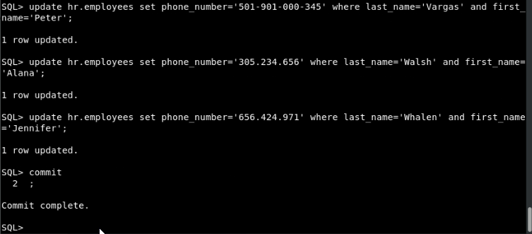
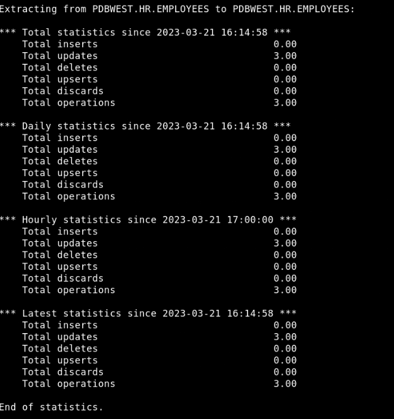
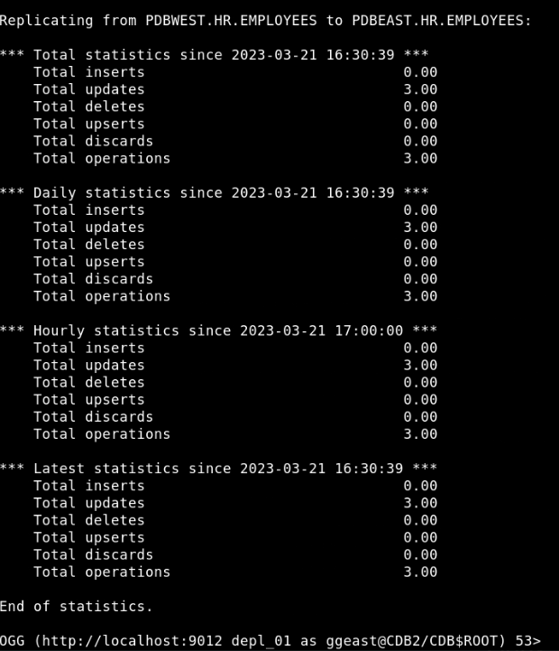
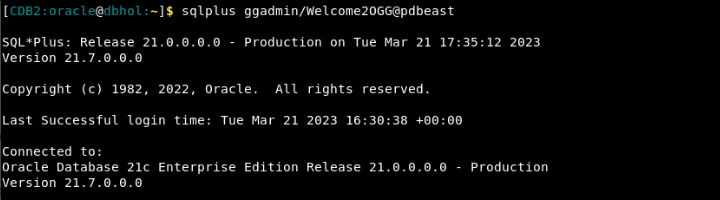
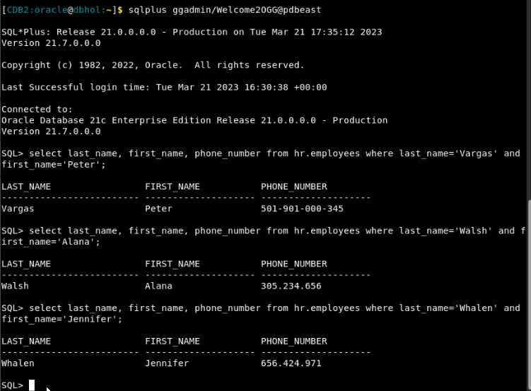

# Test the data replication

## Introduction

This lab describes how to test whether or not the replication is working successfully between source and target databases.

Estimated Time: 10 minutes

### Objectives
In this lab, you will:
* Test the Replication process using Oracle GoldenGate statistics.
* View the actual database records to confirm that the updates were successful.


### Prerequisites
This lab assumes that you have:
- Completed the tasks in **Initialize environment**
- Completed the tasks in **Lab - Configure Database Credentials, Trandata, Heartbeat, and Checkpoint Tables**.
- Completed the tasks in **Lab - Add Extract**.
- Completed the tasks in **Lab - Add Replicat**.

## Task 1: Update records in source database **pdbwest**

   To test the data replication, let’s update some columns in the hr.employees table on the source database, The result should show the replicated result on the target database. 

   In this case, update the phone number columns for 3 employees from the hr.employees table:

   |  FIRST_NAME       |      LAST_NAME  |
   --------------------|------------------
   |  Peter            |      Vargas     |
   |  Alana            |      Walsh      |
   |  Jennifer         |      Whalen     |

   To update records in the source database **pdbwest**:

   1. Open a new terminal and run the script **.set-env-db.sh**: 
   
      ```
      <copy>
      source /usr/local/bin/.set-env-db.sh
      </copy>
      ```
   2. Start the sql prompt and connect to **pdbwest:

       ```
       <copy>
        sqlplus ggadmin/Welcome2OGG@pdbwest
       </copy>
       ```

   3. (Optional) Run the following query to view the records in the hr.employees table:
   
       ```
       <copy>
        Select first_name, last_name from hr.employees
       </copy>
       ```
        
   4. Run the following command to update the phone numbers for the specified employees and then commit the transaction:
        ```
         <copy>
          UPDATE hr.employees set PHONE_NUMBER='501-901-000-345' where LAST_NAME='Vargas' and FIRST_NAME='Peter';

          UPDATE hr.employees set PHONE_NUMBER='305.234.656' where LAST_NAME='Walsh' and FIRST_NAME='Alana';

          UPDATE hr.employees set PHONE='656.424.971' where LAST_NAME='Whalen' and FIRST_NAME='Jennifer';

          COMMIT;
        </copy>
        ```

       The following image displays the query on the sql prompt:

        
    
## Task 2: Verify that the updated records are captured by Extract

   To check if this committed transaction is captured by Extract:

   1. Start the Admin Client:
   
       ```
         <copy>
            adminclient
         </copy>
       ```
  
   2. Connect to the deployment:

      ```
      <copy>
       CONNECT http://localhost:9012 DEPLOYMENT depl_01 as ggma PASSWORD ggma
      </copy>
      ```

   3. Connect to **pdbwest** using alias **ggwest**

      ```
       <copy>
        DBLOGIN USERIDALIAS ggwest
       </copy>
      ```

   4. Run the following command:
     
      ```
      <copy>
       STATS EXTRACT extw
      </copy>
      ```
      The output displays the following:

      

      Notice that there are 3 update records captured by Extract.

## Task 3: Verify that the Replicat applied the updates to the target database

   To check if Replicat successfully applied the UPDATE transactions:

   1. Connect to **pdbeast** using alias **ggeast**

      ```
      <copy>
       DBLOGIN USERIDALIAS ggeast
      </copy>
      ```
   2. Run the commmand:

      ```
      <copy>
       STATS REPLICAT repe
      </copy>
      ```
     The output displays 3 update records:

      

   3. Exit from admin client:

      ```
      <copy>
       EXIT
      </copy>
      ```
   4. Connect to the target pluggable database **pdbeast**.

      ```
       <copy>
        sqlplus ggadmin/Welcome2OGG@pdbeast
       </copy>
      ```
    
       

   5. Check the updated records in the database by running the following SQL query on target database **pdbeast**:
 
      ```
      <copy>
       Select last_name, first_name, phone_number from hr.employees where last_name=’Vargas’ and first_name=’Peter’;
    
       Select last_name, first_name, phone_number from hr.employees where last_name=’Walsh’ and first_name=’Alana’;

       Select last_name, first_name, phone_number from hr.employees where last_name=’Whalen’ and first_name=’Jennifer’;
      </copy>
      ```

      The output should displays as follows:

      

      Notice the updated phone numbers for each of the records.


## Learn More
* [Using the Admin Client](https://docs.oracle.com/en/middleware/goldengate/core/21.3/coredoc/administer-microservices-command-line-interface.html#GUID-0403FAF0-B2F7-48A0-838F-AB4421E5C5E2)


## Acknowledgements
* **Author** - Preeti Shukla, Principal UA Developer, Oracle GoldenGate User Assistance
* **Contributors** -  Volker Kuhr, Alex Lima, Madhusudhan Rao
* **Last Updated By/Date** - Preeti Shukla, April 2023
