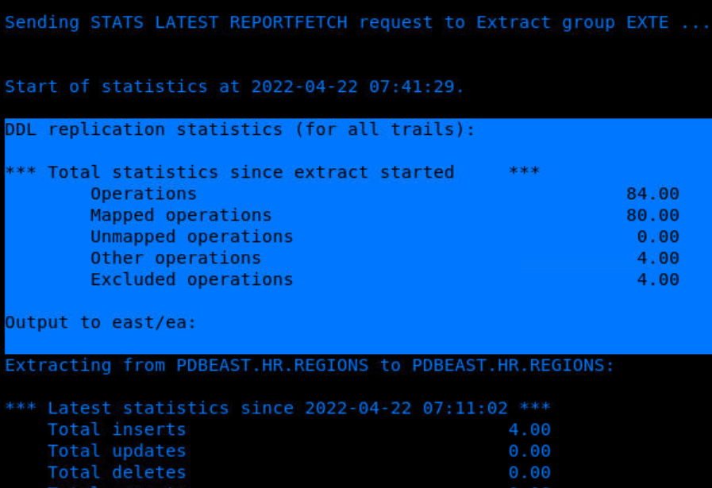
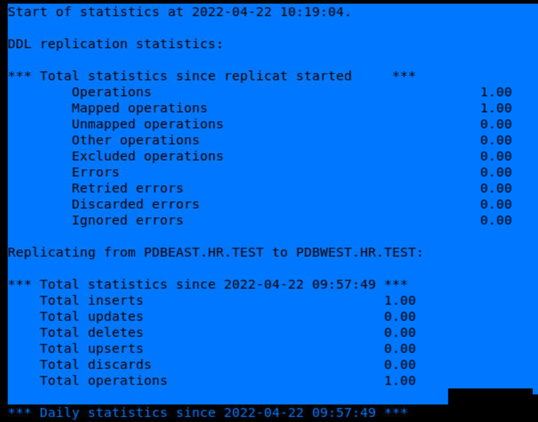

# Test the data replication process

## Introduction

This lab describes how to test whether or not the replication has begun.

Estimated Time: 10 minutes

### Objectives
In this lab, you will:
* Test the Replication process.


### Prerequisites
This lab assumes that you have:
- The appropriate database privileges to be able to execute the commands in the Admin Client.
- Completed the tasks in **Lab - Enable Trandata, Add Heartbeat and Checkpoint Tables**.
- Completed the tasks in **Lab - Add Extract**.
- Completed the tasks in **Lab - Add Replicat**.
- Ensured that there are a few committed DML (INSERT, UPDATE, OR DELETE) transactions in the `EMPLOYEES` table.

## Task 1: Test the Data Replication

To test the data replication:

1. Test the database connection by running the following command:

    ```
    <copy>
    DBLOGIN USERIDALIAS ggeast
    </copy>
    ```

2. Run the following commands on the Extract side:
    ```
    <copy>
    STATS EXTRACT exte, TOTAL, HOURLY, TABLE hr.employees, REPORTRATE MIN, RESET, REPORTFETCH
    </copy>
    ```
    ```
    <copy>
    STATS EXTRACT exte, LATEST, REPORTFETCH
    </copy>
    ```
  You'll see additions to the Insert, Updates, or Deletes columns as follows:

    


3. Test the database connection by running the following command:
    ```
    <copy>
    DBLOGIN USERIDALIAS ggwest
    </copy>
    ```

4. Run the following commands on the Replicat side:
    ```
    <copy>
    STATS REPLICAT repe, TOTAL, HOURLY, TABLE hr.employees, REPORTRATE MIN, RESET, NOREPORTDETAIL
    </copy>
    ```
    You'll see that the data has been replicated on the target database (`PDBWEST`)

    

## Learn More
* [Using the Admin Client](https://docs.oracle.com/en/middleware/goldengate/core/21.1/admin/getting-started-oracle-goldengate-process-interfaces.html#GUID-84B33389-0594-4449-BF1A-A496FB1EDB29)
* [Set Up Data Replication with Oracle GoldenGate Microservices Architecture](https://docs.oracle.com/en/middleware/goldengate/core/21.3/ggmas/quickstart-your-data-replication-oracle-goldengate-microservices-architecture.html)

## Acknowledgements
* **Author** - Anuradha Chepuri, Principal UA Developer, Oracle GoldenGate User Assistance
* **Contributors** -  Preeti Shukla, Volker Kuhr, Alex Lima, Madhusudhan Rao
* **Last Updated By/Date** - Anuradha Chepuri, June 2022
