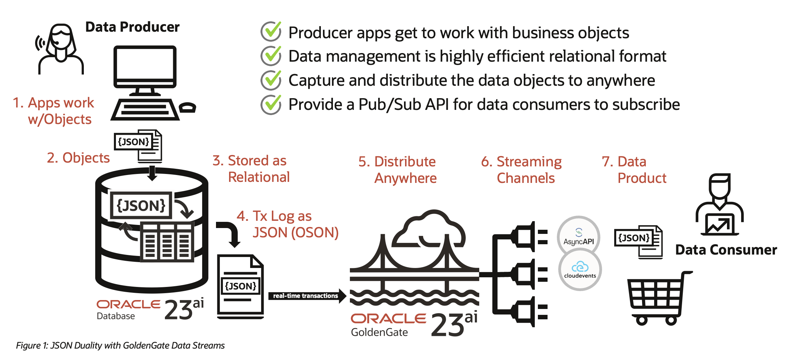

# Introduction

## Replicate Oracle Database 23ai JSON-relational duality view data in real-time using Oracle GoldenGate 23ai
Oracle GoldenGate 23ai (23.6.0.24.10) now supports replicating full-featured business objects in an event-based, pub/sub architecture with Oracle JSON Relational Duality and GoldenGate Data Streams. This is implemented by combining two new Oracle technology features: Oracle Database JSON Relational Duality Views and Oracle GoldenGate Data Streams.

Oracle GoldenGate 23ai (23.6) supports following replication use-cases / scenarios for JSON Relational Duality Views and JSON Collection Tables:

- JSON-Relational Duality Views and/or JSON Collection Tables to Data Streams: Oracle GoldenGate can replicate changes made to JSON Duality View as JSON objects to GoldenGate Data Streams.
- JSON Collection Tables to JSON Collection Tables: Oracle GoldenGate can replicate data between JSON Collection Tables.
- Duality Views to Collection Tables: Oracle GoldenGate can replicate data from Duality Views to Collection Tables, essentially moving data between these two JSON-focused features.
- Replication between Duality Views (Underlying Tables ) to Duality Views (Underlying Tables): Oracle GoldenGate allows replicating the underlying tables from Duality Views to Duality Views, without replicating the view. If supplemental logging is enabled for a JSON Duality Views, it generates extra redo on top of the existing relational table.
Note: Replication from one Duality View to another is not supported.

This lab covers the benefits of using Oracle JSON Relational Duality Views with GoldenGate Data Streams and provides the steps to configure GoldenGate Data Streams with Oracle JSON Relational Duality Views.

Estimated Workshop Time: 4 hours

**Workshop Architecture to configure GoldenGate Data Streams and JSON Relational Duality Views***
    

### Objectives
In this workshop, you will learn:
- Configure GoldenGate Data Streams and JSON Relational Duality Views to Deliver Change Data

### Prerequisites
This lab assumes you have:
* An Oracle account

You may now proceed to the next lab.

## Learn More

* [Oracle GoldenGate 23ai](https://docs.oracle.com/en/middleware/goldengate/core/23/index.html)
* [Oracle GoldenGate Data Streams](https://docs.oracle.com/en/middleware/goldengate/core/23/coredoc/distribute-oracle-goldengate-data-streams-service.html)

## Acknowledgements
* **Author** - Madhu Kumar S, AppDev and Integration, Bangalore Tech Team
* **Contributors** - Madhu Kumar S , Deniz Sendil
* **Last Updated By/Date** - Madhu Kumar S, AppDev and Integration, Bangalore Tech Team, Febuary 2025
