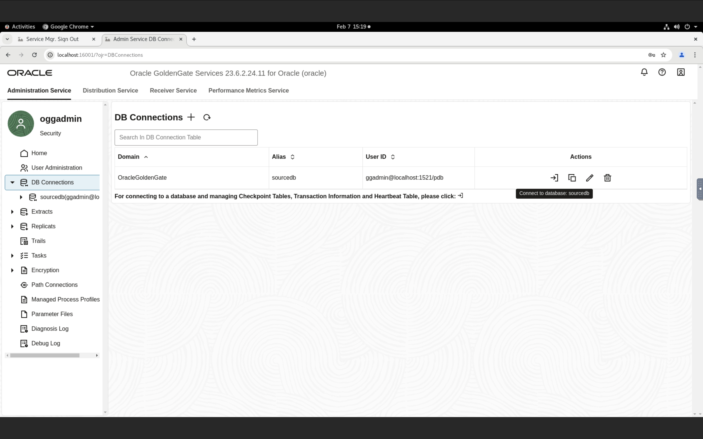
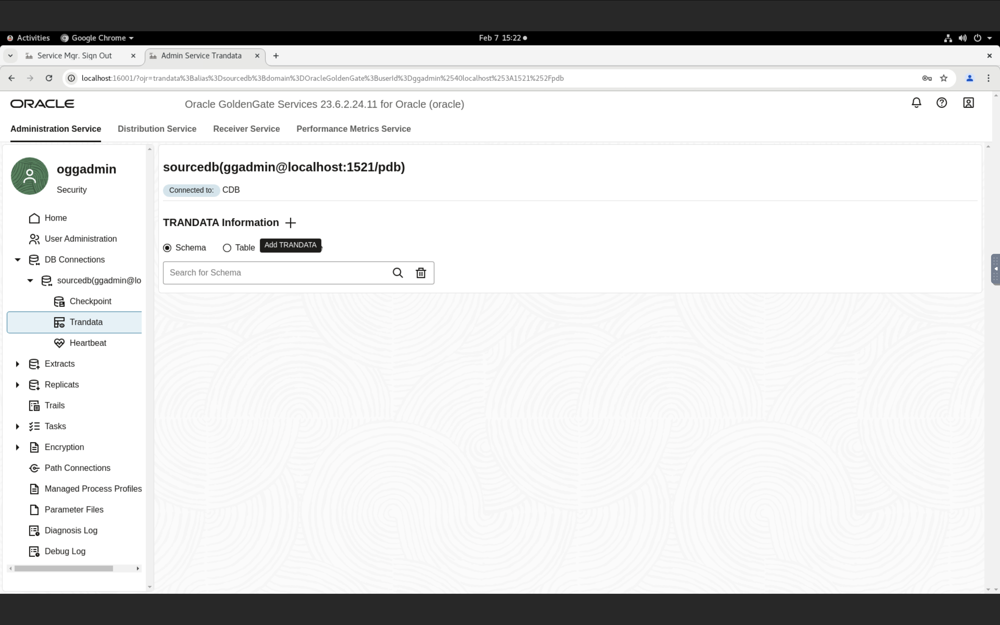
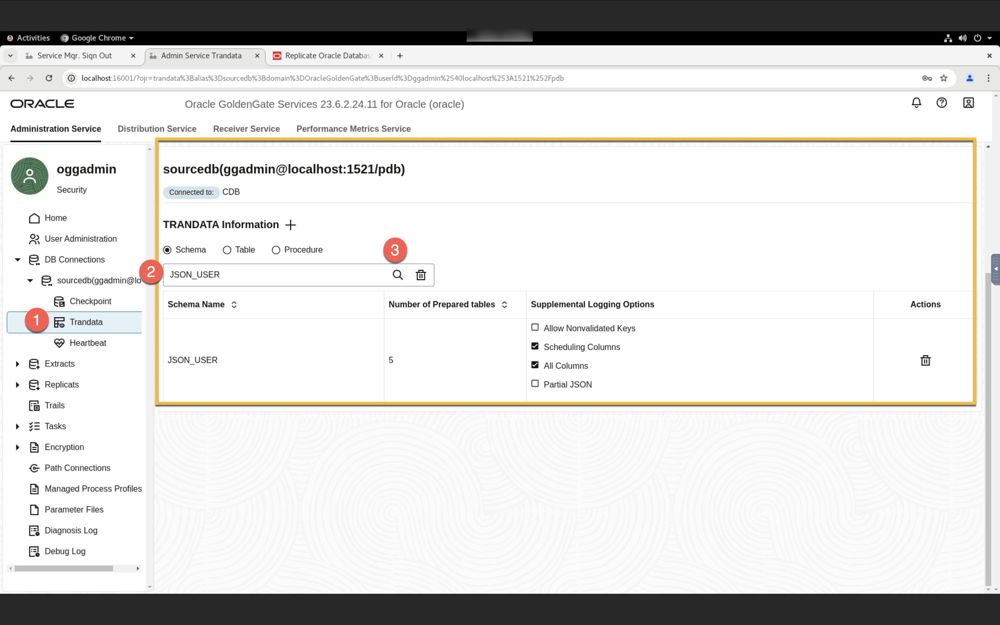
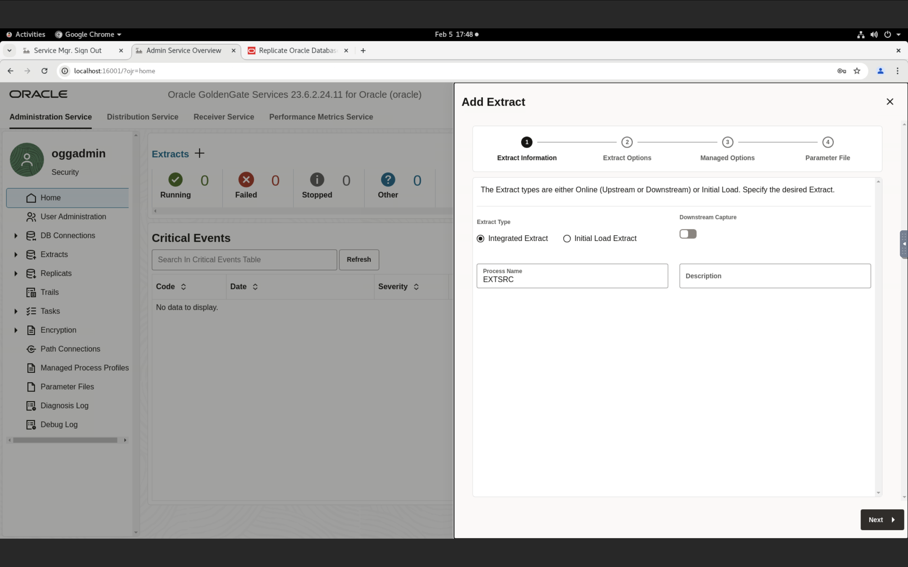
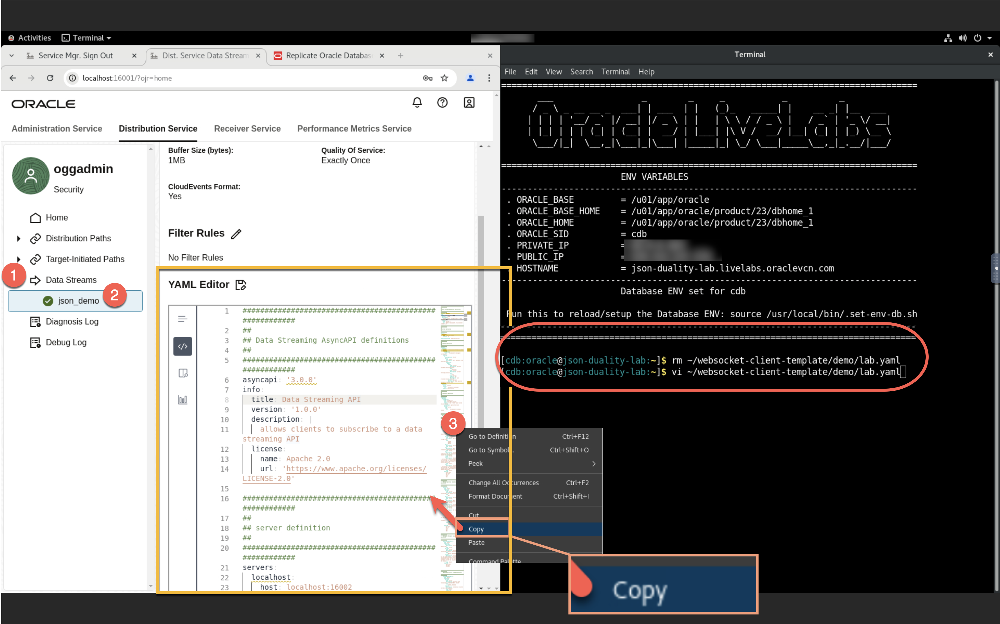

#  Replicate Business Objects with Oracle JSON Relational Duality Views and GoldenGate Data Streams Data Streams

## Introduction

This lab will demonstrate how to  ***Replicate Business Objects with Oracle JSON Relational Duality Views and GoldenGate Data Streams Data Streams*** 

In this lab, we will load data in the Oracle Database schema ***JSON_USER***  of Pluggable Database ***PDB***. GG extract process ***EXTSRC*** will capture the changes from Oracle Database and write them to the local trail file ***et***. From the Distribution Service, **Data Stream** created to consume the trail file ***et***. The YAML document used to generate the client-side code using @asyncapi/generator. 

Estimated Time:  30 minutes

#### Lab Architecture

 

### Objectives
In this lab you will learn:
-  How to create an extract for the source database 
-  How to configure the Data Steams
-  How to consume the Data Steams using AsynchAPI

### Prerequisites
This lab assumes you have:
- An Oracle Cloud account
- You have completed:
    - Lab: Initialize Environment

## Task 1: Create JSON relational duality views
1.  Open a terminal and create a ***JSON table*** using below snipet.

    ```
    <copy>sqlplus / as sysdba << EOF 
    ALTER SESSION 
    SET 
      CONTAINER = PDB;

    CREATE TABLE JSON_USER.ATTENDEE (
      ID NUMBER PRIMARY KEY, 
      NAME VARCHAR2(100), 
      COMPANY VARCHAR2(100)
    );
    CREATE TABLE JSON_USER.SESSIONSS (
      SESSION_ID VARCHAR2(10) PRIMARY KEY, 
      SESSION_NAME VARCHAR2(100), 
      SESSION_TIME TIMESTAMP, 
      ROOM VARCHAR2(50)
    );
    CREATE TABLE JSON_USER.ATTENDEE_SESSION (
      ATTENDEE_ID NUMBER, 
      SESSION_ID VARCHAR2(10), 
      PRIMARY KEY (ATTENDEE_ID, SESSION_ID), 
      FOREIGN KEY (ATTENDEE_ID) REFERENCES JSON_USER.ATTENDEE(ID), 
      FOREIGN KEY (SESSION_ID) REFERENCES JSON_USER.SESSIONSS(SESSION_ID)
    );
    CREATE TABLE JSON_USER.SPEAKER (
      ID NUMBER PRIMARY KEY, 
      NAME VARCHAR2(100)
    );
    CREATE TABLE JSON_USER.SPEAKER_SESSION (
      SPEAKER_ID NUMBER, 
      SESSION_ID VARCHAR2(10), 
      PRIMARY KEY (SPEAKER_ID, SESSION_ID), 
      FOREIGN KEY (SPEAKER_ID) REFERENCES JSON_USER.SPEAKER(ID), 
      FOREIGN KEY (SESSION_ID) REFERENCES JSON_USER.SESSIONSS(SESSION_ID)
    );
    EOF

    </copy>
    ```
    
    


2. Create a JSON relational duality view from the below snipet.

    ```
    <copy>sqlplus / as sysdba << EOF 
    ALTER SESSION 
    SET 
      CONTAINER = PDB;
    CREATE 
    or replace JSON RELATIONAL DUALITY VIEW JSON_USER.attendeeSchedule AS 
    SELECT 
      JSON { '_id' : a.ID, 
      'name' : a.NAME, 
      'company' : a.COMPANY, 
      'schedule' : json[ 
    select 
      json{ 'ATTENDEE_ID' : ass.ATTENDEE_ID, 
      'attendee_sess_id' : ass.session_id, 
      unnest(
        select 
          JSON { 'code' : s.SESSION_ID, 
          'session_name' : s.SESSION_NAME, 
          'time' : s.SESSION_TIME, 
          'room' : s.ROOM, 
          'speakers' : json[ 
        select 
          json{ 'speaker_sess_id' : ss.SESSION_ID, 
          'speaker_session_speaker_id' : ss.SPEAKER_ID, 
          unnest(
            select 
              json{ 'speaker_id' : sp.id, 
              'speaker_name' : sp.name} 
            from 
              JSON_USER.speaker sp with insert 
            update 
              nocheck 
            where 
              sp.id = ss.speaker_id
          ) } 
        from 
          JSON_USER.speaker_session ss with insert 
        update 
          nocheck 
        where 
          ss.session_id = s.session_id]} 
        from 
          JSON_USER.sessionss s with insert 
        update 
          nocheck 
        where 
          s.SESSION_ID = ass.SESSION_ID
      ) } 
    from 
      JSON_USER.ATTENDEE_SESSION ass with insert 
    update 
      nocheck 
    where 
      ass.ATTENDEE_ID = a.id ]} 
    FROM 
      JSON_USER.ATTENDEE a with insert 
    update 
      delete nocheck;

    EOF

    </copy>
    ```
    
    
## Task 2: Preparing the database for Oracle GoldenGate

1. Assigning privileges for Oracle GoldenGate for Oracle.


    ```
    <copy>
    sqlplus / as sysdba << EOF 
    ALTER SESSION 
    SET 
    CONTAINER = PDB;
    GRANT CONNECT, RESOURCE to ggadmin;
    GRANT OGG_CAPTURE to ggadmin;
    GRANT OGG_APPLY to ggadmin; 
    GRANT SELECT, INSERT, UPDATE, DELETE on JSON_USER.SPEAKER to ggadmin; 
    GRANT SELECT, INSERT, UPDATE, DELETE on JSON_USER.ATTENDEE to ggadmin; 
    GRANT SELECT, INSERT, UPDATE, DELETE on JSON_USER.SESSIONSS to ggadmin;
    GRANT SELECT, INSERT, UPDATE, DELETE on JSON_USER.ATTENDEE_SESSION to ggadmin; 
    EOF
    </copy>
    ```

  

## Task 3: Enable table-level supplemental logging for JSON Relational Duality Views and/or JSON Collection

1. Login to GoldenGate Administration Service page from the below URL by passing username as ***oggadmin*** and a password as ***oggadmin*** and Click **Sign In**.
  [http://localhost:16001](http://localhost:16001) 
  

2. On the welcome page, click on **DB Connections**, and connect to the source database ***sourcedb***.
  

3. Click on the **Trandata** and then Click on the **Add TRANDATA** (***+*** plus icon) to get the add trandata wizard.
  

4. On ***Trandata*** page, add schema trandata for the schema ***JSON_USER*** and choose the supplemental logging option as shown below and click ***Submit***.
  

5. To validate the supplemental logging for the schema ***JSON_USER*** follow below the instructions.
  - Select radio button as ***Schema***
  - Type schema name as ***JSON_USER*** and press ***Enter*** on key board.
  

## Task 4: Create an Extract and trail file in Oracle GoldenGate.
1. Click on the ***Home*** button to land on the welcome page to start the extract creation.
  
2. On welcome page, Click on the **Add Extract** (***+*** plus icon) to get the extract creation wizard.

    Extract is a process that runs agains the source data source connection and extracts, or captures, data. Learn to add an Extract for Oracle Database, OCI Autonomous Databases, Oracle Exadata, and Amazon RDS for Oracle technologies.

  
3. On extract information page, follow the below instruction.
  - Choose radio button ***Integrated Extract*** as **Extract type**.
  - Type the **Process Name** as ***EXTSRC***.
  - Click ***Next*** to get the **Extract Options** tab.
  

4. On the **Extract Options** tab, choose the source credential and extract trail as instructed below.
  - select **Domain** as ***<copy>OracleGoldenGate</copy>***
  - select **Alias** as ***sourcedb***
  - Type **Extract Trail Name** as ***et***
  - Click ***Next*** to get the **Extract Options** tab.
  

5. On Managed Options, choose **Profile Name** as ***Default*** and click ***Next***.
  

6. Extract has created successfully 

7. Click ***Start*** button to start the extract.
  

8. Extract ***EXTSRC*** up and running.
  

## Task 5: Add a Data Stream from Oracle GoldenGate Distribution Service.
1. Switch to **Distribution Service** to create a Data Streams.

2. On welcome page, Click on the **Add Data Stream** (***+*** plus icon) to get the Data Streams creation wizard.
  
3. On **Data Stream Information** tab, enter **Name** as ***JSON_DEMO*** and click ***Next***
  
4. On **Source Options**,enter **Trail Name** as ***et*** and click ***Next*** 
  
5.On **Filtering Options**, click on ***Create Data Stream***
  
6. You will be returned to the Distribution Service home page where the Data Stream ***JSON_DEMO*** is listed.
  
  

## Task 6: Consume the Change Data from the Data Stream.
1. Create a YAML file on a terminal to copy the YAML content of the Data Stream.
    ```
    <copy>vi ~/websocket-client-template/demo/lab.yaml</copy>
    ```
    
    
2.The YAML document can then be used to generate the client-side code using @asyncapi/generator
    ```
    <copy>
    cd ~/websocket-client-template/
    sudo ag demo/lab.yaml . -o output -p server=localhost -p authorization=basic 
    </copy>
    ```
    
3. Go to the generated output folder, and install needed packages for client
    ```
    <copy>
    cd ~/websocket-client-template/output
    sudo npm install
    </copy>
    ```
    
4. Insert change data to the document for testing.
    ```
    <copy>
    sqlplus / as sysdba << EOF 
    ALTER SESSION SET CONTAINER = PDB;
    Insert into JSON_USER.ATTENDEESCHEDULE (DATA) values ('{"_id":4,"name":"Windy","company":"ACME Inc","schedule":[{"ATTENDEE_ID":4,"attendee_sess_id":"S004","code":"S004","session_name":"Database Optimization","time":"2024-09-15T09:00:00","room":"Room 104","speakers":[{"speaker_sess_id":"S004","speaker_session_speaker_id":104,"speaker_id":104,"speaker_name":"Jenny"}]}],"_metadata":{"etag":"DD5CA0676D00C68DC996124BBF81F612","asof":"00000000007B54D9"}}');
    Insert into JSON_USER.ATTENDEESCHEDULE (DATA) values ('{"_id":5,"name":"Shawn","company":"WRIME AI","schedule":[{"ATTENDEE_ID":5,"attendee_sess_id":"S005","code":"S005","session_name":"Machine Learning in Databases","time":"2024-09-15T11:00:00","room":"Room 105","speakers":[{"speaker_sess_id":"S005","speaker_session_speaker_id":105,"speaker_id":105,"speaker_name":"Cetin"}]}],"_metadata":{"etag":"953321179FA5E16D26BB009D199EE3E1","asof":"00000000007B54D9"}}');
    Insert into JSON_USER.ATTENDEESCHEDULE (DATA) values ('{"_id":6,"name":"Don","company":"RYTHM CORP","schedule":[{"ATTENDEE_ID":6,"attendee_sess_id":"S006","code":"S006","session_name":"Spatial graph Programming","time":"2024-09-16T09:00:00","room":"Room 106","speakers":[{"speaker_sess_id":"S006","speaker_session_speaker_id":106,"speaker_id":106,"speaker_name":"Ronald"}]}],"_metadata":{"etag":"B22F4BC1BC2FF28533180C0C1BFAA18F","asof":"00000000007B54D9"}}');
    commit;
    EOF
    </copy>
    ```
    
    
5. Open an Administration Service on browser to validata the change data capture on Extract ***EXTSRC*** 
  
6. Start the client on termminal by accessing username as ***oggadmin***,password as ***oggadmin*** and press ***enter***
    ```
    <copy>
    node client.js
    <copy/>
    ```
    
    

## Summary
To summarize, you loaded data in the Oracle Database ***JSON_USER*** schema of Pluggable Database ***PDB***. The GG extract process ***EXTSRC*** captured the changes from the Oracle Database and wrote them to the local trail file ***et***. From the Distribution Service, Data Streams ***JSON_DEMO*** will consume the trail file  ***et***.

You have completed the lab.

## Learn More

* [Sample Commands to Configure GoldenGate Data Streams for JSON Relational Duality Views](https://docs.oracle.com/en/middleware/goldengate/core/23/coredoc/reference-json-dv-config-rest-api-sample.html#GUID-98F68B82-F252-4E52-A55C-87EDCA5E2EEF)
* [Replicating Business Objects with Oracle JSON Relational Duality and GoldenGate Data Streams](https://docs.oracle.com/en/middleware/goldengate/core/23/coredoc/distribute-json-dv-ogg-data-streams.html#GUID-2B7A2E68-6430-44C1-A9BF-C5ED47B3543F)
* [Oracle Blog](https://blogs.oracle.com/dataintegration/post/oracle-goldengate-data-streams-and-json-duality)


## Acknowledgements
* **Author** - Madhu Kumar S, Title, Group>
* **Contributors** -  Madhu Kumar S, Deniz Sendil
* **Last Updated By/Date** - Madhu Kumar S, February 2025>