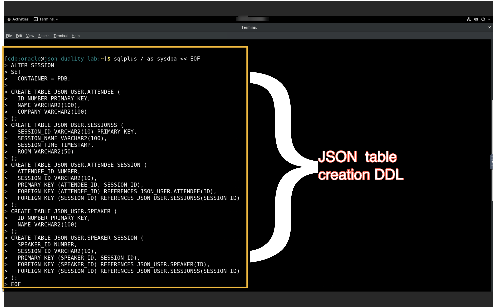
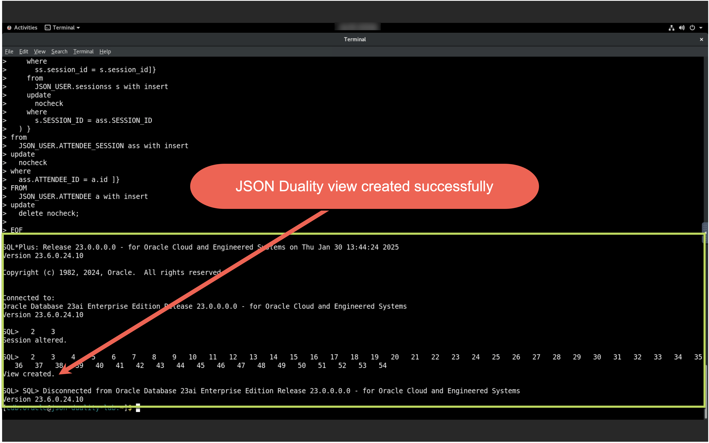
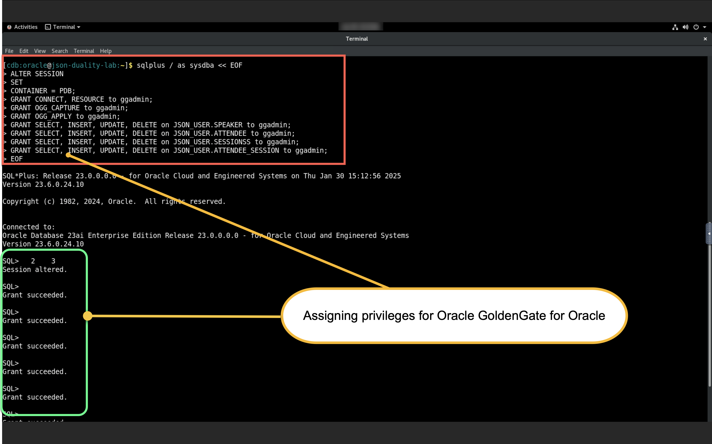
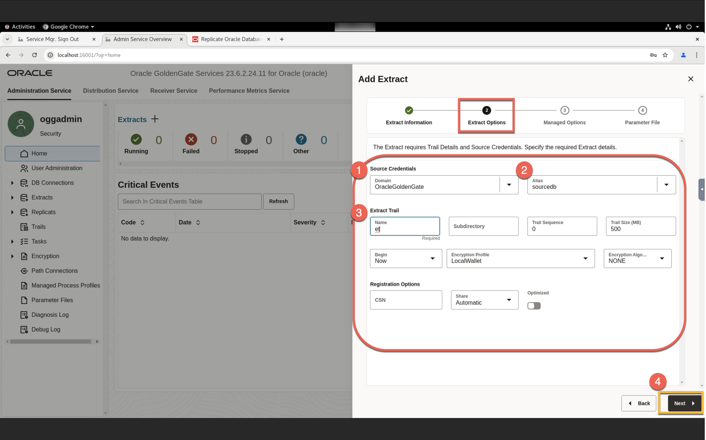
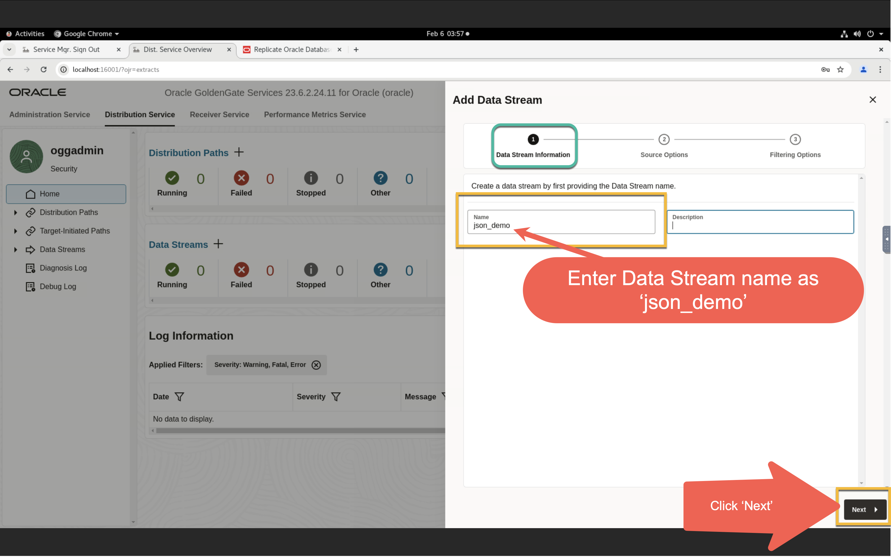
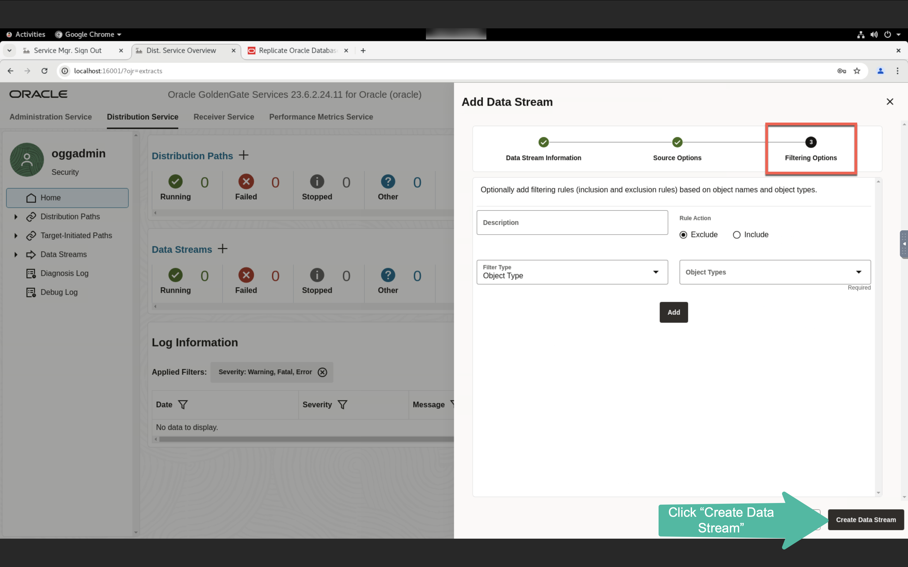
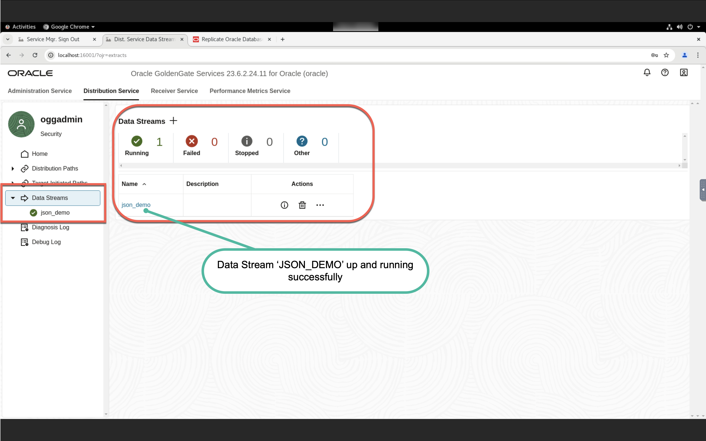
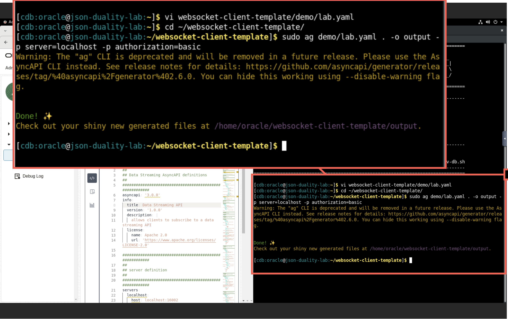
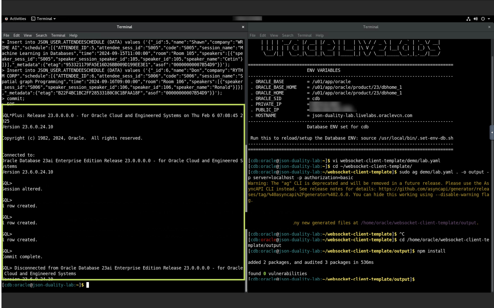

#  Replicate data from Oracle Database to Apache Cassandra

## Introduction

This lab will demonstrate how to  ***Replicate data from Oracle Database to Apache Cassandra*** using **Oracle GoldenGate 21c Microservices** and **Oracle GoldenGate (MA) for Big Data**. All labs will use shell scripts to facilitate the building of the environment, at the same time provide insight into how to use the web pages and AdminClient.

In this lab, we will load data in the Oracle Database schema ***SOE***  of Pluggable Database ***PDB***. GG extract process ***EXTORA*** will capture the changes from Oracle Database and write them to the local trail file ***et***. From the Distribution Service, path ***SRC2TGT*** will route the trail file  ***et*** to target GoldenGate (MA) for Big Data Receiver Service as ***rt***. The replicat process ***REPCASS*** read the remote trail files, created the Cassandra tables, and wrote the data to those tables.

Estimated Time:  30 minutes

#### Lab Architecture

 

### Objectives
In this lab you will learn:
-  How to reset the GoldenGate configuration.
-  How to create an extract for the source database and a path to distribute the trail to target deployment.
-  How to configure the GoldenGate for Cassandra as a target.
-  How to validate the GoldenGate configuration for Cassandra as a target.

### Prerequisites
This lab assumes you have:
- An Oracle Cloud account
- You have completed:
    - Lab: Initialize Environment

## Task 1: Create JSON Relational Duality Views
1.  Open a terminal and create a ***JSON table***.

```
<copy>sqlplus / as sysdba << EOF 
ALTER SESSION 
SET 
  CONTAINER = PDB;

CREATE TABLE JSON_USER.ATTENDEE (
  ID NUMBER PRIMARY KEY, 
  NAME VARCHAR2(100), 
  COMPANY VARCHAR2(100)
);
CREATE TABLE JSON_USER.SESSIONSS (
  SESSION_ID VARCHAR2(10) PRIMARY KEY, 
  SESSION_NAME VARCHAR2(100), 
  SESSION_TIME TIMESTAMP, 
  ROOM VARCHAR2(50)
);
CREATE TABLE JSON_USER.ATTENDEE_SESSION (
  ATTENDEE_ID NUMBER, 
  SESSION_ID VARCHAR2(10), 
  PRIMARY KEY (ATTENDEE_ID, SESSION_ID), 
  FOREIGN KEY (ATTENDEE_ID) REFERENCES JSON_USER.ATTENDEE(ID), 
  FOREIGN KEY (SESSION_ID) REFERENCES JSON_USER.SESSIONSS(SESSION_ID)
);
CREATE TABLE JSON_USER.SPEAKER (
  ID NUMBER PRIMARY KEY, 
  NAME VARCHAR2(100)
);
CREATE TABLE JSON_USER.SPEAKER_SESSION (
  SPEAKER_ID NUMBER, 
  SESSION_ID VARCHAR2(10), 
  PRIMARY KEY (SPEAKER_ID, SESSION_ID), 
  FOREIGN KEY (SPEAKER_ID) REFERENCES JSON_USER.SPEAKER(ID), 
  FOREIGN KEY (SESSION_ID) REFERENCES JSON_USER.SESSIONSS(SESSION_ID)
);
EOF

</copy>
```
  
  


## Task 2: JSON relational duality view 
1.  Create a JSON relational duality view 

```
<copy>sqlplus / as sysdba << EOF 
ALTER SESSION 
SET 
  CONTAINER = PDB;
CREATE 
or replace JSON RELATIONAL DUALITY VIEW JSON_USER.attendeeSchedule AS 
SELECT 
  JSON { '_id' : a.ID, 
  'name' : a.NAME, 
  'company' : a.COMPANY, 
  'schedule' : json[ 
select 
  json{ 'ATTENDEE_ID' : ass.ATTENDEE_ID, 
  'attendee_sess_id' : ass.session_id, 
  unnest(
    select 
      JSON { 'code' : s.SESSION_ID, 
      'session_name' : s.SESSION_NAME, 
      'time' : s.SESSION_TIME, 
      'room' : s.ROOM, 
      'speakers' : json[ 
    select 
      json{ 'speaker_sess_id' : ss.SESSION_ID, 
      'speaker_session_speaker_id' : ss.SPEAKER_ID, 
      unnest(
        select 
          json{ 'speaker_id' : sp.id, 
          'speaker_name' : sp.name} 
        from 
          JSON_USER.speaker sp with insert 
        update 
          nocheck 
        where 
          sp.id = ss.speaker_id
      ) } 
    from 
      JSON_USER.speaker_session ss with insert 
    update 
      nocheck 
    where 
      ss.session_id = s.session_id]} 
    from 
      JSON_USER.sessionss s with insert 
    update 
      nocheck 
    where 
      s.SESSION_ID = ass.SESSION_ID
  ) } 
from 
  JSON_USER.ATTENDEE_SESSION ass with insert 
update 
  nocheck 
where 
  ass.ATTENDEE_ID = a.id ]} 
FROM 
  JSON_USER.ATTENDEE a with insert 
update 
  delete nocheck;

EOF

</copy>
```
  
  
## Task 3: Preparing the database for Oracle GoldenGate

1. Assigning privileges for Oracle GoldenGate for Oracle.


    ```
    <copy>
    sqlplus / as sysdba << EOF 
    ALTER SESSION 
    SET 
    CONTAINER = PDB;
    GRANT CONNECT, RESOURCE to ggadmin;
    GRANT OGG_CAPTURE to ggadmin;
    GRANT OGG_APPLY to ggadmin; 
    GRANT SELECT, INSERT, UPDATE, DELETE on JSON_USER.SPEAKER to ggadmin; 
    GRANT SELECT, INSERT, UPDATE, DELETE on JSON_USER.ATTENDEE to ggadmin; 
    GRANT SELECT, INSERT, UPDATE, DELETE on JSON_USER.SESSIONSS to ggadmin;
    GRANT SELECT, INSERT, UPDATE, DELETE on JSON_USER.ATTENDEE_SESSION to ggadmin; 
    EOF
    </copy>
    ```



2. On the welcome page, Click on the **Add Replicat** (***+*** plus icon) to get the replicat creation wizard.

    Replicat is a process that delivers data to a target database. It reads the trail file on the target database, reconstructs the DML or DDL operations, and applies them to the target database.


















## Task 4: Validation of the GoldenGate configuration for Cassandra as target


## Summary
To summarize, you loaded data in the Oracle Database ***SOE*** schema of Pluggable Database ***PDB***. The GG extract process ***EXTORA*** captured the changes from the Oracle Database and wrote them to the local trail file ***et***. From the Distribution Service, path ***SRC2TGT*** will route the trail file  ***et*** to target GoldenGate (MA) for Big Data Receiver Service as ***rt***. The replicat process ***REPCASS*** will read the remote trail files, create the Cassandra tables, and write the data to Cassandra tables.

You may now proceed to the next lab.

## Learn More

* [Oracle GoldenGate for Big Data 21c ](https://docs.Oracle.com/en/middleware/goldengate/big-data/21.1/index.html)
* [Using the Cassandra Handler ](https://docs.Oracle.com/en/middleware/goldengate/big-data/21.1/gadbd/using-cassandra-handler.html)
## Acknowledgements
* **Author** - Madhu Kumar S, AppDev and Integration, Bangalore Tech Team
* **Contributors** - Madhu Kumar S, Brian Elliott, Deniz Sendil, Meghana Banka, Rene Fontcha  
* **Last Updated By/Date** - Madhu Kumar S, AppDev and Integration, Bangalore Tech Team, 9th August 2022
