#  Replicate Business Objects with Oracle JSON Relational Duality Views and GoldenGate Data Streams

## Introduction

This lab will demonstrate how to  ***Replicate Business Objects with Oracle JSON Relational Duality Views and GoldenGate Data Streams*** 

In this lab, we will load data in the Oracle Database schema ***JSON_USER***  of Pluggable Database ***PDB***. GG extract process ***EXTSRC*** will capture the changes from Oracle Database and write them to the local trail file ***et***. From the Distribution Service, **Data Stream** created to consume the trail file ***et***. The YAML document used to generate the client-side code using @asyncapi/generator. 

Estimated Time:  30 minutes

#### Lab Architecture

 

### Objectives
In this lab you will learn:
-  How to create an extract for the source database 
-  How to configure the Data Steams
-  How to consume the Data Steams using AsynchAPI

### Prerequisites
This lab assumes you have:
- An Oracle Cloud account
- You have completed:
    - Lab: Initialize Environment

## Task 1: Prepare the database for Oracle GoldenGate 
1.  Open a terminal and enter the following command to create a **JSON table**:

    ```
    <copy>sqlplus / as sysdba << EOF 
    ALTER SESSION 
    SET 
      CONTAINER = PDB;

    CREATE TABLE JSON_USER.ATTENDEE (
      ID NUMBER PRIMARY KEY, 
      NAME VARCHAR2(100), 
      COMPANY VARCHAR2(100)
    );
    CREATE TABLE JSON_USER.SESSIONSS (
      SESSION_ID VARCHAR2(10) PRIMARY KEY, 
      SESSION_NAME VARCHAR2(100), 
      SESSION_TIME TIMESTAMP, 
      ROOM VARCHAR2(50)
    );
    CREATE TABLE JSON_USER.ATTENDEE_SESSION (
      ATTENDEE_ID NUMBER, 
      SESSION_ID VARCHAR2(10), 
      PRIMARY KEY (ATTENDEE_ID, SESSION_ID), 
      FOREIGN KEY (ATTENDEE_ID) REFERENCES JSON_USER.ATTENDEE(ID), 
      FOREIGN KEY (SESSION_ID) REFERENCES JSON_USER.SESSIONSS(SESSION_ID)
    );
    CREATE TABLE JSON_USER.SPEAKER (
      ID NUMBER PRIMARY KEY, 
      NAME VARCHAR2(100)
    );
    CREATE TABLE JSON_USER.SPEAKER_SESSION (
      SPEAKER_ID NUMBER, 
      SESSION_ID VARCHAR2(10), 
      PRIMARY KEY (SPEAKER_ID, SESSION_ID), 
      FOREIGN KEY (SPEAKER_ID) REFERENCES JSON_USER.SPEAKER(ID), 
      FOREIGN KEY (SESSION_ID) REFERENCES JSON_USER.SESSIONSS(SESSION_ID)
    );
    EOF

    </copy>
    ```
    
    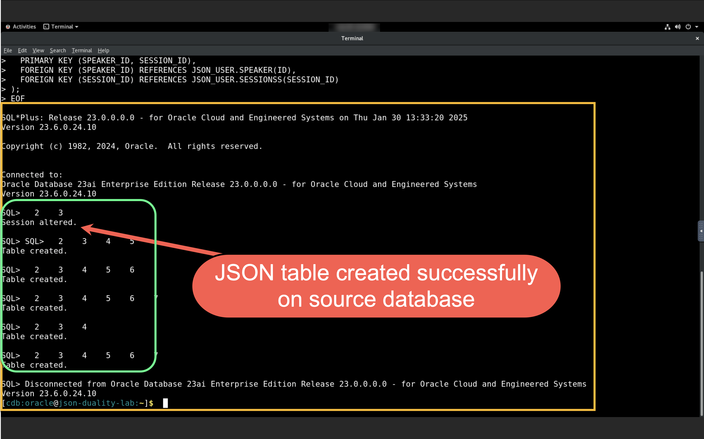


2. Enter the following command to create a JSON relational duality view:

    ```
    <copy>sqlplus / as sysdba << EOF 
    ALTER SESSION 
    SET 
      CONTAINER = PDB;
    CREATE 
    or replace JSON RELATIONAL DUALITY VIEW JSON_USER.attendeeSchedule AS 
    SELECT 
      JSON { '_id' : a.ID, 
      'name' : a.NAME, 
      'company' : a.COMPANY, 
      'schedule' : json[ 
    select 
      json{ 'ATTENDEE_ID' : ass.ATTENDEE_ID, 
      'attendee_sess_id' : ass.session_id, 
      unnest(
        select 
          JSON { 'code' : s.SESSION_ID, 
          'session_name' : s.SESSION_NAME, 
          'time' : s.SESSION_TIME, 
          'room' : s.ROOM, 
          'speakers' : json[ 
        select 
          json{ 'speaker_sess_id' : ss.SESSION_ID, 
          'speaker_session_speaker_id' : ss.SPEAKER_ID, 
          unnest(
            select 
              json{ 'speaker_id' : sp.id, 
              'speaker_name' : sp.name} 
            from 
              JSON_USER.speaker sp with insert 
            update 
              nocheck 
            where 
              sp.id = ss.speaker_id
          ) } 
        from 
          JSON_USER.speaker_session ss with insert 
        update 
          nocheck 
        where 
          ss.session_id = s.session_id]} 
        from 
          JSON_USER.sessionss s with insert 
        update 
          nocheck 
        where 
          s.SESSION_ID = ass.SESSION_ID
      ) } 
    from 
      JSON_USER.ATTENDEE_SESSION ass with insert 
    update 
      nocheck 
    where 
      ass.ATTENDEE_ID = a.id ]} 
    FROM 
      JSON_USER.ATTENDEE a with insert 
    update 
      delete nocheck;

    EOF

    </copy>
    ```
    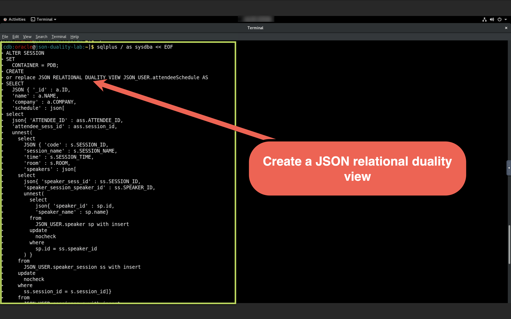
    

3. Enter the following command to assign privileges for Oracle GoldenGate:


    ```
    <copy>
    sqlplus / as sysdba << EOF 
    ALTER SESSION 
    SET 
    CONTAINER = PDB;
    GRANT CONNECT, RESOURCE to ggadmin;
    GRANT OGG_CAPTURE to ggadmin;
    GRANT OGG_APPLY to ggadmin; 
    GRANT SELECT, INSERT, UPDATE, DELETE on JSON_USER.SPEAKER to ggadmin; 
    GRANT SELECT, INSERT, UPDATE, DELETE on JSON_USER.ATTENDEE to ggadmin; 
    GRANT SELECT, INSERT, UPDATE, DELETE on JSON_USER.SESSIONSS to ggadmin;
    GRANT SELECT, INSERT, UPDATE, DELETE on JSON_USER.ATTENDEE_SESSION to ggadmin; 
    EOF
    </copy>
    ```

  

## Task 2: Enable table-level supplemental logging

1. In a new browser window, open  [http://localhost:16001](http://localhost:16001). 
2. On the GoldenGate Administration Service, enter **oggadmin** for Username and the password, and then click **Sign In**.
    >**Note:** password will be saved in location ***/home/oracle/password.txt***.

    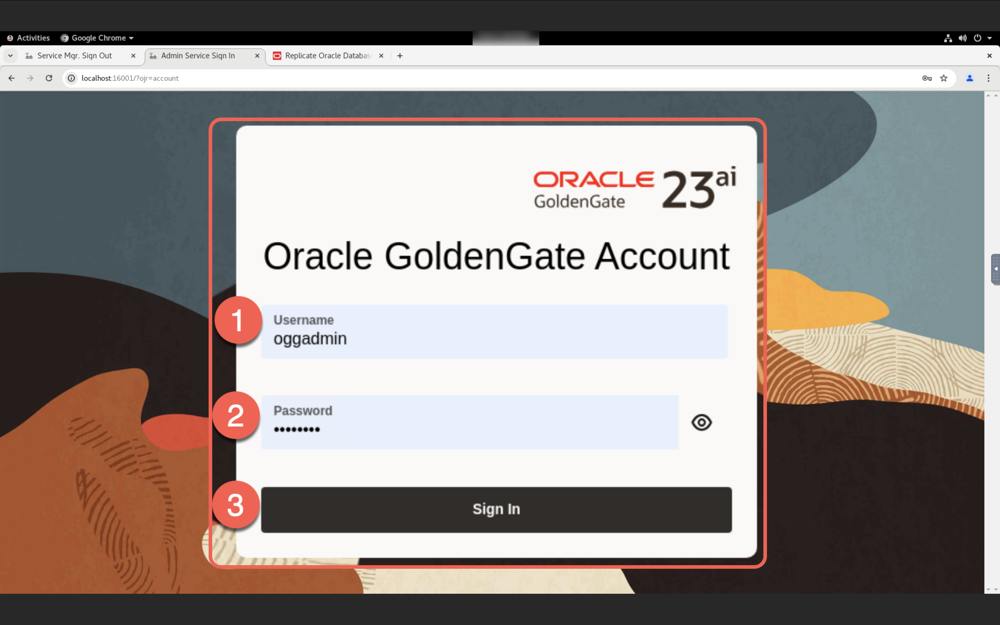

3. Open the navigation menu and then click **DB Connections**.
4. Click **Connect to database sourcedb**.
  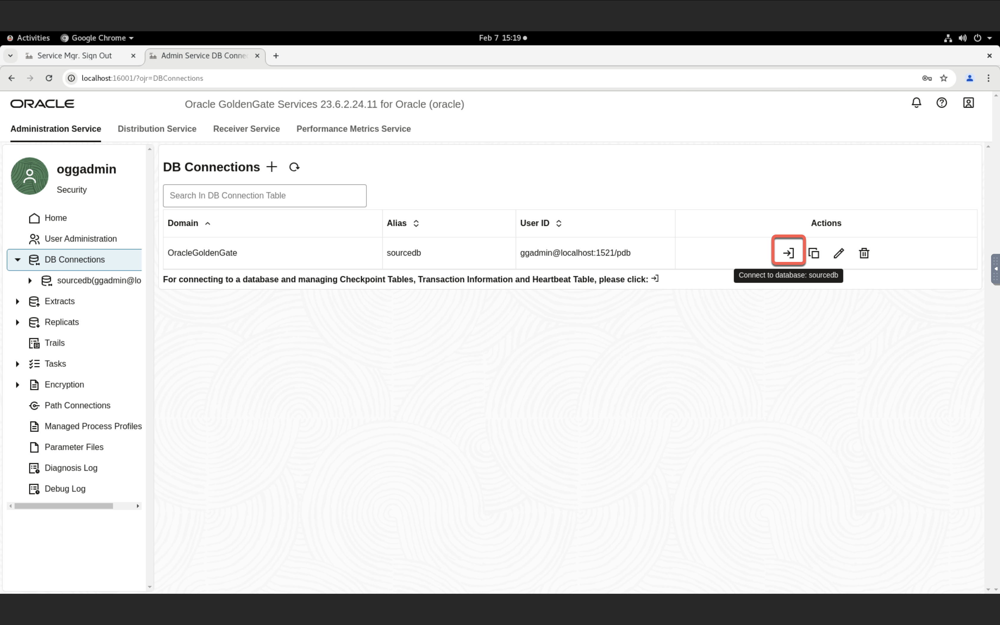

5. Next to **TRANDATA Information**, click **Add TRANDATA** (plus icon)..
  

6. On the Trandata page, complete the following fields, and then click Submit: 
- For Schema Name, enter JSON_USER. 
- Under Supplemental Logging Options, select Scheduling Columns and All Columns.
  
    >**Note:** “To verify, enter JSON_USER and then click Search.”

    


## Task 3: Create an Extract and trail file in Oracle GoldenGate.
1. In the GoldenGate Deployment console, select **Administration Service**, and then on the Administration Service Home page, click **Add Extract** (plus icon).
  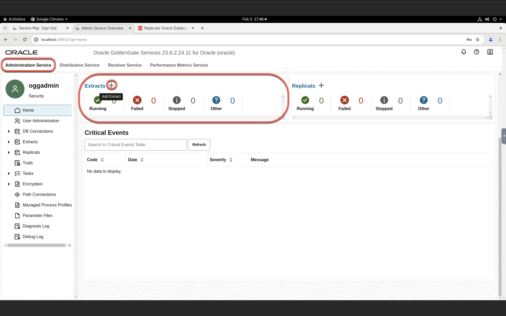
2. The Add Extract panel consists of five pages. On the Extract Information page, complete the following fields, and then click **Next**:
- For **Extract Type**, select **Integrated Extract**.
- For **Process Name**, enter a name for this Extract process, such as **EXTSRC**.


 3. On the Extract Options page, complete the following fields, and then click **Next**:
- For **Domain**, select OracleGoldenGate from the dropdown.
- For **Alias**, select sourcedb from the dropdown.
- For **Trail Name**, enter a two-character name for the Trail file, such as **ET**.

4. On the Managed Options page, leave the fields as they are, and click **Next**. 
  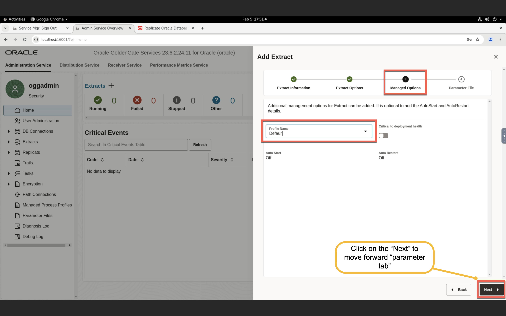
5. In the Parameter File page, click **Create**. 
6. In the **EXTSRC** Action menu, select **Start**. In the Confirm Action dialog, click **OK**.
  
  

## Task 4: Add a Data Stream.

1. In the GoldenGate Deployment console, select **Distribution Service**, and then on the Distribution Service Home page, click **Add Data Stream** (plus icon).
  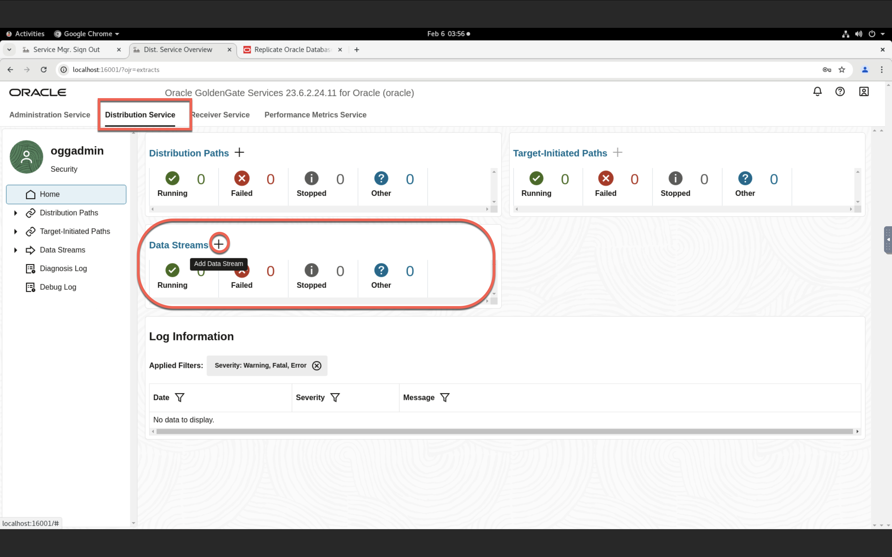
2. The Add Data Stream panel consists of three pages. On the Data Stream Information page, for Name enter **JSON_DEMO**, and then click **Next**.
  
3. On the Source Options page, for **Trail Name** enter **et**, and then click **Next**.
  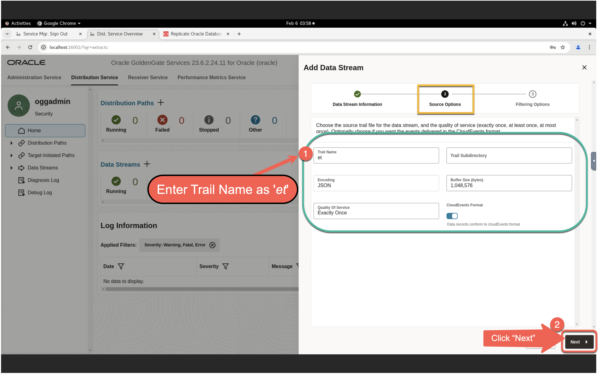
4. On the Filtering Options page, click **Create Data Stream**. You return to the Distribution Service page, where you can find your newly created **JSON_DEMO** Data Stream after a few moments.
  
  

## Task 5: Consume the Change Data from the Data Stream.
1. Enter the following command to create a YAML file:
    ```
    <copy>vi ~/websocket-client-template/demo/lab.yaml</copy>
    ```
    
    
2. Enter the following command to generate the client-side code using @asyncapi/generator:
    ```
    <copy>
    cd ~/websocket-client-template/
    sudo ag demo/lab.yaml . -o output -p server=localhost -p authorization=basic 
    </copy>
    ```
    
3. Enter the following command to install a package:
    ```
    <copy>
    cd ~/websocket-client-template/output
    sudo npm install
    </copy>
    ```
    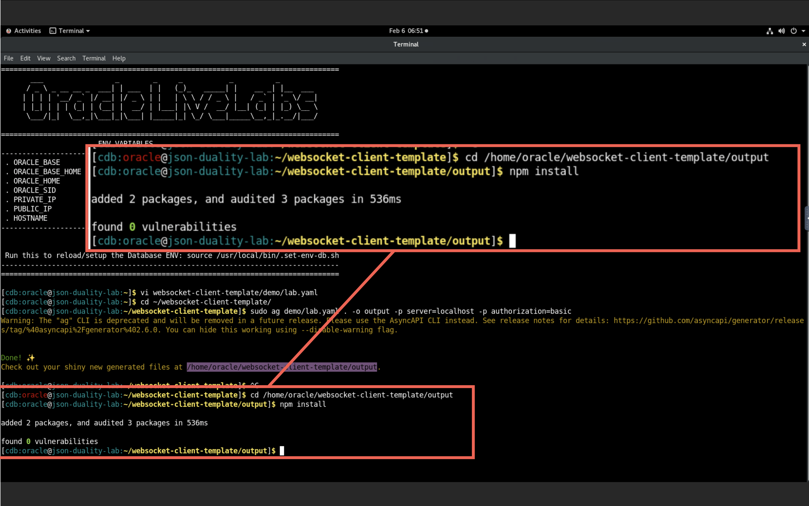
4. Enter the following command to insert Change Data to the document:
    ```
    <copy>
    sqlplus / as sysdba << EOF 
    ALTER SESSION SET CONTAINER = PDB;
    Insert into JSON_USER.ATTENDEESCHEDULE (DATA) values ('{"_id":4,"name":"Windy","company":"ACME Inc","schedule":[{"ATTENDEE_ID":4,"attendee_sess_id":"S004","code":"S004","session_name":"Database Optimization","time":"2024-09-15T09:00:00","room":"Room 104","speakers":[{"speaker_sess_id":"S004","speaker_session_speaker_id":104,"speaker_id":104,"speaker_name":"Jenny"}]}],"_metadata":{"etag":"DD5CA0676D00C68DC996124BBF81F612","asof":"00000000007B54D9"}}');
    Insert into JSON_USER.ATTENDEESCHEDULE (DATA) values ('{"_id":5,"name":"Shawn","company":"WRIME AI","schedule":[{"ATTENDEE_ID":5,"attendee_sess_id":"S005","code":"S005","session_name":"Machine Learning in Databases","time":"2024-09-15T11:00:00","room":"Room 105","speakers":[{"speaker_sess_id":"S005","speaker_session_speaker_id":105,"speaker_id":105,"speaker_name":"Cetin"}]}],"_metadata":{"etag":"953321179FA5E16D26BB009D199EE3E1","asof":"00000000007B54D9"}}');
    Insert into JSON_USER.ATTENDEESCHEDULE (DATA) values ('{"_id":6,"name":"Don","company":"RYTHM CORP","schedule":[{"ATTENDEE_ID":6,"attendee_sess_id":"S006","code":"S006","session_name":"Spatial graph Programming","time":"2024-09-16T09:00:00","room":"Room 106","speakers":[{"speaker_sess_id":"S006","speaker_session_speaker_id":106,"speaker_id":106,"speaker_name":"Ronald"}]}],"_metadata":{"etag":"B22F4BC1BC2FF28533180C0C1BFAA18F","asof":"00000000007B54D9"}}');
    commit;
    EOF
    </copy>
    ```
    
    
5. In the GoldenGate Deployment console, select **Administration Service**, then on the **EXTSRC** Extract page, click Statistics. Validate that each row displays 3 inserts. 
  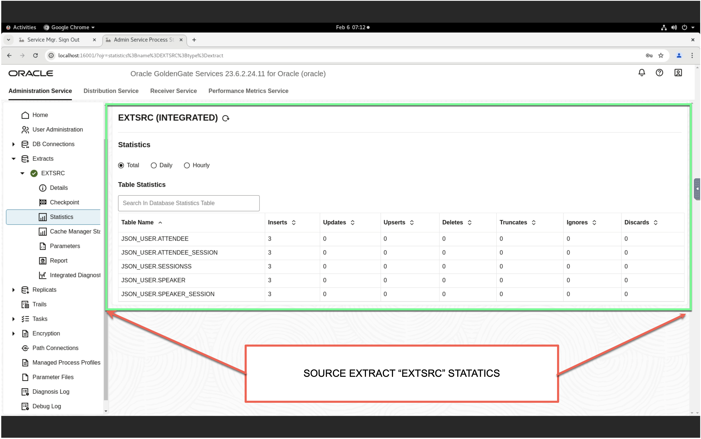
6. Enter the following command on terminal to start the client:
  > **Note:**  Enter **oggadmin** for Username and the password 
    password will be saved in location ***/home/oracle/password.txt***.

    ```
    <copy>
    node client.js
    <copy/>
    ```
    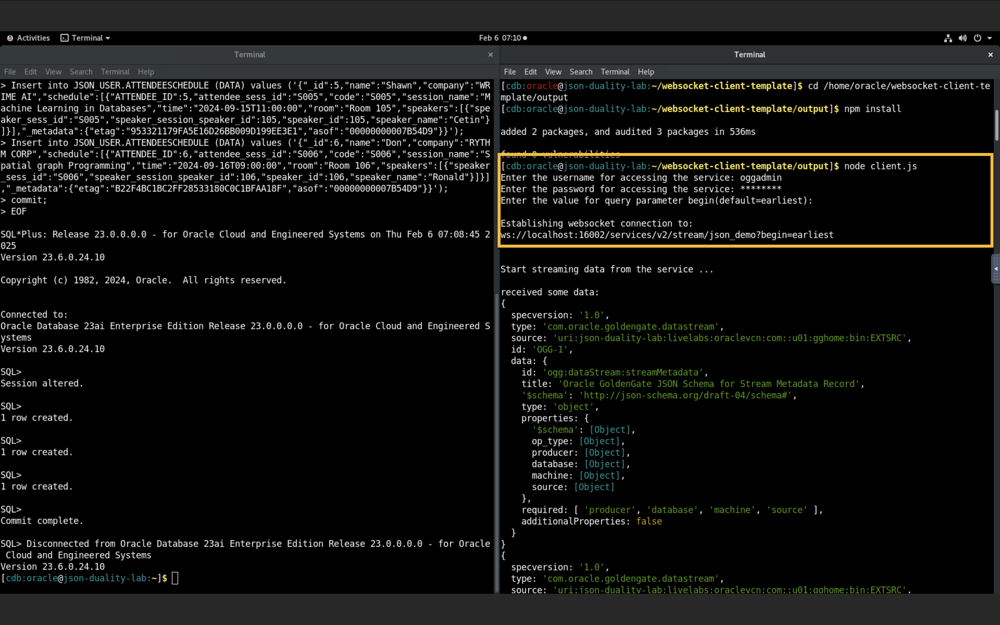
    

## Summary
To summarize, you loaded data in the Oracle Database **JSON\_USER** schema of Pluggable Database **PDB**. The GG extract process **EXTSRC** captured the changes from the Oracle Database and wrote them to the local trail file **et**. From the Distribution Service, Data Streams ***JSON_DEMO*** will consume the trail file  ***et***.

You have completed the lab.

## Learn More

* [Sample Commands to Configure GoldenGate Data Streams for JSON Relational Duality Views](https://docs.oracle.com/en/middleware/goldengate/core/23/coredoc/reference-json-dv-config-rest-api-sample.html#GUID-98F68B82-F252-4E52-A55C-87EDCA5E2EEF)
* [Replicating Business Objects with Oracle JSON Relational Duality and GoldenGate Data Streams](https://docs.oracle.com/en/middleware/goldengate/core/23/coredoc/distribute-json-dv-ogg-data-streams.html#GUID-2B7A2E68-6430-44C1-A9BF-C5ED47B3543F)
* [Oracle Blog](https://blogs.oracle.com/dataintegration/post/oracle-goldengate-data-streams-and-json-duality)


## Acknowledgements
* **Author** - Madhu Kumar S, Senior Cloud Engineer,  NACE CES Delivery
* **Contributors** -  Madhu Kumar S, Deniz Sendil, Katherine Wardhana
* **Last Updated By/Date** - Madhu Kumar S, Senior Cloud Engineer,  NACE CES Delivery, May 2025