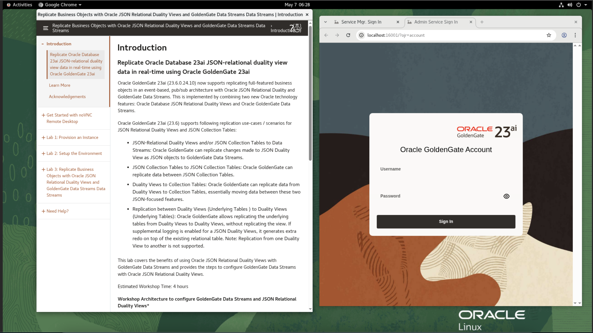

# Lab 1: Environment Setup

## Introduction
In this lab, you download the Oracle Resource Manager (ORM) stack zip file needed to set up the resource needed to run this workshop.

*Estimated Time:* 10 minutes

### Objectives
In this lab, you: 
- Download the ORM stack
- Configure an existing Virtual Cloud Network (VCN)
- Access the graphical remote desktop

## Task 1: Create the stack

1.  Use the following link to download the ORM stack:

    [ggma-datastreams-mkplc-freetier.zip](./files/ggma-datastreams-mkplc-freetier.zip)

2. In the Oracle Cloud navigation menu, select **Developer Services**, and then **Stacks**.
3. On the Stacks page, under **List scope**, select your compartment from the **Compartment** dropdown.
4. Click **Create Stack**.

  

  

5. The Create Stack panel consists of three pages. On the Stack information page, for Choose the origin of the Terraform configuration, select **My configuration**.

6. For Stack configuration, select **.zip file**, click **Browse**, and select the **ggma-datastreams-mkplc-freetier.zip** file from your download directory.

7. Click **Next**.
  

8. On the Configure variables page, for **Instance Count**, enter **1**.
9. For **Select an availability domain**, select a domain from the dropdown.
10. For **Need Remote Access via SSH**:

    a. Deselect if you only want Remote Desktop access.

    b. Select **Need Remote Access via SSH** and deselect **Auto Generate SSH Key Pair** to enable remote access via SSH protocol, then provide the SSH public key(s).

    - i. (Optional) For **SSH Public Key**, select **Paste SSH Keys**, and paste the SSH Key, or select  **Choose SSH Key Files**, click **Browse**, and upload an SSH Key File.

      >**Note:**  For more information on how to create an SSH Key, see [Generate SSH Key](https://oracle-livelabs.github.io/common/labs/generate-ssh-key/).

    c. Select **Need Remote Access via SSH** and select **Auto Generate SSH Key Pair** to have the keys auto-generated for you during provisioning. If you select this option you will be provided with the private key post provisioning.

    - i. Select **Use Flexible Instance Shape with Adjustable OCPU Count?**, if you plan to use an Instance Shape and not a Fixed Shape.

        - For **Instance Shape**, select **VM.Standard.E4.Flex** from the dropdown.

        - For **Select OCPUs Count per Instance**, enter **2**.
    - ii.	Deselect **Use Flexible Instance Shape with Adjustable OCPU Count?**, if you plan to use a Fixed Shape and not an Instance Shape.

        - For **Instance Shape**, select **VM.Standard.E2.2** from the dropdown.
    
11.	For **Use Existing VPN?**, keep the default and deselect. 
12.	Click **Next**.
13.	Select **Run Apply**, and then click **Create**.
    
    
    

    Your stack is now creating and the Apply action is running to deploy your environment. The Job details page updates with your newly created Stack after a few moments, with the status Succeeded. Select the Application Information tab to view information such as your public IP address(es), instance name(s), and remote desktop URL.

## Task 2: Access the Graphical Remote Desktop

1. Return to the **Stack Details** page, select a job, and select the **Application Information** tab.
2. Select **Copy** next to Remote Desktop, and paste the URL on a new tab.
    >**Note:** If you see “Your connection is not private” or its variations, for the purposes of this lab, proceed to access the website.

  

  

  This should take you directly to your remote desktop in a single click.

  

You may now **proceed to the next lab**.

## Acknowledgements
* **Author** - Madhu Kumar S, Senior Cloud Engineer,  NACE CES Delivery
* **Contributors** - Madhu Kumar S, Deniz Sendil, Katherine Wardhana,Jenny Chan
* **Last Updated By/Date** - Madhu Kumar S, Senior Cloud Engineer,  NACE CES Delivery, May 2025
