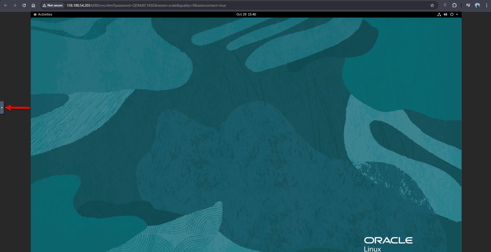
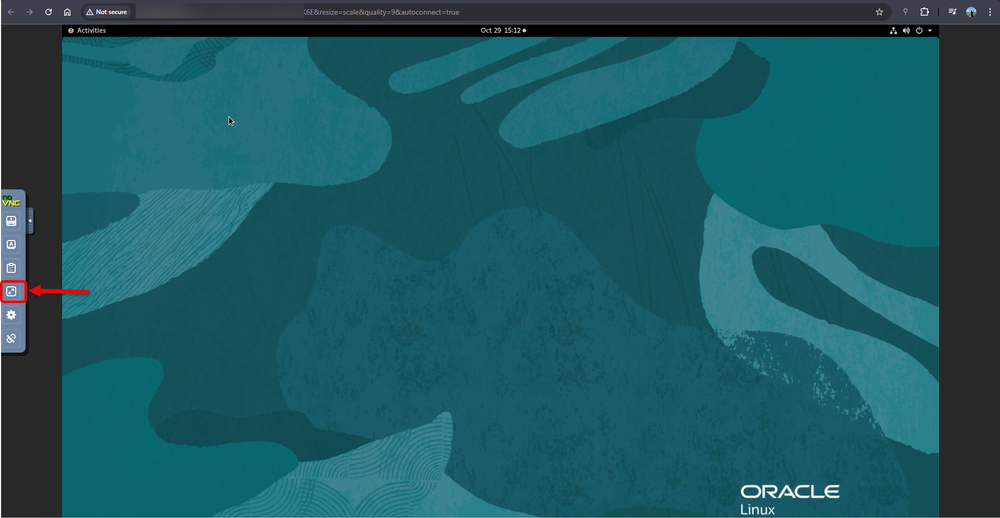
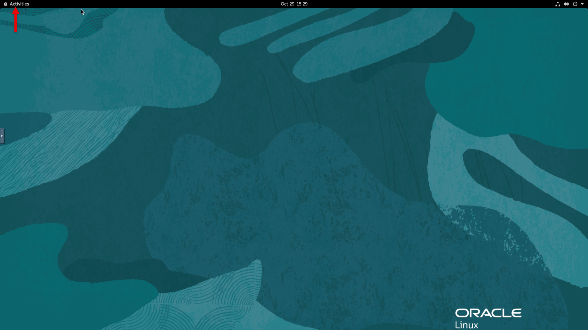
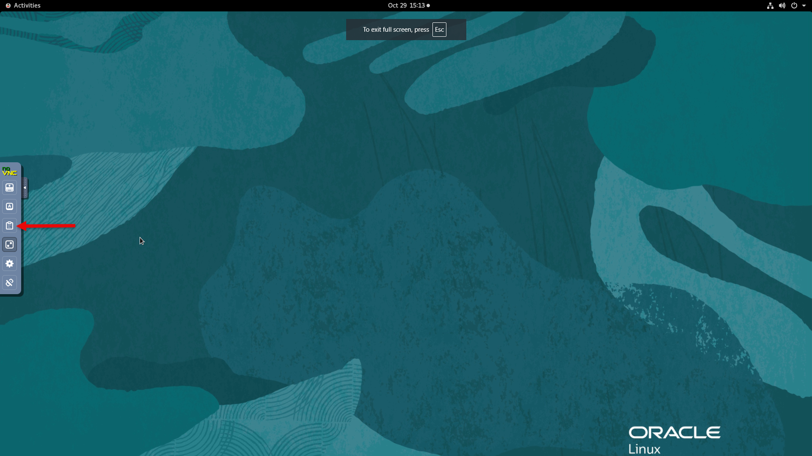
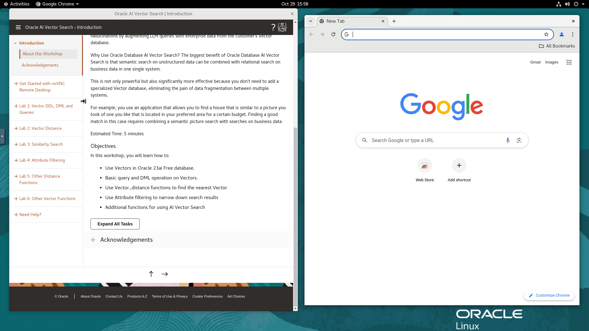
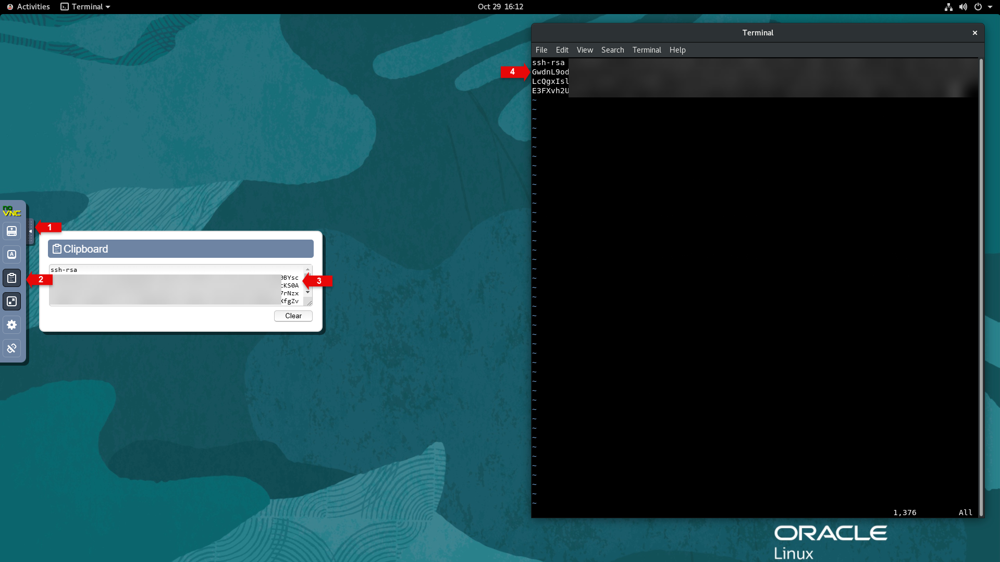

# Get Started with noVNC Remote Desktop

## Introduction
In this lab, you learn how to use a remote desktop session for this workshop.

Estimated Time: 10 minutes

### Objectives
In this lab, you will:
- Enable fullscreen display of remote desktop session
- Enable remote clipboard integration
- Open the workshop guide from the remote desktop

### Prerequisites

To successfully complete this lab, you should have provisioned a VM instance configured with noNVC.

## Task 1: Enable Full-screen Display

   For seamless desktop integration and to make the best use of your display, perform the following tasks to render your remote desktop session in fullscreen mode.

1. In noVNC, if it’s not already visible, expand the **Control Bar.**

    

2. In the Control Bar, select **Fullscreen**.

    
    

3. To view the applications already installed, in the noVNC toolbar, click **.Activities**.

    
    The Activities bar displays icons of applications already installed
    

## Task 2: Enable Copy/Paste from Local to Remote Desktop
As you run through this lab, you may need to copy text from your *local PC/Mac* to the *remote desktop*, to enable an alternative *local-to-remote clipboard* with Input Text Field:

1. In noVNC, open the Control Bar, and then select **Clipboard**.

    

2. Copy text from your local machine, and then paste it into the Clipboard in noVNC

    

    >**Note:** Ensure that you open the Clipboard as instructed in Step 1 before you open and paste the text into the target application in noVNC.

## Task 3: Open Your Workshop Guide
To optimize your workshop experience, it’s recommended that you open the workshop guide in a web browser in noVNC. If a web browser is not already open, follow the steps below:

1. In the noVNC toolbar, click **Activities**.

    

2. In the Activities bar, double-click **Get Started with your Workshop**. This opens a web browser window with your workshop instructions. Depending on the workshop, you may also have additional tabs for other relevant applications.

    

You may now **proceed to the next lab**.

## Appendix: Connect Remotely Using SSH

While your workshop can be executed end-to-end from the remote desktop, follow the steps provided below if you need to access the instance remotely using an SSH client such as Putty, Unix/Linux/MacOS Terminal, OCI cloud shell, and other terminal emulators available on Windows.

>**Note:** In this section you are enabling SSH access to the OS user running the remote desktop. This could be oracle, opc, or any other OS user for which the noVNC remote desktop has been configured.

This assumes that you already have an RSA-type SSH key-pair available on the local system where you will be connecting from. If you don't and for more info on creating and using SSH keys for your specific platform and client, please refer to the guide [Generate SSH Keys](https://oracle-livelabs.github.io/common/labs/generate-ssh-key)

1. Open the remote clipboard on the remote desktop as shown in *Task 2* and launch a terminal session

2. Click on the Activities button, then on Terminal Icon

    

3. Paste the block below onto the remote clipboard first, then onto the terminal to create or update the file *$HOME/.ssh/authorized_keys* with the *Vi* editor

    ```text
    <copy>
    cd $HOME; mkdir .ssh; cd .ssh
    vi authorized_keys
    </copy>
    ```

    

3. From the local system (e.g. your laptop) and with the exception of *Putty* users, locate the SSH public key from the key-pair, open it, and copy the entire content to the clipboard.

    

    If using Putty you must load the private key (*.ppk*) into the *Puttygen* utility to see the relevant public key block to copy. Do not copy the content of the public key file directly as it will not work.

    

4. Paste the copied public key onto the remote clipboard first, then onto the terminal where you opened *authorized_keys* for edit

    

5. Save and exit the *Vi* editor

6. Set required permissions on *$HOME/.ssh* and *authorized_keys*

    ```
    <copy>
    chmod 0700 $HOME/.ssh
    chmod 0600 $HOME/.ssh/authorized_keys
    </copy>
    ```

7. Test/Validate connectivity using the private key (for Unix/Linux/MacOS Terminal, OCI cloud shell, and Terminal emulators on Windows such as Cygwin and MobaXterm).

    ```text
    <copy>
    ssh -i [path to private key] remote-user@[instance-public-ip-address]
    </copy>
    ```

    e.g.
    ```text
    <copy>
    ssh -i /home/appuser1/.ssh/livelabs_rsa_priv oracle@150.xxx.xxx.xxx
    </copy>
    ```

    For Putty, please refer to the guide [Generate SSH Keys](https://oracle-livelabs.github.io/common/labs/generate-ssh-key) on how to establish the connection using the *.ppk* private key.

## Acknowledgements
* **Author** - Madhu Kumar S, Senior Cloud Engineer,  NACE CES Delivery
* **Contributors** - Madhu Kumar S, Deniz Sendil, Katherine Wardhana,Jenny Chan
* **Last Updated By/Date** - Madhu Kumar S, Senior Cloud Engineer,  NACE CES Delivery, May 2025