# Set up your environment

## Introduction

In this lab, you learn to create the required resources you'll use for Oracle Cloud Infrastructure (OCI) GoldenGate. You create a VCN and subnet, provision autonomous database instances, and load data into the databases.

Estimated time: 20 minutes

### Objectives

-  Provision a VCN and subnet
-  Provision, connect, and load data into an Autonomous Transaction Processing (ATP) instance
-  Provision, connect, and load data into an Autonomous Data Warehouse (ADW) instance

### Prerequisites

This lab assumes you completed the Get started lab.

> **Note:** 
* You may see differences in account details (eg: Compartment Name is different in different places) as you work through the labs. This is because the workshop was developed using different accounts over time.
* This workshop was designed to use Oracle Autonomous Databases as the source and target. If you plan to use Oracle Database, ensure that you use the CDB user to capture data from the PDBs.

## Task 1: Create a VCN and subnet

1.  Open the **Navigation Menu**, navigate to **Networking**, and select **Virtual Cloud Networks**.

	

2.  On the **Virtual Cloud Networks in &lt;compartment-name&gt;** page, click **Start VCN Wizard**.

	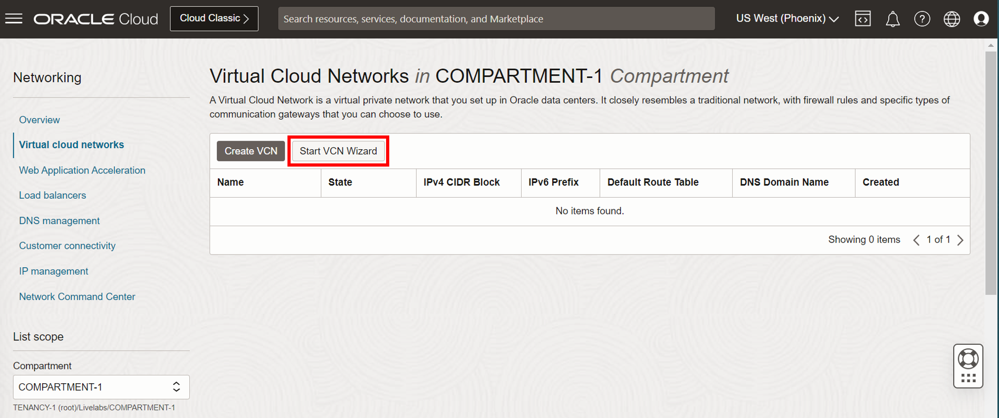

3.  In the Start VCN Wizard dialog, select **VCN with Internet Connectivity**, and then click **Start VCN Wizard.**

    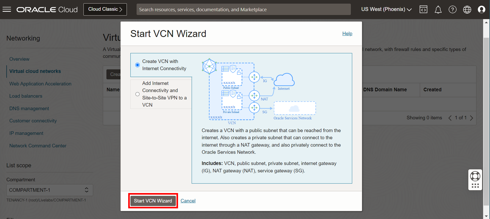

4.  Enter a name for the VCN, select a compartment, and then click **Next**.

    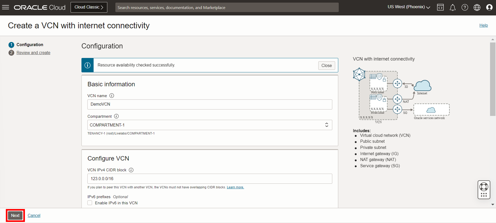

5.  Verify the configuration, and then click **Create**.

    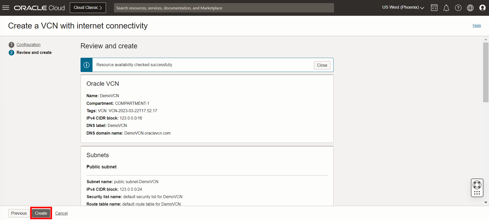

You can click View VCN Details and see both a Public and Private subnet were created.

## Task 2: Create an ATP instance

1.  Open the **Navigation Menu**, navigate to **Oracle Database**, and select **Autonomous Transaction Processing**.

	

2.  On the **Autonomous Database &lt;compartment-name&gt;** page, click **Create Autonomous Database**.

    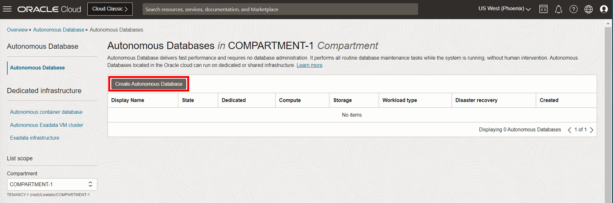

3. For **Compartment** select a compartment from the dropdown. (Note that yours will be different - do not select **ManagedCompartmentforPaaS**) and then enter **ATPSource** for **Display Name** and **Database Name**.

    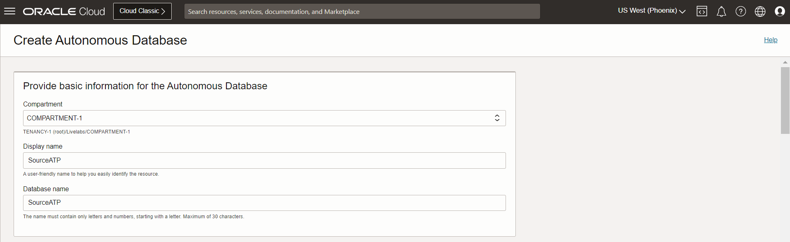

4.  Under **Choose a workload type**, select **Transaction Processing**.

    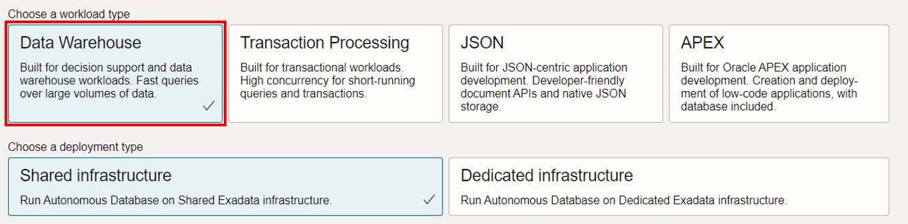

5.  Under **Choose a deployment type**, select **Shared Infrastructure**.

    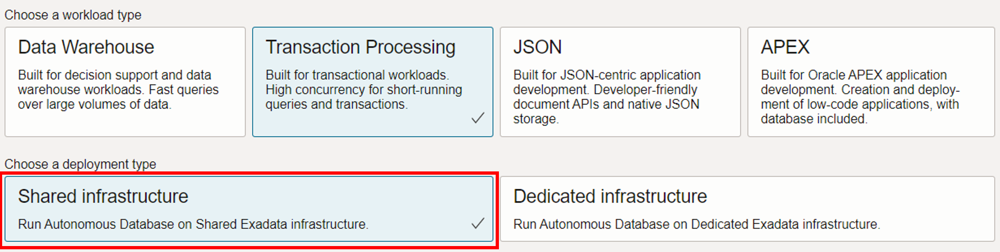

6.  Under **Configure the database**, leave **Choose database version** and **Storage (TB)** and **OCPU Count** as they are.

7.  Add a password. Take note of the password, you will need it later in this lab.

    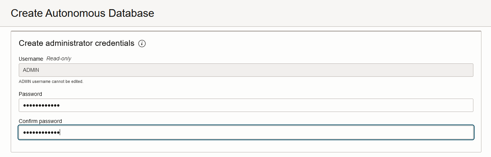

8.  Under **Choose a license type**, select **License Included**.

    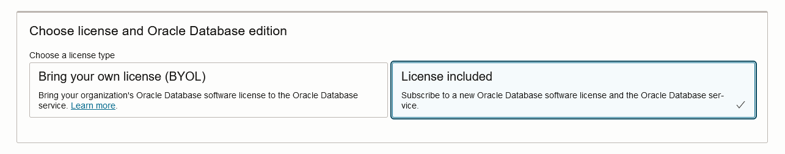

9.  Click **Create Autonomous Database**. Once it finishes provisioning, you can click on the instance name to see details of it.


## Task 3: Load the ATP schema

1.  Click the following link to download the database schema.

    [Archive.zip](https://objectstorage.us-ashburn-1.oraclecloud.com/p/VEKec7t0mGwBkJX92Jn0nMptuXIlEpJ5XJA-A6C9PymRgY2LhKbjWqHeB5rVBbaV/n/c4u04/b/livelabsfiles/o/data-management-library-files/Archive.zip)

2.  Save `Archive.zip` to a download directory, and then unzip the file.

3.  Back in the OCI Console, select your ATP instance from the Autonomous Databases page to view its details and access tools.

    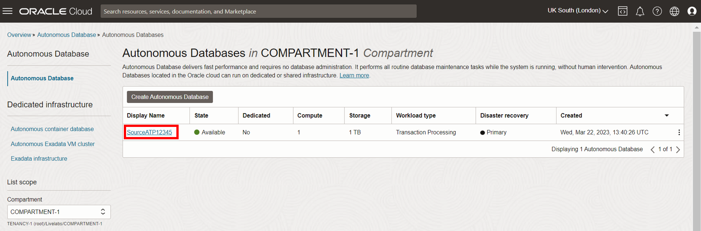

4.  Click **Database actions**.

    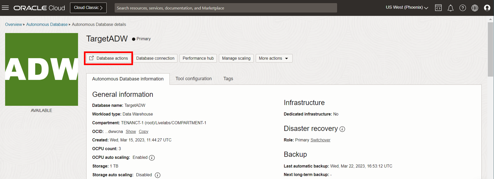

5.  If prompted, log in with the ADMIN user and password provided when you created the ATP instance.

    

6.  From the Database Actions menu, under **Development**, select **SQL**.

    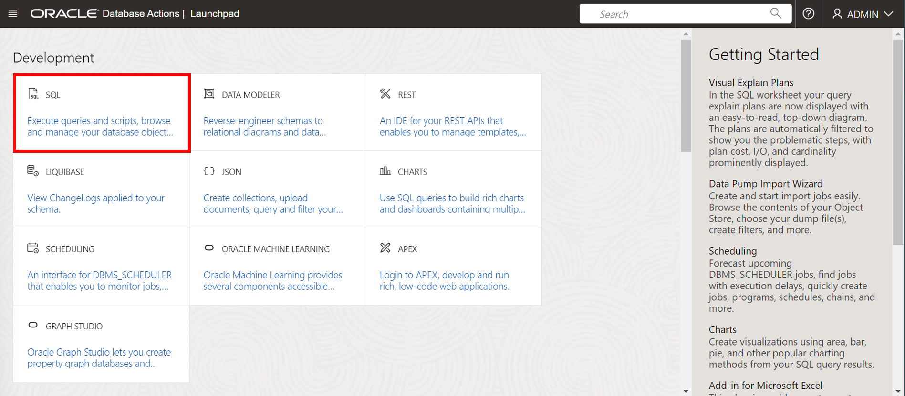

7.  (Optional) Click **X** to close the Help dialog.

8.  Copy and paste the SQL script from **OCIGGLL\_OCIGGS\_SETUP\_USERS\_ATP.sql** into the SQL Worksheet.

    

9.  Click **Run Script**. The Script Output tab displays confirmation messages.

10. Copy and paste the SQL script from **OCIGGLL\_OCIGGS\_SRC\_USER\_SEED\_DATA.sql** a new SQL Worksheet.

    

11. Click **Run Script**. The Script Output tab displays confirmation messages.

	>**Note:** If you find that running the entire script does not create the tables, then try running each table creation and insert statements one at a time until all the tables are created. You may also need to relaunch SQL to continue running the scripts until all tables are created and populated.

12. Close the SQL window and then reopen it from Database Actions.

13. In the Navigator tab, look for the SRC\_OCIGGLL schema and then select tables from their respective dropdowns to verify the schema and tables were created. You may need to log out and log back in if you can't locate SRC\_OCIGGLL.

    

14. To enable supplemental logging, run the following command in SQL:

    ```
    <copy>ALTER PLUGGABLE DATABASE ADD SUPPLEMENTAL LOG DATA;</copy>
    ```

## Task 4: Create an ADW Instance

1.  Open the **Navigation Menu**, navigate to **Oracle Database**, and select **Autonomous Data Warehouse**.

	

2.  Click **Create Autonomous Database**.

    

3. Select **Compartment** by clicking on the drop-down list. (Note that yours will be different - do not select **ManagedCompartmentforPaaS**) and then enter **ADWTarget** for **Display Name** and **Database Name**.

    

4.  Under **Choose a workload type**, select **Data Warehouse**.

    

5.  Under **Choose a deployment type**, select **Shared Infrastructure**.

    

6.  Under **Configure the database**, leave **Choose database version** and **Storage (TB)** and **OCPU Count** as they are.

7.  Add a password. Note the password down in a notepad, you will need it later in Lab 2.

    

8.  Under **Choose a license type**, select **License Included**.

    

9.  Click **Create Autonomous Database**. After it finishes provisioning, you can click on the instance name to see details of it.

10. On the Details page, click **Database Actions**.

11. Log in using the ADMIN username and password set in step 7.

12. Copy and paste the script from **OCIGGLL\_OCIGGS\_SETUP\_USERS\_ADW.sql** into the SQL worksheet, and then click **Run Script**.

	

13. Log out of Database Actions.

## Task 5: Load the ADW schema

1.  Select your ADW instance from the Autonomous Databases list to view its details and access tools.

    

2.  Click **Database Actions**.

3.  If prompted, log in with the ADMIN user and password provided when you created the ADW instance.

    

4.  From the Database Actions menu, under **Development**, select **SQL**.

    

5.  Copy the SQL script from **OCIGGLL\_OCIGGS\_SETUP\_USERS\_ADW.sql** paste it into the SQL Worksheet.

    

6.  Click **Run Script**. The Script Output tab displays confirmation messages.

	>**Note:** If you find that running the entire script does not create the tables, then try running each table creation and insert statements one at a time until all the tables are created. You may also need to relaunch SQL to continue running the scripts until all tables are created and populated.

7.  Copy the SQL script from **OCIGGLL\_OCIGGS\_SRC\_MIRROR\_USER\_SEED\_DATA.sql** and paste it into a new SQL Worksheet.

8.  Click **Run Script**. The Script Output tab displays confirmation messages.

9.  In the Navigator tab, look for the SRCMIRROR\_OCIGGLL schema and then select tables from their respective dropdowns to verify the schema and tables created. You may need to log out and log back in if you can't locate SRCMIRROR\_OCIGGLL.

**Proceed to the next lab.**

## Acknowledgements

- **Author** - Jenny Chan, Consulting User Assistance Developer
- **Last Updated By/Date** - Jenny Chan, March 2023
- **PAR Expiration date** - February 2024
