# Create the Oracle Cloud Infrastructure GoldenGate resources

## Introduction

This lab walks you through the steps to create an Oracle Cloud Infrastructure (OCI) GoldenGate Deployment.

Estimated time: 20 minutes

Watch the video below for a walk through of the lab.
[](youtube:qW8ulWBx99s)

### About Oracle Cloud Infrastructure GoldenGate Resources

A Oracle Cloud Infrastructure GoldenGate deployment manages the resources it requires to function. The GoldenGate deployment also lets you access the GoldenGate deployment console, where you can access the OCI GoldenGate deployment console to create and manage processes such as Extracts and Replicats.

Connections capture source and target credential information. A connection also enables networking between the Oracle Cloud Infrastructure (OCI) GoldenGate service tenancy virtual cloud network (VCN) and your tenancy VCN using a private endpoint.

### Objectives

In this lab, you will:
* Locate Oracle Cloud Infrastructure GoldenGate in the Console
* Create a OCI GoldenGate deployment
* Create the source and target connections
* Assign connections to deployments

### Prerequisites

This lab assumes that you completed all preceding labs.

## Task 1: Create a deployment

> **Note:** *Compartment names in the screenshots may differ from values that appear in your environment.*

1.  Open the **Navigation Menu**, navigate to **Oracle Database**, and select **GoldenGate**.

    

2.  On the GoldenGate **Overview** page, click **Deployments**.

    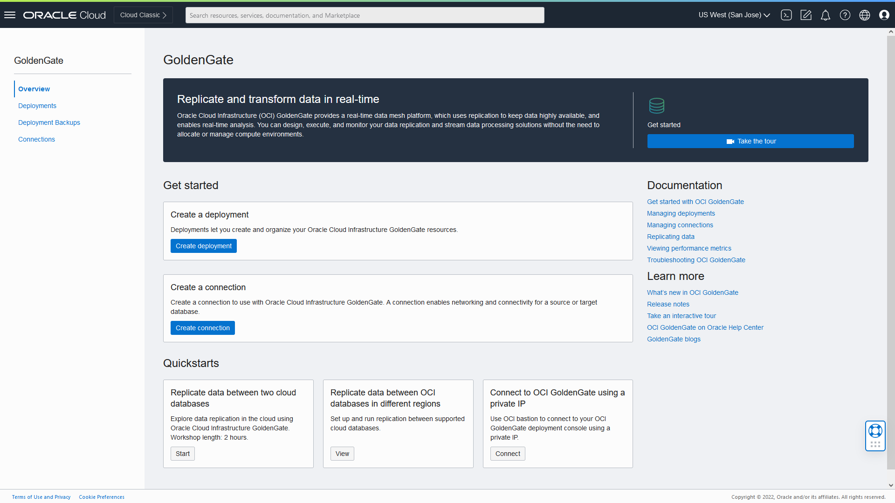

3.  You may need to select a compartment. Under List Scope, from the Comparment dropdown, expand the root compartment, and then select the compartment associated with your username. For example, if your LiveLab username is LL1234-user, expand root, expand LiveLabs, and then select the compartment **LL1234-COMPARTMENT**.

    > **Tip:** *You can find your User name in the Workshop Details section.*

4.  On the Deployments page, click **Create Deployment**.

    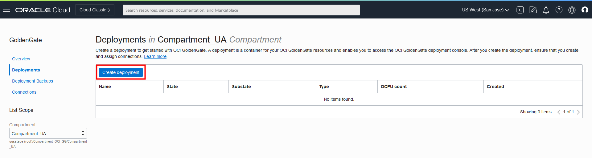

5.  In the Create Deployment panel, enter **GGSDeployment** for Name.

6.  From the Compartment dropdown, select a compartment.

7.  For OCPU Count, enter **1**.

8.  For Subnet, select a subnet. If you're using the workshop environment, select **&lt;user&gt;pubsubnt**.

9.  For License type, select **Bring You Own License (BYOL)**.

10. Click **Show Advanced Options**, and then select **Create Public Endpoint**.

    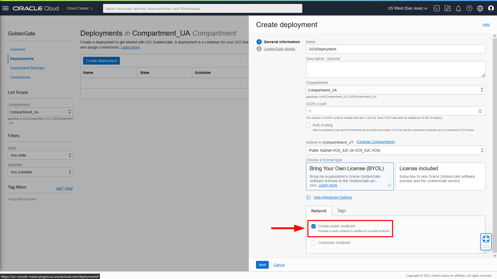

11. Click **Next**.

12. For **Select a technology**, select **Oracle Database** from the dropdown.

13. For GoldenGate instance name, enter **ggsinstance**.

14. For Administrator username, enter **oggadmin**.

15. For Administrator password, enter a password. Take note of this password, or use the same password for the source or target database users from the Workshop Details section.

16. Click **Create**.

    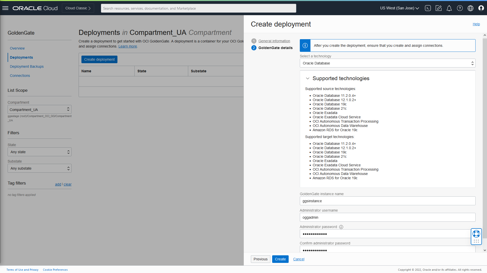

You're brought to the Deployment Details page. It takes a few minutes for the deployment to be created. Its status will change from CREATING to ACTIVE when it is ready for you to use. While you're waiting, proceed to the next Tasks.

## Task 2: Create the source and target connections

While the deployment is being created, you can register the source and target Autonomous Database instances.

1.  Use the Oracle Cloud Console breadcrumb to navigate back to the GoldenGate page.

    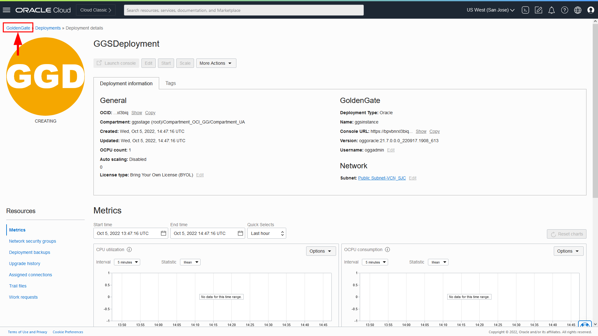

2.  Click **Connections**.

    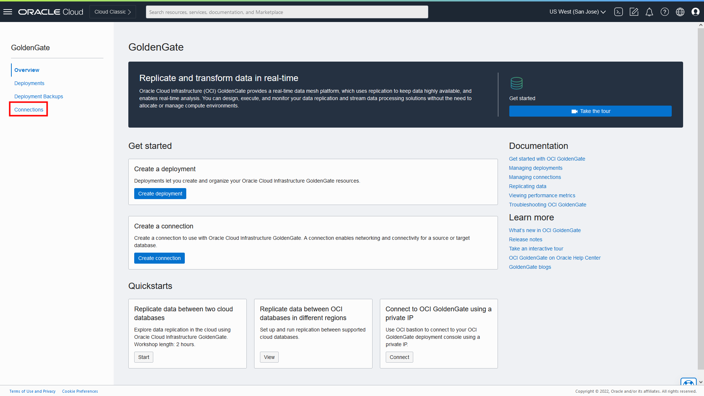

3.  Click **Create connection**.

    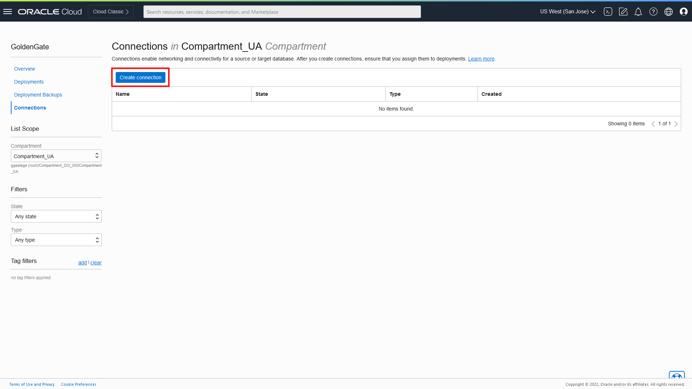

4.  In the Create connection panel, for Name, enter **SourceATP**.

5.  From the Compartment dropdown, select the compartment in which to create the connection.

6.  From the Type dropdown, select **OCI Autonomous Database**.

7.  Click **Next**.

    

8.  For Database details, choose **Select database**.

9.  For **Database in &lt;compartment-name&gt;**, click **Change Compartment**, select the compartment where you created the ATP instance, and then select the source APT instance from the dropdown.

10.  For Database user password, enter a password for the `ggadmin` user, and then click **Create**. Take note of this password.

    >**NOTE:** *If you're completing this lab in a Sandbox Tenancy, then click **View Login Info** in your LiveLab instructions and copy database Admin password under Terraform Values and paste it into the Database user password field.*

    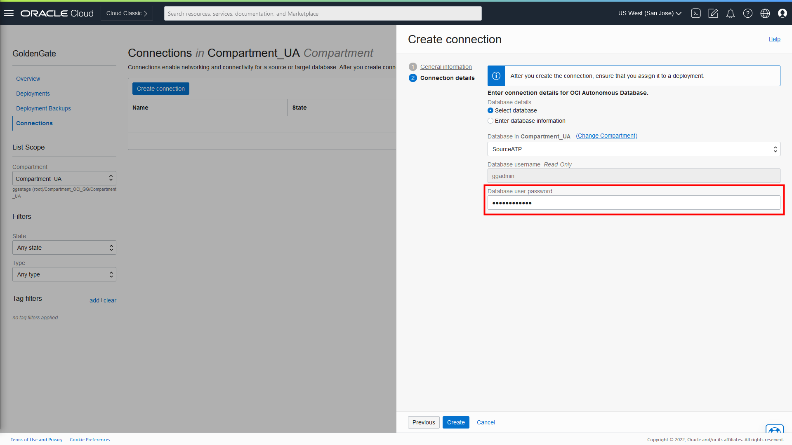

    The connection becomes Active after a few minutes.

11. Repeat steps 2 to 10 to create the TargetADW connection.

## Task 3: Unlock the GGADMIN user and add supplemental logging

Although the GGADMIN user is automatically created, it is locked by default. The following steps guide you through how to unlock the GGADMIN user.

1.  From the Oracle Cloud console navigation menu, click to **Oracle Database**, and then click **Autonomous Transaction Processing**.

    

2.  From the list of databases, select **SourceATP**.

    

3.  On the SourceATP Database Details page, click **Database Actions**.

    

4.  Sign in to Database Actions using the ADMIN user details from Lab 1: Set Up the Environment. If you're running this lab on a Sandbox tenancy, copy the ADMIN password provided with your Login Info.

5.  Under **Administration**, click **Database Users**.

    

6.  From the list of users, locate **GGADMIN**, and then click the ellipsis (three dots) icon and select **Edit**.

    

7.  In the Edit User panel, deselect **Account is Locked**, enter the password you gave the GGADMIN user in Task 2 Step 10, and then click **Apply Changes**.

    

    Note that the user icon changes from a blue padlock to a green checkmark.

8.  From the Database Actions menu, select **SQL**.

    

9.  Enter the following into the worksheet, and then click **Run Script**.

    ```
    <copy>ALTER PLUGGABLE DATABASE ADD SUPPLEMENTAL LOG DATA;</copy>
    ```
    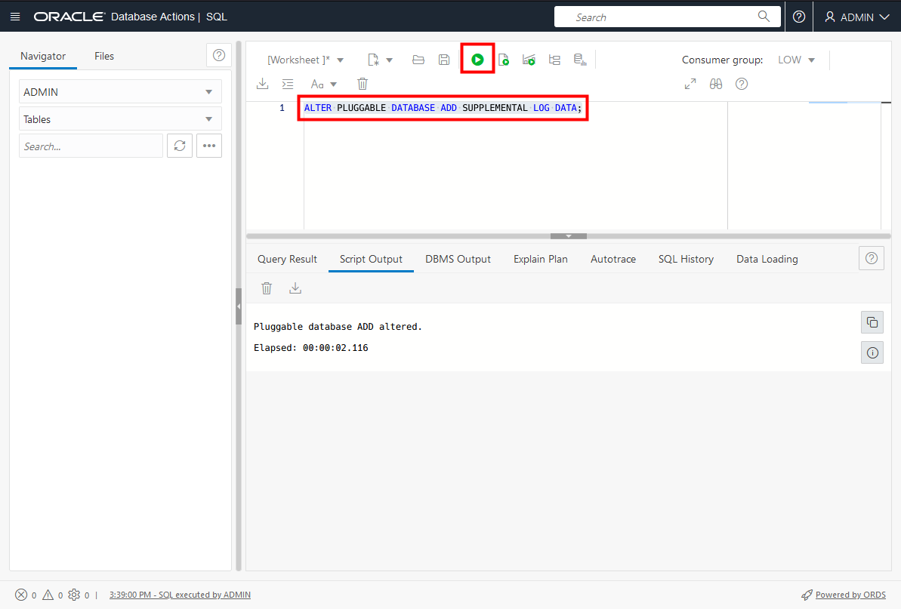

10. Log out of Database Actions.

11. Repeat steps 1 to 7 to unlock the GGADMIN user for **TargetADW** with the password from Task 2 Step 11. Log out of Database Actions when you're done.

## Task 4: Review the deployment details

Return to the OCI GoldenGate Deployments page and select your GGSDeployment to view its details. On the deployment details page, you can:

* Review the deployment's status
* Launch the GoldenGate service deployment console
* Edit the deployment's name or description
* Stop and start the deployment
* Move the deployment to a different compartment
* Review the deployment resource information
* Add tags

    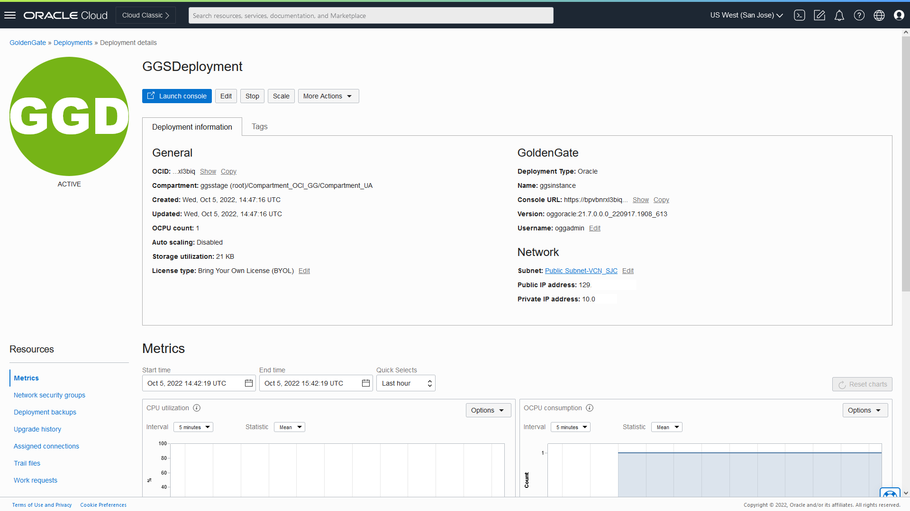

## Task 5: Assign connections to the deployment

1.  On the deployment details page, under **Resources**, click **Assigned connections**.

    

2.  Under Assigned connections, click **Assign connection**.

    

3.  In the Assign connection dialog, from the **Connection** dropdown, select **SourceATP**, and then click **Assign connection**.

    

4.  Use the breadcrumb to return to the Deployments page.

    

5.  Repeat these steps and assign the TargetADW connection to the deployment.


## Task 6: Launch the GoldenGate Deployment Console

1. Aftr the two connections are assigned, click **Launch Console**.

    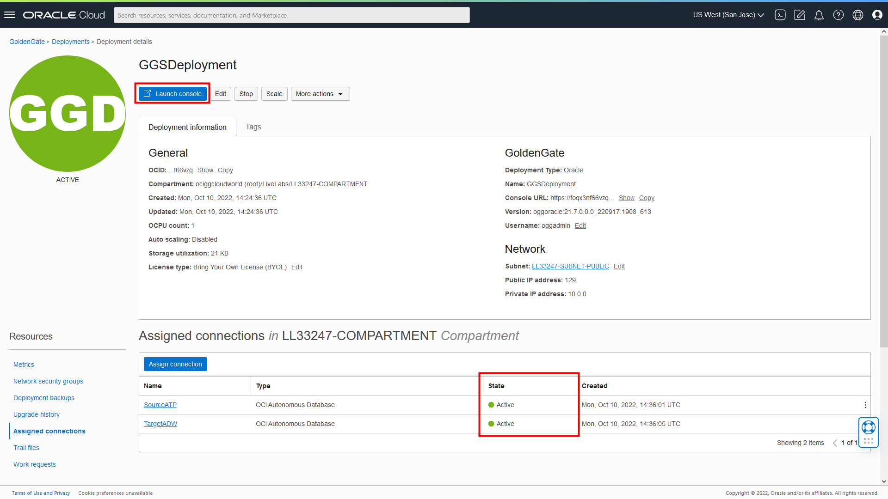

2. To log in to the GoldenGate deployment console, enter **oggadmin** for User Name and the password you provided in when you created the deployment, and then click **Sign In**.

    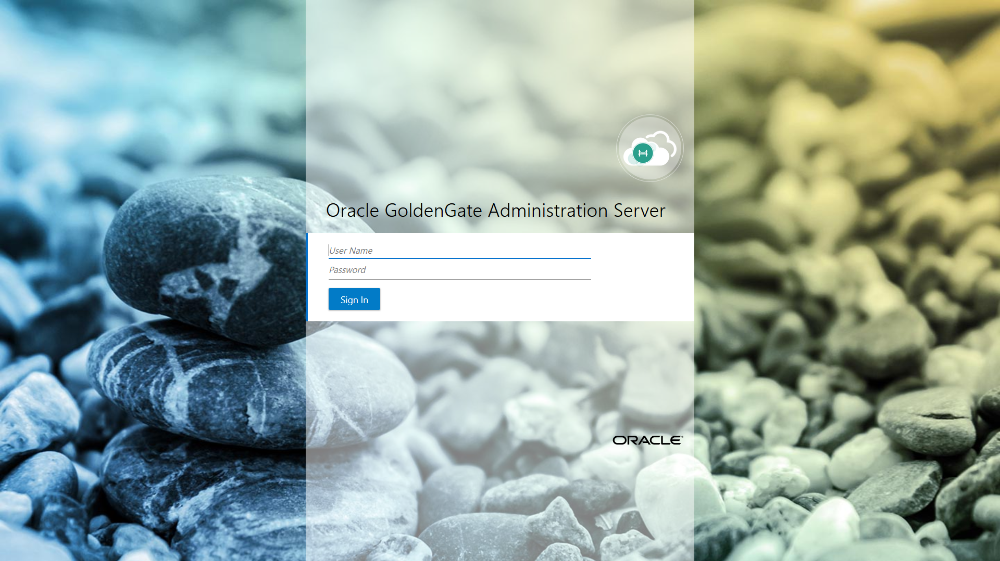

After you log in successfully, you're brought to the GoldenGate deployment console home page. Here, you can access the GoldenGate Administration, Performance Metrics, Distribution, and Receiver services, as well as add Extracts and Replicats for your data replication tasks.

In this lab, you created the OCI GoldenGate deployment and registered the source and target databases. **Proceed to the next lab**.

## Learn more

* [Managing Deployments](https://docs.oracle.com/en/cloud/paas/goldengate-service/using/deployments.html)

## Acknowledgements
* **Author** - Jenny Chan, Consulting User Assistance Developer, Database User Assistance
* **Contributors** -  Julien Testut, Database Product Management
* **Last Updated By/Date** - Jenny Chan, October 2022
