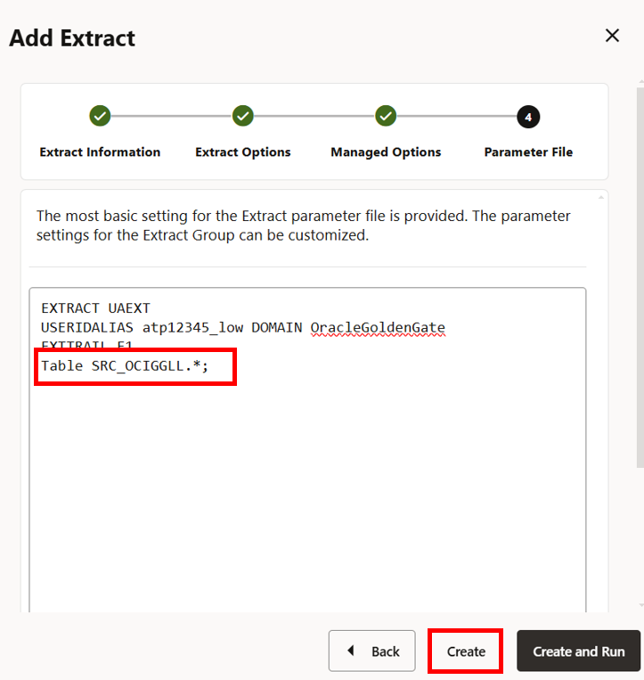
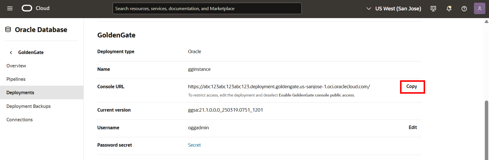
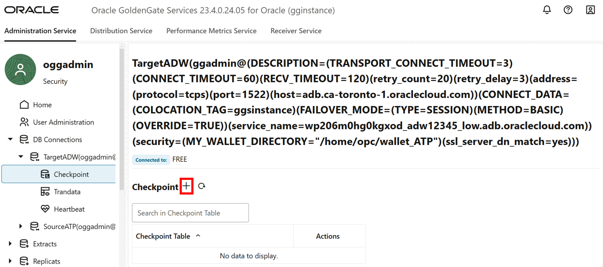
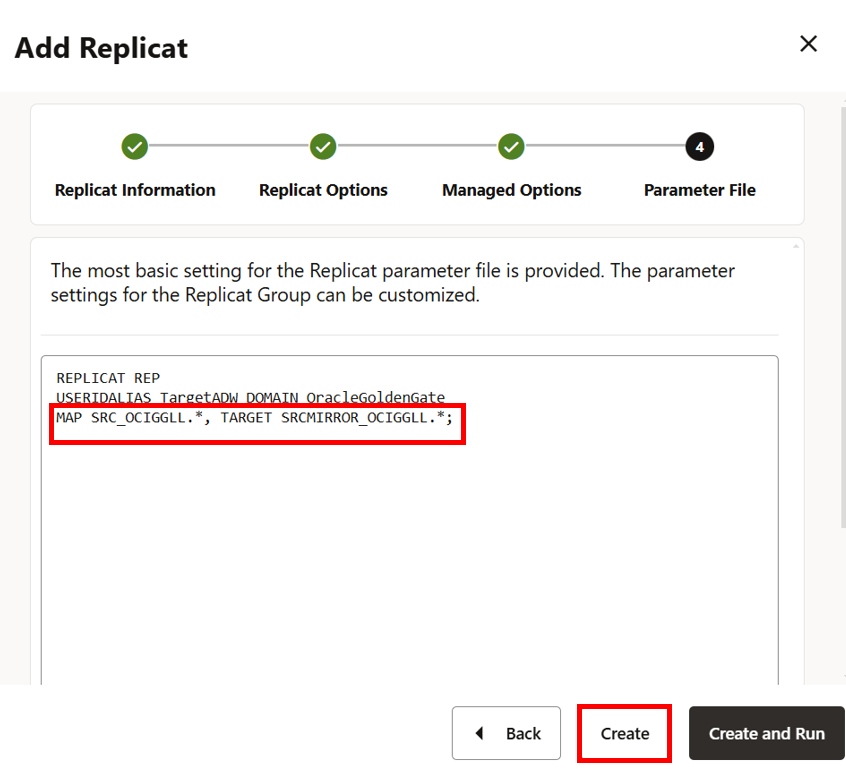

# Send the Oracle GoldenGate Trail file to OCI GoldenGate

## Introduction

In this lab, you learn to capture and send data to Oracle Cloud Infrastructure (OCI) GoldenGate using an on-premises or Marketplace Oracle GoldenGate instance. You'll create an Extract to capture data from the source database, a Distribution Path to initiate sending the data to the target, and a Replicat to consume the data received.

Estimated time: 15 minutes

Watch the video below for a walk through of the lab.
[](youtube:KZ3kJIbGinY)

### About Extracts, Paths, and Replicats
An Extract is a process that extracts, or captures, data from a source database. A Distribution Path is a source-to-destination configuration that uses the Distribution Service to send data in a distributed environment. A Replicat is a process that delivers data to the target.

### Objectives

In this lab, you will:
* Add and run an Extract process to capture data to send to OCI GoldenGate
* Add and run a Distribution Service Path to send the trail file to OCI GoldenGate
* Add and run a Replicat process to consume the trail file sent from Oracle GoldenGate

### Prerequisites

This lab assumes that you completed all preceding labs. For the purposes of this lab, the source database used in this lab is Oracle Autonomous Transaction Processing (ATP) and the target database is Oracle Autonomous Data Warehouse (ADW).

## Task 1: Add and run an Extract in Oracle GoldenGate

This Extract process captures data from the source database to send to OCI GoldenGate.

1.  In the Oracle GoldenGate Marketplace Administration Service console, click **Add Extract** (plus icon).

    

2.  The Add Extract panel consists of four pages. On the Extract Information page, complete the following fields, and then click **Next**:

    * For **Extract Type**, select **Integrated Extract**.
    * For **Process Name**, enter a name for this Extract process, such as **UAEXT**.

    

3. On the Extract Options page, complete the following fields, and then click **Next**:

    * For **Domain**, select **OracleGoldenGate** from the dropdown.
    * For **Alias**, select the Credential Alias for the source Autonomous Transaction Processing database.
    * For **Trail Name**, enter a two-character name for the Trail file, such as **E1**.

    

4. On the Managed Options page, leave the fields as they are, and click **Next**.

    

5. In the Parameter File page, add a new line, paste the following to the text area, and then click **Create**:
    ```
    <copy>Table SRC_OCIGGLL.*;</copy>
    ```

    

6.  In the UAEXT **Action** menu, select **Start**. In the Confirm Action dialog, click **OK**.

    

    The grey **Stopped** icon changes to a green **Running** checkmark when the  Extract starts successfully.

    

## Task 2: Add and run a Distribution Path

The Distribution Path initiates the process to send the Oracle GoldenGate trail file to OCI GoldenGate.

1.  In the on-premises or Marketplace Oracle GoldenGate Administration Server console, click **Distribution Server**, and then click **Add Distribution Path** (plus icon).

    

2.  The Add Path panel consists of seven pages. On the Path Information page, for **Path Name**, enter **OGGtoGGS**, and then click **Next**.

    

3.  On the Source Options page, complete the following fields, and then click **Next**:

    * For **Source Extract**, select **UAEXT** from the dropdown.
    * For **Trail Name**, **E1** should automatically populate the field.
    * For **Generated Target URI**, click Edit Target URI (pencil icon), enter the Internal FQDN instead of the Public IP.

    

    >**NOTE:** You can copy the Internal FQDN from the Instance details page.

    

4. On the Target Options page, complete the following fields, and then click **Next**:

    * For **Target Host**, enter the OCI GoldenGate hostname in the following format: **&lt;domain&gt;.deployment.goldengate.us-&lt;region&gt;-1.oci.oraclecloud.com**.

    >**Note:** You can copy the host from the browser address bar of your OCI GoldenGate Deployment Console window, or copy the Console URL from the Deployment Details page and remove the https:// and any trailing slashes (/).

    

    * For **Port Number**, enter **443**.
    * For **Trail Name**, enter a two-character name for the Trail file when it is received by OCI GoldenGate. For example, **T1**.
    * For **Alias**, enter the alias name you created in Oracle GoldenGate. For example, **ogg2ggs**.

    

5. On the Advanced Options page, leave the fields as they are, and click **Next**.

    

6. On the Filtering Options page, leave the fields as they are, and click **Next**.

    

7. On the Managed Options page, leave the fields as they are, and click **Create**.

    

8. On the left hand navigation menu, click **Distribution Paths**.

9. In the OGGtoGGS Action menu, select **Start**. In the Confirm Action dialog, click **OK**.

    

    The **Stopped** grey status icon becomes a **Running** green checkmark when the Distribution Path starts successfully.

    

In this lab, you created and ran a Path on your on-premises Oracle GoldenGate Distribution Server and sent a trail file from Oracle GoldenGate to OCI GoldenGate.

## Task 3: Add a Checkpoint table

1.  In the OCI GoldenGate Deployment Console, click **Administration Service**, and then open the navigation menu to select **Configuration**.

    

2.  For TargetADW, click **Connect to Database**. If successful, you are directed to the Checkpoint page.

    

3.  In the Checkpoint page, click **Add Checkpoint** (plus icon).

    

4.  For **Checkpoint Table**, enter **"SRCMIRROR\_OCIGGLL"."CHECKTABLE"**, and then click **Submit**.

    

To return to the GoldenGate Deployment Console Home page, click **Overview** in the left navigation.

## Task 4: Add and run a Replicat

This Replicat process consumes the trail file sent from Oracle GoldenGate.

1.  On the Administration Service Overivew page, click **Add Replicat** (plus icon).

    

2. The Add Replicat panel consists of four pages. On the Replication Information page, complete the following fields, and then click **Next**:

    * For Replicat Type, select **Nonintegrated Replicat**.
    * For Process Name, enter **REP**.

    

3. On the Replicat Options page, complete the following fields, and then click **Next**:

    * For Name, enter **T1**.
    * For Domain, select **OracleGoldenGate** from the dropdown.
    * For Alias, select **TargetADW** from the dropdown.
    * For Checkpoint Table, select **"SRCMIRROR\_OCIGGLL"."CHECKTABLE"** from the dropdown.

    

4. On the Managed Options page, for Profile Name, select **Default** from the dropdown, and then click **Next**.

    

5. On the Parameter File page, in the text area, replace **MAP \*.\*, TARGET \*.\*;** with **MAP SRC\_OCIGGLL.\*, TARGET SRCMIRROR\_OCIGGLL.\*;**

6. Click **Create**.

    

7. On the left hand navigation menu, click **Replicats**.

8. The REP Replicat appears. In the REP Action menu, select **Start**. In the Confirm Action dialog, click **OK**.

    

    The **Stopped** grey status icon becomes a **Running** green checkmark when the Replicat starts successfully.

    

In this lab, you created an Extract, a Distribution Path, and a Replicat, and you verified that data is moving from Oracle GoldenGate to OCI GoldenGate. **Proceed to the next lab**.

## Learn more

* [Quickstart - Send data from Oracle GoldenGate to OCI GoldenGate](https://docs.oracle.com/en/cloud/paas/goldengate-service/hotto/index.html)
* [Add an Extract](https://docs.oracle.com/en/cloud/paas/goldengate-service/eeske/index.html)
* [Add a Distribution Path](https://docs.oracle.com/en/cloud/paas/goldengate-service/adpen/index.html)

## Acknowledgements
* **Author** - Jenny Chan, Consulting User Assistance Developer, Database User Assistance
* **Contributors** -  Werner He and Julien Testut, Database Product Management
* **Last Updated By/Date** - Katherine Wardhana, January 2025
