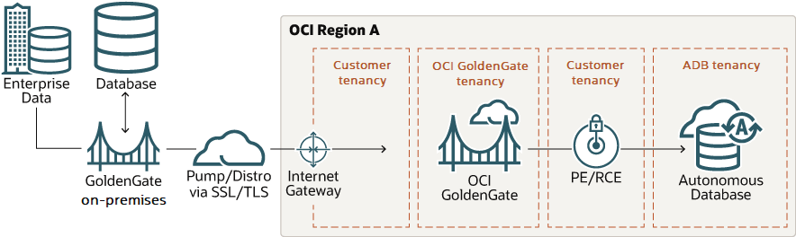

# Introduction

## About this Workshop

Oracle GoldenGate, the industry-leading data replication and integration software, is now available as a fully managed cloud service on Oracle Cloud Infrastructure (OCI). Existing Oracle GoldenGate customers with an on-premises installation or Marketplace image can use this workshop to help you data from Oracle GoldenGate to OCI GoldenGate.

> ***Note:** This workshop uses Oracle Autonomous Databases as the source and target. If you plan to use Oracle Database, ensure that you use the CDB user to capture data from the PDBs.*

Estimated Time: 120 minutes

If you would like to watch us do the workshop, click [here](https://youtu.be/6KsirCdeUXw).

### About Oracle Cloud Infrastructure GoldenGate

Oracle Cloud Infrastructure GoldenGate is a fully managed cloud service that uses Oracle GoldenGate Microservices to replicate data in real time, at scale, in the cloud. It processes data as it moves from one or more data management systems to target databases in Oracle Cloud Infrastructure.

### Objectives

In this workshop, you will:
* Create OCI GoldenGate resources
* Create a trusted connection between Oracle GoldenGate and OCI GoldenGate
* Create and run a distribution path on Oracle GoldenGate

### Prerequisites

To complete this LiveLab, you must have:

* An on-premises or [Marketplace Oracle GoldenGate installation](https://docs.oracle.com/en/middleware/goldengate/core/21.1/oggmp/oracle-goldengate-microservices-oracle-cloud-marketplace.html)
* An Oracle Cloud Infrastructure account with [access to Networking and OCI GoldenGate services](https://docs.oracle.com/en/cloud/paas/goldengate-service/using/getting-started-goldengate.html#GUID-F85CADD5-48A0-4B38-B8CB-C45C6D4F4361)
* Supported source and target databases provisioned and configured for [Oracle GoldenGate](https://www.oracle.com/technetwork/middleware/ogg-21-1-0-0-0-cert-matrix-7503910.xls) (source) and [OCI GoldenGate](https://docs.oracle.com/en/cloud/paas/goldengate-service/using/database-registrations.html#GUID-384772C7-B327-420C-B6AA-B6CEA727322F) (target)

> ***Note:** If you have a **Free Trial** account, your Free Trial automatically converts to an **Always Free** account when your Free Trial expires. You will not be able to conduct Free Tier workshops unless the Always Free environment is available. See [Free Tier FAQs](https://www.oracle.com/cloud/free/faq.html).*

## Learn more

* [Overview of Oracle Cloud Infrastructure GoldenGate](https://docs.oracle.com/cloud/paas/goldengate-service/using/overview-goldengate.html)
* [Oracle Cloud Infrastructure GoldenGate Service Overview video](https://apexapps.oracle.com/pls/apex/f?p=44785:112:0::::P112_CONTENT_ID:29278)
* [Take an interactive tour of OCI GoldenGate](https://apexapps.oracle.com/pls/apex/f?p=44785:112:0::::P112_CONTENT_ID:29986)

## Acknowledgements
* **Author** - Jenny Chan, Consulting User Assistance Developer, Database User Assistance
* **Contributors** -  Werner He and Julien Testut, Database Product Management
* **Last Updated By/Date** - Jenny Chan, September 2022
