# Connect Oracle GoldenGate to Autonomous Transaction Processing

## Introduction

For the purposes of this workshop, Oracle Autonomous Transaction Processing (ATP) serves as the source database for your Oracle GoldenGate Marketplace deployment. This lab walks you through the steps to connect your Oracle GoldenGate Marketplace deployment to ATP.

Estimated time: 10 minutes

Watch the video below for a walk through of the lab.
[](youtube:Vw2rWRLSRjk)

### Objectives

In this lab, you will:
* Download the ATP credentials
* Use Cloud Shell to upload the ATP credentials to the Oracle GoldenGate Marketplace compute instance
* Add the ATP credentials in the Oracle GoldenGate Administration Server

### Prerequisites

* This lab assumes that you completed all preceding labs.
* To connect to the Marketplace Oracle GoldenGate compute image, you must have an [SSH key pair](https://docs.oracle.com/en/learn/generate_ssh_keys/index.html#introduction).
* Have a text editor on hand to copy values that you'll need later.
* For workshop environment users, your &lt;user-number&gt; is part of your User name, as found in your Workshop Details. For example, for LL1234-USER, the user-number is 1234.

## Task 1: Download the Source ATP client credentials

1.  Navigate back to the Source ATP Autonomous Database Details page, and then click **DB Connection**.

    

2.  In the DB Connection panel, click **Download Wallet**.

    

3.  In the Download Client Credentials (Wallet) dialog, enter the Source ATP Admin password twice, and then click **Download**.

    

## Task 2: Upload the Source ATP credentials to Oracle GoldenGate

1.  In the Oracle Cloud Console, open the navigation menu (hamburger icon), click **Compute**, and then click **Instances**.

    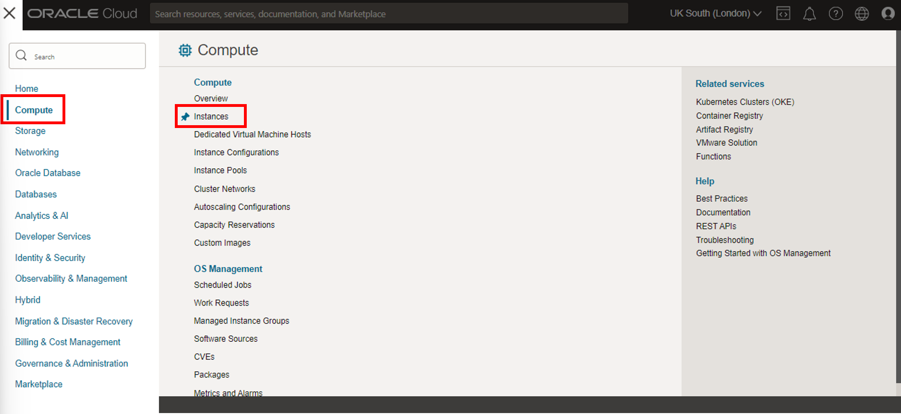

2.  Under **List Scope**, ensure that you select the correct **Compartment** for this workshop. You should then see **Oracle GoldenGate 21.1.0.0.1 Microservices Edition for Oracle** in the list of Instances.

    > **Note:** *For Green Button workshop users, you can find your compartment information in the Workshop Details of this LiveLab.*

3.  In the Oracle Cloud Console global header, click **Cloud Shell**. The Cloud Shell drawer opens at the bottom of your screen.

    

4.  From the Cloud Shell drawer menu (hamburger icon), select **Upload**.

    

5.  In the File Upload to your Home Directory dialog, drag and drop or select the SourceATP wallet file you downloaded in Task 1, and then click **Upload**.

    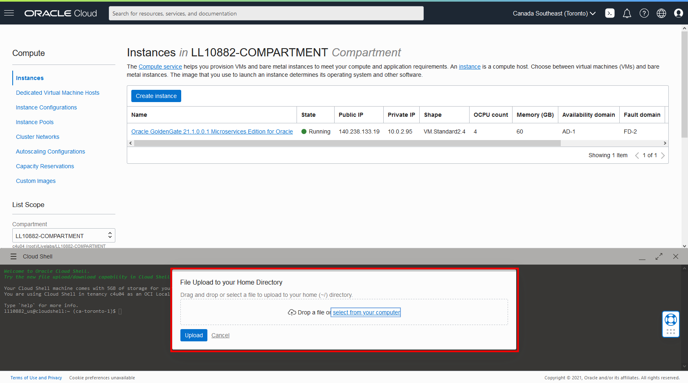

6.  Repeat step 5 to upload your SSH private key. Click **Hide** to close the File Transfers dialog.

7.  To ensure the SSH key permissions are valid, enter the following command in Cloud Shell:

    ```
    <copy>chmod 600 <private-SSH-key></copy>
    ```

    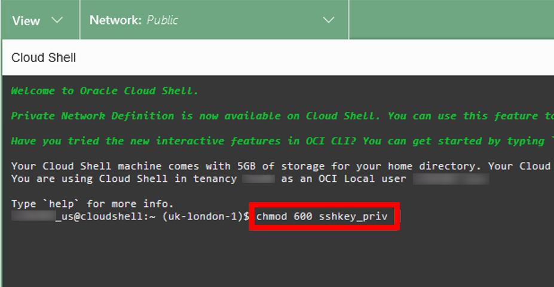

8.  Copy the Public IP from the list of Compute Instances.

    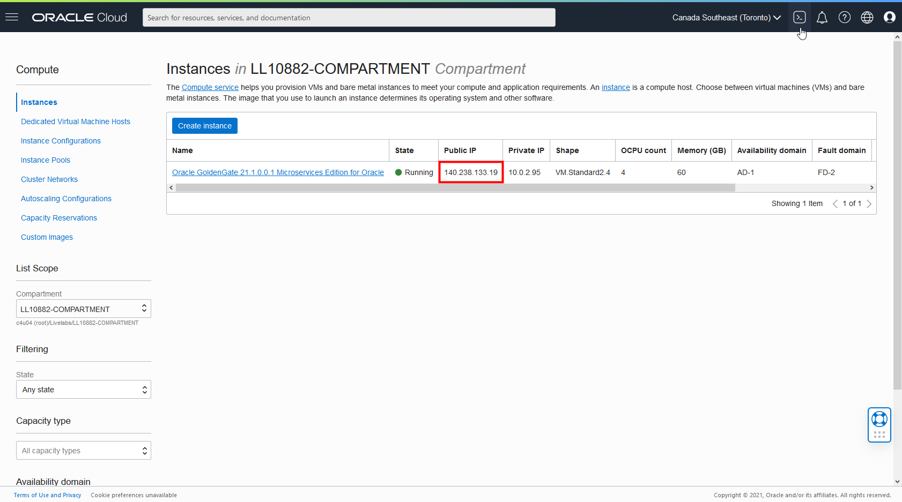

9.  In Cloud Shell, enter the following connect to the Marketplace Oracle GoldenGate compute instance:

    ```
    <copy>sftp -i <private-SSH-key> opc@<ip-address></copy>
    ```

    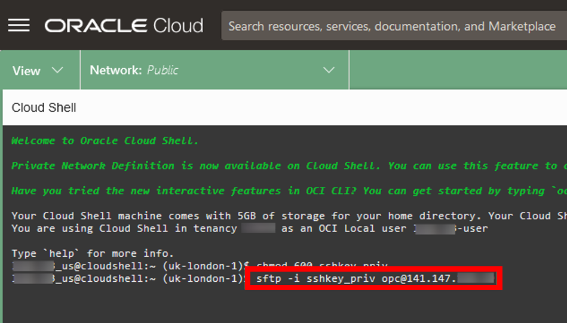

10. Enter the following `put` command to upload the SourceATP wallet file to /home/opc.

    ```
    <copy>put <Wallet_ATP-filename>.zip</copy>
    ```

    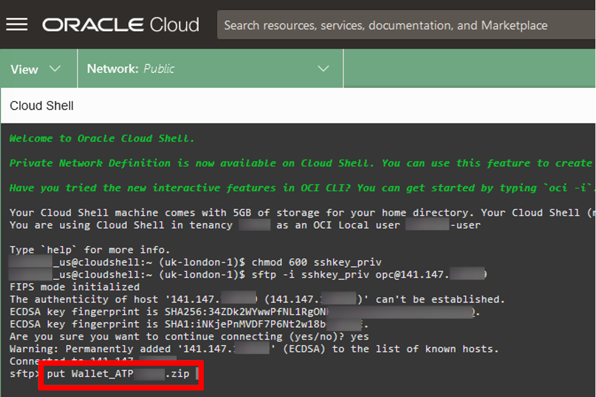

11. Enter `exit` to close the sftp connection.

12. SSH to the compute instance.

    ```
    <copy>ssh -i <private-SSH-key> opc@<ip-address></copy>
    ```

13. Enter 'ls' to list the contents in the current directory. You should see two files, ogg-credentials.json and your wallet file.

14. Make a new directory called **wallet\_ATP** and then extract the contents to that directory.

    ```
<copy>mkdir wallet_ATP
unzip <wallet_ATP-filname>.zip -d wallet_ATP</copy>
    ```

    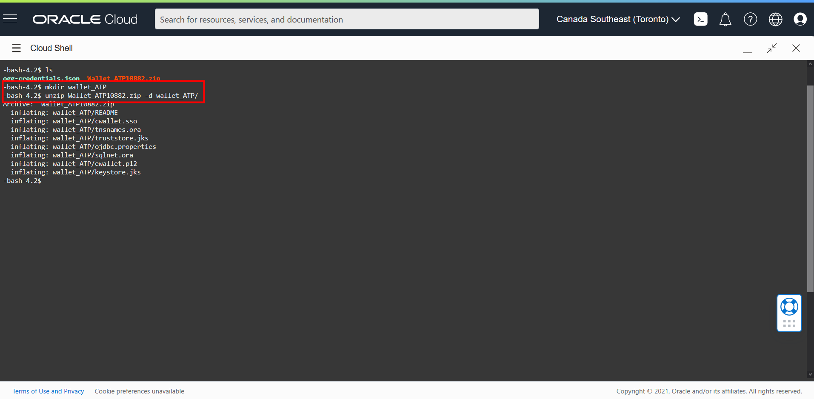

14. Change directories to wallet\_ATP.

    ```
    <copy>cd wallet_ATP</copy>
    ```

15. Enter `pwd` and then copy the full path to the wallet files to be used in a later Task.

    

> **Note:** *Leave Cloud Shell open.*

## Task 3: Get the Marketplace Oracle GoldenGate oggadmin credentials

1.  Open Cloud Shell if you previously closed the connection and SSH to the compute instance.

    ```
    <copy>ssh -i <private-SSH-key> opc@<ip-address></copy>
    ```

2.  Enter `ls` to list the contents of the current directory.

3.  Open ogg-credentials.json and copy the output.

    ```
    <copy>cat ogg-credentials.json</copy>
    ```

    

4.  Exit Cloud Shell.

## Task 4: Add the Source ATP credential in the Oracle GoldenGate Administration Server

First, copy the SourceATP connection string from the OCI GoldenGate Deployment Console (ggsinstance). If it's not already open, launch the OCI GoldenGate Deployment Console from the GGSDeployment Details page in the Oracle Cloud Console. Log in using the user name and password you entered in Lab: Create OCI GoldenGate Resources, Task 1, steps 12 and 13.

1.  In the OCI GoldenGate Deployment Console (ggsinstance), open the navigation menu (hamburger icon) and then click **Configuration**.

    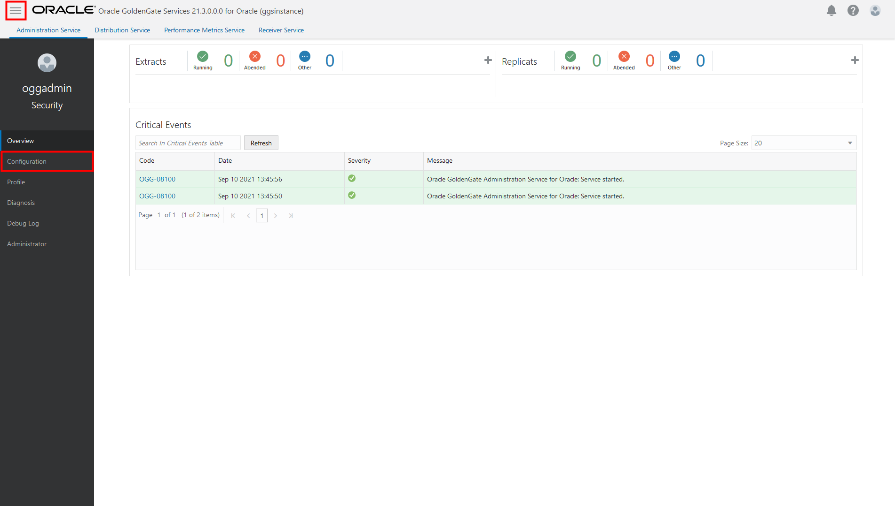

2.  Copy the SourceATP connection string in the User ID column, and then paste it into a text editor.

    

3.  Edit the SourceATP connection string, replacing the value for **MY\_WALLET\_DIRECTORY** with the location where you unzipped the wallet_ATP.zip. For example, **/home/opc/wallet\_ATP**.

    

4.  In a new browser tab or window, use the Public IP and port 443 (**https://&lt;Public-IP&gt;:443**) to open the Marketplace Oracle GoldenGate Service Manager.

5.  Log in to the Service Manager using the credentials you copied in Task 3.

    > **Note:** *The Username is `oggadmin` and the password is the credential string.*

    

6.  In the Service Manager, under **Services**, click the port number associated with the Administration Server. The Administration Server opens in a new browser tab. If you're prompted to log in again, use the same oggadmin credentials.

    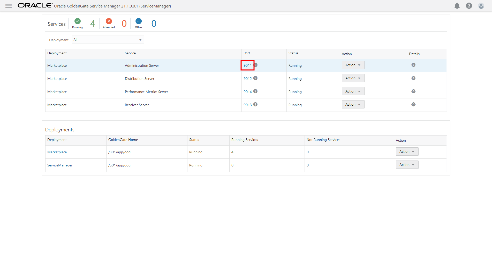

7.  In the Administration Server, open the navigation menu (hamburger icon), and then select **Configuration**.

    

8.  Click **Add Credential**.

    

9.  Enter the following information, and then click **Submit**:

    * For **Credential Domain**, enter **OracleGoldenGate**.
    * For **Credential Alias**, enter the ATP database name (low) from /home/opc/wallet\_ATP/tnsnames.ora. For example, **atp&lt;user-number&gt;_low**.
    * For **User ID**, paste the modified ATP connection string from step 3.
    * For **Password**, enter the SourceATP GGADMIN password. *Workshop environment users can copy this value from the Workshop Details.*

    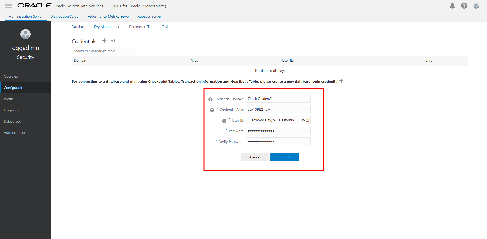

    > **Note:** *You can use Cloud Shell to view the contents of tnsnames.ora.*

    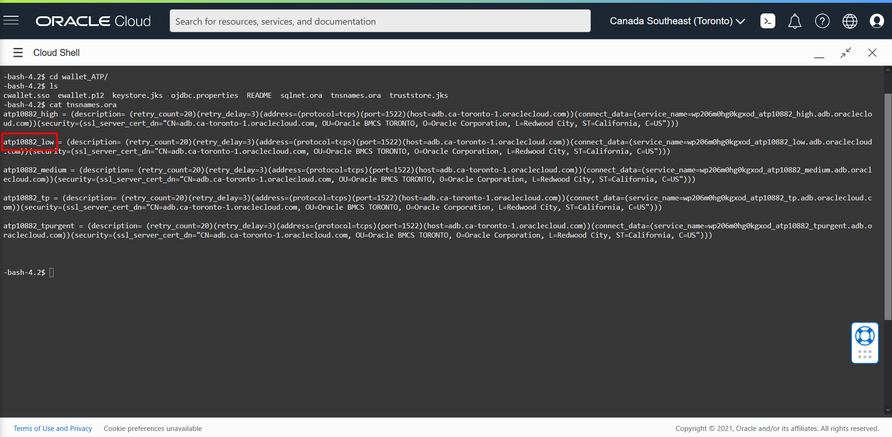

10. Click **Connect to Database**.

    

11. Next to TRANDATA Information, click Add **TRANDATA**.

    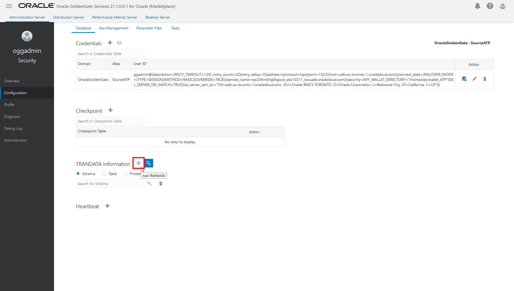

12. For **Schema Name**, enter **SRC\_OCIGGLL**, and then click **Submit**. *You only need to click Submit once. Click Search, and then enter SRC_OCIGGLL to verify.*

    

In this lab, you created a connection from the Oracle GoldenGate Marketplace instance to the source ATP database. You may now **proceed to the next lab**.

## Acknowledgements

* **Author** - Jenny Chan, Consulting User Assistance Developer, Database User Assistance
* **Contributors** -  Denis Gray, Database Product Management
* **Last Updated By/Date** - Jenny Chan, September 2021
