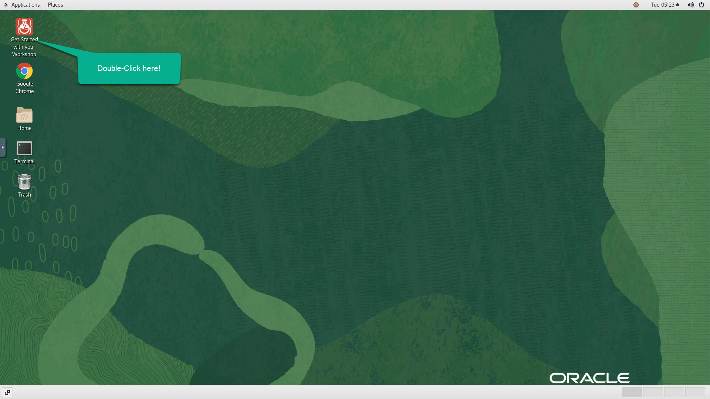
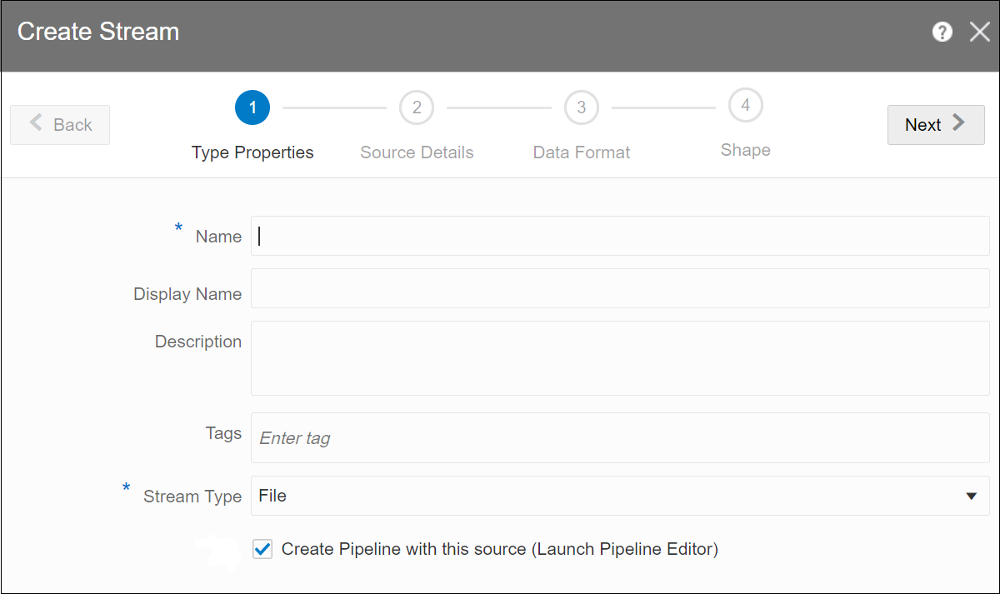
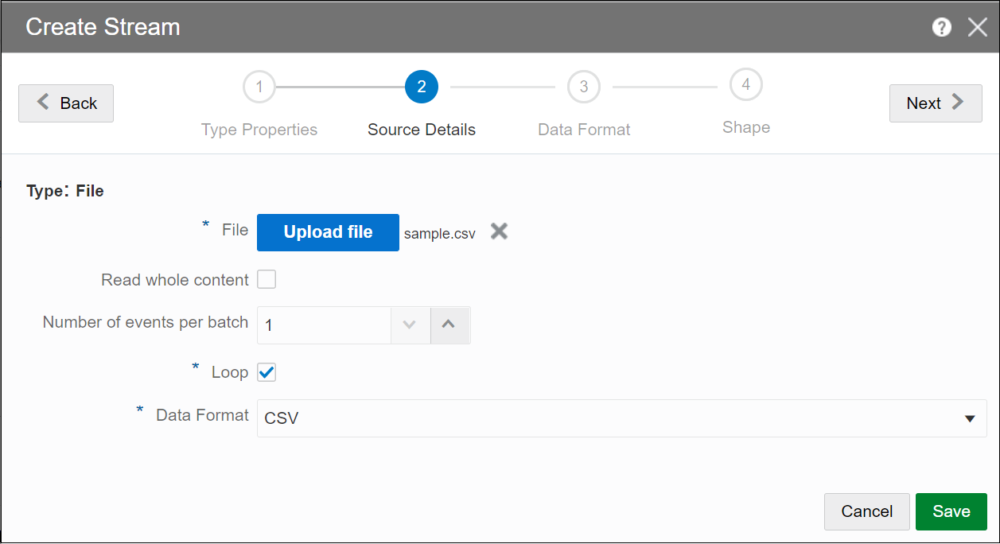
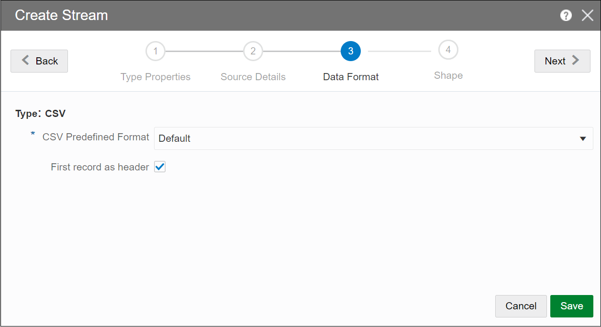
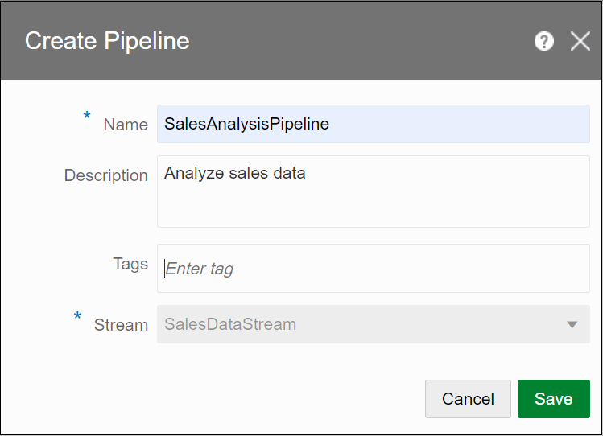
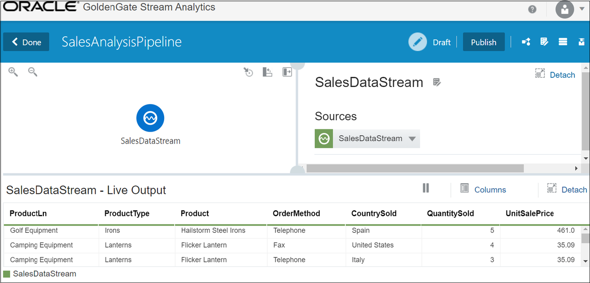

# Create Your HelloWorld Pipeline

## Introduction

A pipeline includes a sequence of data processing stages such as, Query, Pattern, Rule, Query Group, Custom, and Scoring. You can apply business logic to an input data stream, within a pipeline.

*Estimated Time*: 15 minutes

### About this Lab

This lab provides steps to create a basic pipeline, add a query stage and a filter to it, and publish the pipeline; all this in less than 15 minutes!

### Objectives
In this Lab you will:
- Create a CSV file which contains sample data to be processed
- Create a File stream
- Create a Pipeline
- Add a Query Stage to the source stream
- Add a Filter to the Query stage
- Publish the Pipeline

### Prerequisites
This Lab assumes you have:
- A Free Tier, Paid, or LiveLabs Oracle Cloud account
- SSH Private Key to access the host via SSH

## **Task 1:** Create a CSV file

Create a CSV file on your local drive with the data below:

    ```
    <copy>
    ProductLn,ProductType,Product,OrderMethod,CountrySold,QuantitySold,UnitSalePrice
    Personal Accessories,Watches,Legend,Special,Brazil,1,240
    Outdoor Protection,First Aid,Aloe Relief,E-mail,United States,3,5.23
    Camping Equipment,Lanterns,Flicker Lantern,Telephone,Italy,3,35.09
    Camping Equipment,Lanterns,Flicker Lantern,Fax,United States,4,35.09
    Golf Equipment,Irons,Hailstorm Steel Irons,Telephone,Spain,5,461
    </copy>

    ```

## **Task 2:** Log in to GoldenGate Stream Analytics

You should be already logged in after completing the lab *Initialize Environment*. If that's not the case, perform the following:

1. Double click on the *Get Started with Your Workshop* icon on the upper left corner in your remote desktop to launch a fresh browser session.

    

2. On the web browser window on the right preloaded with *GoldenGate Stream Analytics* login page, provide the credentials below to login:

    - Username

    ```
    <copy>osaadmin</copy>
    ```

    - Password

    ```
    <copy>xY3q3svdHt8=</copy>
    ```

## **Task 3:** Create a File Stream

To create a File stream:

1. On the **Catalog** page, click **Create New Item**, and select **Stream**.

2. Select **File** from the list, to display the **Create Stream** screen.

    

3. Select **Create Pipeline with this source (Launch Pipeline Editor)**.

    

4. Click **Next**, to update the source details.

## **Task 4:** Upload the CSV file

To upload the CSV file:

1. On the **Source Details** screen, click **Upload File** to browse and upload the CSV file that you had created in **Task 1**.

    

2. Click **Next**, to display the **Data Format** screen.

## **Task 5:** Set Record Header

To set the first record as header:

1. On the **Data Format** screen, select **First record as header**.

    

2. Click **Next**, to infer shape for the event.

## **Task 6:** Infer Event Shape

To infer shape from stream:

1. On the **Shape** screen, ensure **Infer Shape** and **From Stream** options are selected, and verify if the shape of the event is successfully inferred as shown in following screenshot.

    

2. Click **Save**, to open the **Create Pipeline** screen.

## **Task 7:** Create a Pipeline

To create a pipeline:

1. On the **Create Pipeline** screen, enter a name for the pipeline, and click **Save** to launch the Pipeline Editor.

    


## **Task 8:** View the Pipeline in the Pipeline Editor

1. In the pipeline editor, you will see the message *Starting Pipeline* followed by *Listening to Events*. This is the first access of the cluster, therefore it will take a while to copy the libraries.

2. You should eventually see the following screen, with a single node representing the source stream in the left pane, and the **Sources** used in the pipeline, in the right pane.

    

## **Task 9:** Add a Query Stage

To add a **Query** stage to the source stream:

1. Right-click on the source stream, select **Add a Stage** and then select **Query**.

2. Enter a **Name** and **Description** for the Query Stage.

3. Click **Save**. A Query stage is added to the source stream.

## **Task 10:** Add a Filter to the Query Stage

To add a **Filter** to a **Query** stage:

1. Click **Filters** in the left pane.

2. Click **Add a Filter**. In this example, the filter is **QuantitySold is greater than 4**, as shown in the following screenshot.

    

## **Task 11:** Publish the Pipeline

To publish the pipeline:

1. Click **Publish** on the top-right corner.

    

2. Publish with defaults, for your pipeline to filter data in real-time.

**Note:**
* The pipeline continues to run even after you log out, because the pipeline is now in published state.
* By default, the Pipeline is in *Draft* state, and quitting the pipeline editor without publishing removes the pipeline and releases all cluster resources.

## Learn More

* [Transform and Analyze Data Streams](https://docs.oracle.com/en/middleware/fusion-middleware/osa/19.1/using/creating-pipeline-transform-and-analyze-data-streams.html#GUID-9DB9B57A-1095-4557-ACB9-816A696EB121)

* [Installing GoldenGate Stream Analytics](https://docs.oracle.com/en/middleware/fusion-middleware/osa/19.1/install/how-install-goldengate-stream-analytics.html#GUID-13BC895D-6AD1-4398-98E2-B5BE5B14D26B).

* [GoldenGate Stream Analytics on Oracle Cloud Marketplace](https://docs.oracle.com/en/middleware/fusion-middleware/osa/19.1/osamp/getting-started-goldengate-stream-analytics-oci.html#GUID-B488861E-1C43-4177-A1F8-40F8E44754AD).

* [Mandatory RTE Configurations](https://docs.oracle.com/en/middleware/fusion-middleware/osa/19.1/using/configuring-runtime-environment.html#GUID-EB33DDFD-7444-434D-8944-059564A453FD).

## Acknowledgements
* **Author** - Pratibha Manjunath, Senior User Assistance Developer, GoldenGate Stream Analytics
* **Contributors** - Prabhu Thukaram, Rene Fontcha
* **Last Updated By/Date** - Rene Fontcha, LiveLabs Platform Lead, NA Technology, January 2022
