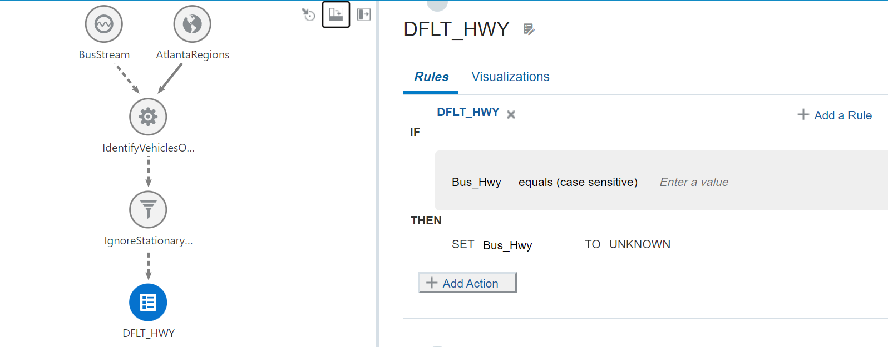

# Add Business Rules to Your Stream Analytics Pipeline

## Introduction

This lab walks you through steps to add business rules to a Stream Analytics pipeline, to monitor the public transportation in the Atlanta area.

This is the third lab in the Monitoring Public Transportation Using Stream Analytics workshop. Follow the labs sequentially.

*Estimated Time*: 

### About this Lab

This lab provides steps to create a basic pipeline, add a query stage and a filter to it, and publish the pipeline; all this in less than 15 minutes!

### Objectives
In this Lab you will:
- Create a Rule Stage
- Add a Rule for Highways to Have a Name Value
- Add a Rule to Identify Bus Drivers Driving Recklessly
- Add a Rule to Identify Drivers Driving with Major Violations
- Add a Rule to Identify Drivers Driving with Minor Violations

### Prerequisites
This Lab assumes you have:
- A Free Tier, Paid, or LiveLabs Oracle Cloud account
- SSH Private Key to access the host via SSH

## **Task 1:** Create a Rule Stage

1. In the Pipeline Editor, right-click the Query Stage, click **Add a Stage**, and then select **Rule**.
  - On the **Create Rule Stage** screen:
  - In the name field, enter **SpeedViolation**.
  - In the **Description** field, enter **Determine violation speeds for the vehicles**.
  - In the **Tags** field, enter **transportation, tutorial**.
  - Click **Save**.
The SpeedViolation Business Rules page is displayed. The values you provide on this page are used for visual analytics.

## **Task 2:** Add a Rule for Highways to Have a Name Value
 1. On the **Rules** tab of the **SpeedViolation** page, enter the following details:
 - In the Rule Name field, enter **DLT-HWY**
 - In the **Description** field, enter **Ensure all highways have a name value**.
 - Click **Done**.
 - For the IF clause, select **BUS_Hwy** from the **Select a field** drop-down list, and **equals (case sensitive)** from the **Select an operator** drop-down list, leave the **Enter a value** blank.
 - For the THEN clause, select **BUS_Hwy** from the **SET** drop-down list, enter **UNKNOWN** in the **TO** field.

 

 
## **Task 3:** Add a Rule to Identify Bus Drivers Driving Recklessly
- On the **Rules** tab of the **SpeedViolation** page, enter the following details:
 - In the Rule Name field, enter **RECKLESS**
 - In the **Description** field, enter **Bus drivers who are driving recklessly**.
 - Click **Done**.
 - For the IF clause, select **Bus_Speed** from the **Select a field** drop-down list, and **greater than** from the **Select an operator** drop-down list, and **60** in the **Enter a value** text field.
 - For the THEN clause, select **status** from the **SET** drop-down list, enter **RECKLESS** in the **TO** field.
 
## **Task 4:** Add a Rule to Identify Drivers Driving with Major Violations
1. On the **Rules** tab of the **SpeedViolation** page, enter the following details:
 - In the **Rule Name** field, enter **MAJOR**
 - In the **Description** field, enter **Bus drivers with major speed violations**.
 - Click **Done**.
 - For the IF clause, select **Bus_Speed** from the **Select a field** drop-down list, and **greater than** from the **Select an operator** drop-down list, and **45** in the **Enter a value** text field.
 - Click the **Add a Condition** link and select **Bus_Speed** from the **Select a field** drop-down list, and **lower than or Equals** from the **Select an operator** drop-down list, enter **60** in the **Enter a value** field.
 - For the THEN clause, select **status** from the **SET** drop-down list, enter **MAJOR** in the **TO** field.

## **Task 5:** Add a Rule to Identify Drivers Driving with Minor Violations
1. On the **Rules** tab of the **SpeedViolation** page, enter the following details:
 - In the Rule Name field, enter **MINOR**
 - In the **Description** field, enter **Bus drivers with minor speed violations**.
 - Click **Done**.
 - For the IF clause, select **Bus_Speed** from the **Select a field** drop-down list, and **greater than** from the **Select an operator** drop-down list, and **35** in the **Enter a value** text field.
 - Click the **Add a Condition** link and select **Bus_speed** from the **Select a field** drop-down list, and **lower than or Equals** from the **Select an operator** drop-down list, enter **45** in the **Enter a value** field.
 - For the THEN clause, select **status** from the **SET** drop-down list, enter **MINOR** in the **TO** field.

## Learn More

* [Transform and Analyze Data Streams](https://docs.oracle.com/en/middleware/fusion-middleware/osa/19.1/using/creating-pipeline-transform-and-analyze-data-streams.html#GUID-9DB9B57A-1095-4557-ACB9-816A696EB121)

* [Installing GoldenGate Stream Analytics](https://docs.oracle.com/en/middleware/fusion-middleware/osa/19.1/install/how-install-goldengate-stream-analytics.html#GUID-13BC895D-6AD1-4398-98E2-B5BE5B14D26B).

* [GoldenGate Stream Analytics on Oracle Cloud Marketplace](https://docs.oracle.com/en/middleware/fusion-middleware/osa/19.1/osamp/getting-started-goldengate-stream-analytics-oci.html#GUID-B488861E-1C43-4177-A1F8-40F8E44754AD).

* [Mandatory RTE Configurations](https://docs.oracle.com/en/middleware/fusion-middleware/osa/19.1/using/configuring-runtime-environment.html#GUID-EB33DDFD-7444-434D-8944-059564A453FD).

## Acknowledgements
* **Author** - Pratibha Manjunath, Senior User Assistance Developer, GoldenGate Stream Analytics
* **Contributors** - Sumathi Nelapati
* **Last Updated By/Date** - Pratibha Manjunath, March 2023
