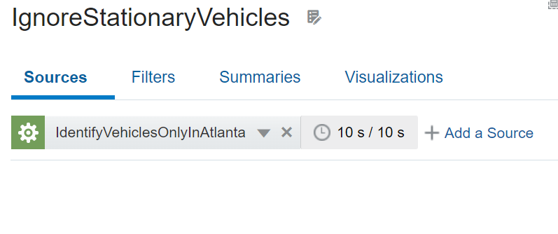

# Build the Stream Analytics pipeline

## Introduction

This lab walks you through steps to create a Stream Analytics pipeline to monitor the public transportation in a marked geographical location.

*Estimated Time*: 20 minutes

### Objectives
In this Lab you will:
- Create a Pipeline
- Create a Stage to Identify Vehicles Only in Atlanta
- Create a Query Stage to Ignore Stationary Vehicles

### Prerequisites
You should have successfully completed all the previous labs.

## **Task 1:** Create a Pipeline

1. On the Catalog page, **Create New Item**, and select **Pipeline**.

2. Select **Pipeline** from the submenu, to display the **Create Pipeline** screen

3. On the **Create Pipeline** screen:

  - In the **Name** field, enter **MonitorPublicTransport**.
  - In the **Description** field, enter **Pipeline to monitor public transport**.
  - In the **Tags** field, enter **transportation, tutorial**.
  - From the **Stream** drop-down, select the **BusStream** File stream that you created in [Lab 4: Create Artifacts for Your Stream Analytics Pipeline.] (#prev)

4. Click **Save**.
The pipeline is created and displayed. Listening for events begins, and then streaming events start to flow.

## **Task 2:** Create a Stage to Identify Vehicles Only in Atlanta

  1. In the Pipeline Editor, right-click the pipeline, click **Add a Stage**, and then select **Pattern**.
  2. Select **Spatial** submenu, select **Geo Filter**.
  3. On the **Create Pattern Stage** screen:
    - In the name field, enter **IdentifyVehiclesOnlyInAtlanta**.
    - In the **Description** field, enter **Spatial analytics in the city of Atlanta**.
    - In the **Tags** field, enter **transportation, tutorial**.
  4. In the **IdentifyVehiclesOnlyInAtlanta** page, on the **Parameters** tab:
    - For **Geo Fence** select **AtlantaRegions**.
    - For **Latitude** select **BUSlat**.
    - For **Longitude** select **BUSlong**.
    - For **Object Key** select **BUStripid**.
    - For **Coordination System** accept the default value **8307**.

    

## **Task 3:** Create a Query Stage to Ignore Stationary Vehicles
  1. Right-click the pattern stage and from the **Add a Stage** menu, select **Query**.
  2. In the **Create Query** dialog box, enter the following and click **Save**:
  3. In the **Name** field, enter **IgnoreStationaryVehicles**.
  4. In the **Description** field, enter **Analytics only on moving vehicles**.
  5. In the **IgnoreStationaryVehicles** query stage page:
  
    - On the **Filters** tab, click **Add a Filter**.
    - In the first drop-down, select **Bus_Speed**, from second drop-down menu select **greater than**, and then accept default value 0.
    - On the **Sources** tab:
    - For **IgnoreStationaryVehicle**, click the Timer icon in the second row below **Sources**.
    - Enter a **range** of 10 seconds and **evaluation frequency** of 10 seconds. PatternGeoFenceInside 10s/10s is displayed.
  

You may now **proceed to the next lab**.

## Learn More

* [Transform and Analyze Data Streams](https://docs.oracle.com/en/middleware/fusion-middleware/osa/19.1/using/creating-pipeline-transform-and-analyze-data-streams.html#GUID-9DB9B57A-1095-4557-ACB9-816A696EB121)

* [Installing GoldenGate Stream Analytics](https://docs.oracle.com/en/middleware/fusion-middleware/osa/19.1/install/how-install-goldengate-stream-analytics.html#GUID-13BC895D-6AD1-4398-98E2-B5BE5B14D26B).

* [GoldenGate Stream Analytics on Oracle Cloud Marketplace](https://docs.oracle.com/en/middleware/fusion-middleware/osa/19.1/osamp/getting-started-goldengate-stream-analytics-oci.html#GUID-B488861E-1C43-4177-A1F8-40F8E44754AD).

* [Mandatory RTE Configurations](https://docs.oracle.com/en/middleware/fusion-middleware/osa/19.1/using/configuring-runtime-environment.html#GUID-EB33DDFD-7444-434D-8944-059564A453FD).

## Acknowledgements
* **Author** - Pratibha Manjunath, Senior User Assistance Developer, GoldenGate Stream Analytics
* **Contributors** - Sumathi Nelapati
* **Last Updated By/Date** - Pratibha Manjunath, December 2023
