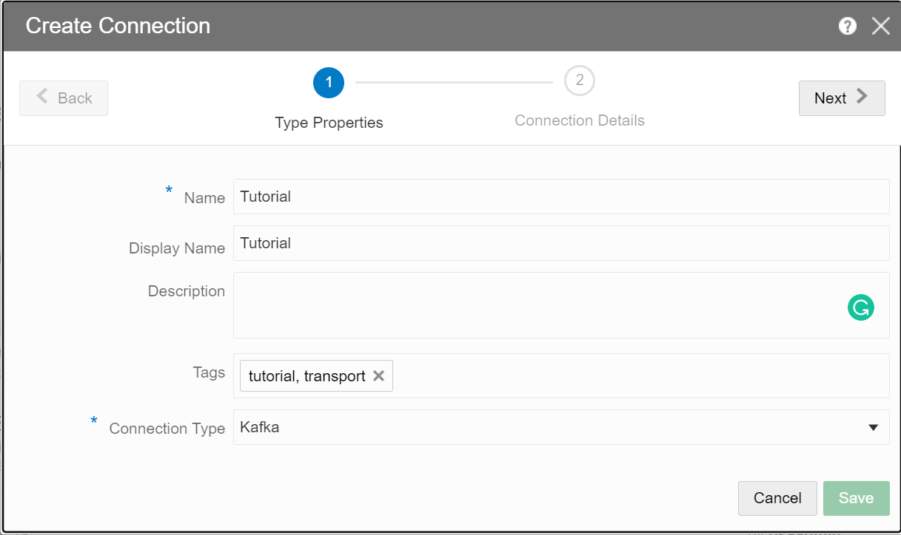
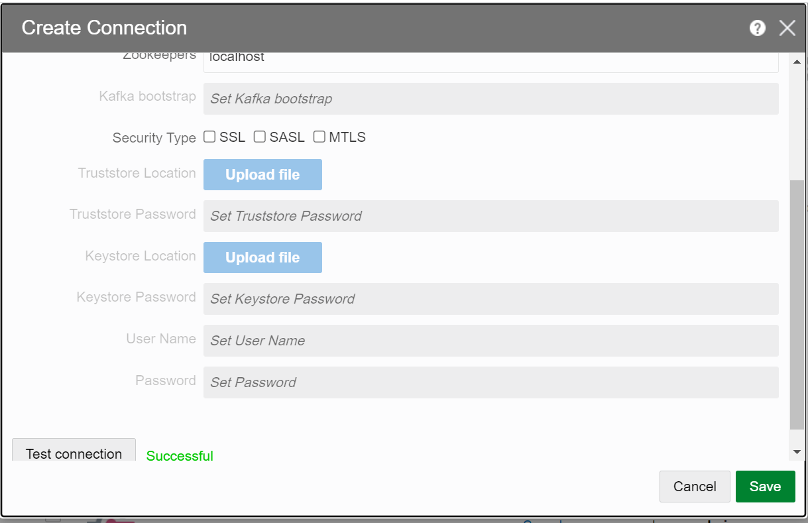
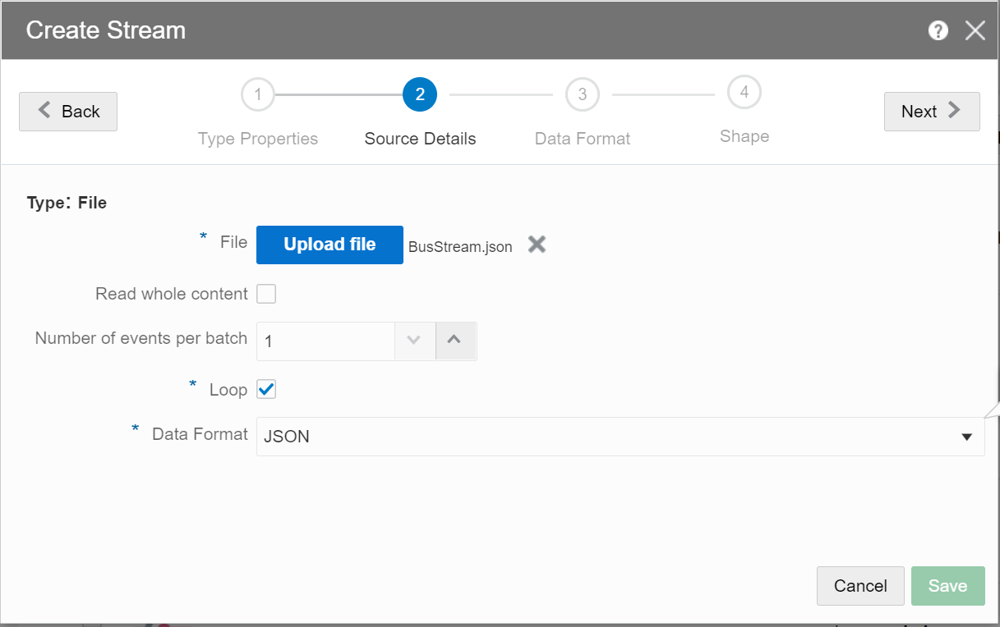
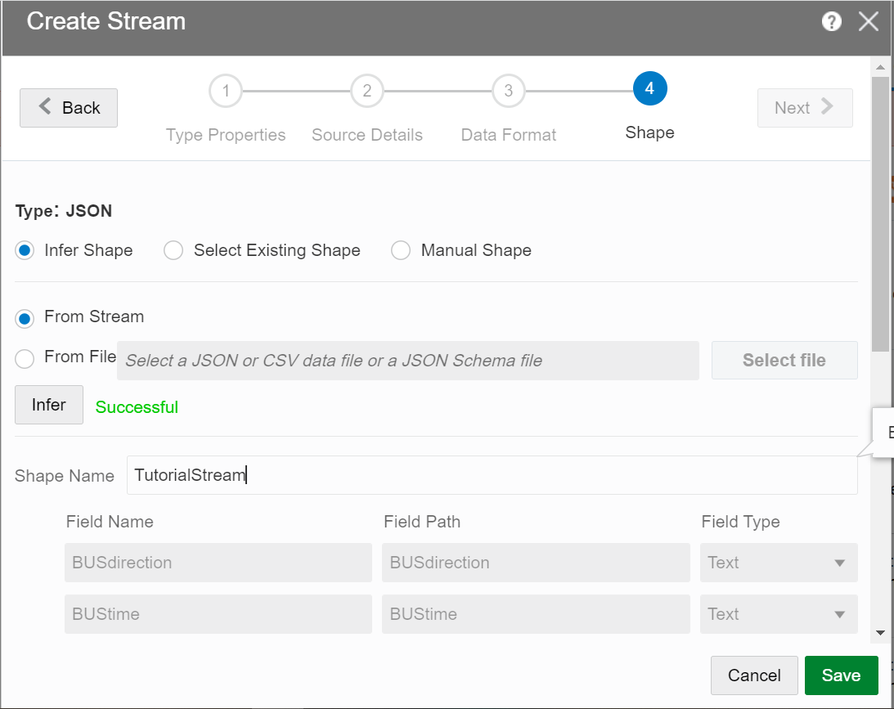
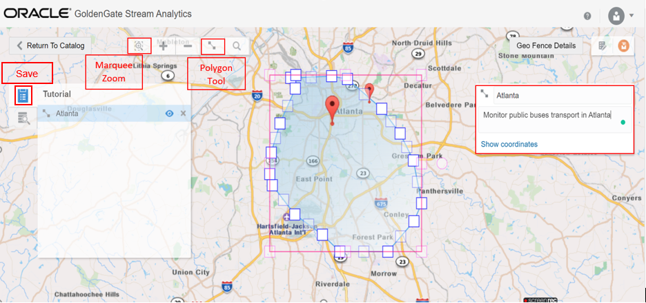

# Create Artifacts for Your Stream Analytics Pipeline

## Introduction

This lab walks you through steps to create supporting artifacts for your Stream Analytics pipeline to monitor the public transportation in the Atlanta area.

 This is the first lab in the Monitoring Public Transportation Using Stream Analytics workshop. Follow the labs sequentially.

*Estimated Time*: 20 minutes

### Objectives
In this Lab you will:
- Download a json file which contains the sample data to be used in this tutorial
- Create a Kafka Connection
- Create a File Stream using the json file
- Create a Geo Fence

### Prerequisite
- A json file with the sample data to be used in this tutorial:
  [Click here to download file.](./files/BusStream.json?download=1)


## **Task 1:** Log in to GoldenGate Stream Analytics

You should be already logged in after completing the lab *Initialize Environment*. If that's not the case, perform the following:

1. Double click on the *Get Started with Your Workshop* icon on the upper left corner in your remote desktop to launch a fresh browser session.

    

2. On the web browser window on the right preloaded with *GoldenGate Stream Analytics* login page, provide the credentials below to login:

    - Username

    ```
    <copy>osaadmin</copy>
    ```

    - Password

    ```
    <copy>xY3q3svdHt8=</copy>
    ```

## **Task 2:** Create a Kafka Connection

1. On the **Catalog** page, click **Create New Item**, and select **Connection**.

2. Select **Kafka** from the submenu, to display the **Create Connection** screen.

3. On the **Type Properties** screen, enter the following details:
    -  In the **Name** field, enter **Tutorial**.
    -  In the **Display Name**, enter a display name for the connection. If left blank, the **Name** field value is     copied.
    -  In the **Tags** field, enter **tutorial, transport**.
    -  In the **Connection Type** drop-down, the selected connection is displayed. **Kafka** in this example.

    

4. On the **Connection Details** page, enter **localhost** in the **Zookeepers** field.

5. Click **Test Connection**, and wait till the status is successful. Click **Save**.

    


## **Task 3:** Create a File Stream

1. On the Catalog page, **Create New Item**, and select **Stream**.

2. Select **File** from the submenu, to display the **Create Stream** screen.

3. On the **Type Properties** screen, enter the following details:
    - In the **Name** field, enter **Tutorial**.
    - In the **Display Name** field, enter a display name for the stream. If left blank, the **Name** field value is   copied.
    - In the **Tags** field, enter **tutorial, transportation**.
    - In the **Stream Type** drop-down, the selected stream is displayed. **File** in this example.

4. On the **Source Details** page:
    - Click **Upload** to upload the **BusStream.json** file that you downloaded earlier.
    - Select **JSON** from the **Data Format** drop-down.

    

5. On the **Shape** page:
    -  Select the **Infer Shape** option and click **Infer**.
    -  Wait till the Shape is successfully inferred from the input stream.
    -  In the **Shape Name** field, enter **TutorialStream**.

    

6. Click **Save**.

## **Task 4:** Create a GeoFence

1. On the Catalog page, **Create New Item**, and select **Geo Fence**.

2. Select **Geo Fence** from the submenu, to display the **Create Geo Fence** screen.

3. On the **Type Properties** screen, enter the following details:
    - In the **Name** field, enter **Tutorial**.
    - In the **Display Name** field, enter a display name for the stream. If left blank, the **Name** field value is   copied.
    - In the **Tags** field, enter **tutorial, transportation**.
    - In the **Geo Fence Type** drop-down, select **Manually Created Geo Fence**.

4. Click **Save**. A page with the world map is displayed. This is where you will mark the area around Atlanta. You can use the **Marquee Zoom** to zoom in a specific area.


5. On top left of the page, click the **Polygon** tool on the toolbar and do the following:
    - Start marking the area around Atlanta on the map. When you're done, click the **Polygon** tool again.
    - In the **Name** field on the right side, enter **Atlanta**.
    - In the **Description** field, enter Monitor public buses transport in Atlanta.
    - On the left side, click the Save icon to save your changes.

    

6.


**Note:**


## Learn More

* [Transform and Analyze Data Streams](https://docs.oracle.com/en/middleware/fusion-middleware/osa/19.1/using/creating-pipeline-transform-and-analyze-data-streams.html#GUID-9DB9B57A-1095-4557-ACB9-816A696EB121)

* [Installing GoldenGate Stream Analytics](https://docs.oracle.com/en/middleware/fusion-middleware/osa/19.1/install/how-install-goldengate-stream-analytics.html#GUID-13BC895D-6AD1-4398-98E2-B5BE5B14D26B).

* [GoldenGate Stream Analytics on Oracle Cloud Marketplace](https://docs.oracle.com/en/middleware/fusion-middleware/osa/19.1/osamp/getting-started-goldengate-stream-analytics-oci.html#GUID-B488861E-1C43-4177-A1F8-40F8E44754AD).

* [Mandatory RTE Configurations](https://docs.oracle.com/en/middleware/fusion-middleware/osa/19.1/using/configuring-runtime-environment.html#GUID-EB33DDFD-7444-434D-8944-059564A453FD).

## Acknowledgements
* **Author** - Pratibha Manjunath, Senior User Assistance Developer, GoldenGate Stream Analytics
* **Contributors** -
* **Last Updated By/Date** - Pratibha Manjunath, August 2022
