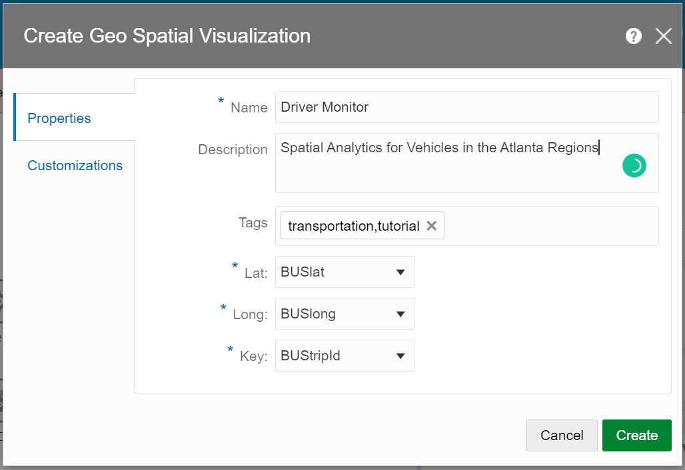
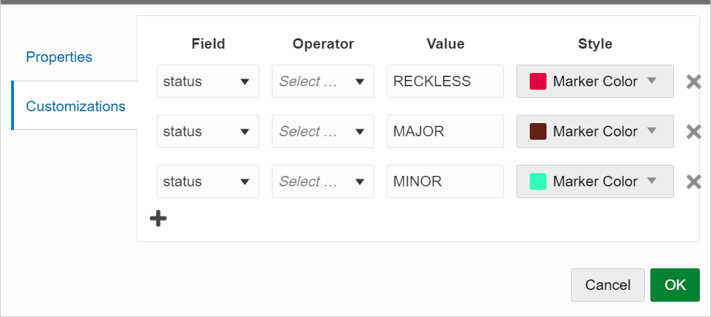
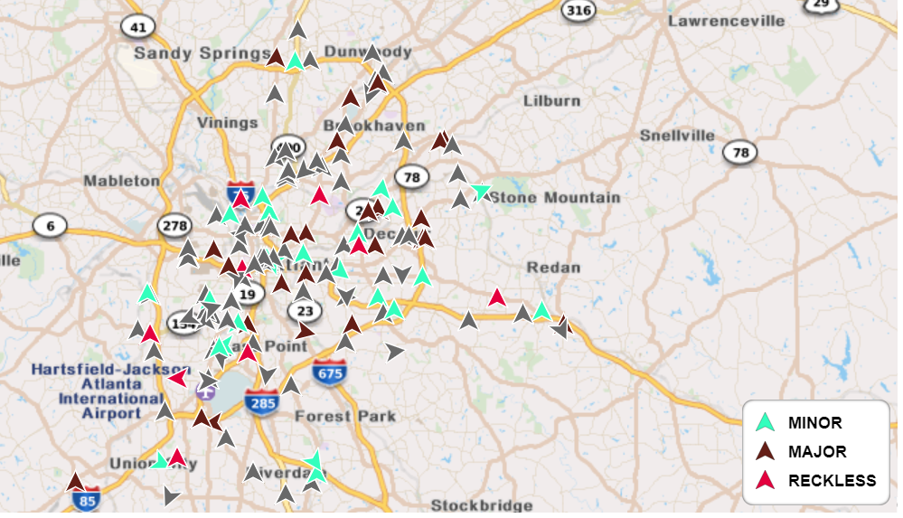
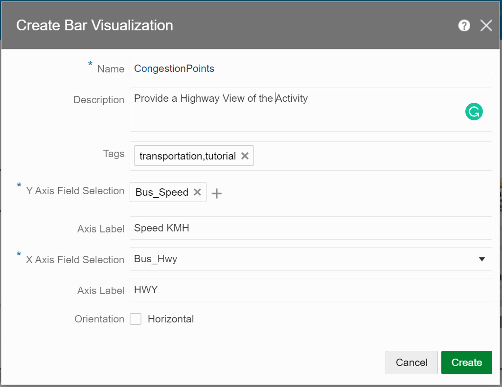
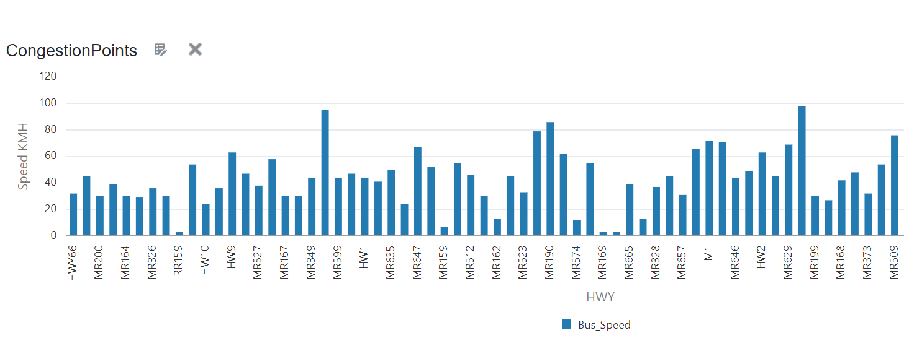

# Configure Graphical Views in your Stream Analytics Pipeline

## Introduction

This lab walks you through steps to configure Graphical Views in a Stream Analytics pipeline, to visualize traffic conditions in a marked geograhical location.

*Estimated Time*: 15 minutes

### Objectives
In this Lab you will:
- Configure a Geo Spatial Visualization
- Configure a Bar Chart Visualization

### Prerequisites
This Lab assumes you have:
- A Free Tier, Paid, or LiveLabs Oracle Cloud account
- SSH Private Key to access the host via SSH

## **Task 1:** Configure a Geo Spatial Visualization for Spatial Analytics of Vehicles in a marked geographical area
1. Click **Visualizations** tab of the **SpeedViolation** Business Rules page:
2. From the **Add a Visualization** drop-down list, select **Geo Spatial**.
3. On the **Create Geo Spatial Visualization** page, on the **Properties** tab:
       1. In the **Name** field, enter **Driver Monitor**.
       2. In the **Description** field, enter **Spatial Analytics for Vehicles in the marked region in Atlanta**.
       3. From the **Lat** drop-down list, select **BUSlat**.
       4. From the **Long** drop-down list, select **BUSlong**.
       5. From the **Key** drop-down list, select **BUStripId**.

  

4. On the **Customizations** tab, click **+** and specify the following values:
       1. Select **Violation**, from the **Field** drop-down list.
       2. Leave the **Operator** field blank.
       3. Enter **Reckless**, **Major**, or **Minor** in the **Value** field, for different violation types.
       4. Assign a marker color from the **Style** tab, to represent each violation type.
       5. Click **Create**.

    

The map is updated instantly as the new data arrives, displaying different driving behaviors.
    

## **Task 2:** Configure a Bar Chart Visualization to view Highway Activity 

1. Click **Visualizations** tab of the **SpeedViolation** Business Rules page:
2. From the **Add a Visualization** drop-down list, select **Bar**.
3. On the **Create Bar Visualization** page, on the **Properties** tab:

       1. In the **Name** field, enter **CongestionPoints**.
       2. In the **Description** field, enter **Provide a HWY view of activity**.
       3. From the **Y Axis Field Selection** drop-down list, select **AvgSpeed**.
       4. In the **Axis Label** field, enter **Speed KMH**.
       5. From the **X Axis Field Selection** drop-down list, select **Bus_Hwy**.
       6. In the **Axis Label** field, enter **HWY**.

          

4. Click **Create**.
  
 The Bar chart displays the highways with the lower-than-average speeds that are currently experiencing traffic congestion.

    

## Learn More

* [Transform and Analyze Data Streams](https://docs.oracle.com/en/middleware/fusion-middleware/osa/19.1/using/creating-pipeline-transform-and-analyze-data-streams.html#GUID-9DB9B57A-1095-4557-ACB9-816A696EB121)

* [Installing GoldenGate Stream Analytics](https://docs.oracle.com/en/middleware/fusion-middleware/osa/19.1/install/how-install-goldengate-stream-analytics.html#GUID-13BC895D-6AD1-4398-98E2-B5BE5B14D26B).

* [GoldenGate Stream Analytics on Oracle Cloud Marketplace](https://docs.oracle.com/en/middleware/fusion-middleware/osa/19.1/osamp/getting-started-goldengate-stream-analytics-oci.html#GUID-B488861E-1C43-4177-A1F8-40F8E44754AD).

* [Mandatory RTE Configurations](https://docs.oracle.com/en/middleware/fusion-middleware/osa/19.1/using/configuring-runtime-environment.html#GUID-EB33DDFD-7444-434D-8944-059564A453FD).

## Acknowledgements
* **Author** - Pratibha Manjunath, Senior User Assistance Developer, GoldenGate Stream Analytics
* **Contributors** - Sumathi Nelapati
* **Last Updated By/Date** - Pratibha Manjunath, December 2023