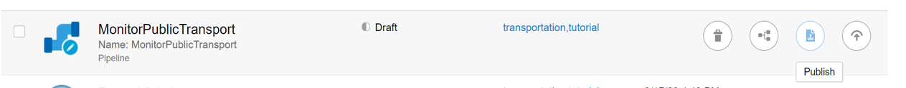

# Publish the Stream Analytics Pipeline

## Introduction

This lab walks you through steps to publish a Stream Analytics pipeline that is built to monitor the public transportation in a marked geographical location.

*Estimated Time*: 15 minutes

### Objectives
In this Lab you will:
- Publish Your Stream Analytics Pipeline to Monitor Public Transport System

### Prerequisites
This Lab assumes you have:
- A Free Tier, Paid, or LiveLabs Oracle Cloud account
- SSH Private Key to access the host via SSH

## **Task 1:** Publish the MonitorPublicTransport Pipeline

1. On the **Catalog** page, click the draft **MonitorPublicTransport** pipeline.
2. In the Pipeline Editor, click **Publish**.

3. You can also publish a pipeline from the **Catalog** page using the **Publish** option in the Actions menu.

4. In both the publish methods, the **Pipeline Settings** dialog box opens, retain the default settings. 
5. Click **Publish**.

A confirmation message appears when the pipeline is published. The pipeline status changes from **Draft** to **Running**.

## Learn More

* [Transform and Analyze Data Streams](https://docs.oracle.com/en/middleware/fusion-middleware/osa/19.1/using/creating-pipeline-transform-and-analyze-data-streams.html#GUID-9DB9B57A-1095-4557-ACB9-816A696EB121)

* [Installing GoldenGate Stream Analytics](https://docs.oracle.com/en/middleware/fusion-middleware/osa/19.1/install/how-install-goldengate-stream-analytics.html#GUID-13BC895D-6AD1-4398-98E2-B5BE5B14D26B).

* [GoldenGate Stream Analytics on Oracle Cloud Marketplace](https://docs.oracle.com/en/middleware/fusion-middleware/osa/19.1/osamp/getting-started-goldengate-stream-analytics-oci.html#GUID-B488861E-1C43-4177-A1F8-40F8E44754AD).

* [Mandatory RTE Configurations](https://docs.oracle.com/en/middleware/fusion-middleware/osa/19.1/using/configuring-runtime-environment.html#GUID-EB33DDFD-7444-434D-8944-059564A453FD).

## Acknowledgements
* **Author** - Pratibha Manjunath, Senior User Assistance Developer, GoldenGate Stream Analytics
* **Contributors** - Sumathi Nelapati
* **Last Updated By/Date** - Pratibha Manjunath, December 2023
