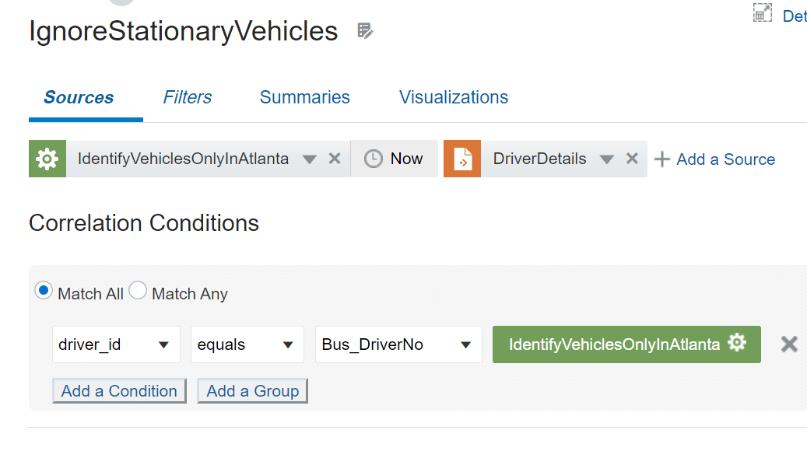

# Add a Reference to the Driver Details Table in the Local Database

## Introduction

This lab walks you through steps to add a reference in the Stream Analytics pipeline to fetch the driver details from the local database table.

*Estimated Time*: 10 minutes

### Objectives
In this Lab you will:
- Add the Driver Details Reference in the Pipeline

### Prerequisites
This Lab assumes you have:
- A Free Tier, Paid, or LiveLabs Oracle Cloud account
- SSH Private Key to access the host via SSH

## **Task 1:** Add a Database Reference to fetch Driver Details

1. On the **IgnoreStationaryVehicles** page, click **Sources**.
2. Select **Driver Details** from the drop-down list.
3. Add a correlation condition:
  - Select **driver _ id** from the first drop-down, **equals** from the operator drop-down, and **Bus_DriveNo** from the drop-down.

## Learn More

* [Transform and Analyze Data Streams](https://docs.oracle.com/en/middleware/fusion-middleware/osa/19.1/using/creating-pipeline-transform-and-analyze-data-streams.html#GUID-9DB9B57A-1095-4557-ACB9-816A696EB121)

* [Installing GoldenGate Stream Analytics](https://docs.oracle.com/en/middleware/fusion-middleware/osa/19.1/install/how-install-goldengate-stream-analytics.html#GUID-13BC895D-6AD1-4398-98E2-B5BE5B14D26B).

* [GoldenGate Stream Analytics on Oracle Cloud Marketplace](https://docs.oracle.com/en/middleware/fusion-middleware/osa/19.1/osamp/getting-started-goldengate-stream-analytics-oci.html#GUID-B488861E-1C43-4177-A1F8-40F8E44754AD).

* [Mandatory RTE Configurations](https://docs.oracle.com/en/middleware/fusion-middleware/osa/19.1/using/configuring-runtime-environment.html#GUID-EB33DDFD-7444-434D-8944-059564A453FD).

## Acknowledgements
* **Author** - Pratibha Manjunath, Senior User Assistance Developer, GoldenGate Stream Analytics
* **Contributors** - Sumathi Nelapati
* **Last Updated By/Date** -Pratibha Manjunath, December 2023
