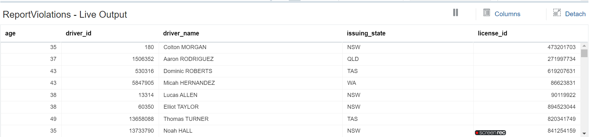

# Define a Target in your Stream Analytics Pipeline

## Introduction

This lab walks you through steps to create a Kafka target to and use it in a pipeline, to report traffic violations to a downstream application.

*Estimated Time*: 15 minutes

### Objectives
In this Lab you will:
- Create a Target
- Use the Target in Your Pipeline

### Prerequisites
This Lab assumes you have:
- A Free Tier, Paid, or LiveLabs Oracle Cloud account
- SSH Private Key to access the host via SSH

## **Task 1:** Create a Target

1. On the **Catalog** page, click **Create New Item**, and select **Target**.

2. Select **Kafka** from the submenu, to display the **Create Target** screen.

3. On the **Type Properties** screen, enter the following details:
    -  In the **Name** field, enter **ReportViolations**.
    -  In the **Display Name**, enter a display name for the connection. If left blank, the **Name** field value is copied.
    -  In the **Description**, enter a meaningful description. **Connection to Kafka running locally** in this example.
    -  In the **Tags** field, enter **transportation,tutorial**.
    -  In the **Target Type** drop-down, the selected target is displayed. **Kafka** in this example. Click **Next**.

4. On the **Target Details** screen, enter the following details:
    - From the **Connection** drop-down list, select the **LocalKafka** connection that you had earlier created.
    - In the **Topic name** field, enter **LocalKafka****.
    - From the **Data Format** drop-down, select **JSON**. Click **Next**.

5. On the **Data Format** screen, check the **Create nested json object** option. Click **Next**.

6. On the **Shape** screen: 
    - Check the **Select Existing Shape** option.
    - From the **Select Existing Shape** drop-down list, select **driver_details**. All the fields in the selected shape are displayed. Select the fields to include in the target.

## **Task 2:** Use the Target in Your Pipeline

1. From the Catalog page, open the **MonitorPublicTransport** pipeline by clicking it.

2. Right-click the **SpeedViolations** stage, click **Add a Stage**.

3. Select **Target** .

4. On the **Create Target Stage** page:

    - In the name field, enter **ReportViolations**.
    - In the **Description** field, enter **Report Violations to a downstream application**.
    - Click **Save**.

5. On the **Target Mapping** page, select the **ReportViolations** target.

The Live Output table for the selected Target:

## Learn More

* [Transform and Analyze Data Streams](https://docs.oracle.com/en/middleware/fusion-middleware/osa/19.1/using/creating-pipeline-transform-and-analyze-data-streams.html#GUID-9DB9B57A-1095-4557-ACB9-816A696EB121)

* [Installing GoldenGate Stream Analytics](https://docs.oracle.com/en/middleware/fusion-middleware/osa/19.1/using/install-and-upgrade.html#GUID-A687DFF0-728A-4071-947A-F3E90ABF65F6).

* [GoldenGate Stream Analytics on Oracle Cloud Marketplace](https://docs.oracle.com/en/middleware/fusion-middleware/osa/19.1/osamp/getting-started-goldengate-stream-analytics-oci.html#GUID-B488861E-1C43-4177-A1F8-40F8E44754AD).

* [Mandatory RTE Configurations](https://docs.oracle.com/en/middleware/fusion-middleware/osa/19.1/using/configuring-runtime-environment.html#GUID-EB33DDFD-7444-434D-8944-059564A453FD).

## Acknowledgements
* **Author** - Pratibha Manjunath, Senior User Assistance Developer, GoldenGate Stream Analytics
* **Contributors** - Sumathi Nelapati
* **Last Updated By/Date** - Pratibha Manjunath, December 2023
