# Streaming Retail data

## Introduction
In this scenario we are working with a retailer who is running promotions in a specific geographic area offering their customers discounts.  They are providing us a few data points from various sources and would like to run analytics on this data and send the results downstream.  The input data includes an order history and customer details, location of the customers, product details, the geographic area where they are running their promotions and a Machine Learning model.

The retailer is asking us to use the input data to provide the following output and analysis:

* Get the customers details and their order history
* Filter out all the customers who live outside Geo area as where the discounts are offered
* Get the product details for each customer
* Segment the customers into Gold, Diamond and Platinum based on the history of their purchase
* Get the revenue generated from these customers
* Predict whether the customers are likely to Buy based on the discount they are being offered using ML
* Send data revenue and likely buyers to targets downstream

*Estimated Lab Time*: 70 minutes

### About Product/Technology
Golden Gate Stream Analytics (GGSA) is a tool designed to consume a stream of data from any source such as a database, GoldenGate, kafka, JMS, REST or even a file system.  Once the data is in GGSA you can run analytics on live data in real-time using transformation and action functionality of Spark and send the data downstream to any target of your choice.

### Objectives
- Understand the Retail Promotions scenario
- Create an extensive Pipeline
- Run analytics on streaming data
- Apply a Machine Learning model to streaming data
- Define source and targets for a streaming data

### Prerequisites
This lab assumes you have:
- A Free Tier, Paid or LiveLabs Oracle Cloud account
- You have completed:
    - Lab: Prepare Setup (*Free-tier* and *Paid Tenants* only)
    - Lab: Environment Setup
    - Lab: Initialize Environment

## Task 1: Import Resources

1. Click on the Home page and Import the Retail example

    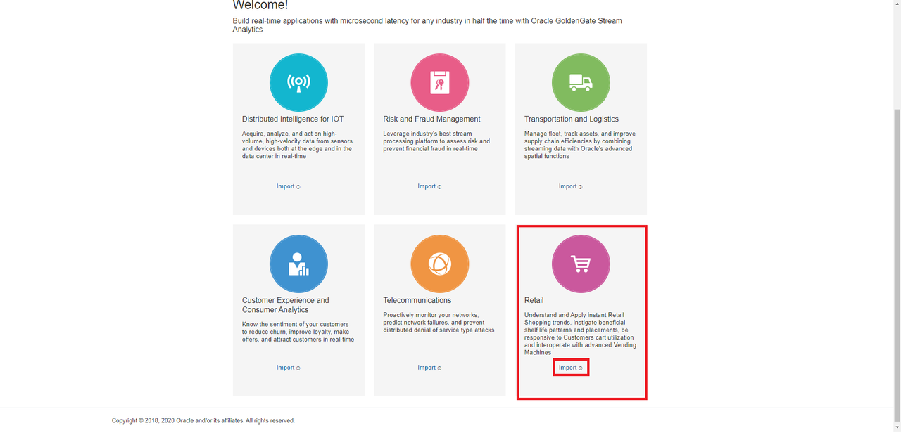

2.  Navigate to the Catalog page and make sure all the resources have been imported.  We will be using them for this lab.
3.  Click on the Retail Sample tag link next to any of the resources.  
4.  See that the grey menu bar on top includes Retail Sample and that there are 15 Resources visible in the main page

    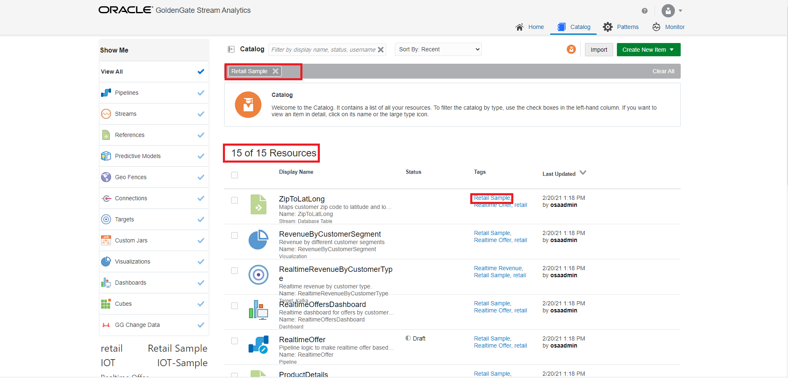

### Available Sources and Definitions for Lab 3 Pipeline

You need to create a pipeline that includes about 17 stages and resources.  Before you create a new pipeline make sure the resources below have all been imported.  Also make sure that in the catalog page all the connections that you use in the pipeline have the correct connections in the existing streams and DB sources.  Understand the properties for each resource and use them to create your pipeline.  For Streams for example you can double click on each stream in the catalog page and see its properties.  For the visualization resources below, you can click on the properties on the right part of the screen as you mouse over each resource.  Do not edit any of these resources as you will need them for this lab:

  * Streams:
    - **OrderStream:**  Includes customers order history

  * References:
    - **CustomerDetails:** Customers information such as name, address, their total web sales, store sales  and average discount
    - **ZipToLatLong:** Maps a given zip code to the corresponding Latitude and Longitude
    - **ProductDetails:**  Product names, SKUs and Categories

  * Geo Fences:
    - **CampaignRegions:** Includes the geographic location of where the promotions are being offered

  * Predictive Models:
    - **CustomerRedeemModel:** This is a Machine Learning model that can make a prediction whether a customer is likely to make a purchase based on the customer's web sales and store sales history

  * Connections:
    - **LocalMySQLDatabase:** Connection to the local SQL database that is available on the lab server

    - **LocalKafka:** Kafka connection to the local Kafka node and topics that is on the lab server

  * Targets:
    - **RealtimeRevenueByCustomerType:** A Kafka topic that we will use as a target in this lab
    - **PersistentPrediction:** A Kafka topic that we will use as a target in this lab

  * Visualizations:
    - **RevenueByCustomerSegment:** Visualization that we will use for this lab
    - **LikelyBuyersByZipCode:** Visualization that we will use for this lab
    - **LikelyBuyersByCustomerType:** Visualization that we will use for this lab

## Task 1: Create Pipeline

1. Start by selecting Pipeline from the Create New Item drop down in the Catalog page.  Make sure you select the appropriate Stream for this pipeline.  Name the pipeline *RetailPromotions*.


    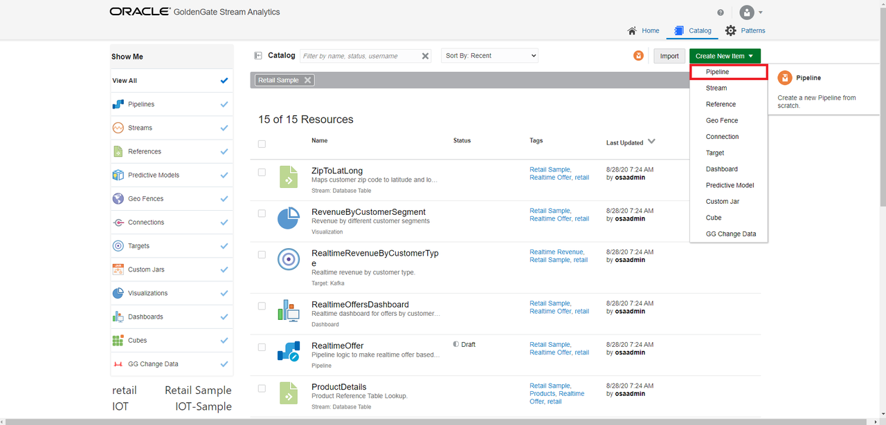

2. Add a new tag called Lab3 next the existing tag:

    ```
    <copy>Lab3</copy>
    ```

 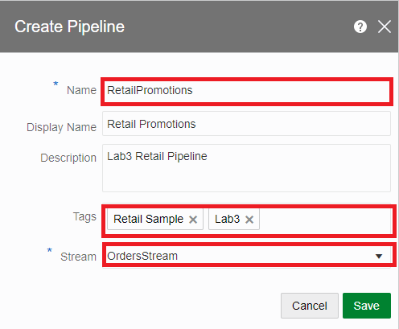

3. Once you have created the pipeline you should see stream of data coming from the OrderStream in the Live Output:

    

Now that we have the order history we would like to enrich this data with the customer details from the database.  

## Task 1: Create GetCustomerDetails Stage

1. Right click on the *OrderStream* and add a Query Stage.  

   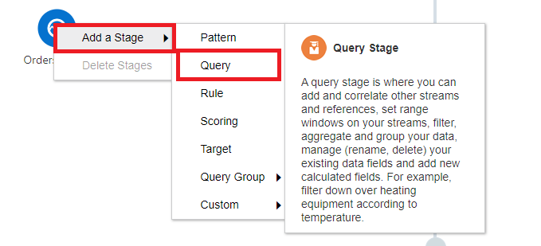

2. Name the query stage *GetCustomerDetails* and add a description.  

   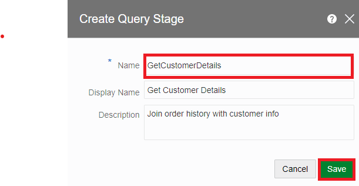

3. On the details pane click on the Add a Source and pick CustomerDetails from the list.

    

4. You should see CustomerDetails added to both pipeline and the details pane.  Notice that the Correlation Conditions are shown.  Ignore the Some sources are not correlated error message.  This is because we are not done with the query conditions yet.  

    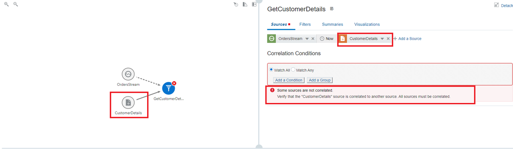

5. Pick *Match Any* condition because we would like to use an *OR* condition. Click on *Add a Condition* and for each field pick the appropriate value from the drop down shown in the Example below.


    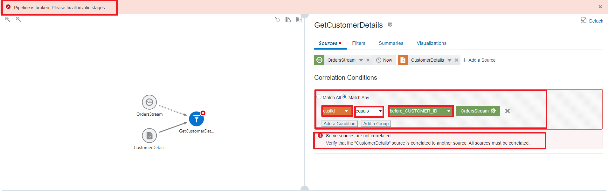

6. Make sure you create two query conditions as explained below.

7. Once you have added both conditions click anywhere outside of the query pane and the errors will go away and you will see the data from both sources joined and streaming. You can Pause the stream to understand the steps and the enriched data better.

    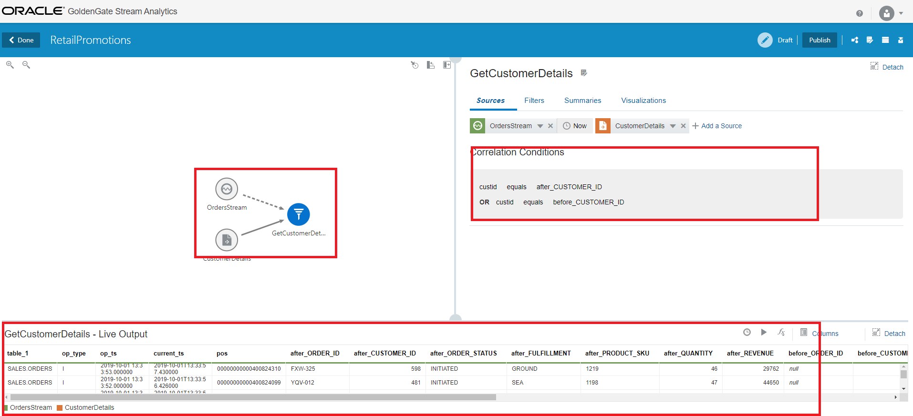

    Note: Some of the parameters that come in from the streams have two values such as *`after_PRODUCT_SKU`* and *`before_PRODUCT_SKU`*.  These are events within a stream

    An event is always before or after a time, and the stream is potentially infinite and ever-changing.  In simple terms a *before* value represents what was already in the stream and an *after* event is an update to that value.  In most of our queries we will have to make sure that we include both events.

    Example:
    ```
    Custid equals after_CUSTOMER_ID
    ```

    OR

    ```
    Custid equals before_CUSTOMER_ID
    ```

8. At any time during design of a pipeline you can click on *Done* button on the top left to exit the pipeline and get back to the catalog.  All your changes will be saved.

## Task 1: Create GetLatLongFromZipCode Stage

In this stage we would like to map a customer’s zip code to an actual latitude and longitude.

1. Right click on the *GetCustomerDetails* in the stream and Add a Stage (a query stage) and name it *GetLatLongFromZipCode*.  
2. In the top right hand pane you should see the new stage and the type of stream you are using.
3. Click on Add a Source and select a source from the drop down.

    Hint: this should be information from the database - A join of GetCustomerDetails with ZipToLatLogng from the dropdown.

    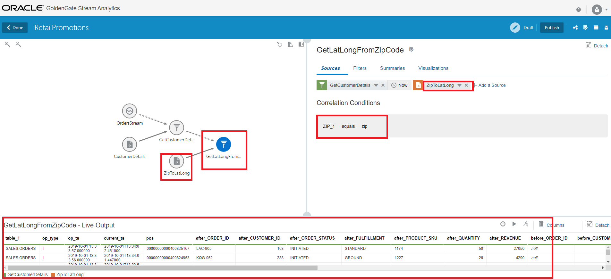

## Task 1: Create FilterCustomers Stage

In the next stage we are only interested in customers that are located in our campaign regions and filter out everyone else.

1. Right click on the *GetLatLongFromZipCode* and Add a Stage.  In this step your stage is NOT a Query stage.  Instead we are looking for a Pattern of type Spatial that selects customers based on a Geo Filter.  

    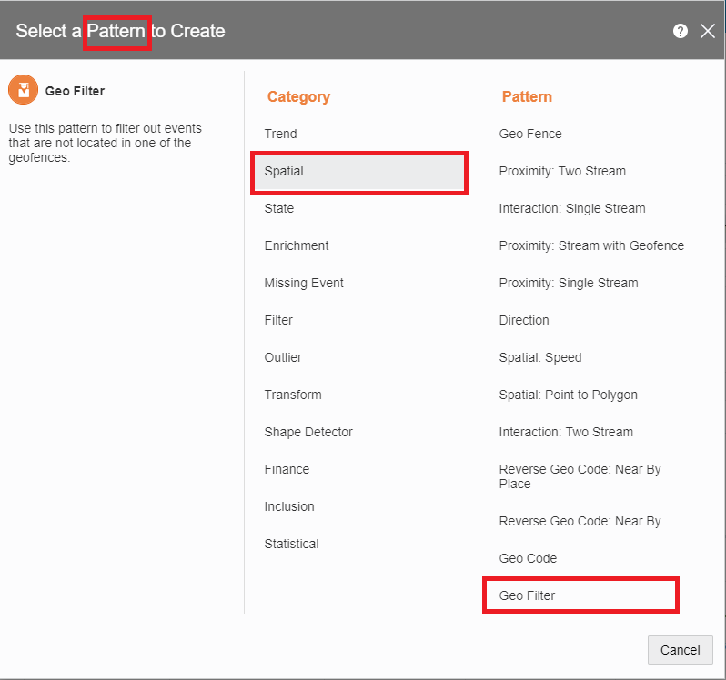

2. Name your stage *FilterCustomers* and add the appropriate description.  

3. In the top right hand pane you should see the new stage.  
4. Provide the correct resource from the drop down. For Geo Fence the drop down should be *CampaignRegions* and for the rest map the associated parameters from the stream, namely *LAT*, *LNG* and for Object Key pick *name* using the + sign. The Coordinate System parameter is fixed and cannot be changed.  

    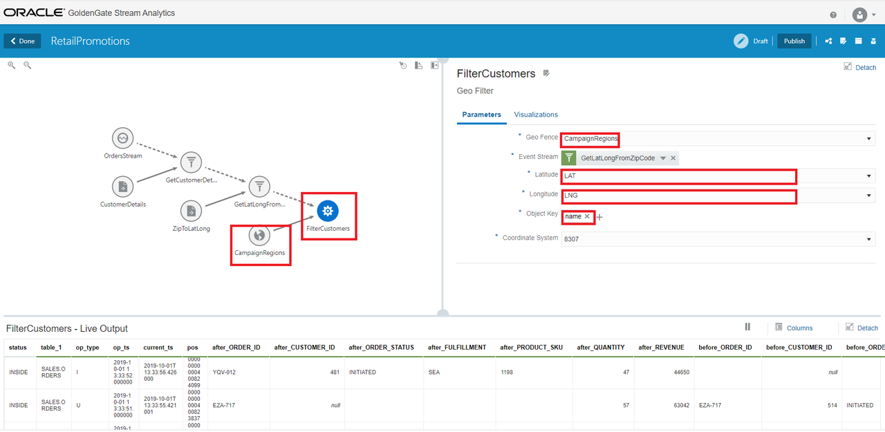

5. Observe that the data now starts streaming in with this Geo Filter.  
6. After setting up the Parameters click on the *`Visualizations`* tab and see the Geo Filter that we are interested in for our campaign.  
7. Also, notice the arrows indicating the customers current location, live.

    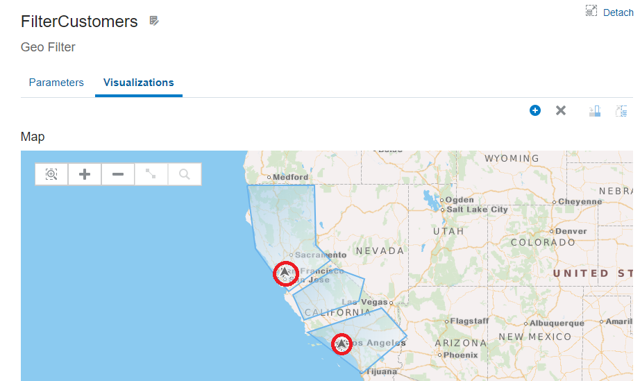

## Task 1: Create GetProductDetails Stage

In the this stage we would like to retrieve the product details from local database for those products that the customers have purchased by joining two sources.

1. Right mouse click on the end stream and Add a Query Stage.
2. Name the new stage *GetProductDetails* with the appropriate description.  
3. In the top right hand pane you should see the new stage and the type of stream you are using

4. Click on Add a Source and select a source from the drop down that will give us the details about the Products.

    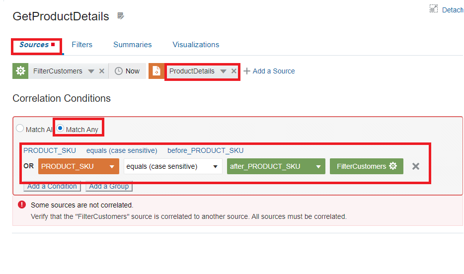

    Hint: this should be information from the database.  

    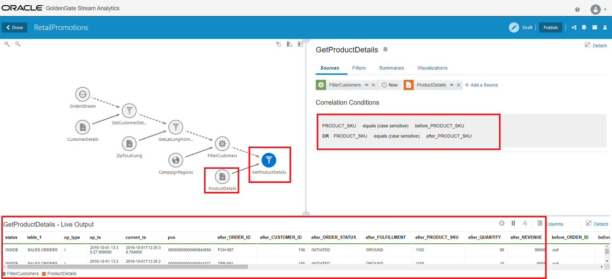

## Task 1: Create SegmentCustomers Stage

Now we would like to add a Rule Stage to segment our customers based on what they have spent on their previous purchases by adding two additional fields based on rules defined below.

1. First begin by using the Expression Builder *`(fx)`* in the bottom half of the screen to add the two new fields.

    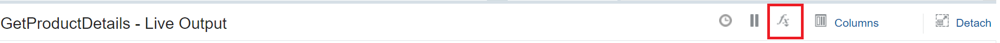

2. In the Expression Builder type in 'BRONZE', then click on the (Sigma) button and then click on the checkmark in that order.  
    ```
    <copy>BRONZE</copy>
    ```

    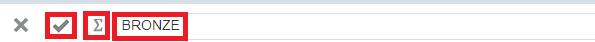

3. The new field defaults to Calc but you can right mouse click (or double click inside the field) and rename it *CustomerType*.  


4. Use *`(fx)`* again and add a new field as a numerical value.  
5. For a numerical value make sure to begin the expression with `=` sign. You can give it default value like `=0`.  

    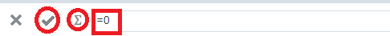

6. The new field defaults to Calc but you can right mouse click (or double click inside the field) and rename it to *DiscountOffered*.

   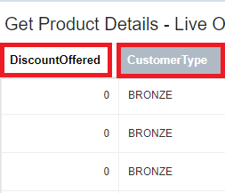

7. Now right click on the GetProductDetails stage and add a Rule Stage

8. Name the new rule stage *SegmentCustomers* with the appropriate description.
9.  In the *`Rules`* tab add *Rule Name* and *Description* and click on *Done*, then create the if-then condition accordingly.  Based on that condition use *+ Add Action* to set the *CustomerType* and *DiscountOffered*.  We need to add the following three rules, each time clicking on the *+ Add a Rule*:

    - *GoldCustomers:*

    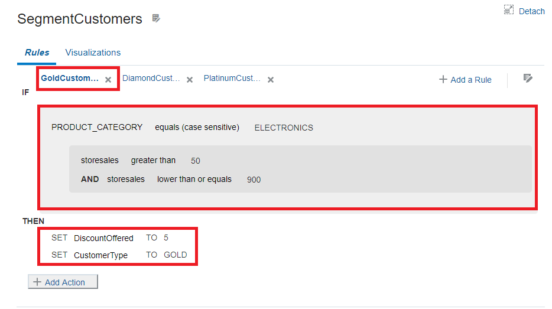

    If they have purchased ELECTRONICS AND the storesales (*Match All*) greater than $50 AND storesales  lower than or equal $900 Then offer them a $5 discount as DiscountOffered and set the CustomerType to *GOLD*

      - Category:

    ```
    <copy>ELECTRONICS</copy>
    ```

      - Discount:

    ```
    <copy>5</copy>
    ```

      - Segment:

    ```
    <copy>GOLD</copy>
    ```

    - *DiamondCustomers:*

    If they have purchased FURNITURE and spent between $900 AND $1500 Then offer them a $10 discount as DiscountOffered and set the CustomerType to *Diamond*

      - Category:

    ```
    <copy>FURNITURE</copy>
    ```

      - Discount:

    ```
    <copy>10</copy>
    ```

      - Segment:

    ```
    <copy>Diamond</copy>
    ```

    - *PlatinumCustomers:*

    If they have purchased any product and spent more than $1500 Then offer them a $25 discount as DiscountOffered and set the CustomerType to *Platinum*

      - Discount:

    ```
    <copy>25</copy>
    ```

      - Segment:

    ```
    <copy>Platinum</copy>
    ```

    In the Live Output pane verify that the Customer Types and Discount Offers data is streaming. *Note* that all other customers are automatically segmented as *BRONZE*.

    We are going to use the data from this stage in two ways which is why we are going to create two branches out from this stage.  In the first branch we will do some analysis on the revenue generated by customer types, i.e. the revenue amount generated by each segment.

## Task 1: Create RealtimeRevenue Stage
After we have segmented the customers we need to Filter out all the customers that don’t generate any revenue.  

1. Begin by adding a Query Stage to the *SegmentCustomers* stage and name it *RealtimeRevenue*.  
2. Use the *`Filters`* tab to query for:

  ```
  after_REVENUE is not null
  ```

3. Then in the *`Summaries`* tab add a summary and do a SUM of all *`after_REVENUE`* to create a new field.

    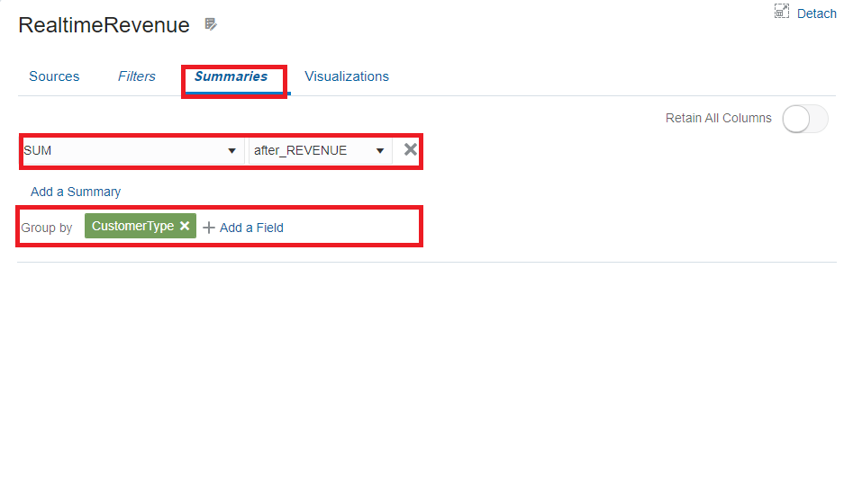

4. Notice that at first the new field is named *`SUM_after_REVENUE`*, but double clicking that column should enable you to rename it to RevByCustomerType.  Rename the new column.  

    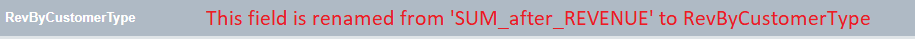

5. Finally Add a Group by with the CustomerType.
6. Click on the *`Visualizations`* tab, select *Bar* chart and name it to *RevenueByCustomerSegmentLab3*.  
7. Add the Visualizations with Bar type with X Axis as the CustomerType and Y Axis as the RevByCustomerType.  
8. Once you have created the bar chart you should see the streaming data as bar chart.

    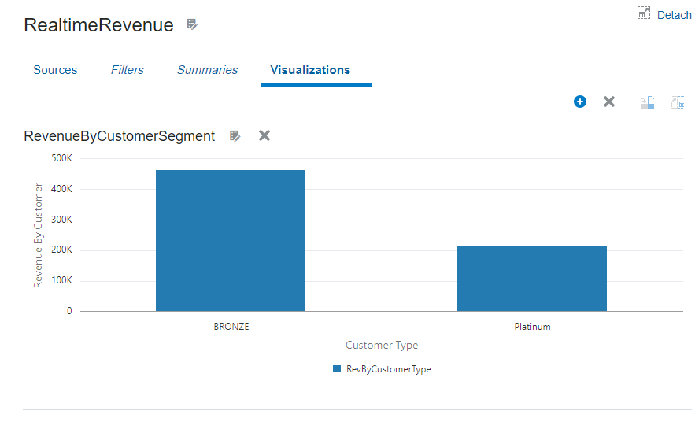

## Task 1: Create LogRTRevenue Stage

1. Right click on the *RealtimeRevenue*  Stage and create a target stage.  Name this stage *LogRTRevenue* and add description.  In the details pane select RealtimeRevenueByCustomerType from the drop down and map the Target properties to the Output Stream properties if not already done for you.

   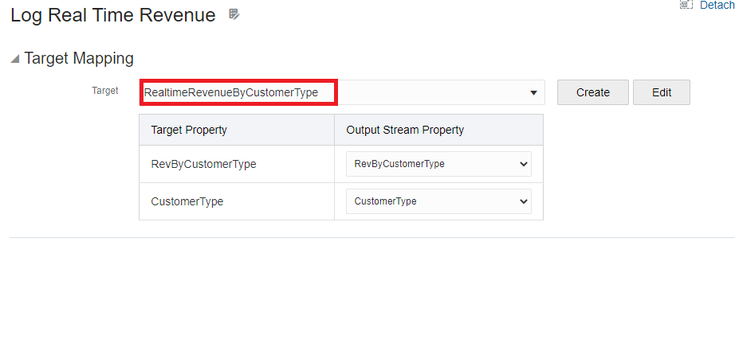

Now we are going to create a parallel branch at the *SegmentCustomers* stage.  We are going to create this parallel branch to make predictions whether the customer is likely to redeem the offer based on their WebSales and StoreSales and the amount of Avgdiscount that is being offered.  

## Task 1: Create PredictBuyNoBuy Stage

1. Begin by creating a new Scoring stage by right clicking on the *SegmentCustomers* stage.  

    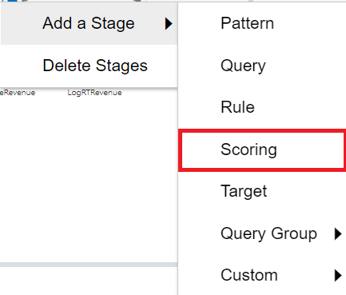

2. Name the stage *PredictBuyNoBuy*.
3. Add description such as Predicts if customer is likely to redeem the offer using a classification algorithm.  
4. Click Save.

5. The Scoring stage allows you to use your own Machine Learning model that you have imported into GGSA.  
6. Select the ML model CustomerRedeemModel that was imported from the dropdown and accept the default Model Version.
7. Now make sure to map all the Model Property to the appropriate Pipeline Property if they are not already done for you.
8.  Based on these model features the output columns are RedeemPrediction, IgnoreProbability and RedeemProbability.  

    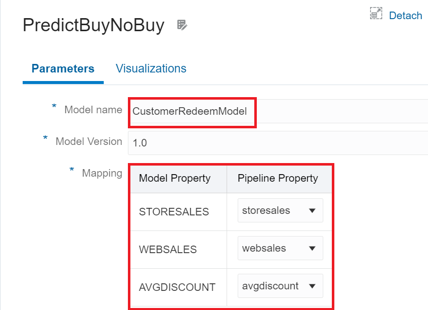

9.  See them streaming in the Live Output region at the bottom of the screen.

## Task 1: Create GetCustomer Stage

1. Once again and from the *SegmentCustomers* stage we also like to define a parallel stage (to the *PredictBuyNoBuy* stage) so that we have access to the data in the previous stage by creating a query stage.  
2. Right click on the *SegmentCustomers* stage and create a new query stage.  
3. Name the new stage *GetCustomer*
4. Add description: Correlates with previous stage to get back customer details.
5. Click Save.
6. Click on Add a Source and select the PredictBuyNotBuy.
7. Now run the following queries or Correlation Conditions:

    ```
    <copy>
    Storesales_1 equals STORESALES**
    AND
    Websales_1 equals WEBSALES
    AND
    Avgdiscount_1 equals AVGDISCOUNT
    </copy>
    ```

8. Be sure to select Now and not Unspecified.
9. See the streaming data in the Live Output.

    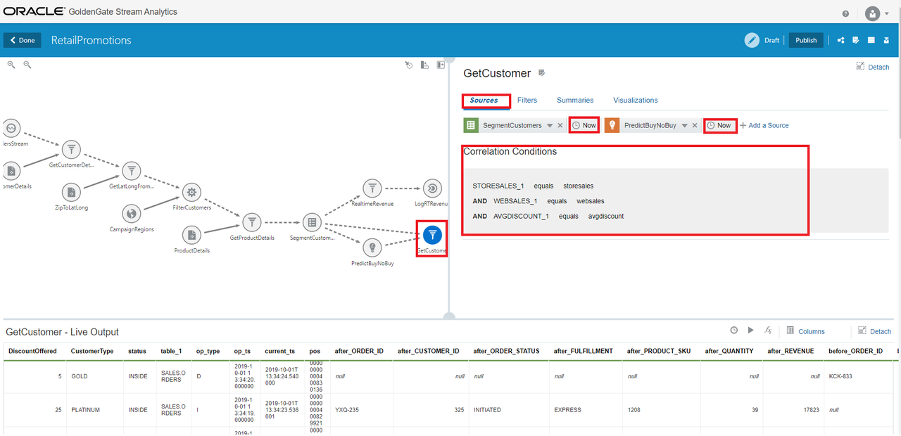

## Task 1: Create FilterLikelyBuyers Stage

1. From the *GetCustomer* stage add a new Query Stage.
2. Name the new stage *FilterLikelyBuyers*.

3. Add a description: Removes customers who are unlikely to redeem the offer.  Click Save.

4. In the lower right hand corner of the screen click on Columns:

   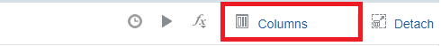

5. In the Columns window click on the left double arrows to deselect all the columns.  Then click on the right single arrow to individually select the columns shown.  Click Save.

   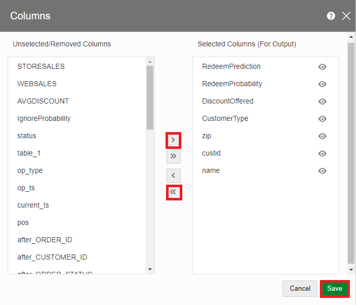

6. In this stage we are only interested in customers that are likely to take advantage of the offer by querying for all the customers whose RedeemPrediction equals (case sensitive) 1.

7. Click on the *`Filters`* tab and Add a Filter.

    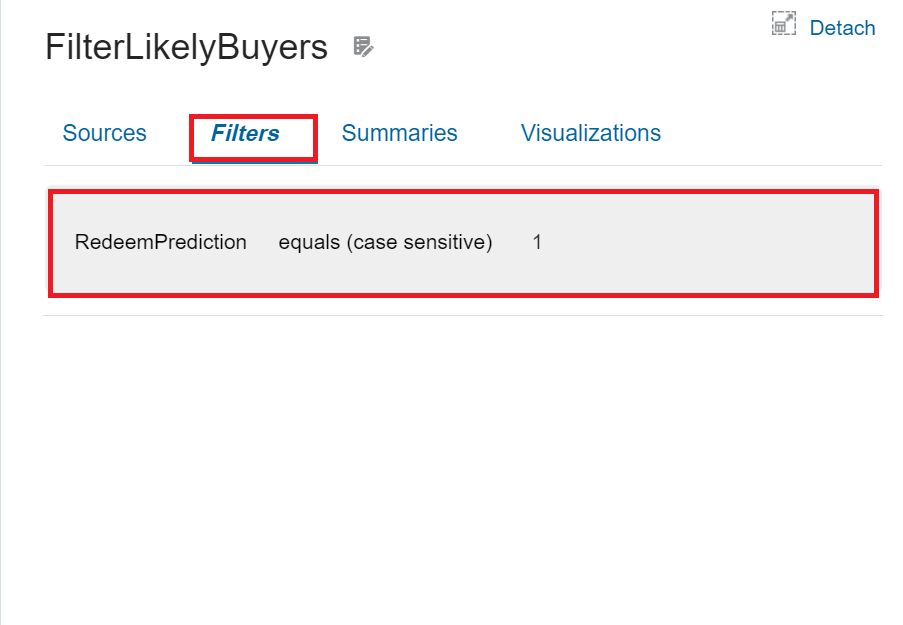

## Task 1: Create PersistPredictionsToKafka Stage

In the last stage we are interested in sending the data to a Kafka Target by mapping the topic params to the stream parameters.  Again the topic could be created before the pipeline is built or as the stage is being created.
1. Right click on the *FilterLikelyBuyers* stage and create a new Target Stage.
2. Name the new target stage *PersistPredictionsToKafka*.
3. Add description: Persists predictions to Kafka. Could also be persisted to database.
4. Click Save.
5. Select PersistPrediction topic from the dropdown and make sure the properties are all mapped properly.

    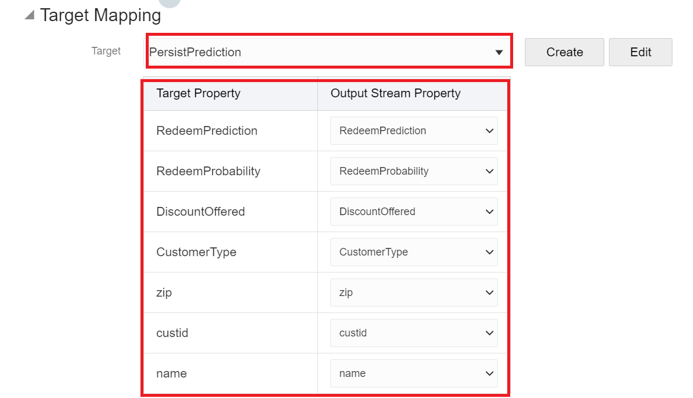

## Task 1: Create LikelyBuyersByTypeAndZip Stage

Create a parallel stage to group the likely buyers by type and by zip code.

1. From the FilterLikelyBuyers stage create a parallel Query Group:Stream stage.
2. Name the new stage *LikelyBuyersByTypeAndZip*.
3. Add description: Likely buyers by customer type and zip code.
4. Click Save.
5. Click on the *`Groups`* tab and *Add a Group* then *Add a Summary* with condition Count_of_RedeemPrediction.  

    

6. Again the column should be renamed to *LikelyBuyersByCustomerType*.  
7. Now Add a GroupBy and select CustomerType.

8. Repeat the same steps and *Add a Group* then *Add a Summary* with condition Count_of_RedeemPrediction but this time rename it to *LikelyBuyersByZipCode* and *Group by* zip.

    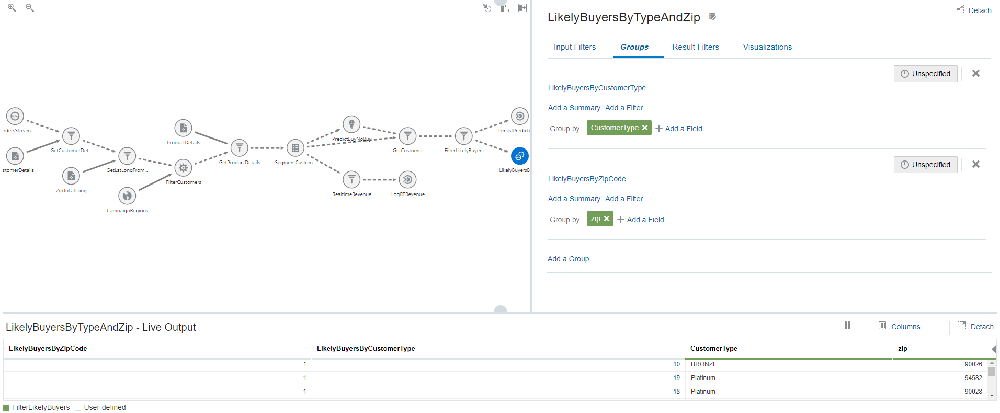

9.  Click on the *`Visualizations`* tab and create a Pie chart for the LikelyBuyersByCustomerType:

    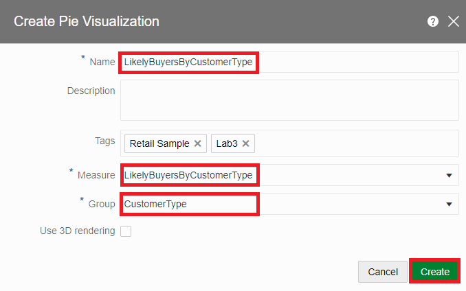

10. Repeat the same step and create a Bar chart for the LikelyBuyersByZipCode.

    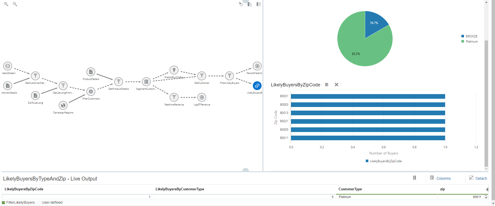

You may now [proceed to the next lab](#next).

## Learn More
* [GoldenGate Stream Analytics](https://www.oracle.com/middleware/technologies)

## Rate this Workshop
When you are finished don't forget to rate this workshop!  We rely on this feedback to help us improve and refine our LiveLabs catalog.  Follow the steps to submit your rating.

1.  Go back to your **workshop homepage** in LiveLabs by searching for your workshop and clicking the Launch button.
2.  Click on any of the **Brown Buttons** to re-access the workshop  

    

3.  Click **Rate this workshop**

    

If you selected the **Green Button** for this workshop and still have an active reservation, you can also rate by going to My Reservations -> Launch Workshop.

## Acknowledgements

* **Author** - Hadi Javaherian, Solution Engineer
* **Contributors** - Shrinidhi Kulkarni, Meghana Banka, Rene Fontcha
* **Last Updated By/Date** - Rene Fontcha, LiveLabs Platform Lead, NA Technology, February 2021
