# Publishing, Dashboards, Import/Export

## Introduction
So far, we have been designing the pipelines in Draft Mode which means that we could have made changes to any of the stages and see the updates live.  Furthermore, we could have at any time stopped the stream and designing of the pipeline by clicking on the Done button in the upper left hand corner of the screen.

*Estimated Lab Time*: 25 minutes

### About Product/Technology
Golden Gate Stream Analytics (GGSA) is a tool designed to consume a stream of data from any source such as a database, GoldenGate, kafka, JMS, REST or even a file system.  Once the data is in GGSA you can run analytics on live data in real-time using transformation and action functionality of Spark and send the data downstream to any target of your choice.

### Objectives
- Learn how to Publish a Pipeline
- Learn how to create a Dashboard
- Learn how to perform Import/Export operations

### Prerequisites
This lab assumes you have:
- A Free Tier, Paid or LiveLabs Oracle Cloud account
- You have completed:
    - Lab: Prepare Setup (*Free-tier* and *Paid Tenants* only)
    - Lab: Environment Setup
    - Lab: Initialize Environment

## Task 1: Publishing vs. Draft

1. Select Pipelines from the left Nav Bar and see all the pipelines.  
2. Click on the RetailPromotions from Lab 3 to see that pipeline running with Live Output. Also note that every time you click on the *Done* button the stream stops but all the changes are saved to the pipeline.  
3. On the top right part of the screen notice that the pipeline is in the Draft mode and only runs while the pipeline is open for each user

    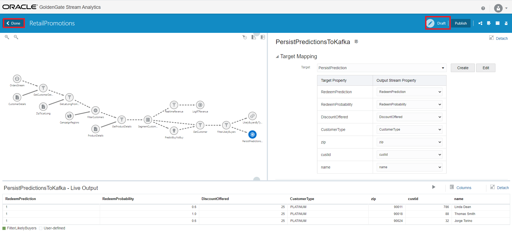

## Task 2: Publishing a Pipeline
In order to make the pipeline available for production for all users the pipeline must be published. A published pipeline will continue to run on your Spark cluster even after you exit the pipeline editor which is not the case if the pipeline is in Draft mode.

You can Publish a pipeline in two ways.  You can hover over the pipeline in the Catalog page and see the Publish button highlighted.  Alternatively, you can open the pipeline and click on the Publish button on the top right-hand corner of the screen.

1. Go ahead and Publish the RetailPromotions by clicking on the *Publish* button.
2. In the Pipeline Settings page note the parameters that are configurable for Spark such as number of Executors and Memory as well as Driver Memory. For this lab we are going to keep all the defaults since we are only running on one node. In production, setting these parameters affect the performance of the pipeline.
3. Do NOT make any changes to the settings and click on the Publish button

    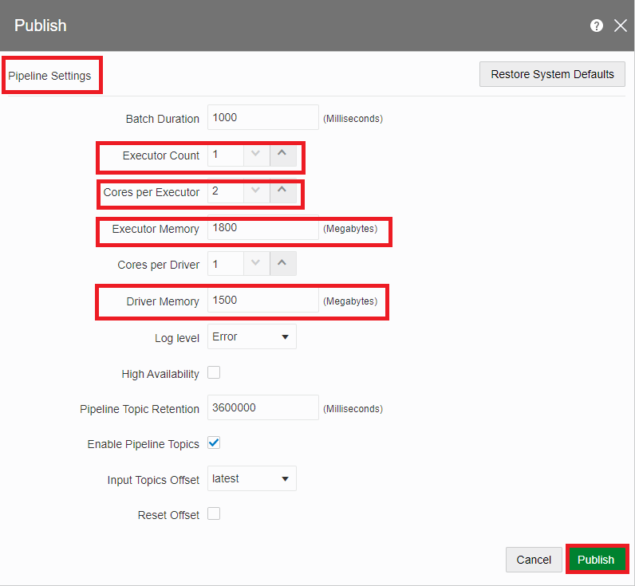

4. The publishing will take a few seconds.

    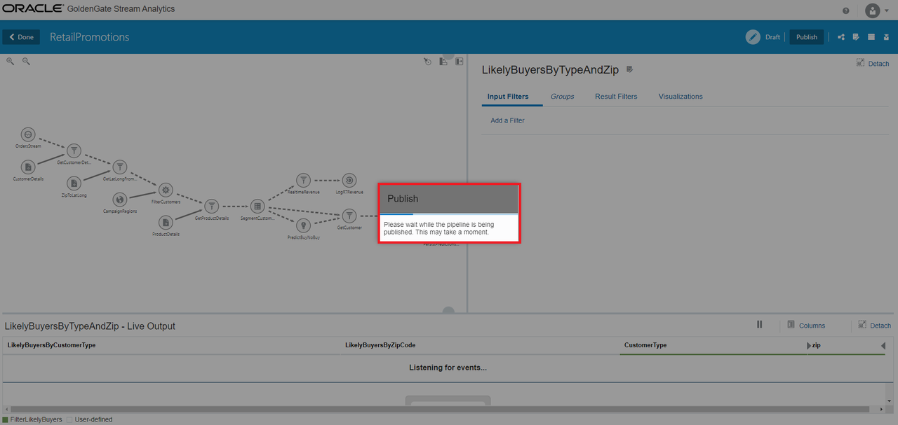

5. The mode should change to *Published* on the top right corner of the screen.

    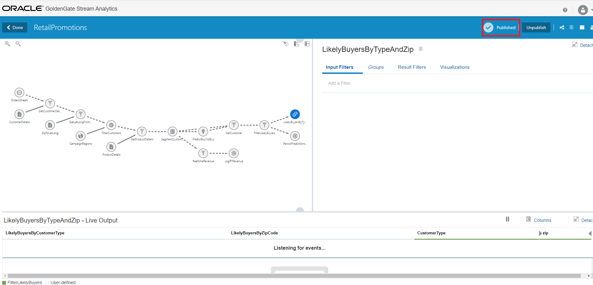

6. Also notice that in the Catalog page the RetailPromotions pipeline is now in Running state.

    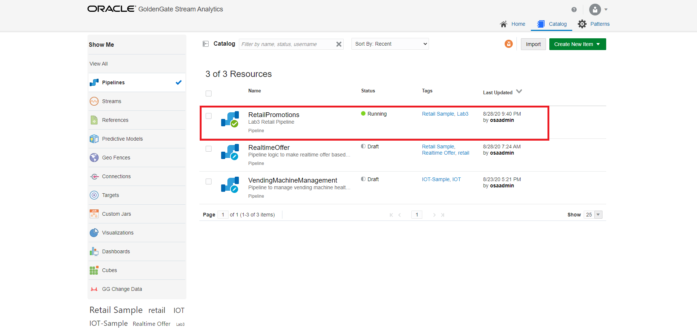

## Task 3: Dashboards
A Dashboard is an analytic feature that allows visualization of the pipeline once the data has been analyzed.  You can easily create a dashboard in GGSA with a few quick steps. However, dashboards are not visible until the pipeline they pertain to is in the Published state.

1. In the left Nav Bar of the Catalog page click on the Dashboards and see all the dashboards that have been created.
2. Click on the Create New Item drop down and select Dashboard.  
3. In the Create Dashboard page name the new dashboard `RevenueByCustomerSegmentLab3`
4. Add a description.  
5. Also, tag the dashboard with Retail Sample and Lab 3 tags.  
6. Click Next.

    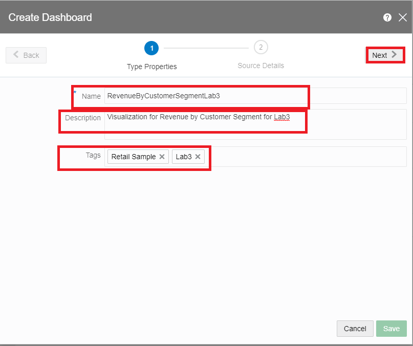

7. Keep the defaults and Save the dashboard.  
8. Notice that the new dashboard is now visible in the Catalog page.
9.  Click on the new RevenueByCustomerSegmentLab3.
10. Click on the *`Edit Dashboard`* button on the top right hand corner.

    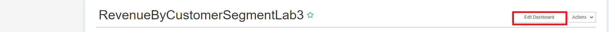

11. The button is now changed to *`Switch to View Mode`*.  
12. On the *`Actions`* dropdown click on the *`Add Visualizations`*.

    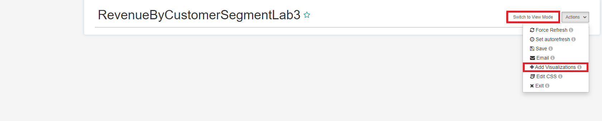

13. A new Add Visualizations to Dashboard screen comes up.  
14. Check the RevenueByCustomerSegementLab3 visualization
15. Click on the Add Visualizations button.

    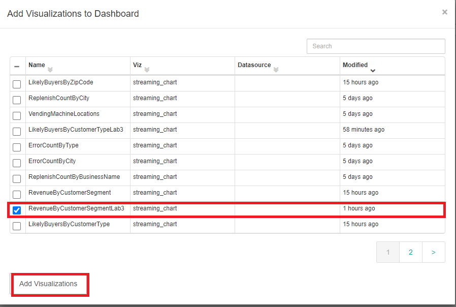

16. Notice that the new dashboard is running and streaming data is displayed as a bar chart.

    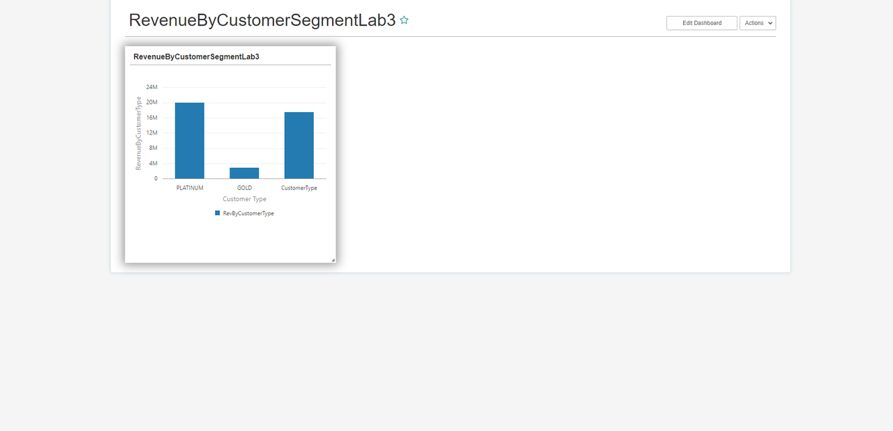

17. You can now Exit the dashboard using the Actions dropdown.

## Task 4: Import/Export
You can use export and import to migrate your pipeline and its contents between GoldenGate Stream Analytics systems, or you can also migrate only select artifacts. You can import a pipeline developed with the latest version of GoldenGate Stream Analytics. You have learned the import functionality in the beginning of this workshop.  In this lab you will export the dashboard that you just create in the last step.

1. Hover over the RevenueByCustomerSegementLab3 dashboard
2. Click on the Export icon on the right part of the screen.
3. In the Export screen name the export as *RevenueByCustomerSegmentLab3Export* and click on the Export button.  
4. Notice all the resources that are exported with this dashboard

    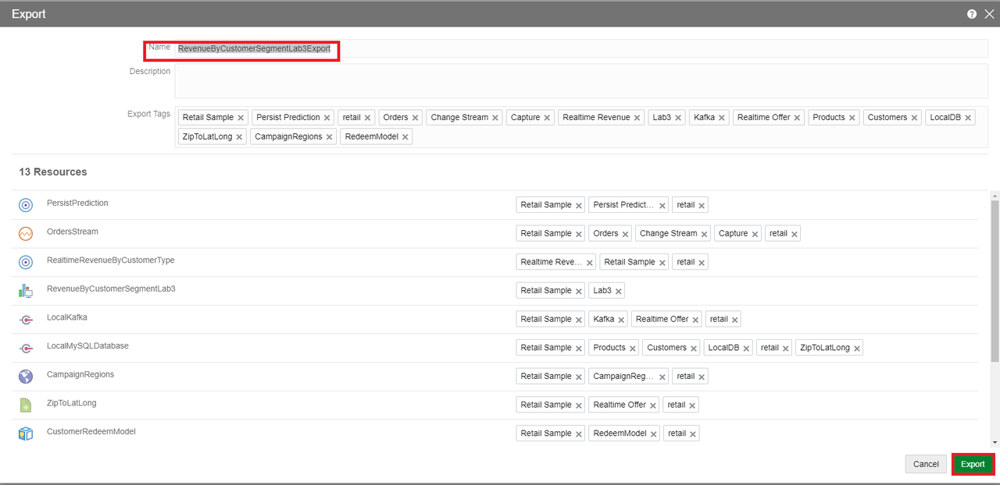

5. Notice that a zip file such as `RevenueByCustomerSegmentLab3Export.zip` has been downloaded to your local machine.

**This concludes this lab.**

## Learn More
* [GoldenGate Stream Analytics](https://www.oracle.com/middleware/technologies)

## Rate this Workshop
When you are finished don't forget to rate this workshop!  We rely on this feedback to help us improve and refine our LiveLabs catalog.  Follow the steps to submit your rating.

1.  Go back to your **workshop homepage** in LiveLabs by searching for your workshop and clicking the Launch button.
2.  Click on any of the **Brown Buttons** to re-access the workshop  

    

3.  Click **Rate this workshop**

    

If you selected the **Green Button** for this workshop and still have an active reservation, you can also rate by going to My Reservations -> Launch Workshop.

## Acknowledgements

* **Author** - Hadi Javaherian, Solution Engineer
* **Contributors** - Shrinidhi Kulkarni, Meghana Banka, Rene Fontcha
* **Last Updated By/Date** - Rene Fontcha, LiveLabs Platform Lead, NA Technology, February 2021
