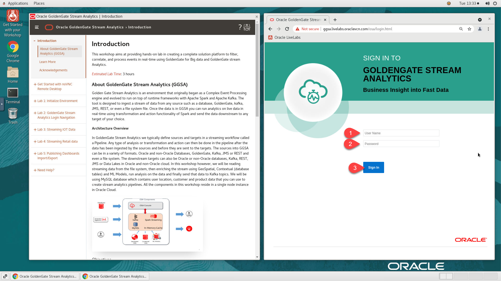
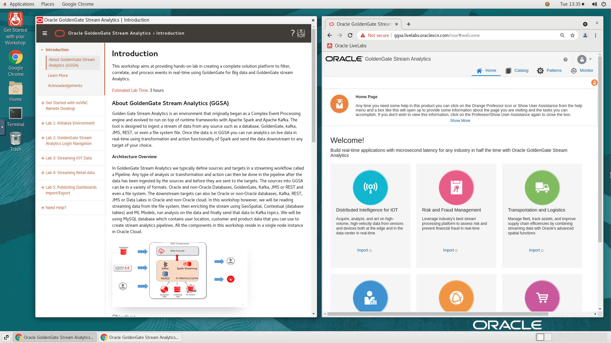
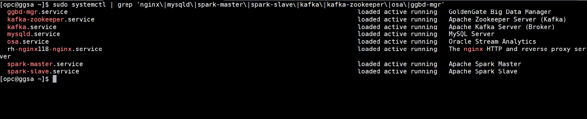
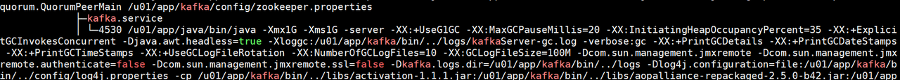

# Initialize Environment

## Introduction

In this lab we will review and startup all components required to successfully run this workshop.

*Estimated Lab Time:* 10 Minutes.

### Objectives
- Initialize the workshop environment.

### Prerequisites
This lab assumes you have:
- A Free Tier, Paid or LiveLabs Oracle Cloud account
- You have completed:
    - Lab: Prepare Setup (*Free-tier* and *Paid Tenants* only)
    - Lab: Environment Setup

## Task 1: Validate That Required Processes are Up and Running.
1. Now with access to your remote desktop session, proceed as indicated below to validate your environment before you start executing the subsequent labs. The following Processes should be up and running:

    - GoldenGate Big Data Manager
    - Apache Zookeeper Server (Kafka)
    - Apache Kafka Server (Broker)
    - MySQL Server
    - Oracle Stream Analytics
    - The nginx HTTP and reverse proxy server
    - Apache Spark Master
    - Apache Spark Slave

2. On the web browser window on the right preloaded with *Golden Gate Stream Analytics* login page, click on the *Username* field and provide the credentials below to login.

    - Username

    ```
    <copy>osaadmin</copy>
    ```

    - Password

    ```
    <copy>welcome1</copy>
    ```

    

3. Confirm successful login. Please note that it takes about 5 minutes after instance provisioning for all processes to fully start.

    - Golden Gate Stream Analytics

    

    - Double click on *Terminal* and execute the below command to check the status for all the services.

    ```
    <copy>
    sudo systemctl | grep 'nginx\|mysqld\|spark-master\|spark-slave\|kafka\|kafka-zookeeper\|osa\|ggbd-mgr'
    </copy>
    ```

    

    If successful, the page above is displayed and as a result your environment is now ready.  

    You may now [proceed to the next lab](#next).

4. If you are still unable to login or the login page is not functioning after reloading from the *Workshop Links* bookmark folder, open a terminal session and proceed as indicated below to validate the services.

    - To check the status for all the service.

    ```
    <copy>
    sudo systemctl status | grep 'nginx\|mysqld\|spark-master\|spark-slave\|kafka\|kafka-zookeeper\|osa\|ggbd-mgr'
    </copy>
    ```

    
    
    


5. If you see questionable output(s), failure or down component(s), restart the corresponding service(s) accordingly

    - Restart all the services.

    ```
    <copy>
    sudo systemctl restart | grep 'nginx\|mysqld\|spark-master\|spark-slave\|kafka\|kafka-zookeeper\|osa\|ggbd-mgr'
    </copy>
    ```

    - If you find that a particular service is not running please restart that service using the below command.

    ```
    <copy>
    sudo systemctl restart <Service-name>
    </copy>
    ```

    *Note*- The following are the service-name used in this workshop

    | Service Name                    |systemctl service             |
    |:-------------                   | :----------------------------|
    | GoldenGate Big Data Manager     | ggbd-mgr.service             |
    | Apache Zookeeper Server (Kafka) | kafka-zookeeper.service      |
    | Apache Kafka Server (Broker)    | kafka.service                |
    | MySQL Server                    | mysqld.service               |
    | Oracle Stream Analytics         | osa.service                  |
    | The nginx HTTP and reverse proxy| rh-nginx118-nginx.service    |
    | Apache Spark Master             | spark-master.service         |
    | Apache Spark Slave              | spark-slave.service          |

    You may now [proceed to the next lab](#next).

## Appendix 1: Managing Startup Services

- Start

    ```
    <copy>sudo systemctl start <Service-name></copy>
    ```

- Stop

    ```
    <copy>sudo systemctl stop <Service-name></copy>
    ```

- Status

    ```
    <copy>sudo systemctl status <Service-name></copy>
    ```

- Restart

    ```
    <copy>sudo systemctl restart <Service-name></copy>
    ```

    *Note*- The following are the service-name used in this workshop

    | Service Name                    |systemctl service             |
    |:-------------                   | :----------------------------|
    | GoldenGate Big Data Manager     | ggbd-mgr.service             |
    | Apache Zookeeper Server (Kafka) | kafka-zookeeper.service      |
    | Apache Kafka Server (Broker)    | kafka.service                |
    | MySQL Server                    | mysqld.service               |
    | Oracle Stream Analytics         | osa.service                  |
    | The nginx HTTP and reverse proxy| rh-nginx118-nginx.service    |
    | Apache Spark Master             | spark-master.service         |
    | Apache Spark Slave              | spark-slave.service          |


## Acknowledgements
* **Author** - Ashish Kumar, LiveLabs Platform, NA Technology, July 2021
* **Contributors** -  Nisharahmed Soneji, Sukin Varghese , Rene Fontcha
* **Last Updated By/Date** - Rene Fontcha, LiveLabs Platform Lead, NA Technology, September 2021
