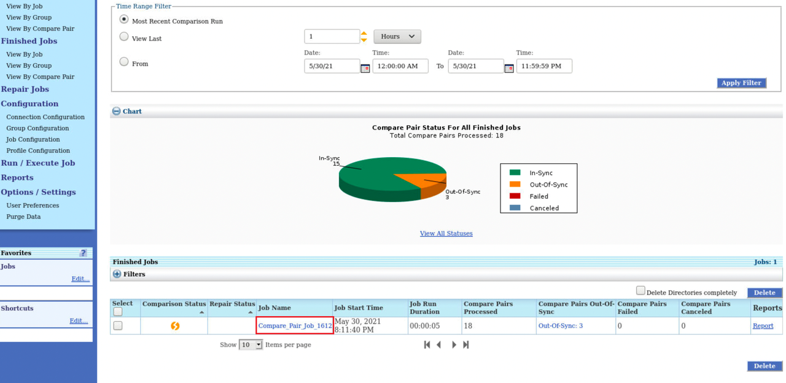
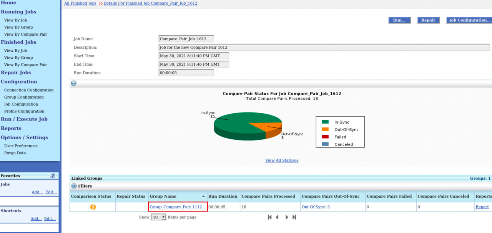
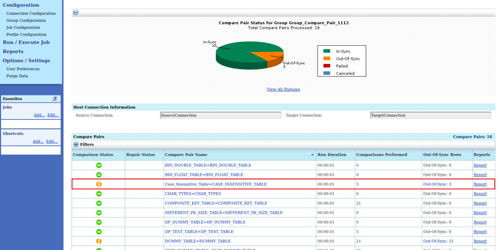
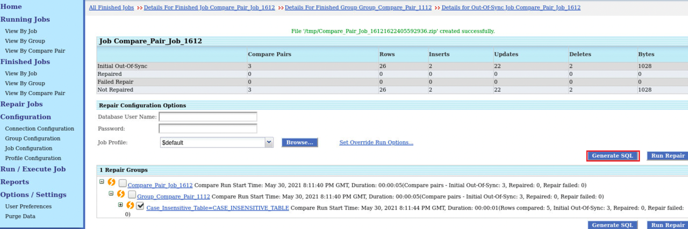
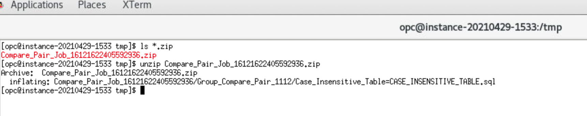
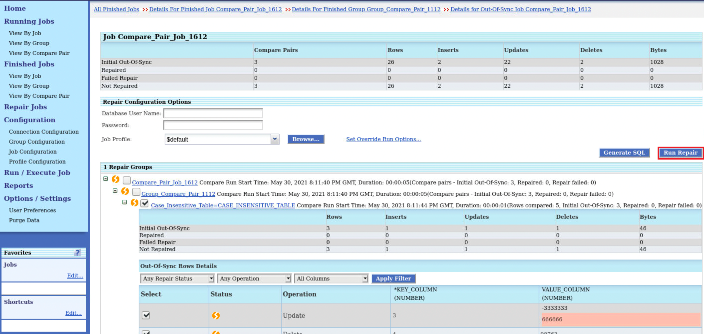
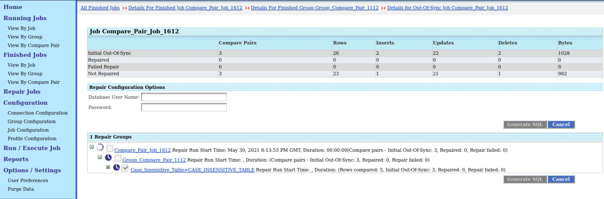
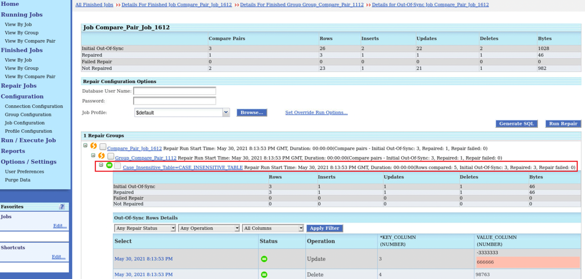

# Repair Out-of-Sync Jobs and Generate SQL Files

## Introduction
From the Finished Jobs page, you can select the out-of-sync comparisons for repair. Jobs, groups, and compare pairs can be selected for repair.

The Repair Jobs page displays a summary of all repair jobs. You can use the Filters on this page to display older repair jobs and to filter repair jobs by repair status and job name.

Oracle GoldenGate Veridata provides the Generate SQL functionality which generates SQL files for the source and target tables associated with the out-of-sync jobs. To do that, the Oracle GoldenGate Veridata generates the SQL Statements in the background and executes these SQL statements onto the target database.

You can also look at these SQL Statements before the Oracle GoldenGate Veridata executes them onto the target database, or execute these SQL statements by yourself on any of the other database tools. With the Generate Repair SQL functionality, you can generate the SQL statements for all your out-of-sync-records, and can also execute them at your convenience.

*Estimated Lab Time*: 30 minutes

### Objectives
In this lab, you will:
* Repair out-of-sync jobs.
* Generate SQL files for out-of-sync jobs.

### Prerequisites
This lab assumes you have:
- A Free Tier, Paid or LiveLabs Oracle Cloud account
- SSH Private Key to access the host via SSH (*Free-tier* and *Paid Tenants* only)
- You have completed:
    * Lab: Generate SSH Keys (*Free-tier* and *Paid Tenants* only)
    * Lab: Prepare Setup (*Free-tier* and *Paid Tenants* only)
    * Lab: Environment Setup
    * Lab: Initialize Environment
    * Lab: Create Datasource Connections
    * Lab: Create Groups and Compare Pairs.
    * Lab: Create and Execute Jobs

## **STEP 1:** Generate SQL Files

You can generate SQL files only for Jobs that have been configured for datasource connections with the Oracle datatype.

To generate SQL files:
  1. From the left navigation pane, click **Finished Jobs** to view the page containing details of all the finished jobs. You can select Jobs, groups, and compare pairs for generating SQL statements.
  2. From the table under **Finished Jobs**, click the Job name link under **Job Name**:
          
  3. Click the Group name under the **Group Name**:
          

 4. Click the **Out of Sync** link for the Compare Pair name **Case\_Insensitive_Table\=CASE\_INSENSITIVE\_TABLE**:
    

  5. Click **Generate SQL**.
    
    The SQL file gets generated.

  6. Open a terminal to view the generated SQL file. Navigate to the generated location:

      

  7. Unzip the SQL file to view its contents.

      

## **STEP 2:** Repair Out-of-Sync Jobs

  To repair out-of-sync jobs:
  1. From the left navigation pane, click **Finished Jobs** to view the page containing details of all the finished jobs. You can select Jobs, groups, and compare pairs for repairing out-of-sync records.
  2. From the table under **Finished Jobs**, click the Job name link under **Job Name**:
          
  3. Click the Group name under the **Group Name**:
          

 4. Click the **Out Of Sync** link for the Compare Pair name **Case\_Insensitive_Table\=CASE\_INSENSITIVE\_TABLE**:
    

  5. Click **Run Repair**.
    

    

    

The out-of-sync records for the selected job are repaired.

You may now [proceed to the next lab](#next).

## Learn More
* [Oracle GoldenGate Veridata Documentation](https://docs.oracle.com/en/middleware/goldengate/veridata/12.2.1.4/index.html)
* [Repair Data](https://docs.oracle.com/en/middleware/goldengate/veridata/12.2.1.4/gvdug/working-jobs.html#GUID-B46185DF-4B7E-4647-8BE2-F7176E1FFDFF)
* [Generate SQL File](https://docs.oracle.com/en/middleware/goldengate/veridata/12.2.1.4/gvdug/working-jobs.html#GUID-0AA3E8E2-BAD3-41D2-83CD-E8986C69A3AB)

## Acknowledgements
* **Author** - Anuradha Chepuri, Principal UA Developer, Oracle GoldenGate User Assistance
* **Contributors** -  Nisharahmed Soneji, Sukin Varghese , Rene Fontcha
* **Last Updated By/Date** - Rene Fontcha, LiveLabs Platform Lead, NA Technology, June 2021
