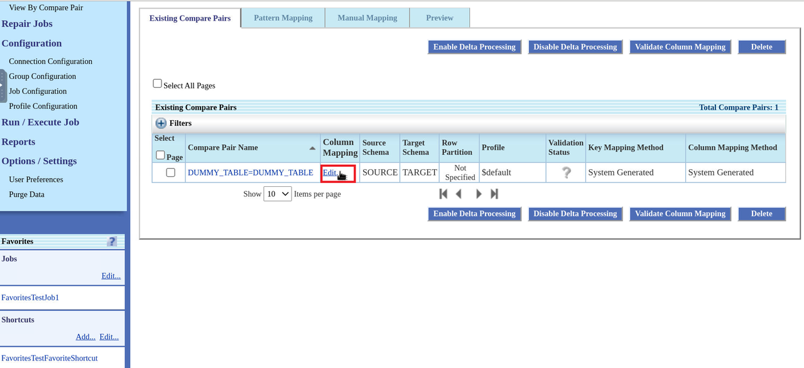
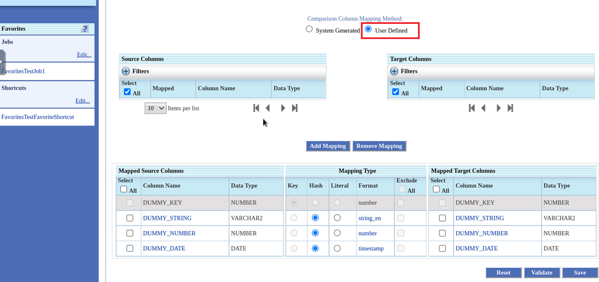
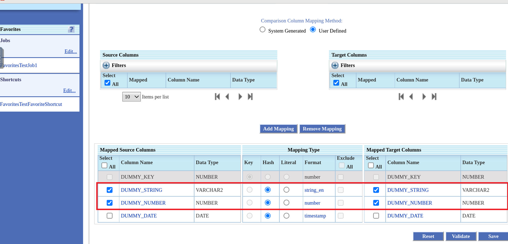
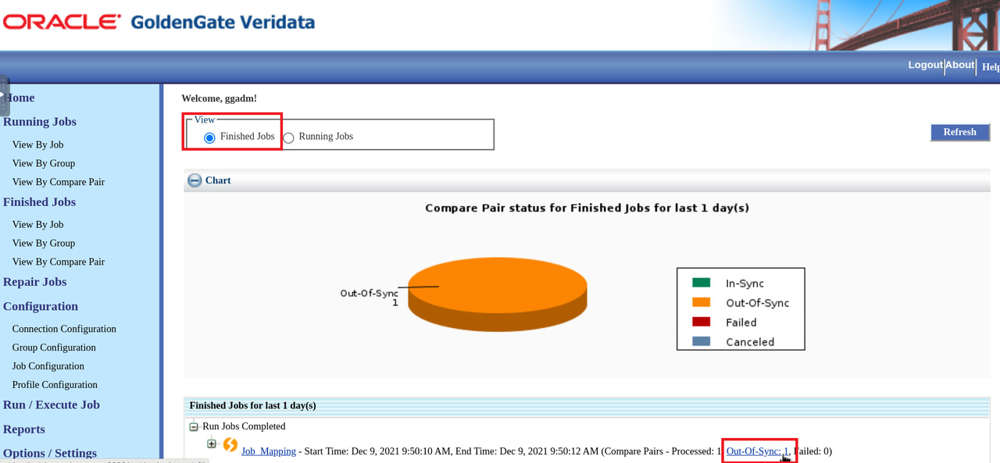
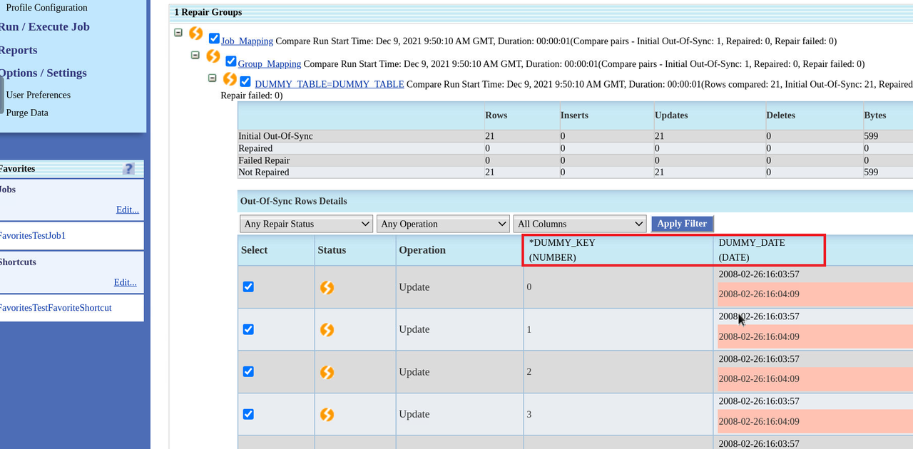
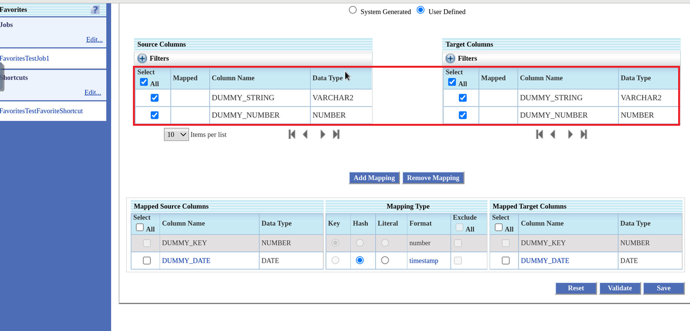
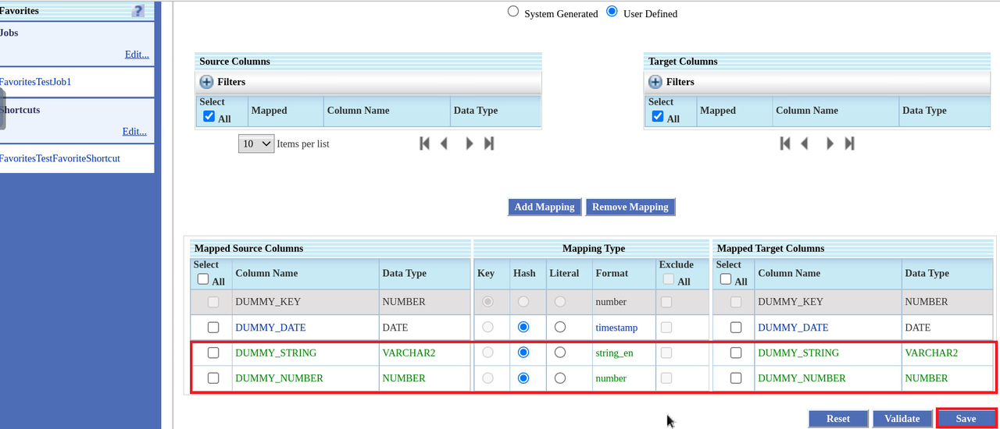
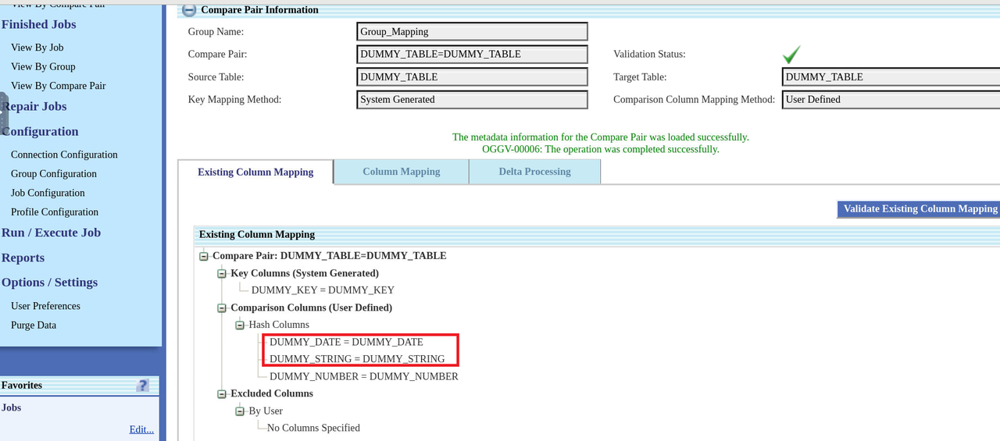
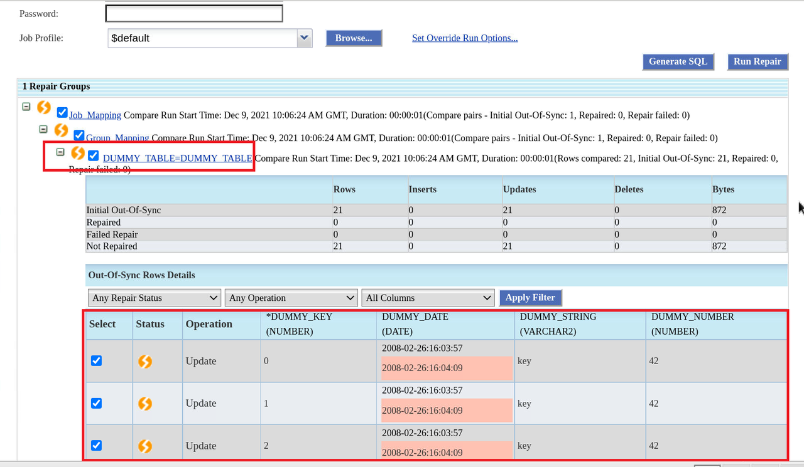

# Add and Remove Mappings

## Introduction
This lab describes how to add and remove mappings.

In Oracle GoldenGate Veridata, you can add mappings to the selected source and target tables. Compare Pairs can then be configured for these columns. You can also remove the mappings from columns.

*Estimated Lab Time*: 20 minutes

### Objectives
In this lab, you will:
* Add column mapping
* Remove column mapping

### Video Preview
Watch our short video that explains the partitioning feature in Oracle GoldenGate Veridata: 

### Prerequisites
This lab assumes you have:
- A Free Tier, Paid or LiveLabs Oracle Cloud account
- You have completed:
    * Lab: Prepare Setup (*Free-tier* and *Paid Tenants* only)
    * Lab: Environment Setup
    * Lab: Initialize Environment
    * Lab: Create Datasource connections
    * Lab: Create Groups and Compare Pairs. Create a Group by name **Group\_Mapping**.
    * Lab: Create Groups and Compare Pairs. Follow the Tasks 1 to 2 to create a compare pair.
- The understanding of **Lab: Create Jobs and Execute Jobs**.

## **Task 1:** Remove Mappings
To Remove Column Mapping:

1. In the Oracle GoldenGate Veridata UI, click **Group Configuration**, select a group, click **Edit**, and click **Go to Compare Pair Configuration** to display the **Compare Pair Configuration** page.

2. Click **Manual Mapping**.

3. Select a Source **Schema** and a Target **Schema** under **Datasource Information**, and then select the tables from **Source Tables** and **Target Tables** for Manual Compare Pair Mapping. Enter:

    * Source schema: **SOURCE**
    * Target schema: **TARGET**
    * Source Table: **DUMMY\_TABLE**
    * Target Table: **DUMMY\_TABLE**

4. Click **Generate Mappings**. The control moves to the **Preview** tab.

5. Click **Save** to save the generated compare pair.

   The control moves to the **Existing Compare Pairs** tab.

6. Click **Edit** under **Column Mapping**.
    

7. Click **User Defined** under **Comparison Column Mapping Method**.

    

8. Select the columns to remove and then click **Remove Mapping**.

    

    The columns get removed.

    

9. Click **Save**.

  On the **Existing Column Mapping** tab, the remaining mapped columns **DUMMY\_KEY** and **DUMMY\_DATE** are displayed.

    

10. Click **Job Configuration**, click **New** to create a new job by Job Name **Job\_Mapping** by following the steps in **Lab - Create Jobs and Execute Jobs**, and then select **Group\_Mapping** group you created to add group to this job.

11. Run the Job **Job\_Mapping**.

12. On the Home Page, click the **out-of-sync** link for job **Job_Mapping**.
    

    Comparison is now complete for the columns **DUMMY\_KEY** and **DUMMY\_DATE**. The other 2 mapped columns (**DUMMY\_STRING** and **DUMMY\_NUMBER**) have been skipped from being mapped and compared.

    

## **Task 2:** Add Mappings

To add mappings:

1. In the Oracle GoldenGate Veridata UI, click **Group Configuration**, select a group, click **Edit**, and click **Go to Compare Pair Configuration** to display the **Compare Pair Configuration** page.

2. Click **Manual Mapping**.

3. Select a Source **Schema** and a Target **Schema** under **Datasource Information**, and then select the tables from **Source Tables** and **Target Tables** for Manual Compare Pair Mapping. Enter:

    * Source schema: **SOURCE**
    * Target schema: **TARGET**
    * Source Table: **DUMMY\_TABLE**
    * Target Table: **DUMMY\_TABLE**

4. Click **Generate Mappings**. The control moves to the **Preview** tab.

5. Click **Save** to save the generated compare pair.

   The control moves to the **Existing Compare Pairs** tab.

6. Click **Edit** under **Column Mapping**.
    

7. Select the columns (both Source and Target Columns) and click **Add Mapping** to add the columns for mapping.

    

      The columns **DUMMY\_STRING** and **DUMMY\_NUMBER** are added for mapping.

    

8. Click **Save**
    These columns are added for comparison.

    

9. Click **Job Configuration**, click **New** to create a new job by Job Name **Job_Mapping** by following the steps in **Lab - Create Jobs and Execute Jobs**, and then select **Group_Mapping** group you created to add group to this job.

10. Run the Job **Job_Mapping**.

11. On the Home Page, click the **out-of-sync** link for job **Job_Mapping**.

      

12. Expand **DUMMY\_TABLE-DUMMY\_TABLE** notice that the **DUMMY\_STRING** and **DUMMY\_DATE** columns have also been added for comparison along the **DUMMY\_KEY** and **DUMMY\_NUMBER** columns.

You may now [proceed to the next lab](#next).

## Want to Learn More?

* [Get Started with Oracle GoldenGate Veridata Workshop](https://apexapps.oracle.com/pls/apex/dbpm/r/livelabs/view-workshop?wid=833&clear=180&session=4555570607052)
* [Master Oracle GoldenGate Veridata Advanced Features Workshop](https://apexapps.oracle.com/pls/apex/dbpm/r/livelabs/view-workshop?wid=913&clear=180&session=4555570607052)
* [Oracle GoldenGate Veridata Documentation](https://docs.oracle.com/en/middleware/goldengate/veridata/12.2.1.4/index.html)
* [Configuring Column Mappings](https://docs.oracle.com/en/middleware/goldengate/veridata/12.2.1.4/gvdug/configure-workflow-objects.html#GUID-00CDC229-E373-47FD-8D68-C6BAF0D4C237)

## Acknowledgements
* **Author** - Anuradha Chepuri, Principal UA Developer, Oracle GoldenGate User Assistance
* **Contributors** -  Sukin Varghese, Jonathan Fu, Meghana Banka
* **Last Updated By/Date** - Anuradha Chepuri, May 2022
