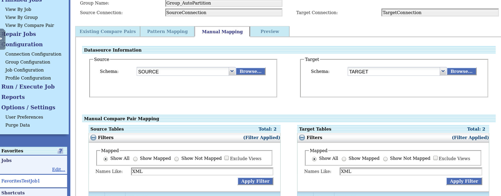
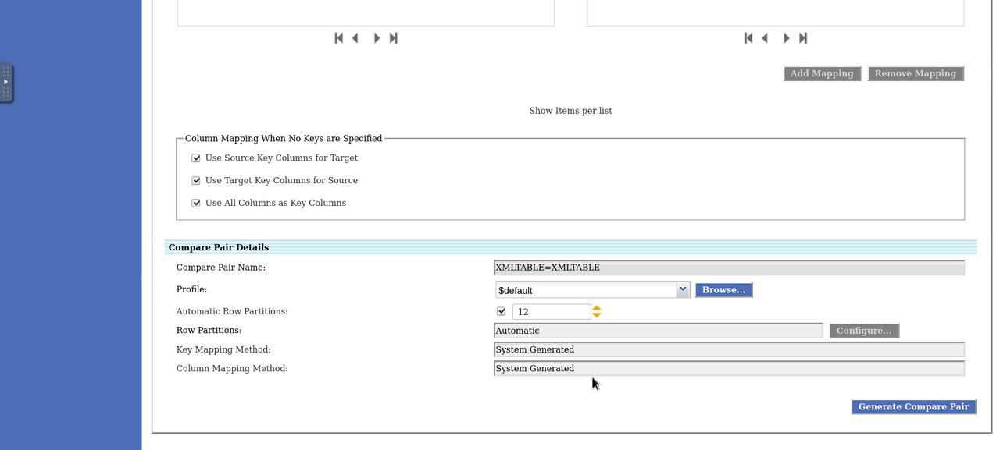
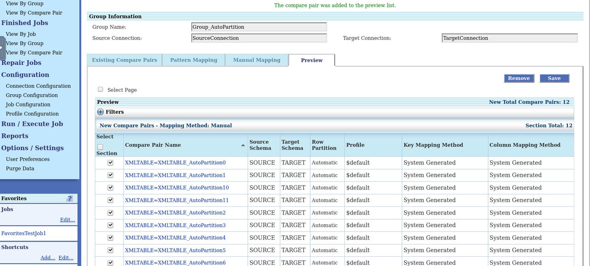
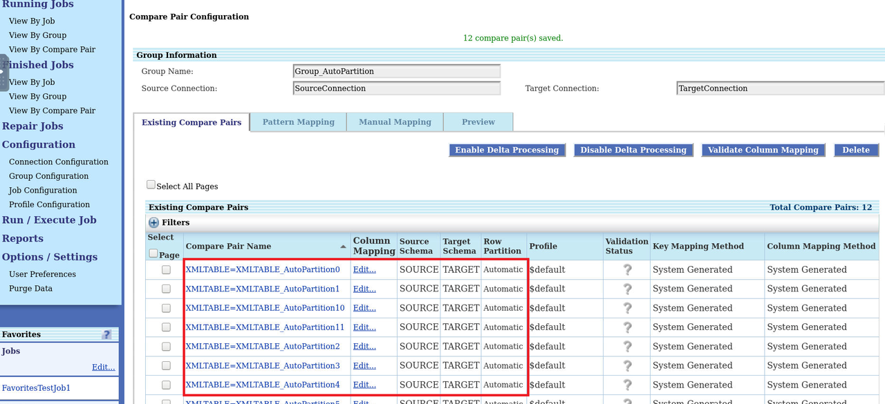

# Configure Auto Partitions

## Introduction
This lab describes how to split the large table comparison into multiple partitions and then you  use Automatic Row Partitioning option. The partitioning is possible only when both the source database and target database are Oracle.

The automatic row partition creates configurable partitions and generates compare pairs for each generated partition.

*Estimated Lab Time*: 20 minutes

Watch our short video that explains the partitioning feature in Oracle GoldenGate Veridata:

### Objectives
In this lab, you will:
* Create Automatic Row Partitioning.

### Prerequisites
This lab assumes you have:
- A Free Tier, Paid or LiveLabs Oracle Cloud account
- You have completed:
    * Lab: Prepare Setup (*Free-tier* and *Paid Tenants* only)
    * Lab: Environment Setup
    * Lab: Initialize Environment
    * Lab: Create Datasource connections
    * Lab: Create Groups and Compare Pairs. Create a Group by name **`Group_AutoPartition`**.
    * Lab: Create Groups and Compare Pairs. Follow the Tasks 1 to 2 to create a compare pair.

## **Task 1:** Configure Automatic Row Partitioning
To configure Automatic Row Partitioning:

1. In the Oracle GoldenGate Veridata UI, click **Group Configuration**, select a group, click Edit, and click **Go to Compare Pair Configuration** to display the **Compare Pair Configuration** page.

2. Click **Manual Mapping**.

3. Select a Source **Schema** and a Target **Schema** under **Datasource Information**, and then select the tables from **Source Tables** and **Target Tables** for Manual Compare Pair Mapping. Enter:

    * Source schema: **SOURCE**
    * Target schema: **TARGET**
    * Source Table: **XMLTABLE**
    * Target Table: **XMLTABLE**

    

4. Select the **Automatic Row Partitions** check box.

5. Enter a numeric value between 2 to 100 in the text field.

    Enter:

    * **Automatic Row Partitions**: **12**

    

6. Click **Generate Mappings**. The control moves to the **Preview** tab.

    

7. Click **Save** to save the generated compare pair.

The control moves to the **Existing Compare Pairs** tab.
Notice the compare pairs that have been generated with Automatic Row Partition.

    

You may now [proceed to the next lab](#next).

## Want to Learn More?

* [Oracle GoldenGate Veridata Documentation](https://docs.oracle.com/en/middleware/goldengate/veridata/12.2.1.4/index.html)
* [Configuring Partitions in Oracle GoldenGate Veridata ](https://docs.oracle.com/en/middleware/goldengate/veridata/12.2.1.4/gvdug/configure-workflow-objects.html#GUID-03B3876F-7A79-43BA-9E14-8B216BD8F3BB)

## Acknowledgements
* **Author** - Anuradha Chepuri, Principal UA Developer, Oracle GoldenGate User Assistance
* **Contributors** -  Sukin Varghese , Jonathan Fu, Rene Fontcha
* **Last Updated By/Date** - Rene Fontcha, LiveLabs Platform Lead, NA Technology, November 2021
