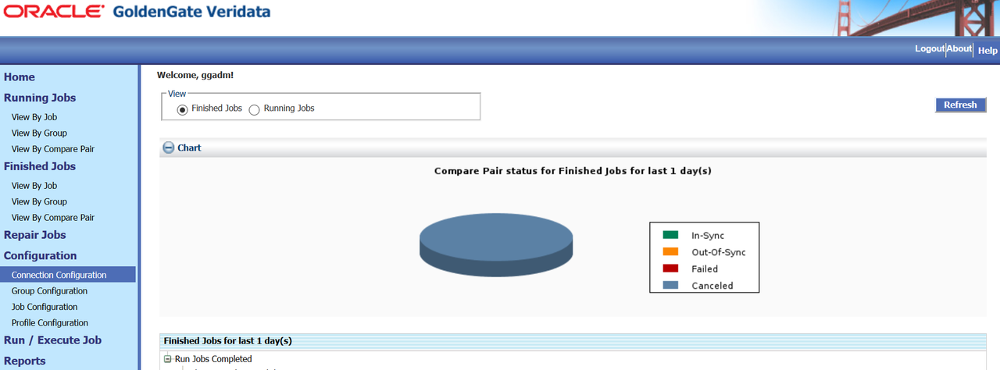
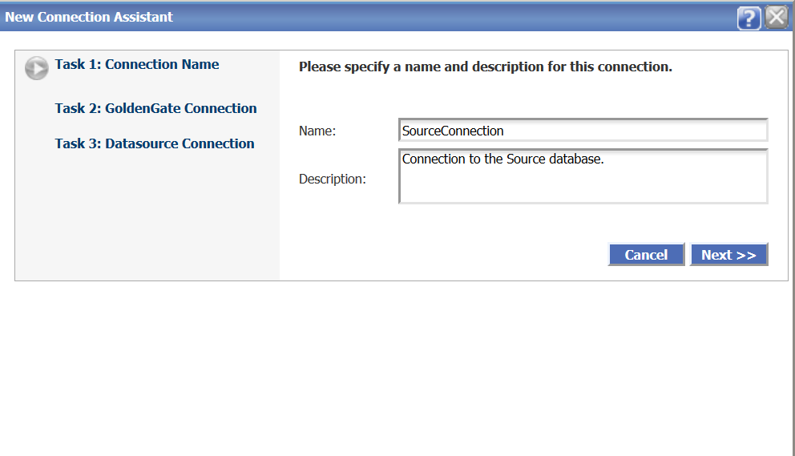
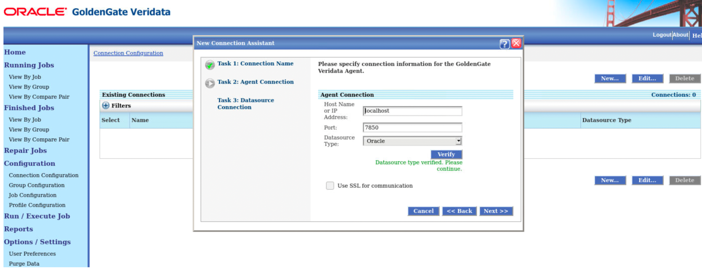
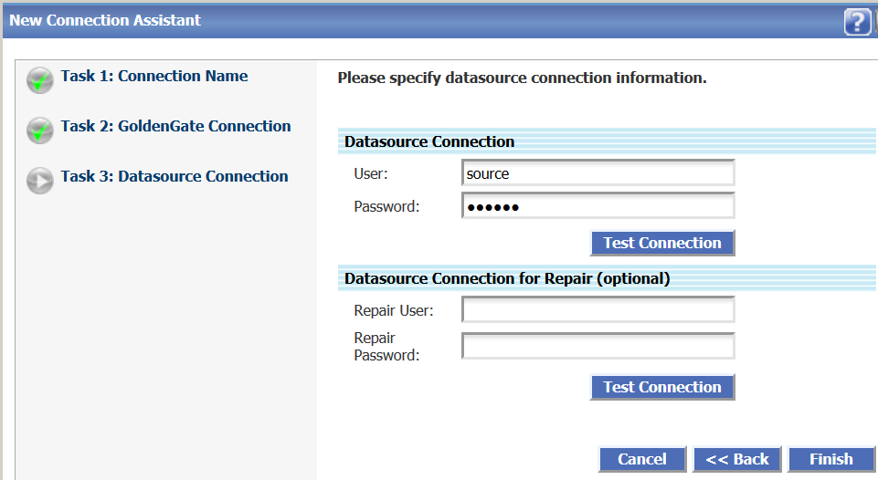
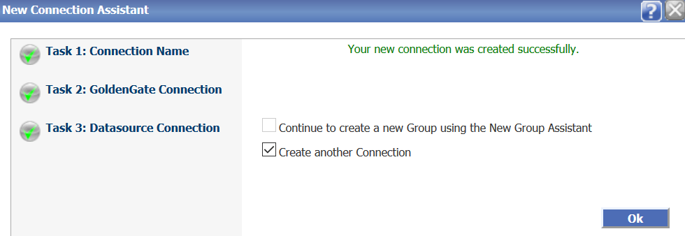

# Create Datasource Connections

## Introduction
This lab describes how to configure datasource connections. The Oracle GoldenGate Veridata  Server must be able to connect to an Oracle GoldenGate Veridata Agent for each database that contains source and target data that you want to compare. A connection is defined by a host, the port number of an Oracle GoldenGate Veridata Agent (or Manager, if a C-agent), and the datasource that is accessed by the agent. You need to create connections before you create any of the GoldenGate Veridata objects, such as groups, compare pairs, profiles, or jobs.

### Video Preview
  Watch this short video on how to create datasource connections, groups, compare pairs, jobs, and repair data:

[](youtube:DiAapnWt0No)


*Estimated Lab Time*: 45 minutes

### Objectives
In this lab, you will:
* Create a Connection in Oracle GoldenGate Veridata.

### Prerequisites
This lab assumes you have:
- A Free Tier, Paid or LiveLabs Oracle Cloud account
- You have completed:
    * Lab: Prepare Setup (*Free-tier* and *Paid Tenants* only)
    * Lab: Environment Setup
    * Lab: Initialize Environment

## Task 1: Create a Connection
To get started with Oracle GoldenGate Veridata, you must define a connection to the source and target databases that contain the data that you want to compare. Oracle GoldenGate Veridata Server uses the connection information to communicate with Oracle GoldenGate Veridata Agent.

**Note**: Ensure that you have the Administrator or the Power User roles to create and configure connections.

To create connections:
1. From the left navigation pane, click **Configuration** and then click **Connection Configuration** to display the **Connection configuration** page.

    

2. Click **New** to display the **New Connection Assistant** page to create one connection for the source database.

3. Enter the **Connection Name**, for example, **SourceConnection** and click **Next**.

    

4. Enter the following details:

    * **Host Name or IP Address**: Name of the host where Oracle GoldenGate Veridata Agent is running.

      Enter

          ```
          <copy>
          veridata.livelabs.oraclevcn.com
          </copy>
          ```
      OR

          ```
          <copy>
          localhost
          </copy>
          ```

    * **Port**: The port number for Oracle GoldenGate Veridata Agent on that host. Enter

          ```
          <copy>
          7850
          </copy>
          ```

    * **Datasource Type**: The datasource that is associated with this agent. Click **Verify**.

    

5. Click **Next** to enter the Datasource Connection credentials:

    * **User**: source
    * **Password**: source

    

6. Click **Test Connection**.

7. Click **Finish**.

    You have created one connection successfully.

8. Click **Create another Connection** to create the target connection. Follow points 3 to 7 to create the second connection (for example, **TargetConnection**) for the target database:

    * **User**: target
    * **Password**: target

      

9. Click **OK** to display the **New Connection Assistant** page.

You may now [proceed to the next lab](#next).

## Learn More
* [Get Started with Oracle GoldenGate Veridata Workshop](https://apexapps.oracle.com/pls/apex/dbpm/r/livelabs/view-workshop?wid=833&clear=180&session=4555570607052)
* [Master Oracle GoldenGate Veridata Advanced Features Workshop](https://apexapps.oracle.com/pls/apex/dbpm/r/livelabs/view-workshop?wid=913&clear=180&session=4555570607052)
* [Oracle GoldenGate Veridata Documentation](https://docs.oracle.com/en/middleware/goldengate/veridata/12.2.1.4/index.html)
* [Configuring Connections](https://docs.oracle.com/en/middleware/goldengate/veridata/12.2.1.4/gvdug/configure-workflow-objects.html#GUID-75005B4D-5C24-4467-A68B-1FE66A168905)

## Acknowledgements
* **Author** - Anuradha Chepuri, Principal UA Developer, Oracle GoldenGate User Assistance
* **Contributors** -  Sukin Varghese, Jonathan Fu
* **Last Updated By/Date** - Anuradha Chepuri, May 2022
