# Create Groups and Compare Pairs

## Introduction
This lab describes how to groups and compare pairs. Groups are logical containers for one or more compare pairs. They help you to organize and partition large or diverse sets of data into more manageable units. Groups are linked to jobs when jobs are created. Any group can be linked to one or more jobs, allowing you complete control over how and when data is compared.

A group is associated with a set of connections to the source and target data.

A compare pair is the logical relationship between a source table or file and a target table or file for the purpose of comparing their data. Compare pairs are linked to groups. Because of this, all of the source and target objects that you configure into compare pairs for any given group must be accessible from the datasource connections that are associated with that group.

*Estimated Lab Time*: 45 minutes

### Objectives
In this lab, you will:
* Create a Group.
* Create Compare Pairs (on Manual Mapping and Pattern Mapping tabs).
* Create a job for the Compare Pair Groups.
* Run the job.

### Video Preview
Watch our short video that explains the partitioning feature in Oracle GoldenGate Veridata: 

### Prerequisites
This lab assumes you have:
- A Free Tier, Paid or LiveLabs Oracle Cloud account
- You have completed:
    * Lab: Prepare Setup (*Free-tier* and *Paid Tenants* only)
    * Lab: Environment Setup
    * Lab: Initialize Environment
    * Lab: Create Datasource Connections

## Task 1: Create a Group

To create a group:

1. From the left navigation pane, click **Configuration** and then click **Group Configuration** to display the **Group configuration** page.

    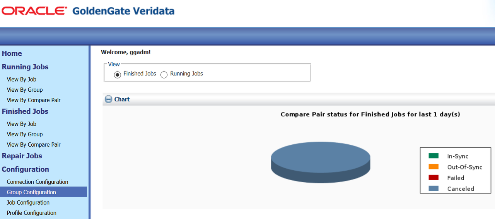

2. Click **New** to display the **New Group Assistant** page to create a group.

3. Enter the **Name** and **Description** for the Group and click **Next**.

  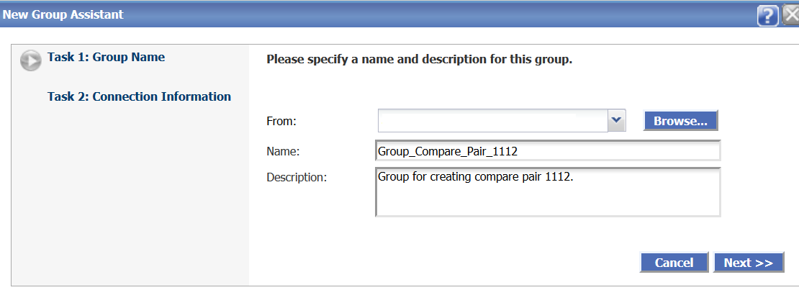

4. Click **Next** to enter the connection information.

5. Browse to select the **Source Connection** and **Target Connection** (that you have created in **Lab: Create Datasource Connections**).

  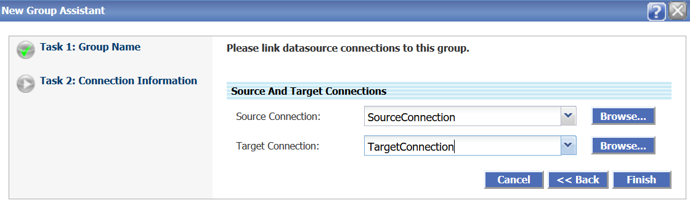

6. Click **Finish**.

Your new Group has been created.

## Task 2: Create Compare Pairs (on Manual Mapping Tab)
Use the **Manual Mapping** tab to map source objects to target objects one at a time. This method is useful when source and target names differ vastly and cannot be mapped by using wildcards.
To create compare pairs on the **Manual Mapping** tab:
1. After you have created the Group, click **Go to Compare Pair Configuration...** check box in the **New Group Assistant** page to display the **Compare Pair Configuration** page.

2. Click **OK**.

    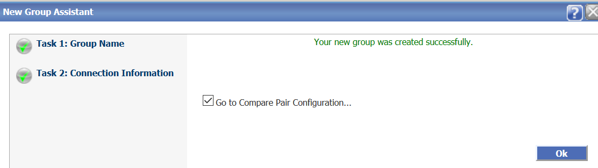

3. Click **Manual Mapping**.

4. Select a Source **Schema** and a Target **Schema** under **Datasource Information**, and then select the tables from **Source Tables** and **Target Tables** for Manual Compare Pair Mapping. Enter:

    * Source schema: **SOURCE**
    * Target schema: **TARGET**
    * Source Table: **CHAR_TYPES**
    * Target Table: **CHAR_TYPES**

    

5. Click **Generate Compare Pair** to add the compare pair to the preview list.

    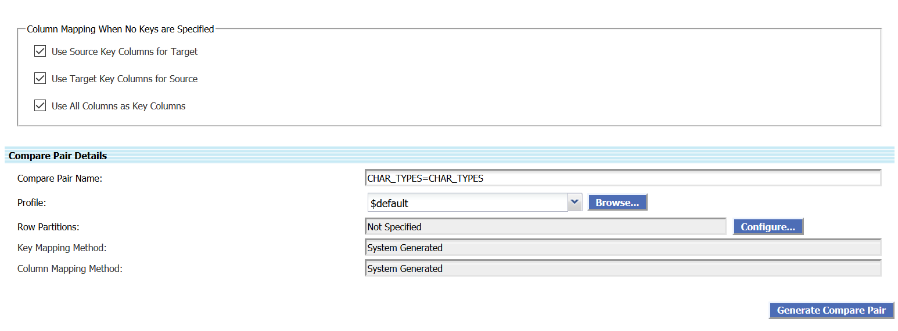

6. Go the **Preview** tab and click **Save** to save the generated compare pair.

    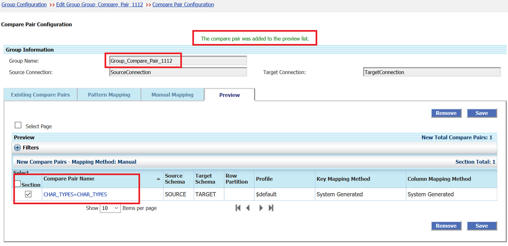

    The control moves to the **Existing Compare Pairs** tab.

    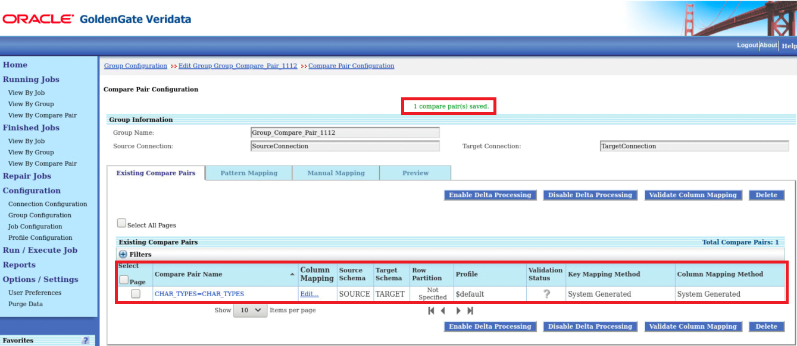

Similarly, you can create any number of compare pairs for other tables.

## Task 3: Create Compare Pairs (on Pattern Mapping Tab)
If you don’t want to add new compare pairs, you may directly jump to **Lab Create and Execute Job**. Use the **Pattern Mapping** tab to map numerous source and target objects at once by using:

* An exact name match (for example TAB1=TAB1).
* A SQL percent (%) wildcard (for example, %_Table)
* An asterisk (GoldenGate *) wildcard to map differently named source and targets whose naming conventions support wildcarding.

To create compare pairs on the **Pattern Mapping** tab:
1. In the **Compare Pair Configuration** page, click **Pattern Mapping**.

    

2. Select a Source **Schema** and a Target **Schema** under **Datasource Information**. Enter:

    * Source schema: **SOURCE**
    * Target schema: **TARGET**

3. Under **Pattern Compare Pair Mapping**, select a **Table Mapping Method**. You can select any of the following:

    - **Map Source and Target Tables Using Exact Names**: Let's select this option here:

    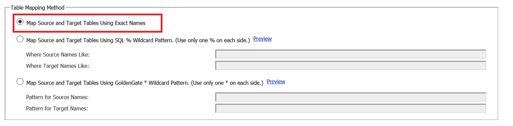

    - **Map Source and Target Tables Using SQL % Wildcard Pattern. (Use only one % on each side.)**.

        Enter:
        * Where Source Names Like: **%\_Table**

        * Where Target Names Like: **%\_Table**

    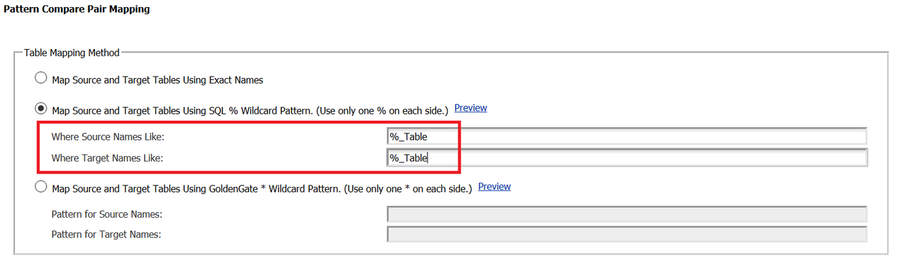

    - **Map Source and Target Tables Using GoldenGate * Wildcard Pattern. (Use only one * on each side.)**.

        Enter:
        * Pattern for Source Names: **DUMMY_TABLE**

        * Pattern for Target Names: *****

    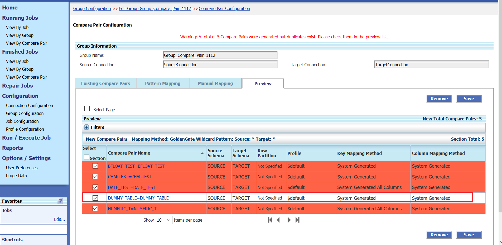

4. Click **Generate Mappings**. The control moves to the **Preview** tab. Here, option **3b** has been selected.

    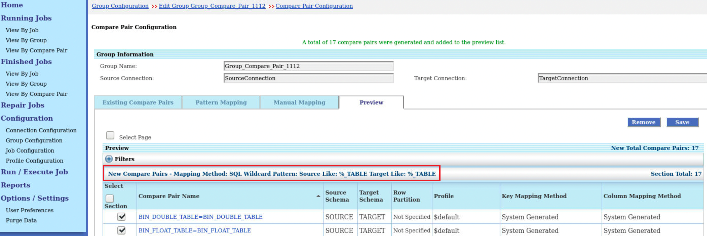

5. Click **Save** to save the generated compare pair. The control moves to the **Existing Compare Pairs** tab.

    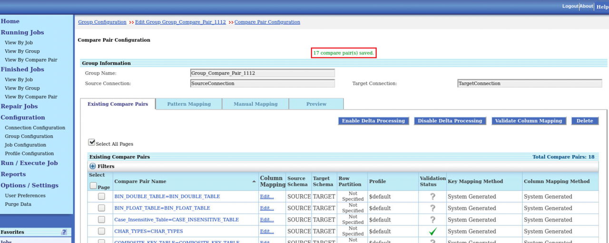

You may now [proceed to the next lab](#next).

## Learn More
* [Get Started with Oracle GoldenGate Veridata Workshop](https://apexapps.oracle.com/pls/apex/dbpm/r/livelabs/view-workshop?wid=833&clear=180&session=4555570607052)
* [Master Oracle GoldenGate Veridata Advanced Features Workshop](https://apexapps.oracle.com/pls/apex/dbpm/r/livelabs/view-workshop?wid=913&clear=180&session=4555570607052)
* [Oracle GoldenGate Veridata Documentation](https://docs.oracle.com/en/middleware/goldengate/veridata/12.2.1.4/index.html)
* [Configuring Groups](https://docs.oracle.com/en/middleware/goldengate/veridata/12.2.1.4/gvdug/configure-workflow-objects.html#GUID-70B42ABB-EA8E-4ADF-8414-7EA1752CA7E6)
* [Compare Pairs](https://docs.oracle.com/en/middleware/goldengate/veridata/12.2.1.4/gvdug/configure-workflow-objects.html#GUID-055CE119-0307-4826-98C7-A51F53E28763)
* [Jobs](https://docs.oracle.com/en/middleware/goldengate/veridata/12.2.1.4/gvdug/working-jobs.html#GUID-EE434517-18EB-4827-A05F-D420D9E5B0DD)

## Acknowledgements
* **Author** - Anuradha Chepuri, Principal UA Developer, Oracle GoldenGate User Assistance
* **Contributors** -  Sukin Varghese, Jonathan Fu, Rene Fontcha
* **Last Updated By/Date** - Anuradha Chepuri, May 2022
