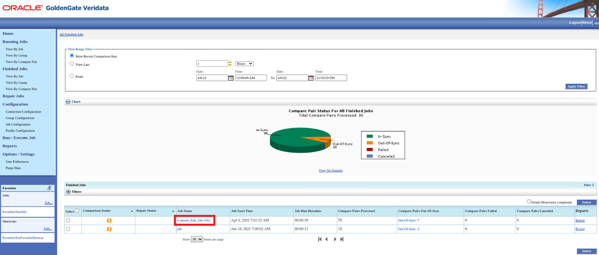
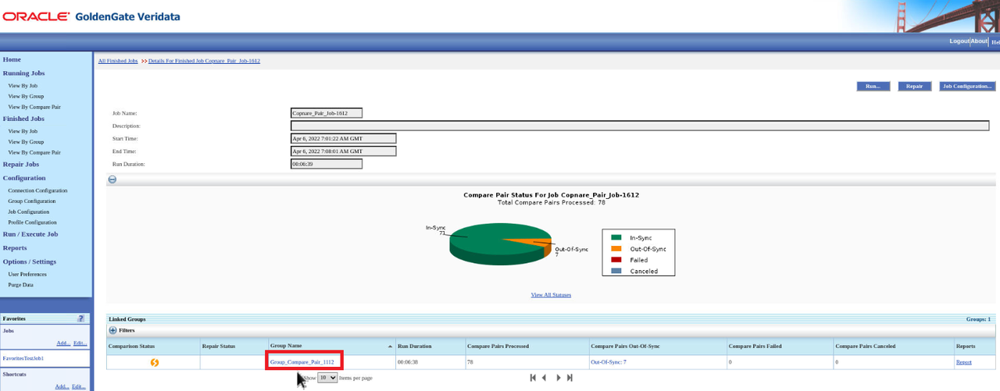
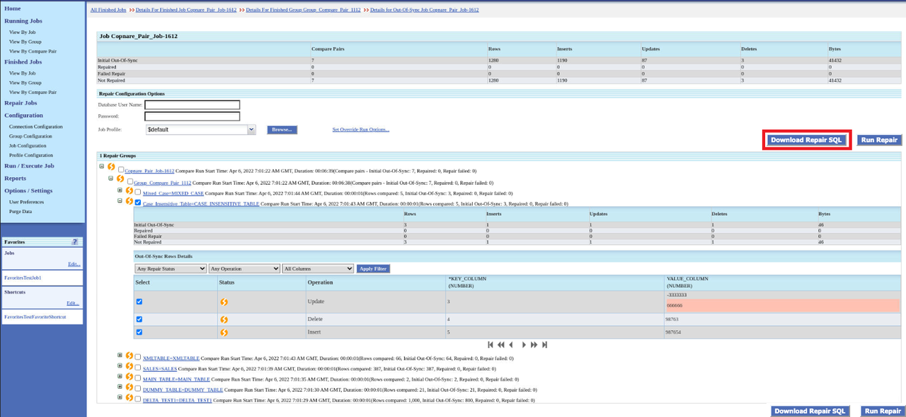
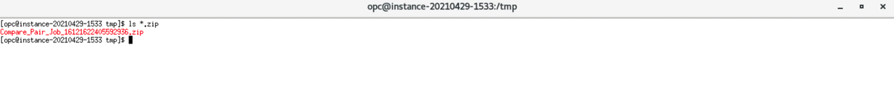
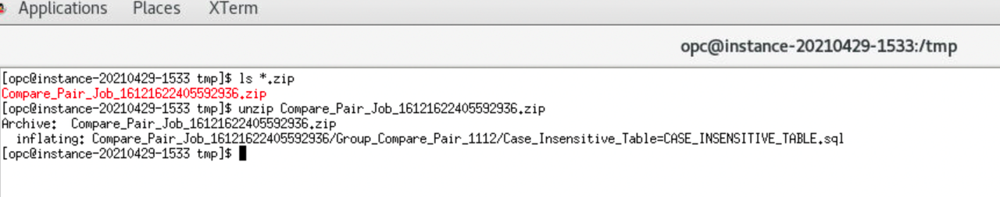
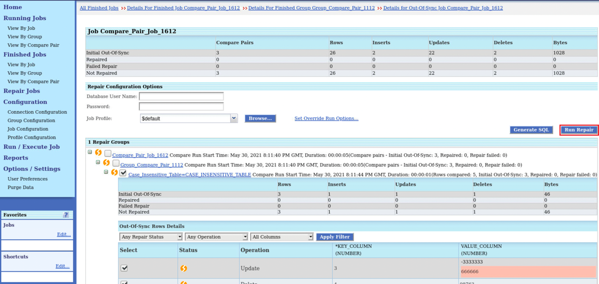
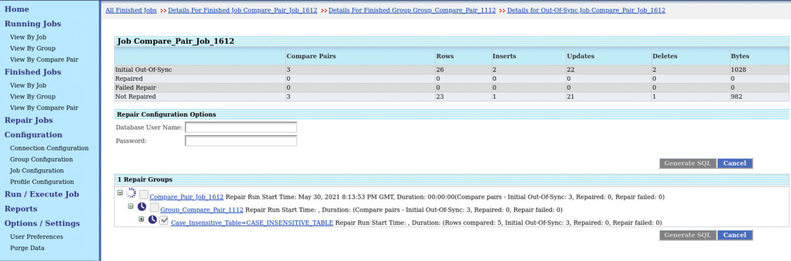

# Repair Out-of-Sync Jobs and Download Repair SQL Files

## Introduction

Oracle GoldenGate Veridata performs comparisons on tables to identify data discrepancies. The **Repair** functionality allows you to eliminate these discrepancies and makes the data identical.

Oracle GoldenGate Veridata provides the Download Repair SQL functionality which downloads SQL files for the source and target tables associated with the out-of-sync jobs.

*Estimated Lab Time*: 30 minutes

### Objectives
In this lab, you will:
* Repair out-of-sync jobs
* Download SQL Files for out-of-sync jobs

### Prerequisites
This lab assumes you have:
- A Free Tier, Paid or LiveLabs Oracle Cloud account
- You have completed:
    * Lab: Prepare Setup (*Free-tier* and *Paid Tenants* only)
    * Lab: Environment Setup
    * Lab: Initialize Environment
    * Lab: Create Datasource Connections
    * Lab: Create Groups and Compare Pairs.
    * Lab: Create and Execute Jobs

## Task 1: Download Repair SQL Files

You can download repair SQL files only for Jobs that have been configured for datasource connections with the Oracle datatype.

Ensure to execute a Job by following the steps in **Lab: Create and Execute Jobs** with the compare pair *Case_Insensitive_Table=CASE_INSENSITIVE_TABLE*

To download repair SQL files:
  1. From the left navigation pane, click **Finished Jobs** and then click the Job name link under **Job Name**:

    

  2. Click the Group name under the **Group Name**:

    

 4. Click the **Out of Sync** link for the Compare Pair name **Case\_Insensitive_Table\=CASE\_INSENSITIVE\_TABLE**:

    

  5. Click **Download Repair SQL**.

    

    The SQL file gets downloaded.

  6. Open a terminal to view the SQL file. Navigate to the file location:

    

  7. Unzip the SQL file to view its contents.

    

## Task 2: Repair Out-of-Sync Jobs

  To repair out-of-sync jobs:
  1. From the left navigation pane, click **Finished Jobs** to view the page containing details of all the finished jobs. You can select Jobs, groups, and compare pairs for repairing out-of-sync records.
  2. From the table under **Finished Jobs**, click the Job name link under **Job Name**:

    

  3. Click the Group name under the **Group Name**:

    

 4. Click the **Out Of Sync** link for the Compare Pair name **Case\_Insensitive_Table\=CASE\_INSENSITIVE\_TABLE**:

    

  5. Click **Run Repair**.

    

    

    

The out-of-sync records for the selected job are repaired.

You may now [proceed to the next lab](#next).

## Learn More
* [Oracle GoldenGate Veridata Documentation](https://docs.oracle.com/en/middleware/goldengate/veridata/12.2.1.4/index.html)
* [Repair Data](https://docs.oracle.com/en/middleware/goldengate/veridata/12.2.1.4/gvdug/working-jobs.html#GUID-B46185DF-4B7E-4647-8BE2-F7176E1FFDFF)
* [Generate SQL File](https://docs.oracle.com/en/middleware/goldengate/veridata/12.2.1.4/gvdug/working-jobs.html#GUID-0AA3E8E2-BAD3-41D2-83CD-E8986C69A3AB)

## Acknowledgements
* **Author** - Anuradha Chepuri, Principal UA Developer, Oracle GoldenGate User Assistance
* **Contributors** -  Nisharahmed Soneji, Sukin Varghese , Rene Fontcha
* **Last Updated By/Date** - Rene Fontcha, LiveLabs Platform Lead, NA Technology, November 2021
