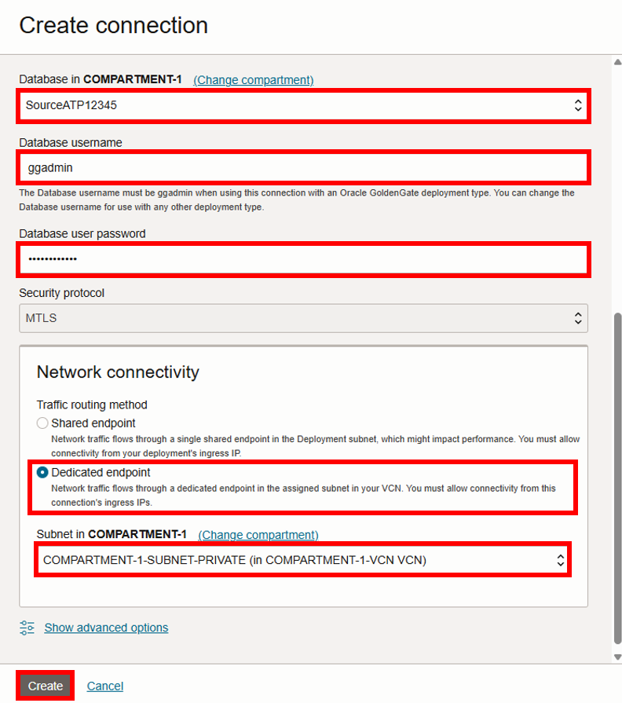
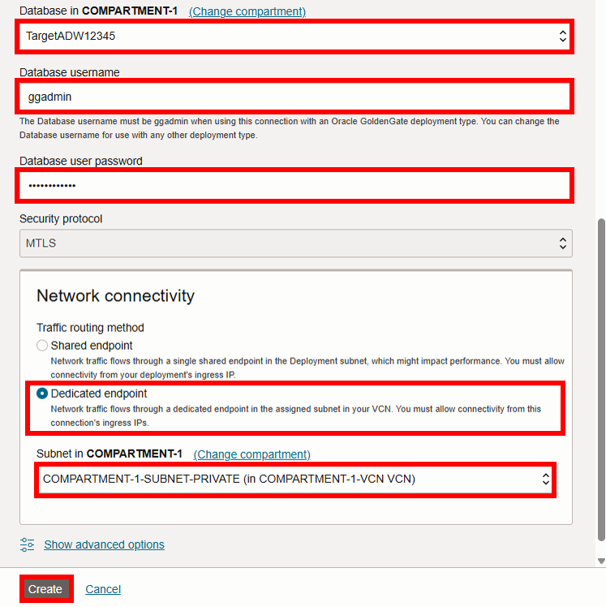

# Create the Oracle Cloud Infrastructure GoldenGate connections

## Introduction

In this lab, you learn to create an Oracle Cloud Infrastructure (OCI) GoldenGate connection.

Estimated time: 20 minutes

Watch the video below for a quick walk through of the lab.
[Watch the video](videohub:1_hz7gsiin)

### About Oracle Cloud Infrastructure GoldenGate connections

A Oracle Cloud Infrastructure GoldenGate connections store the source and target credential information for OCI GoldenGate. A connection also enables networking between the Oracle Cloud Infrastructure (OCI) GoldenGate service tenancy virtual cloud network (VCN) and your tenancy VCN using a private endpoint.

### Objectives

In this lab, you will:
* Locate Oracle Cloud Infrastructure GoldenGate in the Console
* Create the source and target connections

## Task 1: Create the source connection

1. In the Oracle Cloud console, open the **navigation menu**, navigate to **Oracle Database**, and then select **GoldenGate**.

    

2.  Click **Connections** and then click **Create Connection**.

    

3.  The Create connection panel appears. For Name, enter **SourceATP** and optionally, a description.

4.  From the Compartment dropdown, select **&lt;USER&gt;-COMPARTMENT**.

5.  From the a Type dropdown, select **Oracle Autonomous Database**.

6. For Database details, select **Select database**.

    

7.  For **Database in &lt;compartment-name&gt;**, select **SourceATP-&lt;numbers&gt;** from the dropdown. 

8.  For Database username, enter `ggadmin`.

9.  Enter the database's password in the Password field. Take note of the password.

    > **NOTE:** This password will be used to unlock `GGADMIN` in a later task.

10. For Traffic routing method, select **Dedicated endpoint**.

11. For **Subnet in &lt;compartment-name&gt;**, select **&lt;USER&gt;-COMPARTMENT-SUBNET-PRIVATE** from the dropdown. 

12. Click **Create**.

    

    The connection becomes Active after a few minutes. You can proceed with the next task while service creates the connection.

## Task 2: Create the target connection

Follow the steps below to connect the target Autonomous Data Warehouse \(ADW\) instance.

1.  Use the Oracle Cloud Console navigation menu to navigate back to **GoldenGate**.

2.  Click **Connections** and then **Create Connection**.

    

3.  The Create connection panel appears. For Name, enter **TargetADW** and optionally, a description.

4.  From the **Compartment** dropdown, select a compartment.

5.  From the a Type dropdown, select **Oracle Autonomous Database**.

6.  For Database details, select **Select database**.

    

7. For **Database in &lt;compartment-name&gt;**, select **TargetADW-&lt;numbers&gt;** from the dropdown. 

8. For Database username, enter `ggadmin`.

9. Enter the database's password in the Password field. Ensure that you record this password for later use.

10. For Traffic routing method, select **Dedicated endpoint**.

11. For **Subnet in &lt;compartment-name&gt;**, select **&lt;USER&gt;-COMPARTMENT-SUBNET-PRIVATE** from the dropdown. 

12. Click **Create**.

    

    The source and target databases appear in the list of Connections. The connection becomes Active after a few minutes.

You may now **proceed to the next lab.**

## Learn more

* [Connect to Oracle Autonomous Database](https://docs.oracle.com/en/cloud/paas/goldengate-service/tqrlh/)

## Acknowledgements
* **Author** - Katherine Wardhana, User Assistance Developer, Database User Assistance
* **Contributors** -  Julien Testut, Database Product Management
* **Last Updated By/Date** - Katherine Wardhana, May 2025