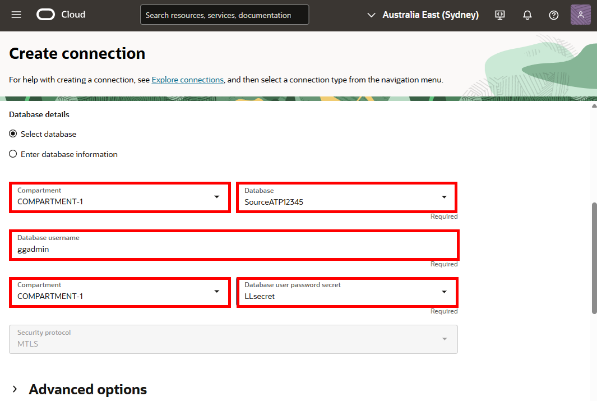
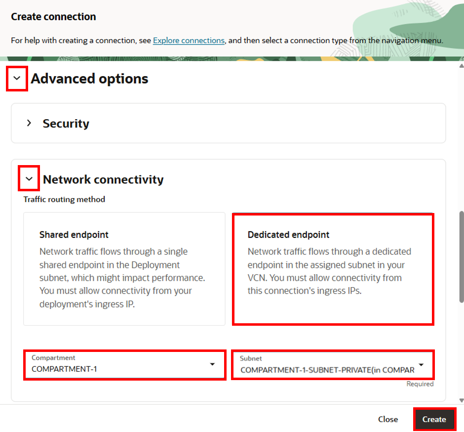
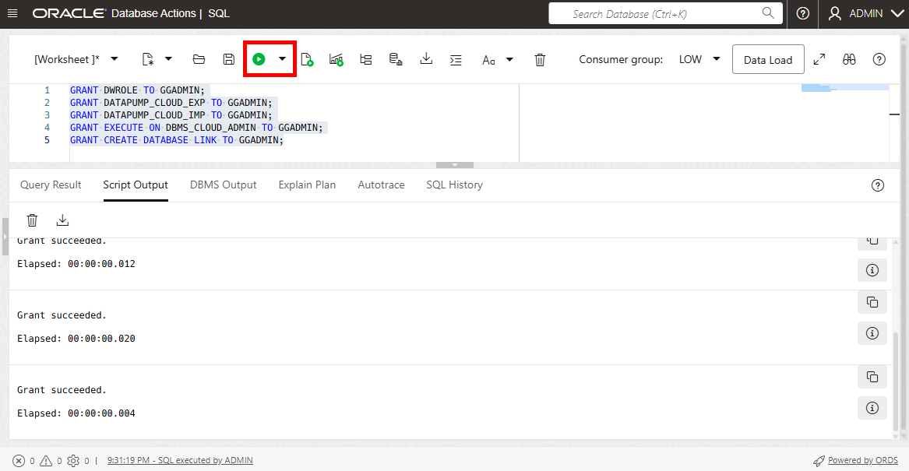
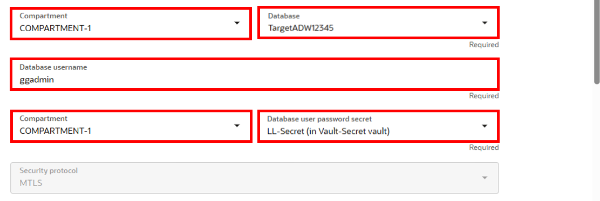

# Create the Oracle Cloud Infrastructure GoldenGate connections

## Introduction

In this lab, you learn to create an Oracle Cloud Infrastructure (OCI) GoldenGate connection.

Estimated time: 20 minutes

Watch the video below for a quick walk through of the lab.
[Watch the video](videohub:1_hz7gsiin)

### About Oracle Cloud Infrastructure GoldenGate connections

A Oracle Cloud Infrastructure GoldenGate connections store the source and target credential information for OCI GoldenGate. A connection also enables networking between the Oracle Cloud Infrastructure (OCI) GoldenGate service tenancy virtual cloud network (VCN) and your tenancy VCN using a private endpoint.

### Objectives

In this lab, you will:
* Locate Oracle Cloud Infrastructure GoldenGate in the Console
* Create the source and target connections

### Prerequisites

To successfully complete this lab, you must:
* Review [Minimum recommended policies](https://docs.oracle.com/en/cloud/paas/goldengate-service/rmrrr/#GUID-3E101995-8630-4D58-93DF-0AE94041B031).

## Task 1: Create the source connection

1. In the Oracle Cloud console, open the **navigation menu**, navigate to **Oracle Database**, and then select **GoldenGate**.

    

2.  Click **Connections** and then click **Create Connection**.

    

3.  The Create connection panel appears. For Name, enter **SourceATP** and optionally, a description.

4.  From the Compartment dropdown, select **&lt;USER&gt;-COMPARTMENT**.

5.  From the a Type dropdown, select **Oracle Autonomous Database**.

6. For Database details, select **Select database**.

    

7.  From the Compartment dropdown, select **&lt;USER&gt;-COMPARTMENT**, and then select **SourceATP-&lt;numbers&gt;** from the dropdown. 

8.  For Database username, enter `ggadmin`.

9.  From the Compartment dropdown, select **&lt;USER&gt;-COMPARTMENT**, and then select a Database user password secret from the dropdown.

    > **NOTE:** This password will be used to unlock `GGADMIN` in a later task.

    

10. Expand the **Advanced options**, and then expand **Network connectivity**.

11. For **Traffic routing method**, select **Dedicated endpoint**.

    > **Note:** Ensure that you select **Dedicated endpoint** as the **Traffic routing method**, as **Shared endpoint** is not supported. 

12. From the Compartment dropdown, select **&lt;USER&gt;-COMPARTMENT**, and then select **&lt;USER&gt;-COMPARTMENT-SUBNET-PRIVATE** from the dropdown.

13. Click **Create**.

    

    The connection becomes Active after a few minutes. You can proceed with the next task while service creates the connection.

## Task 2: Unlock the GGADMIN user and enable supplemental logging for the source database

Oracle Autonomous Databases come with a GGADMIN user that is locked by default. The following steps guide you through how to unlock the GGADMIN user.

1.  From the Oracle Cloud Console navigation menu, click **Oracle Database**, and then select **Autonomous Database**.

	

2.  From the list of databases, select **SourceATP**.

    

3.  On the SourceATP Database Details page, click **Database actions**, and then select **Database Users** from the dropdown. If the Database actions menu takes too long to load, you can click **Database actions** directly, and then select **Database users** from the Database actions page.

    

4.  If prompted, log in to Database actions as **admin**, using the ATP Admin Password using the ATP Admin Password.

    

5.  From the list of users, locate **GGADMIN**, and then click the ellipsis (three dots) icon and select **Edit**.

    

6.  In the Edit User panel, deselect **Account is Locked**, enter the password you gave the ggadmin user in the previous task and then click **Apply Changes**.

    

    Note that the user icon changes from a padlock to a checkmark.

7.  Open the Database actions navigation menu, and then under **Development**, select **SQL**.

    

    > **Note:**  (Optional) Close the SQL Help dialogs. 

8.  Enter the following into the Worksheet, and then click **Run Statement**.

    ```
    <copy>ALTER PLUGGABLE DATABASE ADD SUPPLEMENTAL LOG DATA;</copy>
    ```

    

9.  Replace the supplemental logging script with the following statement, and then click **Run Statement**:

    ```
    <copy>GRANT DWROLE TO GGADMIN;
    GRANT DATAPUMP_CLOUD_EXP TO GGADMIN;
    GRANT DATAPUMP_CLOUD_IMP TO GGADMIN;
    GRANT EXECUTE ON DBMS_CLOUD_ADMIN TO GGADMIN;
    GRANT CREATE DATABASE LINK TO GGADMIN;</copy>
    ```

    

    You can leave the SQL window open and continue with the next Task.

## Task 3: Create the target connection

Follow the steps below to connect the target Autonomous Data Warehouse \(ADW\) instance.

1.  Use the Oracle Cloud Console navigation menu to navigate back to **GoldenGate**.

2.  Click **Connections** and then **Create Connection**.

    

3.  The Create connection panel appears. For Name, enter **TargetADW** and optionally, a description.

4.  From the **Compartment** dropdown, select a compartment.

5.  From the a Type dropdown, select **Oracle Autonomous Database**.

6.  For Database details, select **Select database**.

    

7. For **Database in &lt;compartment-name&gt;**, select **TargetADW-&lt;numbers&gt;** from the dropdown. 

8. For Database username, enter `ggadmin`.

9. From the Compartment dropdown, select **&lt;USER&gt;-COMPARTMENT**, and then select a Database user password secret from the dropdown.

    

10. Expand the **Advanced options**, and then expand **Network connectivity**.

11. For **Traffic routing method**, select **Dedicated endpoint**.

    > **Note:** Ensure that you select **Dedicated endpoint** as the **Traffic routing method**, as **Shared endpoint** is not supported. 

12. From the Compartment dropdown, select **&lt;USER&gt;-COMPARTMENT**, and then select **&lt;USER&gt;-COMPARTMENT-SUBNET-PRIVATE** from the dropdown.

13. Click **Create**.

    

    The source and target databases appear in the list of Connections. The connection becomes Active after a few minutes.

14. Repeat Task 2, steps 1-9, to unlock the GGADMIN user and run the SQL script for the TargetADW database.

You may now **proceed to the next lab.**

## Learn more

* [Connect to Oracle Autonomous Database](https://docs.oracle.com/en/cloud/paas/goldengate-service/tqrlh/)

## Acknowledgements
* **Author** - Katherine Wardhana, User Assistance Developer, Database User Assistance
* **Contributors** -  Julien Testut, Database Product Management
* **Last Updated By/Date** - Katherine Wardhana, July 2025