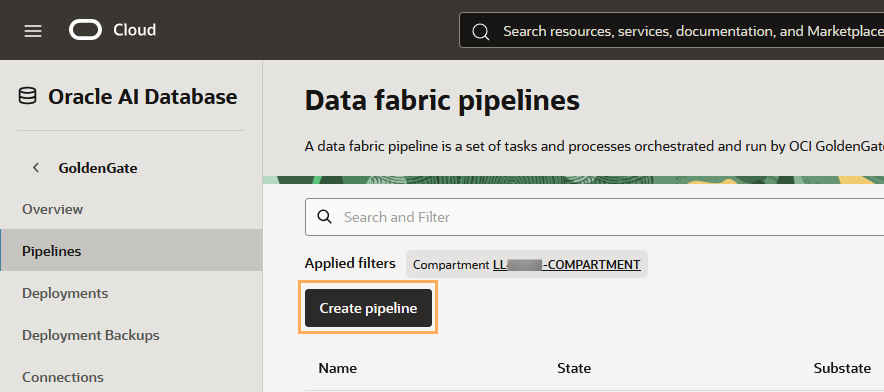
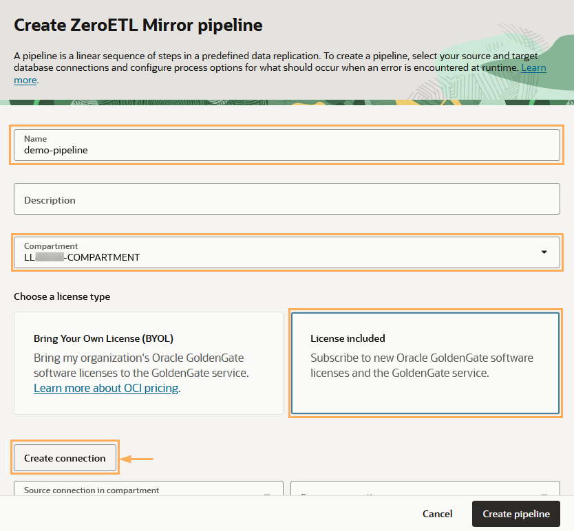
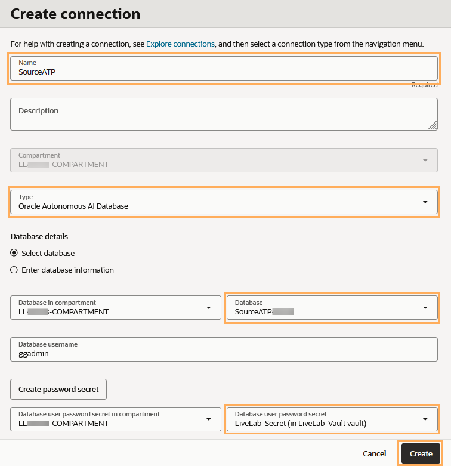
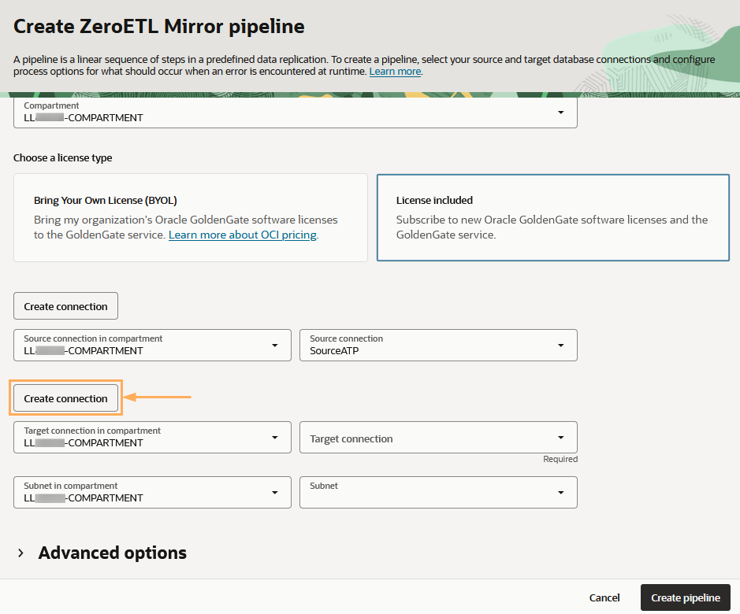
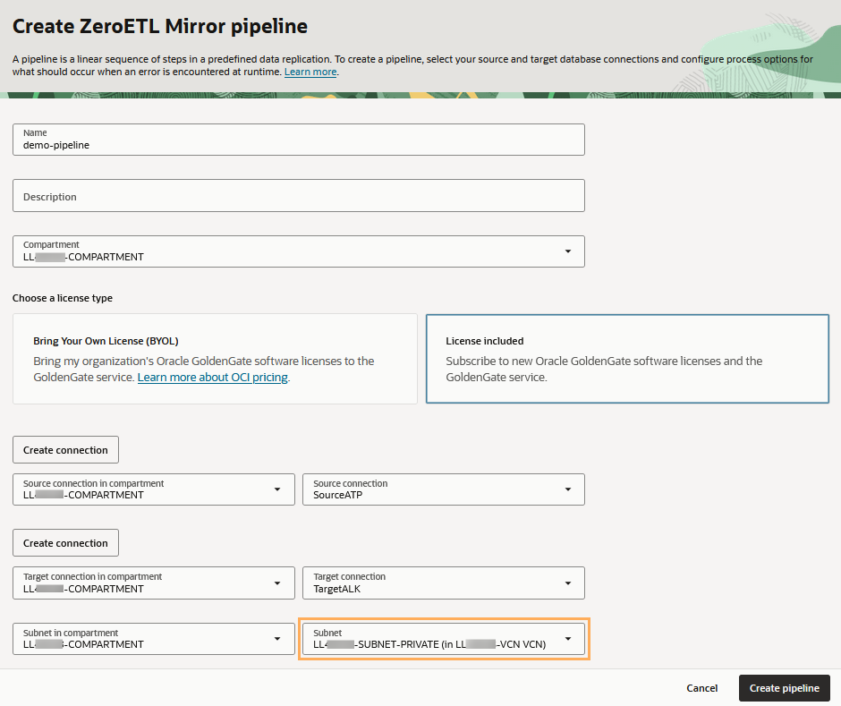

# Create the Oracle Cloud Infrastructure GoldenGate resources

## Introduction

In this lab, you learn to create an Oracle Cloud Infrastructure (OCI) GoldenGate connection.

Estimated time: 20 minutes

### About Oracle Cloud Infrastructure GoldenGate (OCI) pipelines

OCI GoldenGate pipelines let you configure real time data replication flows that support mission critical use cases such as analytics, operational reporting, and hybrid cloud integrations. You can create a pipeline to stream data directly from operational databases to analytical environments without traditional extract, transform, load (ETL) processes. 

### Objectives

In this lab, you will:
* Locate Oracle Cloud Infrastructure GoldenGate in the Console
* Create the pipeline, source and target connections
* Unlock the GGADMIN user in the source and target databases

### Prerequisites

To successfully complete this lab, you must:
* Review [Minimum recommended policies](https://docs.oracle.com/en/cloud/paas/goldengate-service/rmrrr/#GUID-3E101995-8630-4D58-93DF-0AE94041B031).

## Task 1: Unlock the GGADMIN user and enable supplemental logging

Oracle Autonomous AI Databases come with a GGADMIN user that is locked by default. The following steps guide you through how to unlock the GGADMIN user before you use the source and target databases.

1.  From the Oracle Cloud Console navigation menu, click **Oracle AI Database**, and then select **Autonomous AI Database**.

	

2.  From the list of databases, select **SourceATP**.

    

3.  On the SourceATP Database Details page, click **Database actions**, and then select **Database Users** from the dropdown. If the Database actions menu takes too long to load, you can click **Database actions** directly, and then select **Database users** from the Database actions page.

    

4.  If prompted, log in to Database actions as **admin**, using the ATP Admin Password using the ATP Admin Password.

    

5.  From the list of users, locate **GGADMIN**, and then select **Edit** from its **Menu** (ellipsis icon).

    

6.  In the Edit User panel, deselect **Account is Locked**, enter the password you gave the ggadmin user in the previous task and then click **Apply Changes**.

    

    Note that the user icon changes from a padlock to a checkmark.

7.  Open the Database actions navigation menu, and then under **Development**, select **SQL**.

    

    > **Note:**  (Optional) Close the SQL Help dialogs. 

8.  Enter the following into the Worksheet, and then click **Run Script**.

    ```
    <copy>ALTER PLUGGABLE DATABASE ADD SUPPLEMENTAL LOG DATA;</copy>
    ```

    

9.  Replace the supplemental logging script with the following statement, and then click **Run Statement**:

    ```
    <copy>GRANT DWROLE TO GGADMIN;
    GRANT DATAPUMP_CLOUD_EXP TO GGADMIN;
    GRANT DATAPUMP_CLOUD_IMP TO GGADMIN;
    GRANT EXECUTE ON DBMS_CLOUD_ADMIN TO GGADMIN;
    GRANT CREATE DATABASE LINK TO GGADMIN;</copy>
    ```

    


10. Repeat the steps above to unlock the GGADMIN user and run the SQL scripts for the TargetALK database.

## Task 2: Create the pipeline

This task guides you through the steps to create a pipeline and its source and target connections.

1. In the Oracle Cloud console, open the **navigation menu**, navigate to **Oracle Database**, and then select **GoldenGate**.

    

2.  If you're prompted to take a tour, you can choose to continue with the tour or close it.

    

3.  On the GoldenGate **Overview** page, if you encounter a "Failed to load" error about your resources, select your assigned **Compartment** from the **Applied filters** dropdown. 

    > **NOTE**: If you're using the LiveLab Sandbox environment, you can find your compartment number in the Reservation Information panel (View Login Info) of the workshop instructions.

    

4.  In the GoldenGate menu, click **Pipelines**. 

    

5.  On the Pipelines page, click **Create pipeline**.

    

6.  On the **Create ZeroETL Mirror pipeline** page, complete the fields as follows:

    * Enter a **Name** for the pipeline.
    * (Optional) Enter a **Description** for the pipeline.
    * Select a **Compartment** in which to create the pipeline.
    * For **Choose a license type**, select **License included**. 
    * Click **Create connection** to create the source connection.

    

7.  In the Create connection panel, complete the fields as follows, and then click **Create**:

    * For **Name**, enter `SourceATP`.
    * (Optional) Enter a **Descroption**.
    * From the **Type** dropdown, select **Oracle Autonomous AI Database**
    * From the **Database** dropdown, select **SourceATP**.
    * From the **Database user password secret** dropdown, select **LiveLab_Secret**.

    

    The Source connection dropdown should automatically populate with the SourceATP connection.

8.  Click **Create connection** to create the target connection.

    

9.  In the Create connection panel, complete the fields as follows, and then click **Create**:

    * For **Name**, enter `TargetALK`.
    * (Optional) Enter a **Descroption**.
    * From the **Type** dropdown, select **Oracle Autonomous AI Database**
    * From the **Database** dropdown, select **TargetALK**.
    * From the **Database user password secret** dropdown, select **LiveLab_Secret**.

    The Target connection dropdown should automatically populate with the TargetALK connection.

10. Back on the Create ZeroETL Mirror pipeline page, from the **Subnet** dropdown, select the private subnet.

    

11. Click **Create**.

You're brought to the pipeline details page. The pipeline takes a few minutes to create. The pipeline status updates to Active when it's ready to use.


You may now **proceed to the next lab.**

## Learn more

* [About pipelines](https://docs.oracle.com/en/cloud/paas/goldengate-service/jppjs/)
* [Create pipeline resources](https://docs.oracle.com/en/cloud/paas/goldengate-service/crylk/)
* [Connect to Oracle Autonomous AI Database](https://docs.oracle.com/en/cloud/paas/goldengate-service/tqrlh/)

## Acknowledgements
* **Author** - Katherine Wardhana, User Assistance Developer, Database User Assistance
* **Contributors** -  Julien Testut, Database Product Management
* **Last Updated By/Date** - Jenny Chan, December 2025